# 数据结构

## 数据结构概述

数据结构是一门研究 **非数值计算** 的程序设计问题的操作对象，以及它们之间的关系和操作等相关问题的学科。

程序设计 = 数据结构+算法

**基本数据类型**：数据类型反映了数据的取值范围以及对这类数据可以施加的运算
**抽象数据类型**：抽象数据类型（abstract data type, ADT）只是 ⼀ 个数学模型以及定义在模型上的 ⼀ 组操作。通常是
对数据的抽象，定义了数据的取值范围以及对数据操作的集合。

## 数据结构基本类型

**元素和元素的关系：**

1. 1:1 的关系 为线性结构（例如：顺序表、链表...）
2. 1: n 的关系 为树形结构（例如：二叉树）
3. n: m 的关系 为图形结构 （例如：联通图）

**物理存储上（与上面对应）：**

1. 顺序表、链表
2. 顺序树、链式树
3. 邻接矩阵、邻接表、十字链表、邻接多重表

## 线性结构

### 概述

**线性结构：**

1. 除了第一个元素和最后一个元素，每一个元素都有前驱元素和后继元素
2. 第一个元素没有前驱元素
3. 最后一个元素没有后继元素

我们称这样的结构就叫做 **线性结构**

**顺序存储结构：** 指的是一段地址连续的存储单元依次存储线性表的数据元素

### 顺序表

#### 顺序表概述

**定义：** 在计算机内存中，顺序表是以数组的形式保存的线性表。也就是 ⼀ 组地址连续的存储单元依次存储

数据元素的线性结构。

**顺序表的理论图：**

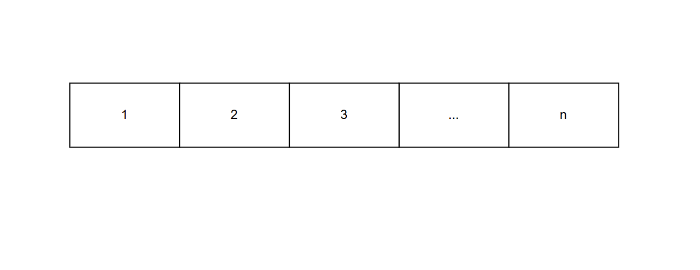

**表头设计**：对于任何一个表，我们一般会设置一个表头用来指向这个表，那么对于顺序表我们需要设计下面三个东西

1. 存储表中数据空间的首地址（用于帮我们找到找到表的第一个位置）（Element *data）
2. 存储表中的待插入位置（用于辅助我们插入数值）(int pos)
3. 存储中的实际容量（边界条件）(int capacity)

那我们从图像的角度来看下:
.png)

接下来是代码实现

#### 代码实现

首先我们对表头进行封装，以方便我们后续的操作，这里使用结构体进行封装

```c
typedef int Element;
    
typedef struct{
    Element *data;
    int pos;
    int capacity
}SeqTable;
```

##### 初始化顺序表

对于初始化的时候我们传入的肯定是顺序表有多大的参数, 也就是顺序表的容量

```c
SEQTable_t* createSeqTable(int n) {
	SEQTable_t* table = NULL;

	table = malloc(sizeof(SEQTable_t));
	if (table == NULL) {
		fprintf(stderr, "SeqTable malloc failed!\n");
		return NULL;
	}
	table->data = malloc(sizeof(Element_t) * n);
	if (table->data == NULL) {
		fprintf(stderr, "SeqTable data malloc failed!\n");
		free(table);
		return NULL;
	}
	table->pos = 0;
	table->capacity = n;
	return table;
}
```

为了方便我们操控顺序表，所以我们选择把顺序表放在堆上，由我们自主控制释放空间

上面我们也说了同时用一个表头来指向整个表，所以我们要先申请一个表头，接下来的操作都是基于这个表头进行操作；

接下来我们对顺序表中的数据也进行一个在堆上申请，由我们手动分配内存，那么内存是多大呢，当然是 Element*n

（**注：** fprintf 是 C 语言中用于灵活输出格式化字符串的基础函数, 一是能够清晰地提示错误，二是不会干扰程序正常输出到 stdout 的内容。）

由于这个表初始化的时候是一张空表所以，他对应的指针位置一开始也为 0，最大容量跟用户实际传入的参数 n 相关

这样我们就初始化好了整张表了，接下来返回这张表即可

##### 尾插法插入元素

在介绍尾插法插入元素之前，我们先介绍顺序表的扩容

```c
static int enlargerTable(SEQTable_t *table) {
	// 1. 再申请一个新空间，初始化申请的空间
	Element_t *tmp = malloc(sizeof(Element_t) * table->capacity * 2);
	if (tmp == NULL) {
		printf("enLargerTable malloc failed!\n");
		return -1;
	}
	// 2. 拷贝老内容到新空间，for循环一个个拷贝，直接空间拷贝
	memcpy(tmp, table->data, sizeof(Element_t) * table->pos);
	// 3. 更新表头，释放老空间
	table->capacity *= 2;
	free(table->data);
	table->data = tmp;

	return 0;
}
```

顺序表的扩容逻辑上是这样的：

1. 申请一个新的空间，大小为原来老空间的两倍。
2. 将老空间的内容复制到新的空间
3. 更新表头，释放老空间

再释放老空间的时候，我们要先把老空间里面的内容释放掉，然后将老空间的指针指向新空间

申请新空间的时候一般会引入一个辅助变量或者指针用来帮忙，也就是上面代码的 tmp

那么接下来是顺序表尾插法的代码：

```c
int pushbackSeqTable(SEQTable_t* table, Element_t value) {
	if (table == NULL) {
		fprintf(stderr, "table is nullptr!\n");
		return -1;
	}
	// 空间有效性判断，顺序表没有空余的位置，进行扩容
	if (table->pos >= table->capacity && enlargerTable(table)) {
		printf("===========!\n");
		return -1;
	}
	table->data[table->pos] = value;
	++table->pos;
	return 0;
}
```

整体代码逻辑比较简单，空间有效性判断逻辑如下：

1. 先判断插入位置是否在或者大于末尾位置，如果在则直接执行后面的语句
2. 进行顺便的扩容

如下图：
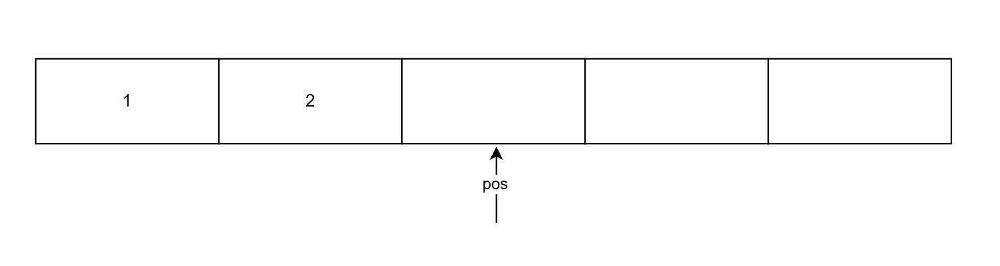

我要在 pos 的位置插入 3，然后将 pos 指针向后移动一位，就变成了下面的图片：


##### 任意位置插入元素

上述讲述了顺序表尾插法，接下来是任意位置插入元素代码：

```c
int insertPosSeqTable(SEQTable_t* table, int index, Element_t value) {
	// 1. 空间有效性的判断
	if (index < 0 || index > table->pos) {
		printf("index Invalid!\n");
		return -1;
	}
	// 顺序表进行扩容
	if (table->pos >= table->capacity && enlargerTable(table)) {
		printf("....\n");
		return -1;
	}
	// 2. 搬移数据为新数据预留位置  从后往前  data[i + 1] = data[i];
	// [pos-1, index] 使用for --操作
	for (int i = table->pos - 1; i >= index; --i) {
		table->data[i + 1] = table->data[i];
	}
	table->data[index] = value;
	++table->pos;

	return 0;
}
```

首先进行顺序表空间有效性判断，上述已经讲述逻辑这里不再赘述

重点讲述任意位置插入逻辑：

1. 将指针移动到待插入位置
2. 将待插入位置以及后面已有元素全部向后移动
3. 插入新的元素

图示如下：
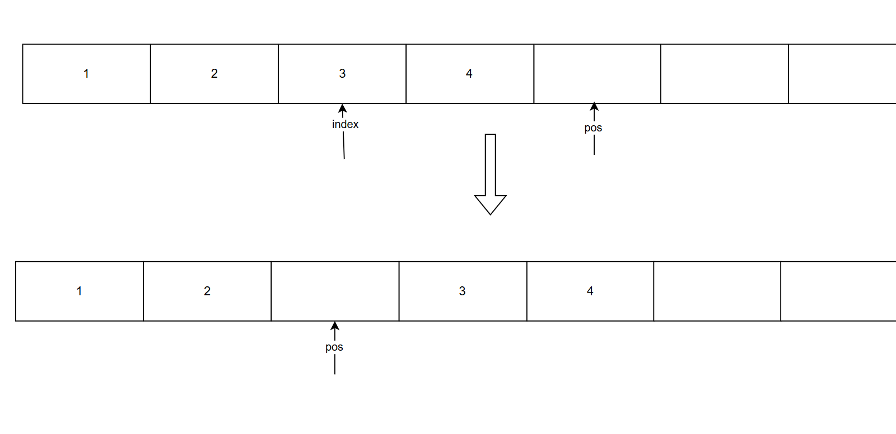

代码解释：

1. 初始化循环起点为 pos-1 的位置，然后循环到 index 的位置（因为 pos 是在最后面，所以循环要--）
2. 到了位置以后，将所在的数据全部向后移动，也就是将 i 的值赋给 i+1 的位置的值
3. 插入元素

整体逻辑很简单

##### 查找顺序表中元素的位置

代码如下：

```c
int findSeqTable(const SEQTable_t* table, Element_t value) {
	for (int i = 0; i < table->pos; ++i) {
		if (table->data[i] == value) {
			return i;
		}
	}
	return -1;
}
```

逻辑如下：

初始化索引位置为 0，一直循环到 pos 前面，如果找到元素则返回下标，如果没有则返回-1

##### 删除顺序表的元素

代码如下：

```c
int deleteSeqTable(SEQTable_t* table, Element_t value) {
	// 1. 查找value在数据结构中的索引位置
	int index = findSeqTable(table, value);
	if (index == -1) {
		printf("Not find %d element!\n", value);
		return -1;
	}
	// 2. 删除这个元素，把[index + 1, pos) 搬移覆盖到，把后一个给前一个
	for (int i = index + 1; i < table->pos; ++i) {
		table->data[i - 1] = table->data[i];
	}
	--table->pos;
	return 0;
}
```

删除顺序表的逻辑和在任意位置插入元素正好相反

如下图：
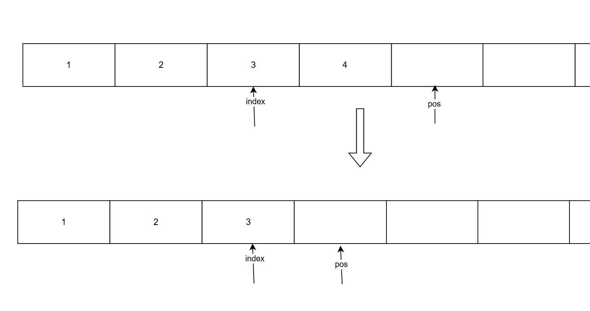

逻辑如下：

1. 先使用查找，查找到对应元素的下标位置
2. 从对应下标+1 的位置开始，将后面的元素值覆盖到前面的一个元素位置，实现伪删除
3. --pos 位置

#### 总结

**优点：** 顺序表在查找元素的时候非常快，因为他是按照顺序存储，可以找到对应的数组下标

**缺点：** 顺序表在插入和删除元素方面相对较慢，因为需要移动大量的元素，且大小不可测因此对于空间可能造成浪费

综上所述，可以得出。顺序表对于插 ⼊、删除 ⼀ 个元素的时间复杂度是 O(n)。

因为顺序表 ⽀ 持随机访问，顺序表读取 ⼀ 个元素的时间复杂度为 O(1）。因为我们是通过下标访问的，所以时间复杂度是固定的，和问题的规模 ⽆ 关。 

最 ⼤ 的优点是空间利 ⽤ 率 ⾼。最 ⼤ 的缺点是 ⼤⼩ 固定。

### 链表

#### 链表概述

链表的存储结构特点就是可以用一组任意的存储单元存储存储里面的数据元素，这组存储单元可以是连续的也可以是不连续的

**链表结构：** 在物理上不连续，在逻辑上连续。大小不固定。

链式存储的结构是基于指针实现的，我们把一个数据元素和一个指针称之为节点，如下图：

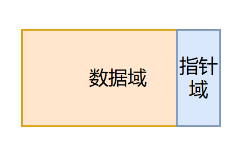

**数据域：** 存数据元素的区域

**指针域：** 存储直接后继位置的区域。

**链式存储：** 其实就是 ⽤ 指针将相互关联的结点链接起来。

链式存储根据链表的构造不同，可以分成：单向链表，单向循环链表，双向链表，双向循环链
表。

我们先介绍单链表

#### 单向链表

##### 单向链表概述

**定义：** 链表的每个节点只包含 ⼀ 个指针域。叫做单链表（即构成链表的每个节点只有 ⼀ 个指向后继节点的指针）

单链表里面分为头指针和头结点的两种情况

**头指针：** 链表中第一个结点的存储位置叫做头指针

**头结点：** 在单链表中第一个结点前附设一个结点称为头结点

链表中，第 ⼀ 个结点存储的位置叫头指针，如果链表有头结点，那么头指针就是指向头结点的指针

我们优先介绍头结点的链表结构

链表理论图示如下：
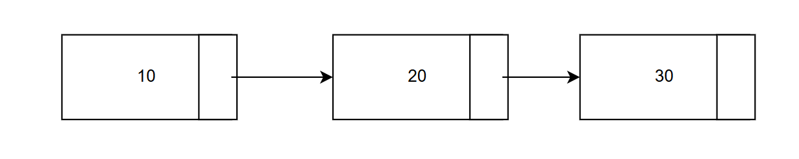

同样接下来我们来介绍一下链表的表头设计，我们先从带有头结点的链表开始

1. 链表里面的头(node head)
2. 总共的数量（int count）

从图像来看就是这样：

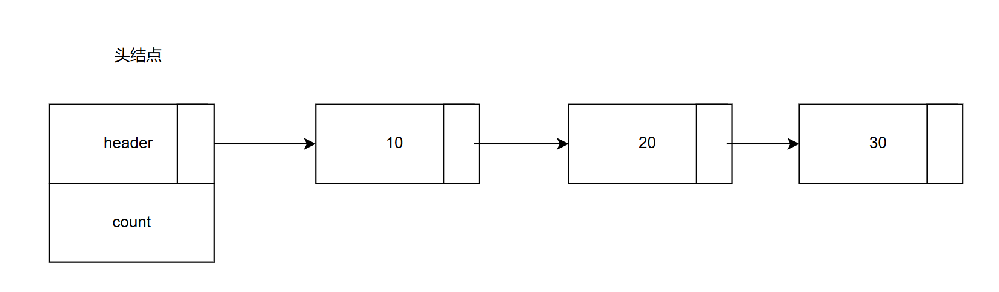

接下来进入代码部分

##### 单向链表代码实现

在进行代码实现之前我们先进行准备工作，先封装一些结构体以方便后续操作

```c
typedef int Element_t;
// 1. 定义链表的节点结构
typedef struct _node{
	Element_t val;
	struct _node *next;
} node_t;

// 2. 定义带头节点的链表头结构
typedef struct {
	node_t head;
	int count;
} LinkList_t;
```

在后续对于结点的操作，我们通常会先封装一个结点，这个结点里面包含两个信息

1. 结点里面的数据
2. 结点里面的指针域（指向下一个位置的指针）

那么封装完结点以后，接下来就是对表头进行一个封装，也就是上述用结点创建一个头，然后加上额外的一些自定义信息等

###### 初始化链表

```c
LinkList_t* createLinkList() {
	LinkList_t* table = NULL;
	table = malloc(sizeof(LinkList_t));
	if (table == NULL) {
		return NULL;
	}
	table->head.val = 0;
	table->head.next = NULL;
	table->count = 0;

	return table;
}
```

初始化跟顺序表一样，我们需要申请一个动态的表，内存的释放由我们自己决定而不是程序决定

这个表初始化的时候肯定是为空的

1. 表头里面的值为 0
2. 一开始没有插入别的数据和链表，所以指针指向空
3. 数量也对应为 0

那么这样初始化就完成了

###### 头插法插入链表元素

我们先说一下头插法的插入逻辑，逻辑如下：

1. 引入一个辅助指针 p，p 找到待插入位置的前一个位置
2. 创建新的节点
3. 更新新的节点
4. 最后更新老的节点

这样讲可能不太清楚，我们以图示来看，如下图:
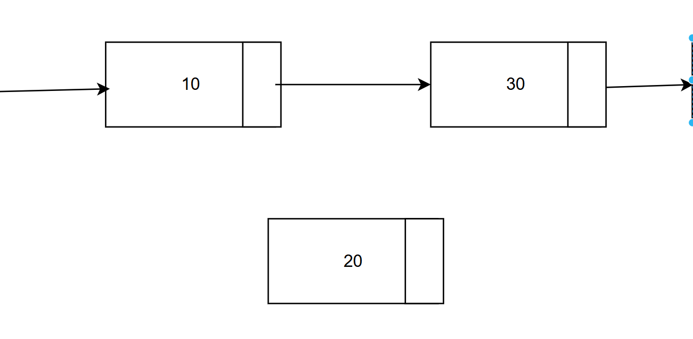

假设我们现在要在 10 和 30 之间插入 20 这个元素，那么这时候我们会引入一个辅助指针 p 放在 10 的位置

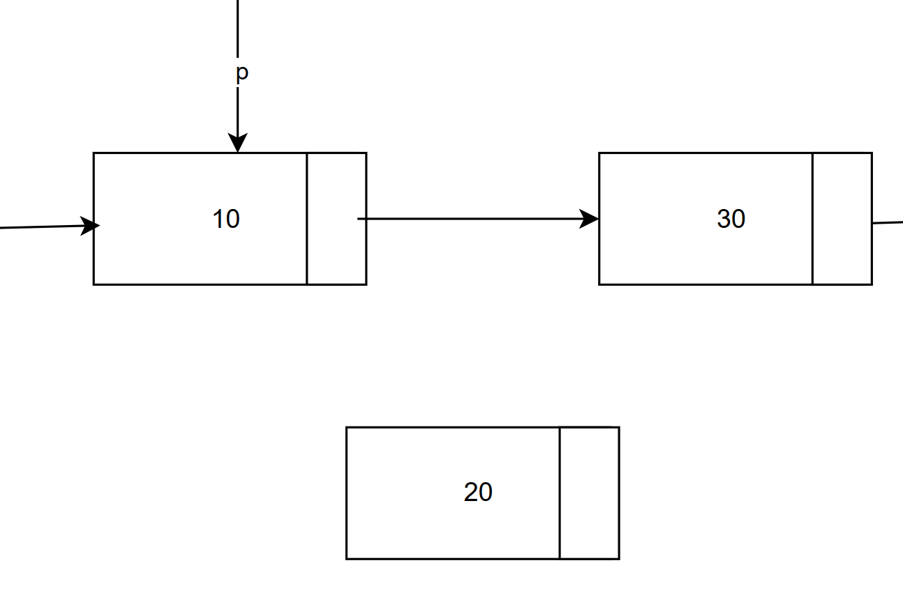

为了保证在不影响原先节点的情况下，所以要引入一个辅助指针 p，当热这里的顺序一定要注意，如果先更新了老的节点，那么我们就无法找到下一个节点, 如果 p-> next = new_node, 那么 new_node 怎么指向原先 p-> next 呢，所以整体要先更新新的节点，最后在动老节点，伪代码就是这样：new_node-> next = p-> next; p-> next = new_node; 这样就可以实现插入了，如下图

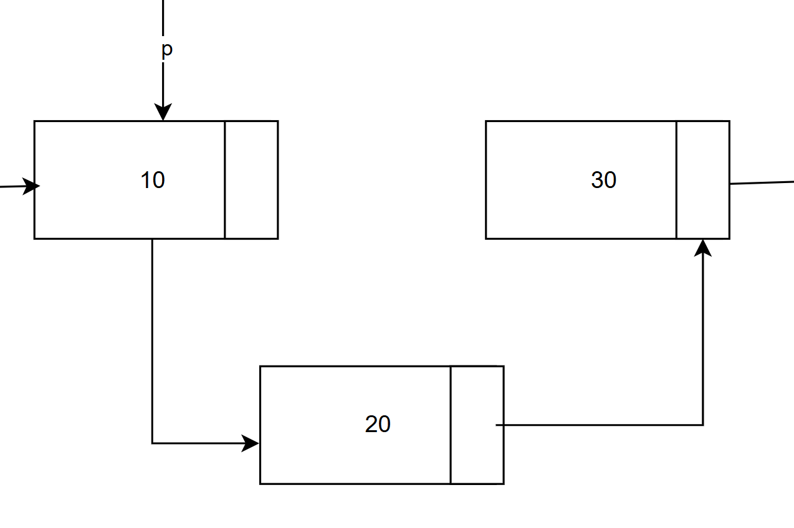

那么整体插入逻辑就如上，接下来是代码：

```c
int insertLinkListHeader(LinkList_t* table, Element_t val) {
	node_t *p = &table->head;
	node_t *new_node = malloc(sizeof(node_t));
	if (new_node == NULL) {
		return -1;
	}
	new_node->val = val;
	new_node->next = p->next;
	p->next = new_node;

	++table->count;
	return 0;
}
```

因为我们是头插法，所以会将辅助指针放在头结点的位置，然后给新结点申请一个空间，然后给它对应的值

接下来插入逻辑上述已经讲述这里不在赘述

最后加一下数量，整体代码如上

###### 任意位置插入链表元素

```c
int insertLinkListPos(LinkList_t* table, int pos, Element_t val) {
	// 1. 判断边界值
	if (pos < 0 || pos > table->count) {
		printf("insert pos invalid!\n");
		return -1;
	}
	// 2. 找到pos - 1索引的节点首地址
	node_t *p = &table->head;
	int index = -1;
	while (index < pos - 1) {
		p = p->next;
		++index;
	}
	if (p == NULL) {
		return -1;
	}
	node_t *new_node = malloc(sizeof(node_t));
	new_node->val = val;
	new_node->next = p->next;
	p->next = new_node;

	++table->count;
	return 0;
}
```

任意位置插入元素本质与上述头插法逻辑一致，所以这里不在过多赘述

唯一不一样的地方在于判断边界的条件，确保 pos 的位置有效

###### 4 删除链表里面的元素

 我们先来讲一下删除的逻辑：

1. 引入辅助指针 p，p 找到待删除位置的前一个节点
2. 引入辅助指针备份待删除位置 tmp

如下图：
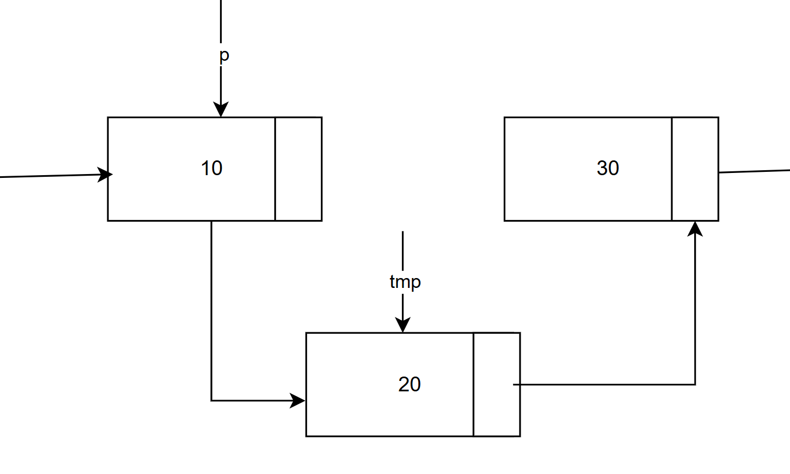

比如这时候我要删除 20 这个节点，我们的辅助指针 p 放在 10 的位置，这时候删除的逻辑伪代码就是这样：

node_t *tmp = p-> next; p-> next = tmp-> next; free(tmp);

这里还是跟上面的一样，如果出现了顺序错误，可能会导致链表断裂

删除了就变成，图示如下：

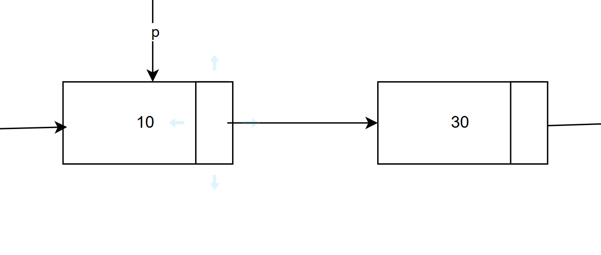

接下来就是代码实现;

```c
int deleteLinkListElement(LinkList_t* table, Element_t val) {
	node_t *p = &table->head;
	while (p ->next) {
		if (p->next->val == val) {
			break;
		}
		p = p->next;
	}
	if (p->next == NULL) {
		printf("Not Find!\n");
		return -1;
	}

	node_t *tmp = p->next;
	p->next = tmp->next;
	free(tmp);
	table->count--;
	return 0;
}
```

1. 引入辅助指针 p 从头结点开始，一直向后走，直到找到对应位置的前一个位置
2. 引入辅助指针备份待删除位置 tmp
3. 减少链表对应的数量

整体的代码逻辑如上

###### 释放链表

```c
void releaseLinkList(LinkList_t* table) {
	if (table) {
		node_t *p = &table->head;
		node_t *tmp;
		while (p->next) {
			tmp = p->next;
			p->next = tmp->next;
			free(tmp);
			--table->count;
		}
		printf("LinkList have %d node!\n", table->count);
		free(table);
	}
}
```

释放逻辑如下：

1. 如果表存在，先删除里面的对应元素，删除逻辑和上述删除元素一致
2. 清空里面的元素后，最后释放表头

释放逻辑相对简单，单链表有关代码结束

##### 总结

单链表相对于顺序表来说，在插入和删除方面比顺序表的操作方便

但如果要进行频繁的查找的话顺序表的速度是比链表快的+

单链表的另一个有点就是不需要分配存储空间，元素个数也不受限制  

所以并不能说顺序表和单链表谁好，要根据实际情况来选择

#### 单向循环链表

##### 单向循环链表概述

单向循环链表与单链表的区别在于，将最后一个结点的指针由 **空指针转变为指向头结点** 的指针

这种头尾相接的链表我们称之为 **循环链表**，如下图：
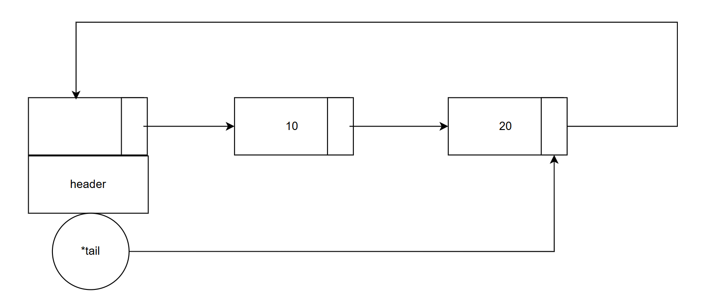

那么在单链表的基础上，我们会在链表的头结点上面加一个 tail 指针用来指向末尾的位置，这样就形成了一个单向循环链表

这里概念相对简单，我们来看代码

##### 单向循环链表代码实现

还是跟之前一样，我们先定义一下结点结构和头结构

```c
// 定义节点结构
typedef int Element;
typedef struct _loop_node {
	Element val;
	struct _loop_node *next;
} LoopNode;

// 定义单向循环链表的头结构
typedef struct {
	LoopNode header;
	LoopNode *rear;
	int num;
} LinkLoopList;
```

节点的结构和单链表是一样的，数据域+指针域的组合

头结构新增了一样东西，那就是尾指针，也就是我们上面画的地方，我们接下来的操作都要基于尾指针来操作

###### 初始化单向循环链表

```c
void initLinkLoopList(LinkLoopList* link_loop) {
	link_loop->header.next = link_loop->rear = &link_loop->header;
	link_loop->num = 0;
}
```

单向循环链表我们这里使用的是初始化，而并非创建单向循环链表

这里我们选择的是带有头结点的单向循环链表，所以一开始指针的位置都是指向头的位置，链表的数量对应也为 0

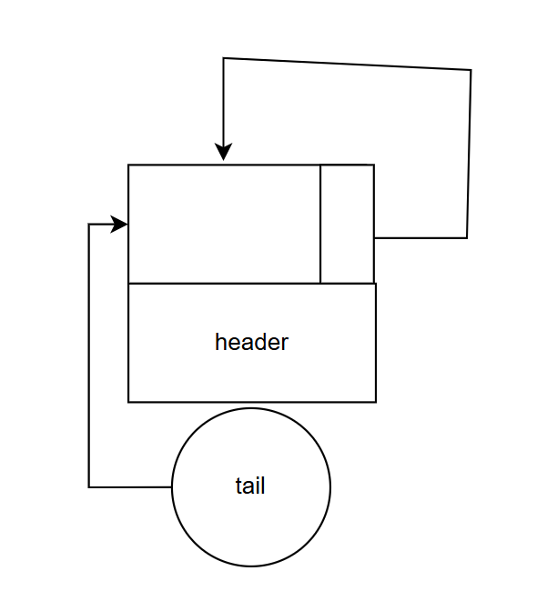

###### 头插法插入单向循环链表元素

在看代码之前我们先讲一下插入的逻辑

1. 本质上跟单链表相同，先更新新结点
2. 更新老节点
3. 更新尾指针的位置

在单向循环链表里面，因为我们有了 rear 指针，所以在结束插入和删除操作的时候，我们需要更新一下 rear 指针

我们从图示角度看一下:
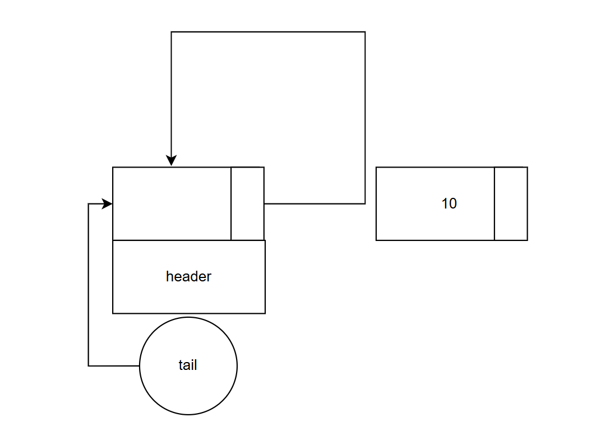

比如这时候我要插入 10 这个元素，按照上面的逻辑因为是循环链表，我们要让 10 的 next 指向头结点，在更新头结点的指向

也就是 10-> next = header.next; header.next = node; 最后更新了完成以后，再更新 rear 指针，也就是 rear = node;

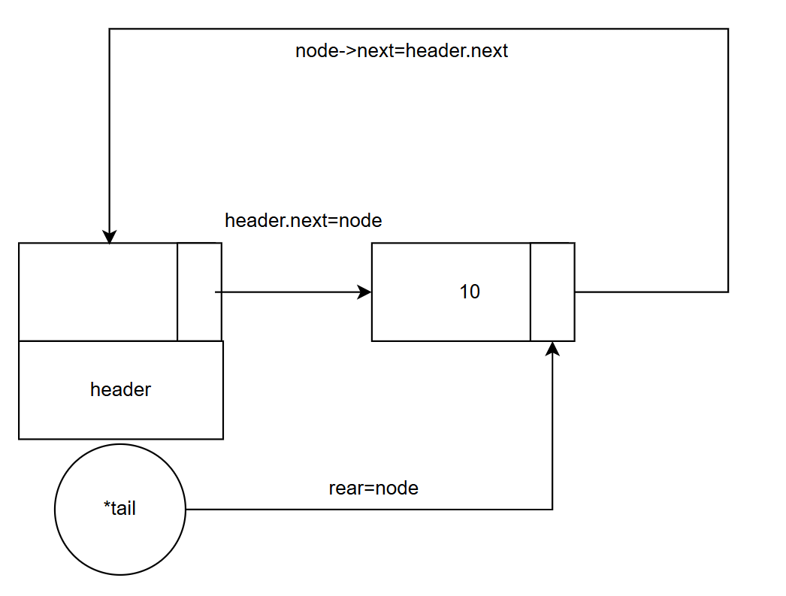

接下来逻辑讲完了我们来看代码

```c
int insertLinkLoopHeader(LinkLoopList* link_loop, Element value) {
	// 1. 先有新节点
	LoopNode *node = malloc(sizeof(LoopNode));
	if (node == NULL) {
		return -1;
	}
	node->val = value;
	node->next = link_loop->header.next;
	link_loop->header.next = node;

	// 2. 判断尾指针是否需要更新
	if (link_loop->rear == &link_loop->header) {
		link_loop->rear = node;
	}
	++link_loop->num;
	return 0;
}
```

按照上面说的逻辑，代码内容如下：

1. 为新的节点申请一个新的内存空间
2. 传入对应的数值
3. 更新新节点的指针，指向头结点，实现循环
4. 更新老节点的指针，指向新结点
5. 更新尾指针的位置
6. 增加数量

那么这就是头插法插入元素，接下来看尾插法

###### 尾插法插入单向循环链表元素

我们还是先将逻辑，本质上与头插法大同小异，没有什么区别

如下图：

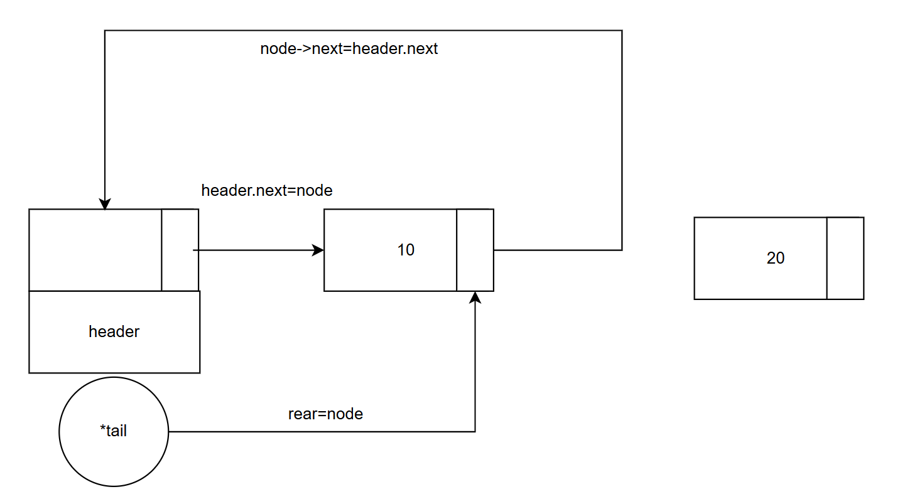

我们这时候假设在原来的基础上插入 20 这个元素，那我们对应的改变，万变不离其宗，我们先动新结点再动老节点，也就是 20-> next = rear-> next; rear-> next = 20; rear = 20; 即可，逻辑上比较简单，最后就变成了下图

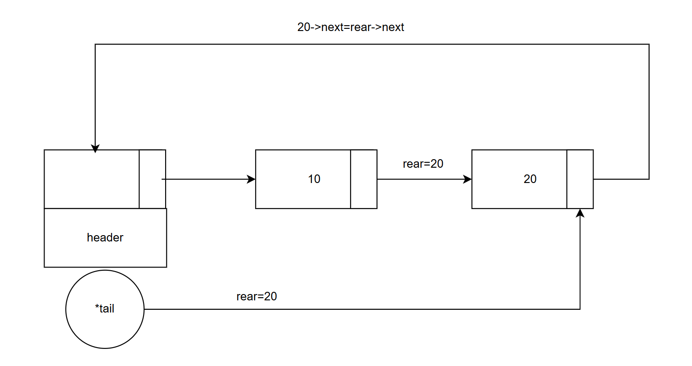

接下来看代码

```c
int insertLinkLoopRear(LinkLoopList* link_loop, Element value) {
	// 1. 先有新节点
	LoopNode *node = malloc(sizeof(LoopNode));
	if (node == NULL) {
		return -1;
	}
	node->val = value;
	node->next = link_loop->rear->next;
	link_loop->rear->next = node;
	link_loop->rear = node;

	++link_loop->num;

	return 0;
}
```

代码内容如下：

1. 为新的节点申请一个新的内存空间
2. 传入对应的数值
3. 更新新节点的指针，指向头结点，实现循环
4. 更新老节点的指针，指向新结点
5. 更新尾指针的位置
6. 增加数量

那么尾插法和头插法的区别在哪里，区别在于一个是用 rear 指针进行操作，而另一个是直接用头操作，这就是基本的区别，如果要在中间任意一个位置插入元素，那么可以参考单向链表里面的任意位置插入元素，这里不再赘述

###### 删除单向循环链表里面的元素

先说删除逻辑，如下图：


假设我们现在要删除 20 这个元素，这时候我们需要引入两个辅助指针，第一个辅助指针（node），从头结点开始一直向后走，直到 node-> next 的值等于了我们要删除的目标值，我们停下，这时候引入第二个辅助指针（tmp），让 tmp = node-> next; 这时候的删除逻辑就跟之前单链表的删除逻辑一样了，也就是 node-> next = tmp-> next; free(tmp); 当然这里也要更新一下 rear 指针，不过这里更新 rear 是在如果删除最后一个元素需要更新，如果不是则不需要更新，这里更新就是 rear = node

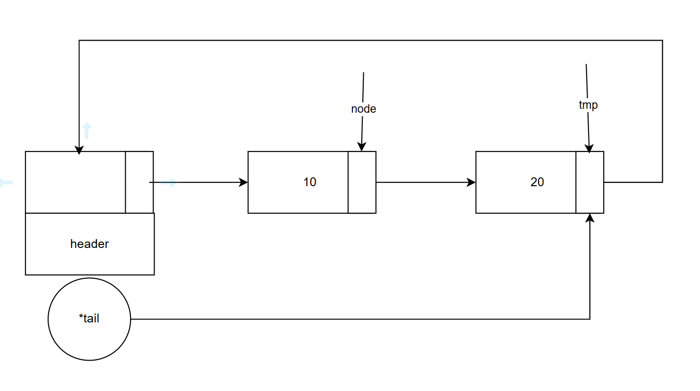

如下图：

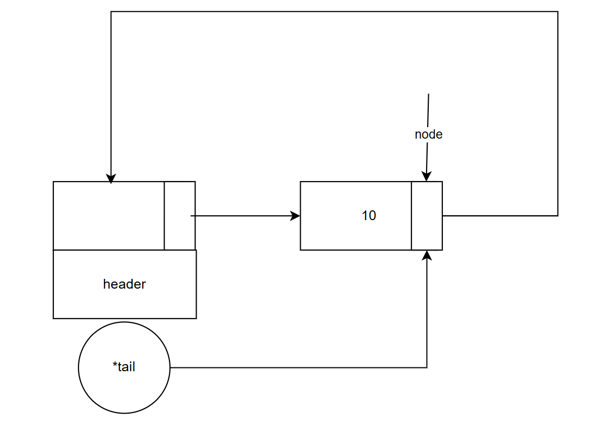

那么接下来来看代码部分

```c
int deleteLinkLoopList(LinkLoopList* link_loop, Element value) {
	LoopNode *node = &link_loop->header;

	while (node->next != &link_loop->header && node->next->val != value) {
		node = node->next;
	}
	if (node->next->val == value) {
		LoopNode *tmp = node->next;
		node->next = tmp->next;
		free(tmp);
		--link_loop->num;
	} else {
		printf("No %d element!\n", value);
	}
	return 0;
}
```

代码内容如下：

1. 引入第一个辅助指针 node
2. 遍历循环，直到找到 node-> next 等于我们要删除的值，如果没有则返回没有这个值
3. 找到对应的值，引入第二个辅助指针 tmp，让 tmp 等于删除的位置
4. 更新待删除位置的前一个结点的指针，指向删除位置的下一个位置
5. 释放待删除位置的元素

总体来讲逻辑上也是很简单的

##### 总结

单向循环链表解决了一个问题，那就是如何从当前结点出发访问到所有结点的位置

当然它肯定不如循环链表，所以接下来我们介绍循环链表

#### 双向循环链表

##### 双向循环链表概述

双向链表是在单链表的每个结点中，再设置一个 **指向前驱结点的指针域**

也就是双向循环链表有两个指针域，双向循环链表的节点结构如下图：

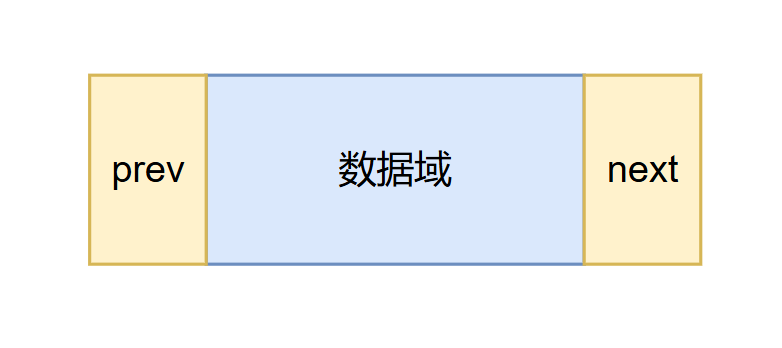

**prev：** 指向前一个结点的指针域

**next：** 指向后一个结点的指针域

**数据域：** 存数据元素的区域

那么双向链表的概述图如下图：
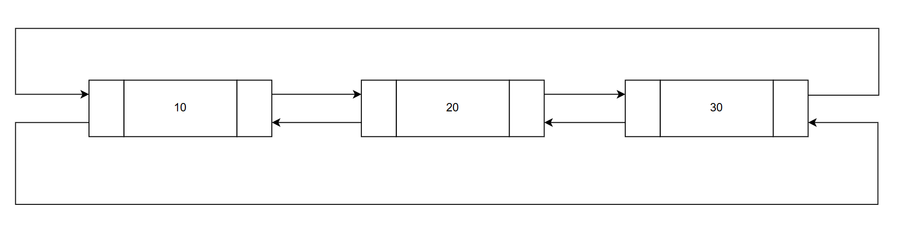

##### 双向循环链表代码实现

我们先对表头和结点进行一个结构体封装

```c
typedef int Element;
typedef struct _node {
	Element val;
	struct _node *next;
	struct _node *prev;
} DNode, DList;
```

这里呢我们选择表头和节点一块设计

那么这里面的内容：

1.结点里面存放的数值

2.结点指向后面的指针

3.结点指向前面的指针

完成了封装以后我们开始写代码

###### 初始化双向循环链表

```c
void initDList(DList* header) {
	header->val = 0;
	header->next = header->prev = header;
}
```

循环链表的初始化相对简单，初始化默认的数值为 0

然后将头结点的指针全部指向自己即可

如下图：
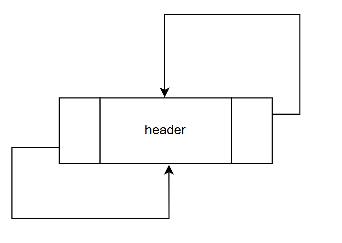

###### 头插法插入双向循环链表元素

先讲逻辑后讲代码：

先看下图：
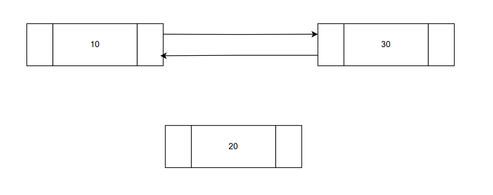

假设我要在 10 和 30 之间插入 20 这个元素，按照之前的逻辑来说，对于链表的插入，就一个思想，**引入辅助指针** 那对于双向循环链表来说，我们会引入两个辅助指针，第一个辅助指针（prev）放在 10 的位置，第二个辅助指针（next）放在 30 的位置，有了这两个辅助指针以后就可以开始操作了

那么具体的操作是什么呢，如下：

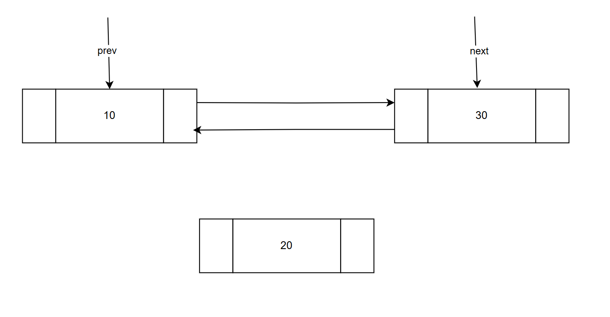

具体步骤如下：

1. next-> prev = 20
2. 20-> next = next
3. 20-> prev = prev
4. prev-> next = 20

这些操作步骤下来我们就可以完成插入代码。也就变成下图：

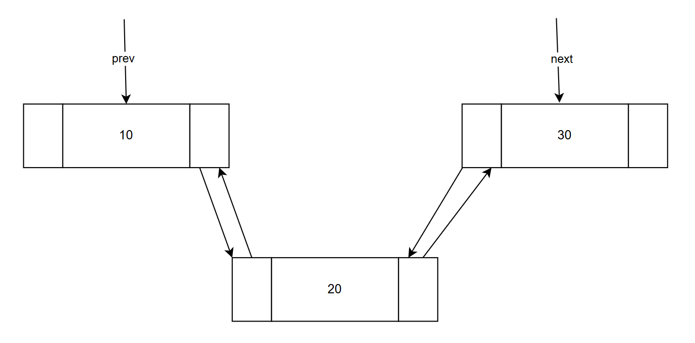

接下来我们写插入代码，在这之前我们写一个函数用来辅助操作

```c
static void addDNode(DNode *new_node, DNode *prev, DNode *next) {
	next->prev = new_node;
	new_node->next = next;
	new_node->prev = prev;
	prev->next = new_node;
}
```

那么这个函数就是跟我们上面讲的逻辑一模一样，通过引入两个辅助指针的位置，用来操作

```c
void insertDListHeader(DList* header, Element val) {
	DNode *new_node = malloc(sizeof(DNode));
	new_node->val = val;
	addDNode(new_node, header, header->next);
	++header->val;
}
```

那么代码如下：

1. 为新结点申请一个新的空间
2. 赋值
3. 添加新结点（**注意：** 这里的 prev 指针位置因为是头插法所以对应的应该是 header 位置，后面 next 对应的是 header-> next）
4. 增加结点数量

介绍完了头插法接下来介绍尾插法

###### 尾插法插入双向循环链表元素

```c
void insertDListRear(DList* header, Element val) {
	DNode *new_node = malloc(sizeof(DNode));
	new_node->val = val;
	addDNode(new_node, header->prev, header);
	++header->val;
}
```

尾插法具体插入逻辑和上述头插法一样

唯一注意修改的地方就是插入的 prev 和 next 这两个辅助指针位置，尾巴肯定是 header-> prev，而尾巴的下一个元素就是 header

大体逻辑不变

###### 删除双向循环链表元素

如下图：


现在我要把 20 删除，那具体操作思想和我们上面的思想保持一致，不过现在我们要再额外引入一个辅助指针 p，让 p 的位置放在 20 这个位置上面，用来备份 20，也是辅助我们进行删除操作

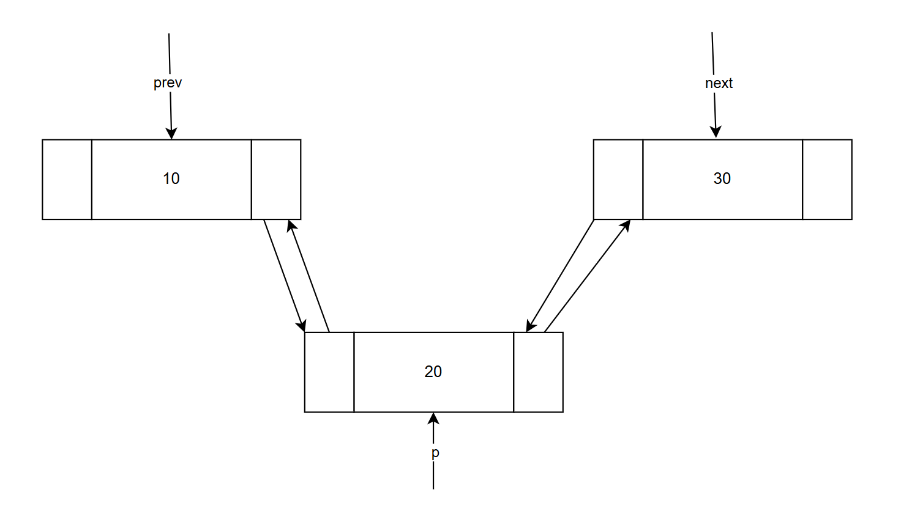

接下来我们来看操作逻辑：

1. next-> prev = prev;
2. prev-next = next;
3. free(p)

删除操作很简单，至于为什么引入 p，因为一旦我进行了 1 2 这个操作就没人认识 20 这个节点了，所以这时候我们选择引入辅助指针 p 来辅助我们操作

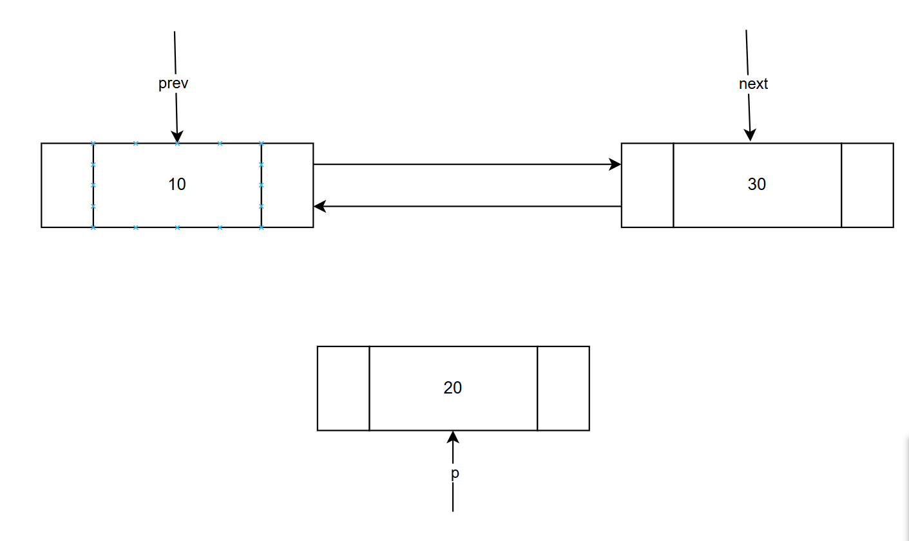

最后释放 p 即可

删除的代码同样引入一个辅助函数来操作

```c
static void delDNode(DNode *prev, DNode *next) {
	next->prev = prev;
	prev->next = next;
}
```

这里不再赘述逻辑

```c
void delDList(DList* header, Element e) {
	// 1. 找到这个元素，就可以删除，不需要再找到前置节点
	DNode *pos = header->next;
	while (pos != header && pos->val != e) {
		pos = pos->next;
	}
	// 2. 找到没有？
	if (pos != header) {	// 找到
		delDNode(pos->prev, pos->next);
		pos->next = pos->prev = NULL;
		free(pos);
		--header->val;
	} else {
		printf("Not find %d element!\n", e);
	}
}
```

代码内容如下：

1. 引入一个指针 pos，从头结点开始循，找到待删除元素的位置
2. 找到遇难苏位置后，引入辅助函数，对应的两个指针位置分别是 pos 的前一个和后一个位置
3. 删除元素过后，--pos 数量
4. 如果没找到元素则返回没有找到

这个就是删除元素的一个逻辑

##### 总结

对于双向链表来说，它更复杂一点，内存空间占用也多一点

不过由于它的良好的对称性，使它可以为某个节点的前后结点操作带来了方便，可以有效提升算法的时间

简单来说，就是以空间来换时间、

### 栈

#### 栈的概述

**概念：** 栈是限定仅在表尾进行插入和删除操作的线性表

**栈顶：** 允许插入和删除的一端

**栈底：** 对应的不允许插入和删除的一端

**空栈：** 不含任何的数据元素的栈

栈又称为后进先出的线性表，简称 LIFO 结构

栈的插入操作，叫做进栈、压栈、入栈

栈的删除操作，叫做出栈、弹栈

栈的结构如下图：

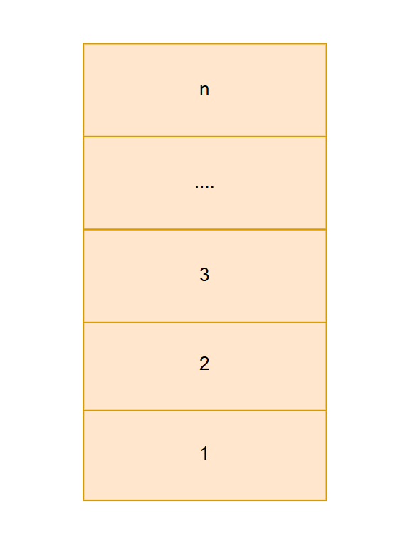

那么对于栈来说，线性结构都有两种存储结构，一种是顺序存储结构，一种是链式存储结构，因此栈也分为顺序栈和链式栈

我们先介绍顺序栈

#### 顺序栈

##### 顺序栈概述

顺序栈的结构图示跟上图一致，我们知道顺序表是用数组实现的，那么顺序栈也是用数组实现的

也就是整体如下图所示：


那么对于顺序栈的逻辑结构我们来想一想，一个顺序栈肯定要有对应的结构我们来看下图：

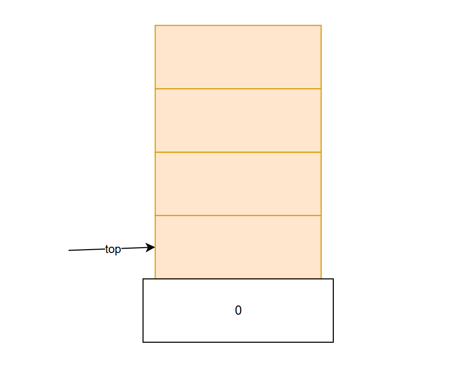

对于顺序栈而言，我们需要一个额外的空间，用来存对应的下标，然后引入另一个辅助值或者是指针，来指向我们的待插入位置，它这个待插入的位置肯定是比栈顶要高一点的，所以有了这么一个概念，我们就可以开始写代码了

##### 顺序栈代码实现

```c
typedef int Element;

#define MaxStackSize 5
typedef struct {
	Element data[MaxStackSize];
	int top;
} ArrayStack;
```

还是跟顺序表一样，我们先封装对应的结构体，如上图，我们已经说了，顺序栈用数组实现的，所以，我们得先封装一个对应的数组空间，然后还有对应的下标（top），做好准备工作后就可以开始写代码了

###### 初始化顺序栈

```c
void initArrayStack(ArrayStack* stack) {
	memset(stack->data, 0, sizeof(stack->data));
	stack->top = 0;
}
```

代码内容如下：

1. 将栈里面的内容指向的内存区域空间全部设置为 0
2. 将 top 设置在最低端

这就是顺序栈的初始化，相对简单

###### 顺序栈入栈操作

我们先讲下入栈的基本原理，如下图：


现在我要插入 10、20 这两个元素，那么根据我们上述所说，栈是一种先进后出的结构，所以 20 是压在 10 的上面，所以顺序栈入栈也叫做压栈的操作，那我们在每一次插入元素的时候，top 指针都要向上走，top 一直处于待插入位置，而不是栈顶的位置，如下图：

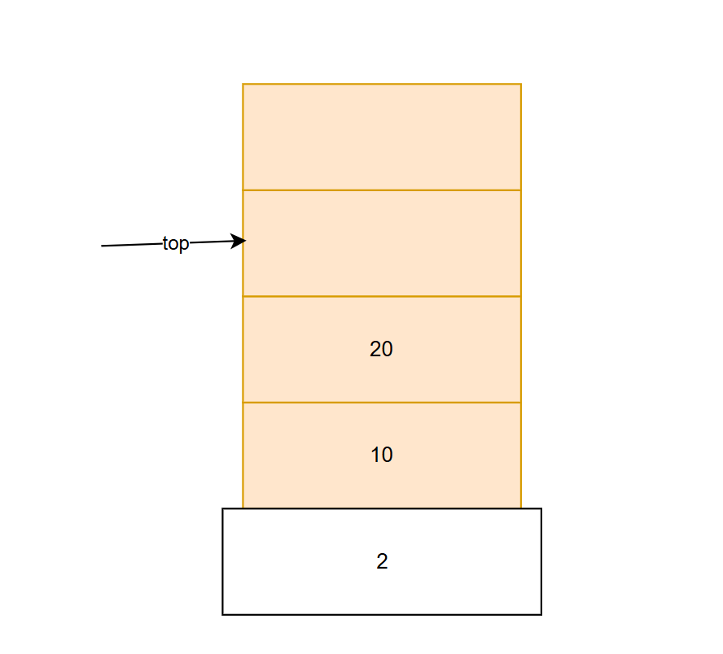

这就是栈的入栈基本原理，接下来我们来看代码：

```c
void pushArrayStack(ArrayStack* stack, Element e) {
	stack->data[stack->top] = e;
	++stack->top;
}
```

代码内容就相对简单，将 top 对应的位置赋值，然后 top++向上走即可

###### 顺序栈弹栈的操作

我们先看下代码：

```c
void popArrayStack(ArrayStack* stack) {
	--stack->top;
}
```

弹栈的操作相对比较简单，为什么呢，如下图：


假设我现在要删除 20 这个元素，那么我们只要 top 向下走一个位置即可，为什么呢，因为 top 这个指针指向的是待插入的位置，一旦有新的数据进来，那么这个值是不是被修改了，换句话说就是被删除了，注意我们这里并非获取元素，如果你输入对应的 null 空值，那么就变成了下图：

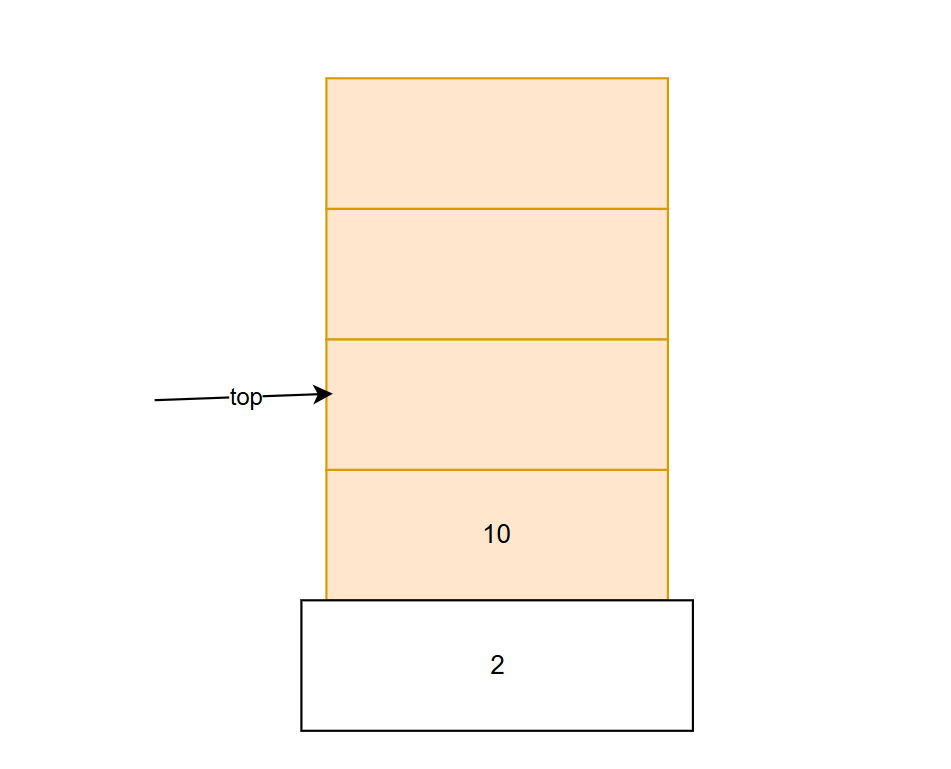

这就是弹栈的操作

###### 顺序栈获取栈顶元素

```c
Element getTopArrayStack(const ArrayStack* stack) {
	int pos = stack->top - 1;
	return stack->data[pos];
}
```

代码内容如下：

1. 引入一个辅助值 pos，让 pos 等于 top（待插入位置）-1，即对应栈顶的元素
2. 返回对应的栈顶元素

获取栈顶元素逻辑相对简单，这里不再赘述

##### 顺序栈总结

栈的顺序存储相对方便一点，因为只准栈顶出入元素，所以不存在线性表中需要大量移动元素的问题

不过他的缺陷就是要提前确定数组空间大小，不然内存空间不够可能需要扩容，所以相对麻烦一点

那么接下来我们来介绍链式栈

#### 链式栈

##### 链式栈概述

栈的链式存储方式跟单链表很像，但还是有一点区别的，我们看下图：

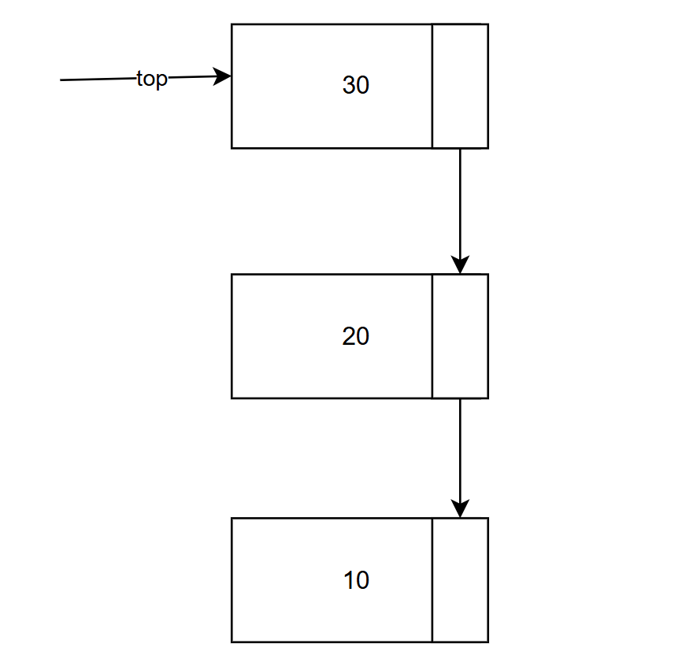

这大概就是链式栈的逻辑存储结构，这里不再过多描述我们直接看代码

##### 链式栈的代码实现

我们先做一下准备工作，先把表头准备好

```c
typedef struct _node {
	Element data;
	struct _node *next;
} StackNode;

typedef struct {
	StackNode *top;
	int count;
} LinkStack;
```

那么对于链式栈来说，我们跟单链表一样，封装一个 next 的指针域加一个数据域，表头这里由于我们不再使用数组，所以用指针来表示

有了这些我们就可以开始初始化了

###### 创建链式栈

```c
LinkStack* createLinkStack() {
	LinkStack* link_stack = malloc(sizeof(LinkStack));
	if (link_stack == NULL) {
		fprintf(stderr, "linkStack malloc failed!\n");
		return NULL;
	}
	link_stack->top = NULL;
	link_stack->count = 0;

	return link_stack;
}
```

代码内容如下：

1. 为链式栈申请一个表头 link_stack
2. 初始化 top 指针指向空，因为一开始创建没有任何元素
3. 对应的数量也为 0

那么这就创建好了链式栈

###### 链式栈入栈操作

我们还是先讲逻辑后说代码，看下图：

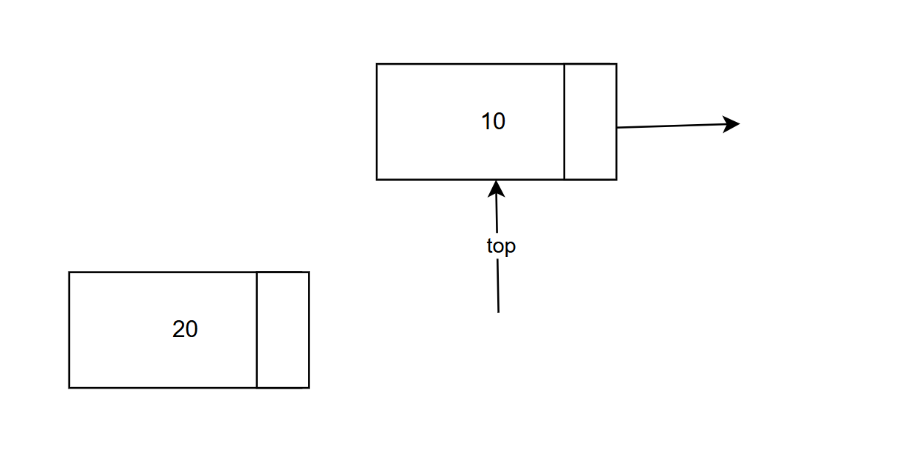

现在我要在 10 的基础上插入 20 这个元素，那么 20 是放右边呢，还是放左边呢，如果放右边，那是不是 top 要往右边走，但是这是个单向链表，那么如果你要删除的时候怎么操作呢，所以一般是将新的元素放左边，让 top 往左边移动，代码来讲就是 new_node-> next = top; top = new_node; 这就是插入逻辑，如下图：

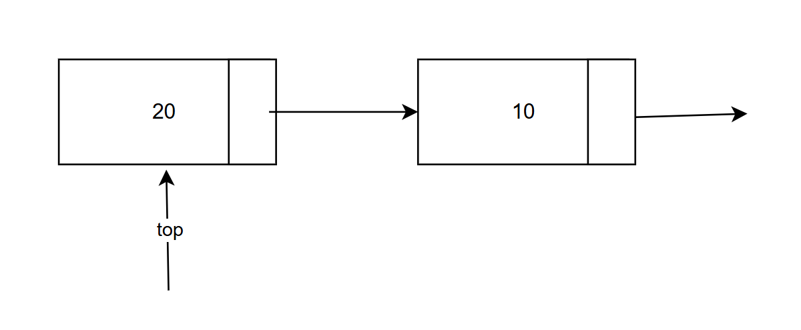

那么接下来我们来看代码：

```c
int pushLinkStack(LinkStack* stack, Element e) {
	StackNode *node = malloc(sizeof(StackNode));
	if (node == NULL) {
		fprintf(stderr, "Stack Node malloc failed!\n");
		return -1;
	}
	node->data = e;

	node->next = stack->top;
	stack->top = node;
	++stack->count;
	return 0;
}
```

代码内容如下：

1. 为新节点申请一个新的空间，并传入我们所给的值
2. 按照上面的逻辑，node-> next = stack-> top; 然后 stack-> top = node；
3. 最后加一下数量即可

那么这就是链式栈的插入操作

###### 链式栈出栈操作

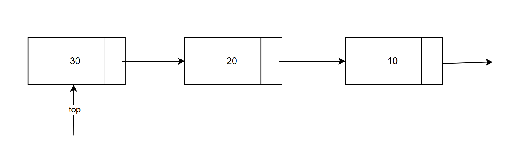

如上图我现在要出栈 30 这个元素，那么我们的操作就如下，这时候我们引入一个辅助指针 tmp 用来备份 top 的位置，然后让 top = top-> next 也就是让指针往后走，这时候我们最后 free(tmp)就可以了，这就是删除的逻辑


代码如下：

```c
int popLinkStack(LinkStack* stack, Element* e) {
	if (stack->top == NULL) {
		fprintf(stderr, "stack empty!\n");
		return -1;
	}
	*e = stack->top->data;
	StackNode *tmp = stack->top;
	stack->top = tmp->next;
	free(tmp);
	--stack->count;
	return 0;
}
```

代码内容如下：

1. 引入一个备份值 e 让 e = 栈顶的元素值
2. 按照上述的逻辑，引入备份然后移动 tmp，最后删除
3. 最后减少数量即可

这就是链式栈的出栈原理

##### 链式栈总结

 对于链式栈来说，它的便捷在于如果元素变化不可预料，有时候大有时候小，那么这时候用链式栈比较好

反之则用顺序栈比较好

### 队列

#### 队列概述

**概念：** 队列是只允许在一端进行插入操作，而在另一端进行删除操作的线性表

**队头：** 允许删除的一端称为队头

**队尾：** 允许插入的一端称为队尾

队列是一种 **先进先出** 的线性表结构，简称 FIFO

队列的理论图如下：

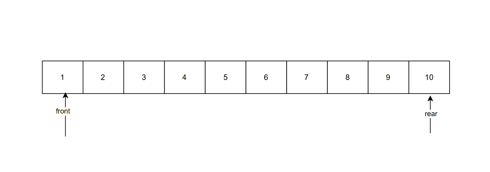

##### 队列的顺序存储不足

对于我们上面的队列来说，我们知道队列的队头是用来出元素的，而队尾是用来插入元素的，如果向上图我出去了 1、2 这两个元素，这时候队尾要插入元素，但是往后发现没有位置了，但实际上呢，因为队头出了两个元素，其实是有空间的，所以这时候就涉及到了一个概念，叫做伪溢出，如下图：

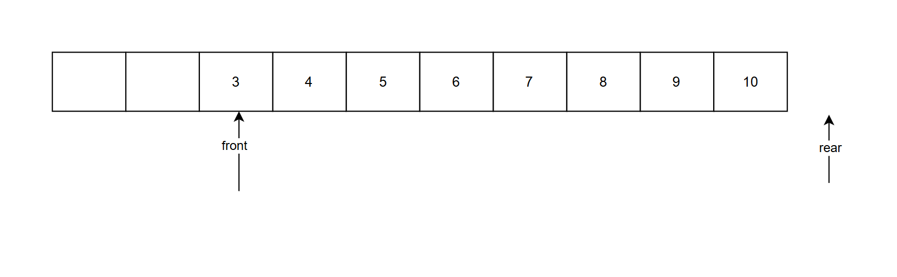

这就是伪溢出，所以为了解决这个问题，我们一般是用循环队列来解决这个问题

就是将队列看成首位相接的队列，叫做循环队列，那么对于两个指针怎么操作呢，下面两步关键的步骤：

```c
rear=(rear+1)%MaxSize;
front=(front+1)%MaxSize;
```

那么这句话是什么意思呢，rear+1 是让队尾向后走一个元素，让它指向下一个空闲单元，而至于为什么%呢，取模运算确保了指针永远不会超出数组的索引范围，换句话说，假设队列有 5 个元素，通过%可以一直让 rear 的位置在 0-4 的位置，非常符合数组的下标这个具体要去看 c 语言里面的%运算，这就是循环队列的一个核心步骤

那么介绍完了队列的基本操作，我们接下来来看顺序队列

#### 顺序队列

#####  顺序队列概述

顺序队列的基本概念如上，已经基础的和相关概念已经教完了，整个图呢如下：


那么接下来我们来看代码实现

##### 顺序队列代码实现

```c
#define MaxQueueSize	5
typedef struct {
	Element data[MaxQueueSize];
	int front;
	int rear;
} ArrayQueue;
```

我们还是先封装表头，我们上述之前讲过对于顺序存储结构，我们会先定义它的对应空间，对于顺序队列来说，还需要两个索引或者说是指针来指向它的头和尾巴，那么封装好我们就可以开始初始化了

###### 初始化顺序队列

```c
void initArrayQueue(ArrayQueue* queue) {
	queue->front = queue->rear = 0;
}
```

代码内容非常简单，因为一开始没有任何元素，所以队列的头指针和尾指针都等于 0，都等于空间最开始的位置

###### 顺序队列入队

在讲入队具体代码之前，我们还是先看一下逻辑：

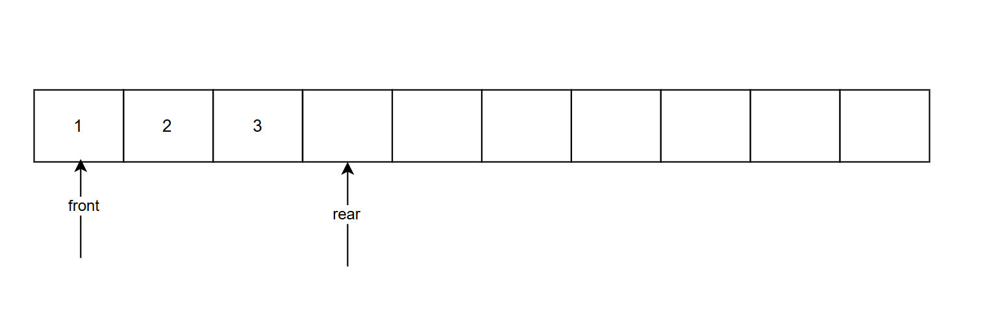

我们已经知道队列里面，队尾负责插入元素，所以要插入一个新的元素的时候，直接将队尾所对应的位置，直接将元素值给即可，然后这里 rear 可不是直接++，按照我们上面说的，它是一个循环逻辑，所以应该是 rear =(rear+1)%maxsize; 这样就可以实现入队操作了。

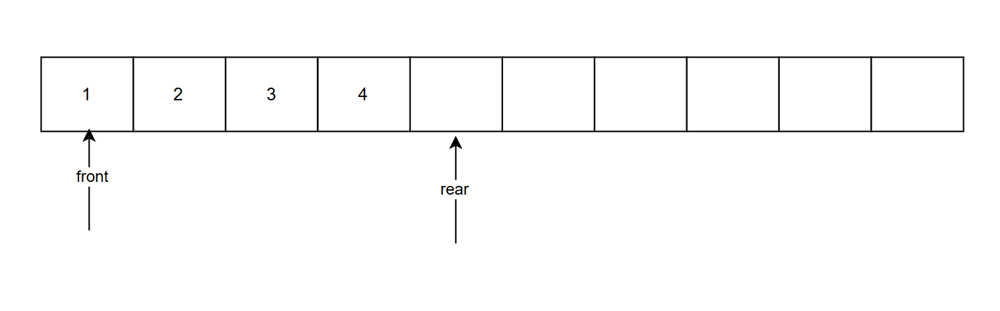

具体代码如下：

```c
int enArrayQueue(ArrayQueue* queue, Element e) {
	if ((queue->rear + 1) % MaxQueueSize == queue->front) {
		fprintf(stderr, "Queue Full!\n");
		return -1;
	}
	queue->rear = (queue->rear + 1) % MaxQueueSize;
	queue->data[queue->rear] = e;
	return 0;
}
```

代码内容如下：

1. 先判断队尾是否和队头保持一致了，如果一致则说明队列已经满
2. 队尾向后走一个位置
3. 赋值给队尾

这就是顺序队列的入队操作

###### 顺序队列出队

那么出队操作应该怎么做呢，如下图：

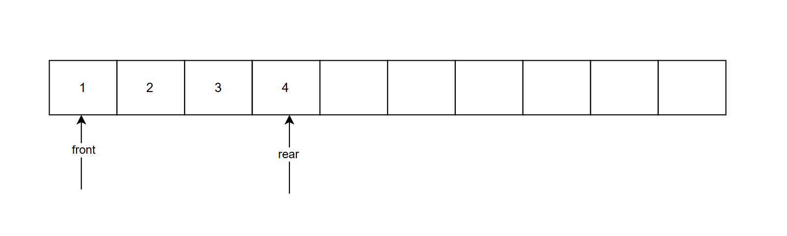

按照之前说的，这时候出队到队头操作了，操作思路也比较简单，直接按照上面说的，让 front 向后走，然后把之前的值直接拿出去即可

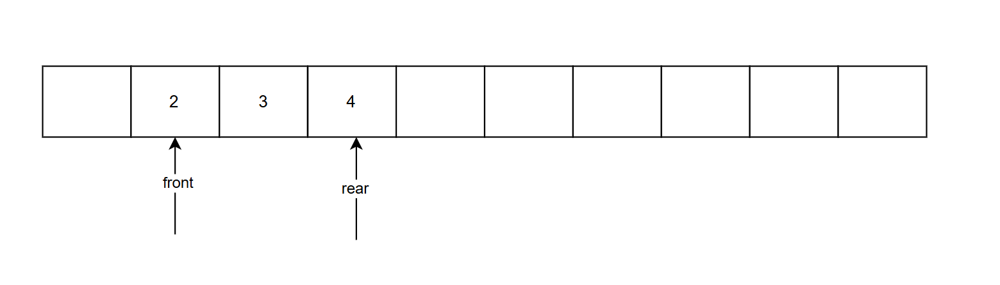

代码如下：

```c
int deArrayQueue(ArrayQueue* queue, Element* e) {
	if (queue->rear == queue->front) {
		fprintf(stderr, "Queue Empty!\n");
		return -1;
	}

	queue->front = (queue->front + 1) % MaxQueueSize;
	*e = queue->data[queue->front];

	return 0;
}
```

代码内容如下：

1. 还是分析队头是否等于队尾，判断是否为空队列
2. 队头向后走
3. 取出对应的元素

这就是顺序队列的出队操作

##### 总结

顺序队列是基于数组实现的“先进先出”数据结构，通过队头和队尾指针进行入队和出队操作。其核心问题是数组空间可能产生“假溢出”，即数组前部有闲置空间但队尾指针已无法后移。为解决该问题，通常采用循环队列的设计，通过取模运算让指针在数组内循环移动，从而高效地复用空间，但其大小仍需预先固定。

#### 链式队列

##### 链式队列概述

**概念：** 链式队列是一种 **基于链表** 实现的队列。和所有队列一样，它严格遵循 **“先进先出”** 的原则。

- **队头指针（Front）**：始终指向链表中的 **第一个结点**（即队头结点），所有出队操作都通过它进行。
- **队尾指针（Rear）**：始终指向链表中的 **最后一个结点**（即队尾结点），所有入队操作都通过它进行。

整个链式队列如下图：

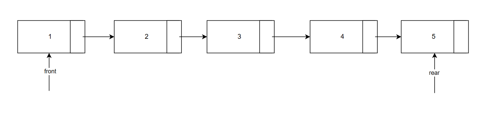

- **不存在“假溢出”问题**：因为链式队列的每个结点都是在需要时 **动态申请内存空间** 的，只要系统的内存还没有耗尽，就可以一直进行入队操作。它 **不需要** 像顺序队列那样预先分配一块固定大小的数组。

所以链式队列不需要写循环链表那样，进行循环，那么接下来我们来看代码

##### 链式队列代码实现

```c
// 链表的节点
typedef struct _node {
	Element data;
	struct _node *next;
} QueNode;

// 链式队列的头节点
typedef struct {
	QueNode *rear;
	QueNode *front;
	int cnt;
	const char *name;
} LinkQueue;
```

对于这些结构我们还是保持一致，都先设计一个封装好的头结点，对于链表或者链式存储结构来说，这里面的每一个结点我们要封装一个结构体以方便我们操作，那么结点还是跟链表一样，然后队列的头结点里面，也是包含两个指针加一个数量值，这里还额外添加了一个关于这个队列叫什么名字这个可有可无

###### 创建链式队列

```c
LinkQueue* createLinkQueue(const char *name) {
	LinkQueue* queue = malloc(sizeof(LinkQueue));
	if (queue == NULL) {
		fprintf(stderr, "createLinkQueue malloc failed!\n");
		return NULL;
	}
	queue->name = name;
	queue->front =queue->rear = NULL;
	queue->cnt = 0;

	return queue;
}
```

创建链式队列比较简单，跟链表很类似，代码内容如下：

1. 一开始先申请一个队列空间
2. 把对应的值赋值，这里一开始队头队尾都分别指向空
3. 最后队列的节点数量为 0

那么这就创建好了链式队列

###### 链式队列入队

链式队列里面入队插入元素我们一般选择尾插法，如下图：

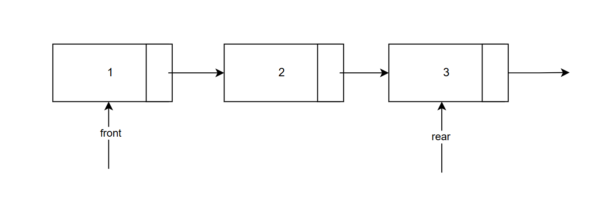

在链式队列中插入元素（例如插入“4”）时，其插入逻辑设计为 `rear->next = new_node;` 和 `rear = new_node;`，即新节点始终添加在队尾（右侧），而不是像栈那样向左（队头方向）添加。原因如下：

1. **队列的核心规则是“先进先出”（FIFO）**：若新节点一直向左插入队头，则最新插入的节点会成为新的 `front`。这会导致出队操作时，无法按正确顺序删除最早进入的元素（例如“1”），反而删除了最新插入的节点（如“4”），这违反了 FIFO 原则，实质上变成了栈的“后进先出”（LIFO）行为。
2. **单向链表的指针局限性**：单向链表的节点只包含指向下一个节点的指针（`next`）。若一直向左插入，`rear` 指针确实可以始终指向最新节点，但 `front` 指针会被困在链表最左端，无法向左移动以执行删除操作（因为无前驱指针），导致出队功能无法实现。
3. **正确的插入逻辑保障操作有效性**：通过 `rear->next = new_node` 将新节点链接到当前队尾，再更新 `rear = new_node` 使其指向新队尾，既能确保新元素添加在队列末端，又保持了 `front` 指针始终指向队头（最早进入的元素），使得出队操作可直接通过 `front` 指针安全高效地完成。

因此，链式队列的插入逻辑设计是为了严格遵循队列的 FIFO 特性，并适应单向链表的指针结构，确保入队和出队操作均可正确执行。

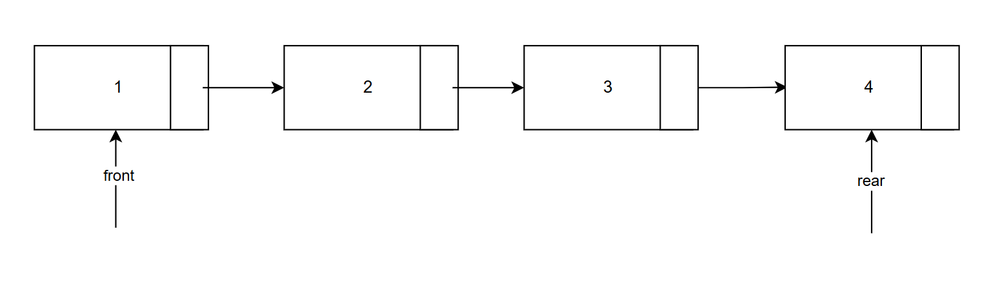

接下来来看代码：

```c
// 先有新节点，新节点应该rear的next方向插入，便于front的删除
int enLinkQueue(LinkQueue* queue, Element e) {
	QueNode *node = malloc(sizeof(QueNode));
	if (node == NULL) {
		fprintf(stderr, "enLinkQueue new_node malloc failed!\n");
		return -1;
	}
	node->data = e;
	node->next = NULL;
	if (queue->rear) {
		queue->rear->next = node;
		queue->rear = node;
	} else {
		queue->rear = queue->front = node;
	}
	queue->cnt++;
	return 0;
}
```

代码内容如下：

1. 前面的内容跟链表一样，将新节点里面的数值赋值，然后 next 的指针指向空
2. 在插入的时候我们要先判断 rear 是否存在，因为可能存在一开始创建为空的情况，如果有按照上述逻辑插入，如果没有，则在队头和队尾的位置创建结点
3. 增加结点的数量

这就是链式队列入队的操作

###### 链式队列出队

我们还是先看下图 

链式队列的删除（出队）操作严格在 **队头（front）** 进行。其核心逻辑是：移除 `front` 指针当前所指的节点，并让 `front` 指向下一个节点，从而更新队头。

**操作步骤（以出队元素“1”为例）：**

1. **保存数据**：首先，通过 `*e = front->data` 将队头节点的数据保存到变量 `e` 中，以便后续使用或返回。
2. **标记待删节点**：引入一个 **辅助指针 `tmp`**，令 `tmp = front`。此时，`tmp` 和 `front` 同时指向待删除的队头节点。
3. **更新队头**：将 `front` 指针向后移动一位，指向其下一个节点，即执行 `front = front->next`。至此，新的队头已经确立。
4. **释放内存**：最后，通过 `free(tmp)` 释放原队头节点（即 `tmp` 所指向的节点）所占用的内存。

完成以上四步后，元素“1”便被成功移出队列，内存空间得到释放，且 `front` 指针已正确指向新的队头。

**总结：** 该流程通过引入辅助指针 `tmp`，巧妙地实现了在更新 `front` 指针的同时，保留对原队头节点的引用，从而安全地将其内存释放，是链式队列出队的标准且高效的做法。

代码如下：

```c
int deLinkQueue(LinkQueue* queue, Element* e) {
	if (queue->front == NULL) {
		fprintf(stderr, "queue empty!\n");
		return -1;
	}
	*e = queue->front->data;
	QueNode *tmp = queue->front;
	queue->front = tmp->next;
	free(tmp);
	queue->cnt--;
	if (queue->front == NULL) {		// 队列中已经没有元素
		queue->rear = NULL;
	}
	return 0;
}
```

代码内容如下：

1. 我们先判断这个 front 是否为空，如果是空的则是空的链式队列，无法删除元素
2. 按照上述逻辑进行操作
3. 减少队列里面对应的数量，如果这时队头为空了，那就说明队列里面已经没有元素了，所以队尾同样赋值为空

这就是链式队列的出队操作

##### 总结

链式队列是一种基于 **单向链表** 实现的队列，它严格遵循 **先进先出（FIFO）** 的原则。其核心是通过 **队头（front）** 和 **队尾（rear）** 两个指针分别指向链表的首节点和尾节点来进行管理。

**入队操作** 在队尾进行，通过将新节点链接到 rear 所指节点的后面并更新 rear 指针来完成；**出队操作** 在队头进行，通过移除 front 所指节点并使其指向下一个节点来实现。

它的最大优点是 **动态分配内存**，无需预先指定容量，只要系统内存充足就可以无限扩展，从而彻底避免了顺序队列的“假溢出”问题。缺点是每个节点需要额外的指针空间，且操作涉及动态内存管理，性能开销稍大。

总之，链式队列是一种利用链表动态性、以空间换时间的队列实现方案，非常适合数据量变化大或难以预估的场景。

### 线性结构总结

线性结构是数据元素按顺序排列的集合，每个元素最多有一个前驱和一个后继，构成了最简单也最基础的数据关系。其核心实现主要包括以下四种：

**1. 顺序表：基于数组的连续存储** 顺序表是线性结构最直观的体现，它采用数组作为底层存储，所有元素在内存中依次存放。其最大优势是 **支持随机访问**，通过下标即可在常数时间 O(1)内定位任何元素，查询效率极高。然而，这种紧密排列的代价是在中部进行插入或删除操作时，必须移动大量元素以保持连续性，时间复杂度为 O(n)。此外，其容量必须预先静态分配，难以灵活应对数据量的动态变化。

**2. 链表：基于指针的离散存储** 链表采用一组任意的存储单元来存放元素，每个节点不仅包含数据本身，还包含指向下一个节点地址的指针。这种链式存储结构彻底解决了顺序表插入删除效率低的问题，只需修改相关指针的指向即可完成操作，时间复杂度为 O(1)。同时，它可以按需动态申请内存，无需担心容量不足。但其代价是 **失去了随机访问能力**，查找元素必须从头开始顺序遍历，时间复杂度为 O(n)，且每个节点的指针域也带来了额外的空间开销。

**3. 栈：受限访问的线性表（后进先出 - LIFO）** 栈是一种操作受限的线性表，其添加和移除操作被严格限制在表的同一端进行，这一端被称为“栈顶”。它强制遵循 **后进先出（LIFO）** 的原则，最后压入栈的元素将最先被弹出。这种特性使得栈非常适合处理具有回溯性质的问题，如函数调用栈、表达式求值、括号匹配、撤销操作等。栈既可以用数组（顺序栈）实现，也可以用链表（链栈）实现，其核心操作（压栈、弹栈）的时间复杂度均为 O(1)。

**4. 队列：受限访问的线性表（先进先出 - FIFO）** 队列同样是一种操作受限的线性表，但其插入和删除操作分别在一端进行。插入发生在 **队尾**，删除则发生在 **队头**，这保证了元素严格的 **先进先出（FIFO）** 顺序，就像现实生活中的排队一样。队列是管理公平性和顺序性的理想模型，广泛应用于任务调度、消息缓冲、广度优先搜索等场景。队列的实现也有顺序（循环队列）和链式（链队列）两种方式，其中顺序队列需通过“循环”结构巧妙解决“假溢出”问题。

**总结关系：** 顺序表和链表是构建线性结构的两种 **物理基石**，前者强调存储效率和访问速度，后者强调操作灵活性和动态性。而栈和队列则是在此基础上定义的两种重要 **逻辑抽象** 和 **访问规则**，它们限定了数据的操作方式，从而解决了特定类型的计算问题。理解它们的特性和适用场景，是设计和优化算法的基础。

那么接下来我们就开始进入下一个板块，树状结构

## 树状结构

### 树概述

#### 树的基本概念

树（Tree）是一种表示 **层次关系** 的 **非线性** 数据结构。 它包含一个或多个节点，节点通过边连接，且满足以下三个核心条件：

- **有且仅有一个根节点**（Root），该节点无父节点。
- **除根节点外，每个节点都有且仅有一个父节点**。
- **树中不存在任何环**（从任一节点出发，沿边移动都不能回到自身）。
- 树的定义具有 **递归性**，即“树中还有树”。

#### **基本概念与术语**

- **节点**：树的基本构成单元，包含数据项及其指向子节点的指针。
- **边**：连接两个节点的线段，表示父子关系。
- **根节点**：树的最顶层节点，没有父节点。
- **父节点**：一个节点的直接上层节点。
- **子节点**：一个节点的直接下层节点。
- **兄弟节点**：具有相同父节点的节点。
- **子树**：一个节点及其所有后代节点构成的集合。

#### **重要属性与度量**

- **节点的度**：一个节点拥有的 **子节点数目**。
- **树的度**：树中所有节点的度的 **最大值**。
- **叶节点**：**度为 0** 的节点（也称为终端节点）。
- **分支节点**：**度不为 0** 的节点（也称为非终端节点）。
- **层次**：从根开始定义，**根为第 1 层**（或第 0 层），其子节点为第 2 层，逐层向下。
- **节点的深度**：从 **根节点** 到该节点的 **唯一路径上的边的数目**。
- **节点的高度**：从该节点到其 **最远叶节点** 的路径上的 **边数**。
- **树的高度**：**根节点的高度**。
- **树的深度或者高度：** 结点的层次从根结点开始定义起，根为第一层，根的孩子为第二层。依次类推

#### 树的存储方法

1. **链式存储（最常用）**
   - **核心**：每个节点是一个结构体，包含 **数据域** 和 **指针域**。
   - **指针域** 用于存储指向其子节点的地址，通过指针链接建立节点间的父子关系。
2. **顺序存储（数组）**
   - **双亲表示法：** 数组每个单元存储节点的数据和其父节点在数组中的下标。根节点的父指针置为-1。
     - **优点**：查找父节点效率极高。
     - **缺点**：查找子节点需遍历整个数组。
   - **孩子表示法**：数组每个单元存储节点的 **数据** 和一个 **链表头指针**，该链表记录其所有子节点在数组中的位置。
   - **孩子兄弟表示法**：数组每个单元存储节点的 **数据**、其 **第一个子节点的下标** 以及其 **下一个兄弟节点的下标**。此法能用二叉树的结构表示多叉树。

#### 树的图示结构

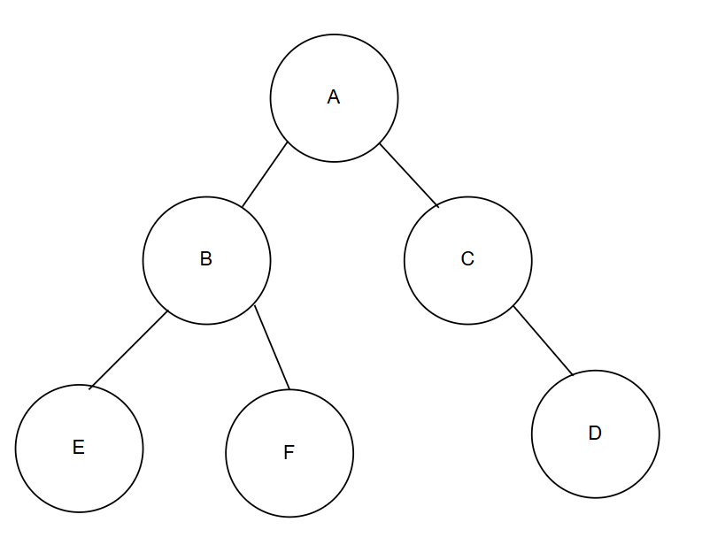

那么如上图所示，这就是一个无规则的树

那么接下来开始介绍特殊的树

### 二叉树

#### 二叉树的概念

##### **核心定义**

二叉树（Binary Tree）是每个节点 **最多有两个子节点** 的树结构。 这两个子节点通常被称为 **左子节点** 和 **右子节点**。 即使某个节点只有一个子节点，也要区分它是左子节点还是右子节点。

##### **两种特殊形态**

1. **满二叉树**
   - 一棵高度为 `h` 的二叉树，如果其第 `1` 到 `h` 层的所有节点都达到了 **最大个数**，则称为满二叉树。
   - 直观理解：除最后一层叶子节点外，每个节点都有两个子节点，且所有叶子节点都在最底层。
2. **完全二叉树**
   - 一棵深度为 `h` 的二叉树，其前 `h-1` 层是满的，且第 `h` 层的节点都 **连续集中在最左边**。
   - 通俗理解：在满二叉树的基础上，只能从右至左、从下至上地 **缺失若干个相邻的叶子节点**。

##### 主要性质

- **性质一**：在二叉树的 **第 `i` 层** 上，至多有 **2 <sup>(i-1)</sup>** 个节点。(`i ≥ 1`)
- **性质二**：**深度为 `h`** 的二叉树，其节点总数最多是 **2 <sup> h </sup> - 1** 个。(`h ≥ 1`)
- **性质三**：对 **任何一棵二叉树**，如果其 **叶子节点数为 `n₀`**，**度为 2 的节点数为 `n₂`**，则满足：**`n₀ = n₂ + 1`**。
- **性质四**：具有 `n` 个节点的完全二叉树，其深度为 **⌊log₂n⌋ + 1**。（⌊⌋ 表示向下取整）

##### **遍历方式**

二叉树的遍历是指按某种规则访问树中每个节点，且每个节点仅被访问一次。

1. **深度优先搜索**
   - **定义**：沿着树的深度遍历节点，尽可能深地搜索分支。会先走到叶子节点，然后再回溯。
   - 主要策略（根据访问根节点的顺序划分）：
     - **先序遍历**：先访问 **根节点**，然后遍历 **左子树**，最后遍历 **右子树**。
     - **中序遍历**：先遍历 **左子树**，然后访问 **根节点**，最后遍历 **右子树**。
     - **后序遍历**：先遍历 **左子树**，然后遍历 **右子树**，最后访问 **根节点**。
2. **广度优先搜索**
   - **定义**：从树的根节点开始，**逐层** 向下访问，在同一层中按从左到右的顺序依次访问节点。
   - **实现方法**：通常借助 **队列** 数据结构来实现。先将根节点入队，然后每次从队列中取出一个节点并访问，同时将这个节点的所有子节点（左、右子节点）按顺序入队，重复此过程直到队列为空。

##### 二叉树的图示

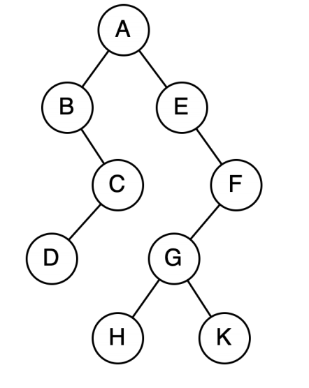

那么接下来我们就可以开始写代码了

结点为n的二叉树一共有n-1条有效分支路径。那么，则二叉链表中存在

2n - ( n-1 ) = n + 1个 空指针域

#### 二叉树的代码实现

```c
typedef int Element;
// 树的节点结构
typedef struct _tree_node {
	Element data;
	struct _tree_node *left;
	struct _tree_node *right;
} TreeNode;

// 二叉树的树头
typedef struct {
	TreeNode *root;
	int count;
} BinaryTree;
```

**结点封装：双指针结构**

为实现上述逻辑，每个结点需包含以下三个核心部分：

1. **数据域**：用于存储该结点的实际数据。
2. **左指针域**：一个指针，用于指向其 **左子结点**。
3. **右指针域**：一个指针，用于指向其 **右子结点**。

这种一个数据域搭配两个指针域的构造，是二叉树区别于单向链表（单指针）的关键。

**树头封装：管理整棵树**

为高效管理整棵二叉树，我们通常会封装一个 **树头（Tree Head）** 结构。它包含两个主要成员：

1. **根结点指针**：一个指向二叉树 **根结点** 的指针。这是访问整棵树的起点。
2. **结点计数器**：一个记录当前二叉树 **结点总数** 的变量。此成员非必需，但能极大方便我们快速获取树的大小，无需遍历。

有了上述的两个结构我们就可以开始写代码了

##### 创建二叉树

```c
BinaryTree *createBinaryTree(TreeNode *root) {
	BinaryTree *tree = malloc(sizeof(BinaryTree));
	if (tree == NULL) {
		fprintf(stderr, "tree malloc failed!\n");
		return NULL;
	}
	if (root) {
		tree->root = root;
		tree->count = 1;
	} else {
		tree->root = NULL;
		tree->count = 0;
	}
	return tree;
}
```

代码内容如下：

1. 首先我们为整个树申请一个空间，这个空间由我们自己管理
2. 如果树已经有根结点了，那么根结点就是所对应的节点，数量为 1；反之如果没有则树的根指针指向为空，数量为 0。
3. 最后返回整棵树

创建二叉树的代码相对简单一点

##### 创建二叉树的节点

```c
TreeNode *createTreeNode(Element e) {
	TreeNode *node = malloc(sizeof(TreeNode));
	node->data = e;
	node->left = node->right = NULL;
	return node;
}
```

代码内容比较简单，直接申请一个结点空间，然后赋值，然后这个结点的左右指针分别为空，这就是创建结点，为什么要创建结点，因为创建结点是为了方便我们进行插入和删除的操作。

##### 插入二叉树的节点

```c
void insertBinaryTree(BinaryTree* tree, TreeNode* parent, TreeNode* left, TreeNode* right) {
	if (tree && parent) {
		parent->left = left;
		parent->right = right;

		if (left) {
			tree->count++;
		}
		if (right) {
			tree->count++;
		}
	}
}
```

因为我们这个二叉树是一棵无规则的树，所以插入的实现比较简单，代码内容如下：

- 首先判断树和父亲是否存在，如果存在，根据插入的内容，更新父亲结点的左指针或右指针
- 如果左边存在，++count; 如果右边存在，++count.

那么由于这个二叉树没有任何规则，所以这里不再画图示

##### 二叉树的先序遍历

那么接下来我们将会写三个遍历的代码实现，在这之前我们先来看一下深度搜索的概念

**深度优先搜索：**

- **定义**：沿着树的深度遍历节点，尽可能深地搜索分支。会先走到叶子节点，然后再回溯。
- 主要策略（根据访问根节点的顺序划分）：
  - **先序遍历**：先访问 **根节点**，然后遍历 **左子树**，最后遍历 **右子树**。
  - **中序遍历**：先遍历 **左子树**，然后访问 **根节点**，最后遍历 **右子树**。
  - **后序遍历**：先遍历 **左子树**，然后遍历 **右子树**，最后访问 **根节点**。

那么我们知道了深度搜索的概念，那么如果要实现深度优先搜索，我们肯定需要用递归来写，当然也有不是递归的写法，这里我们写介绍递归的写法

我们先写一个辅助函数：

```c
void visitTreeNode(const TreeNode* node) {
	if (node)
		printf("\t%c", node->data);
}
```

这个函数是用来查看结点里面的数据了，比较简单这个不做解释，接下来我们来看先序遍历

```c
static void preOrderNode(const TreeNode *node) {
	if (node) {
		visitTreeNode(node);
		preOrderNode(node->left);
		preOrderNode(node->right);
	}
}
```

先序遍历的逻辑遵循“根-左-右”的递归顺序：当首次访问某个节点时立即处理该节点，随后递归遍历其左子树，待左子树遍历完成后，再递归遍历其右子树。每个节点仅在其首次被递归栈展开时访问一次。

```c
void preOrderBTree(const BinaryTree* tree) {
	preOrderNode(tree->root);
	printf("\n");
}
```

那么对于先序遍历来说，那么我们肯定先访问树并且先从树的根结点开始，然后用我们上面所封装的代码来写，这就是先序遍历的写法，那么接下来我们来看中序遍历和后序遍历

##### 二叉树的中序遍历

```c
static void inOrderNode(const TreeNode *node) {
	if (node) {
		inOrderNode(node->left);
		visitTreeNode(node);
		inOrderNode(node->right);
	}
}
```

二叉树的中序遍历遵循“左-根-右”的递归顺序：首先递归遍历左子树，待左子树遍历完成后返回至当前节点（即第二次经过时）进行访问，最后递归遍历右子树。每个节点在其左子树递归返回时被访问一次。

```c
void inOrderBTree(const BinaryTree* tree) {
	inOrderNode(tree->root);
	printf("\n");
}
```

那么这就是二叉树的中序遍历，传入对应的树根即可

##### 二叉树的后序遍历

```c
static void postOrderNode(const TreeNode *node) {
	if (node) {
		postOrderNode(node->left);
		postOrderNode(node->right);
		visitTreeNode(node);
	}
}
```

二叉树的后序遍历遵循“左-右-根”的递归顺序：首先递归遍历左子树，待左子树遍历完成后，递归遍历右子树，最后在左右子树均遍历完成后返回至当前节点（即第三次经过时）进行访问。每个节点在其左右子树递归均返回后被访问一次。

```c
void postOrderBTree(const BinaryTree* tree) {
	postOrderNode(tree->root);
	printf("\n");
}
```

这就是二叉树的后序遍历，原理与上述一致，这里不再赘述

##### 二叉树的广度优先搜索

好接下来我们来讲二叉树的广度优先搜索，我们先看下图：

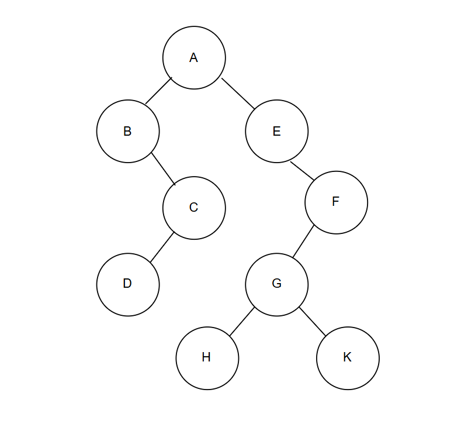

假设我们现在要对上述图进行广度优先搜索遍历，我们先看下广搜的概念：

**广度优先搜索**

- **定义**：从树的根节点开始，**逐层** 向下访问，在同一层中按从左到右的顺序依次访问节点。
- **实现方法**：通常借助 **队列** 数据结构来实现。先将根节点入队，然后每次从队列中取出一个节点并访问，同时将这个节点的所有子节点（左、右子节点）按顺序入队，重复此过程直到队列为空。

那么我们知道广度优先搜索我们需要引入队列来辅助我们实现，上述也说了，每次从队列中取出一个节点访问，同时将这个节点的所有子节点按顺序入队，重复此过程，如上图这时候我们将 A 入队，如下图：
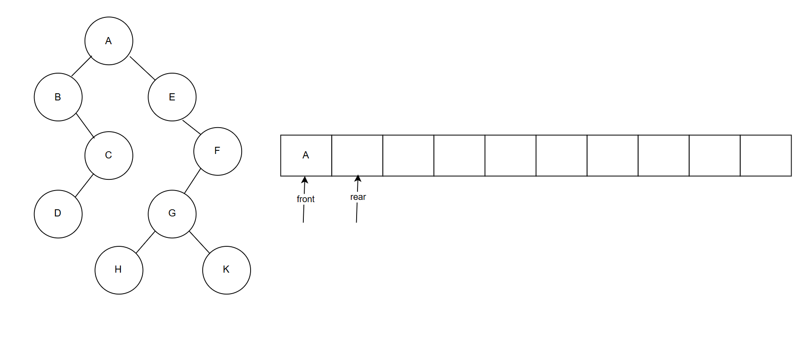

那么这时候我们在访问 A 节点的时候我们将 B 和 E 按顺序入队，如下图：

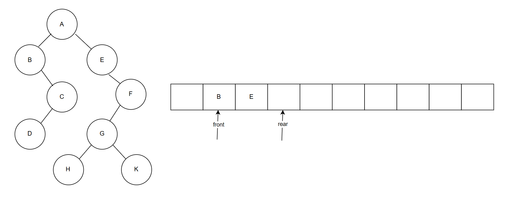

B 和 E 入队后我们就重复上述的操作，访问 B 的时候我们再把 C 放入，访问 E 的时候放入 F 以此类推，这样我们就实现了广度优先搜索，这就是二叉树广度优先搜索的实现概述，接下来我们看代码

```c
/* 广度遍历
 * 1. 引入一个任务队列，先把根节点入队
 * 2. 从任务队列中，取出一个节点，处理他（访问）
 * 3. 如果2步的节点，有左那么就入队，有右那么就入队
 * 4. 重复第2步
 */
void levelOrderBTree(const BinaryTree* tree) {
	// 申请一个任务队列，用顺序存储，循环队列，队列里每个元素应该是节点的地址
	#define MaxQueueSize 8
	TreeNode* queue[MaxQueueSize];
	int front, rear;

	// 初始化系统
	front = rear = 0;
	queue[rear] = tree->root;
	rear = (rear + 1) % MaxQueueSize;

	// 开始循环系统处理事务
	while (rear != front) {
		TreeNode* node = queue[front];
		front = (front + 1) % MaxQueueSize;
		visitTreeNode(node);
		if (node->left) {
			queue[rear] = node->left;
			rear = (rear + 1) % MaxQueueSize;
		}
		if (node->right) {
			queue[rear] = node->right;
			rear = (rear + 1) % MaxQueueSize;
		}
	}
}
```

代码内容如下:

- 我们上述说了竟然要进行广度优先搜索，需要引入队列，所以我们先申请一个任务队列，这里呢我们选择用顺序存储，循环队列，一开始我们自己定义整个队列空间大小，这里举例，所以我们定义大小为 8，也方便我们后续操作，实际工程根据大小变化
- 我们初始化整个队列，将他们的队头和队尾分别设置为 0，一开始我们先放入根结点，然后让 rear 向后走一格，接下来就可以开始循环了
- 那么循环的条件比较简单，那就是头指针和尾指针不相撞，也就是队列不为空的时候，那么取队列元素的时候我们可以引入一个辅助指针放到整个队列的队头位置，然后我们让 front 继续向后走，然后我们访问对应辅助指针所在的位置的元素值，访问完一个结点以后我们要看它的左右是否有节点，如果有节点，我们按照先左后右的逻辑，将结点插入到整个队列当中，重复上述操作即可

那么这就是二叉树的广度搜索实现

#### 二叉树总结

二叉树是一种基础且重要的树形数据结构。它的核心特点在于，树中的每个节点最多只能拥有两个子节点，通常被称为“左孩子”和“右孩子”。这种“一对二”的分支结构是其得名“二叉”的原因。这种结构天然地具有递归性，即任何一个节点的左子树和右子树本身也都是二叉树。从逻辑上看，它像是一棵从根开始不断分叉的“倒置的树”。

**优点**

1. **结构清晰，逻辑简单**：相比于多叉树或其他复杂结构，二叉树的“最多两个子节点”的规则非常简洁，易于理解和实现。这种简单的规则为构建更复杂的树结构（如二叉搜索树、AVL 树等）奠定了坚实的基础。
2. **操作高效**：许多基于二叉树的操作，如遍历（包括前序、中序、后序）、搜索、插入和删除（在特定形态下）等，都可以通过递归或迭代的方式高效实现。其操作的时间复杂度通常与树的高度相关。
3. **是高级数据结构的基础**：普通二叉树是众多强大数据结构的基石。例如，通过给二叉树加上排序规则，就变成了高效的 **二叉搜索树（BST）**；通过平衡规则，就衍生出 **平衡二叉树（如 AVL 树、红黑树）**，这些结构在数据库、编译器等领域应用极广。理解普通二叉树是学习这些高级概念的必经之路。
4. **可以表示复杂关系**：二叉树的结构非常适合用来表示某些具有二分特性的数据关系，例如家谱、组织结构、决策过程（如决策树）等。

**缺点**

1. **形态不确定性**：普通二叉树本身没有对其形态做任何约束。在最坏情况下，它可能会退化成一种类似 **链表** 的线性结构（即每个节点都只有一个子节点）。此时，树的高度等于节点数，基于树高度的所有操作效率都会下降到 O(n)，失去了树结构应有的高效优势。
2. **查找效率不稳定**：由于没有排序规则，在普通二叉树中查找一个特定元素没有优势，只能遍历整个树，时间复杂度为 O(n)。它不像二叉搜索树那样可以利用排序特性进行快速二分查找。
3. **内存开销相对较大**：每个节点都需要存储数据本身以及指向其左右孩子的指针。与线性表相比，这需要额外的指针存储空间。

**总结**

普通二叉树本身更像是一个 **概念模型** 或 **基础框架**，而不是一个直接用于解决特定高性能问题的工具。它的巨大价值不在于直接应用，而在于其 **极简的规则和递归特性**，这使其成为理解和构建更高级、更实用树形结构的完美起点。它的优点在于简单和基础性，而缺点在于其性能的不稳定性，这也正是为什么我们需要在其基础上增加各种规则（排序、平衡）来创造出真正强大的数据结构的原因。

### 线索二叉树

#### 线索二叉树的概述

线索二叉树是一种对普通二叉树进行物理结构改造后的特殊二叉树，其核心目的是利用二叉树中大量的空指针域来存放指向其前驱或后继结点的指针（称为“线索”），以达到在不增加额外存储空间的前提下，高效实现二叉树结点的线性序列遍历。

**一、 基本定义与背景** 在包含n个结点的标准二叉链表结构中，总共有2n个指针域。其中，用于指向子树的指针只有n-1个，这意味着有n+1个指针域是空闲的（被置为NULL）。线索二叉树正是为了有效利用这些空闲指针域而设计的。

**二、 核心概念：线索化** 线索化是指将二叉树中的空指针域改为指向某种遍历顺序下的前驱结点或后继结点的过程。被修改的指针被称为“线索”。通过线索化，我们可以从任一结点出发，直接找到其在前序、中序或后序遍历序列中的前驱或后继，而无需像遍历普通二叉树那样使用递归或栈，从而提高了遍历效率。

**三、 结点结构** 线索二叉树的结点结构在标准二叉链表结点的基础上进行了扩展。通常包含以下域：

- 数据域（data）：用于存储结点的数据。
- 左孩子指针域（lchild）：可能指向结点的左子树，也可能指向其遍历序列中的前驱结点。
- 右孩子指针域（rchild）：可能指向结点的右子树，也可能指向其遍历序列中的后继结点。
- 左标志域（ltag）：一个布尔型标志，用于区分lchild指针的指向含义。
- 右标志域（rtag）：一个布尔型标志，用于区分rchild指针的指向含义。

**标志域的具体含义为：**

- 若 ltag 为0，表示 lchild 指向该结点的左孩子；若为1，表示 lchild 指向其遍历序列中的前驱结点。
- 若 rtag 为0，表示 rchild 指向该结点的右孩子；若为1，表示 rchild 指向其遍历序列中的后继结点。

**四、 线索二叉树的类型** 根据遍历方式的不同，线索二叉树主要分为三种：

1. **中序线索二叉树**：线索反映了二叉树的中序遍历序列。
2. **先序线索二叉树**：线索反映了二叉树的先序遍历序列。
3. **后序线索二叉树**：线索反映了二叉树的后序遍历序列。

每种类型的线索二叉树，其结点的前驱和后继都是根据对应的遍历顺序来定义的。

但我们这里主要实现中序线索二叉树

**五、 主要特性**

1. **空间效率高**：在不增加额外存储空间的情况下，利用空指针域存储遍历线索。
2. **遍历效率高**：对线索二叉树进行遍历时，算法不需要使用递归或辅助栈，其时间复杂度为O(n)，空间复杂度为O(1)。这是因为通过线索可以直接定位到后继或前驱结点。
3. **查找前驱/后继便捷**：对于中序线索二叉树，可以非常高效地查找任意结点在遍历序列中的前驱和后继。这是其最突出的优点。
4. **物理结构与逻辑结构结合**：它既保留了树的原始层次结构（通过孩子指针），又增加了线性序列的逻辑结构（通过线索指针）。
5. **更新操作复杂**：与普通二叉树相比，对一棵已线索化的二叉树进行插入或删除结点操作会更为复杂，因为需要同时维护孩子指针和线索指针的正确性。

**六、 主要用途** 线索二叉树主要用于那些需要频繁进行遍历或查找结点前驱、后继的场合，尤其是在内存空间受限或对遍历性能有较高要求的系统中。它完美地解决了遍历操作中递归栈或迭代栈的空间开销问题。

总结来说，线索二叉树是一种通过重新利用空指针来建立线性遍历线索的高效数据结构，它巧妙地将非线性结构与线性序列联系起来，核心价值在于提升遍历操作的效率。

**线索二叉树图示如下：**

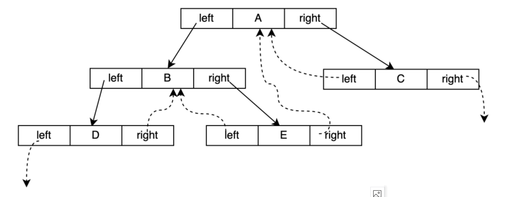

#### 线索二叉树的代码实现

```c
typedef int Element;
// 线索二叉树的节点结构
typedef struct treeNode {
	Element data;
	struct treeNode *left;
	struct treeNode *right;
	int lTag;			// 0表示left指针指向NULL，1表示left指向了前驱
	int rTag;
} BTNode;

typedef struct {
	BTNode *root;
	int count;
} ThreadedBTree;
```

**结点封装：双指针+双标志结构**

为了实现上述的结构我们需要封装以下几个结点的结构

1. **数据域（data）：**用来存放结点里面的数据
2. **指针域（left/right）：**用来指向树的左边和右边的指针
3. **标志域（left/right）：**用来辅助我们知道指针的指向位置（0表示left指针指向NULL，1表示left指向了前驱）

这就是线索二叉树的节点封装与二叉树的区别

**树头封装：管理整棵树**

线索二叉树的树头结构跟二叉树类似，还是需要封装下面的结构

1. **根结点指针**：一个指向线索二叉树 **根结点** 的指针。这是访问整棵树的起点。
2. **结点计数器**：一个记录当前线索二叉树 **结点总数** 的变量。此成员非必需，但能极大方便我们快速获取树的大小，无需遍历。

那么这就是封装的相关内容，接下来我们来看代码

##### 创建线索二叉树

```c
ThreadedBTree* createThreadedBTree(BTNode* root) {
	ThreadedBTree *tree = malloc(sizeof(ThreadedBTree));
	if (tree == NULL) {
		fprintf(stderr,"Error allocating threaded btree\n");
		return NULL;
	}
	if (root) {
		tree->root = root;
		tree->count = 1;
	} else {
		tree->root = NULL;
		tree->count = 0;
	}
	return tree;
}
```

创建线索二叉树的基本逻辑和二叉树类似，代码内容如下：

1. 首先我们申请一个树的空间，这让我们动态分配内存
2. 如果根结点存在，那么根结点对应传入即可，树的数量为1，反之则为空和0
3. 最后返回这棵树即可

那么这就是创建线索二叉树，相对简单，核心不在这

##### 创建线索二叉树的节点

```c
BTNode* createBTNode(Element e) {
	BTNode* node = malloc(sizeof(BTNode));
	if (node == NULL) {
		fprintf(stderr,"Error allocating memory\n");
		return NULL;
	}
	node->data = e;
	node->left = node->right = NULL;
	node->lTag = node->rTag = 0;

	return node;
}
```

创建线索二叉树的节点与二叉树多了一个就是标志域，代码内容如下：

1. 给这个新的节点，申请一个新的空间
2. 将这个新节点的数据域，赋给我们传入的数值，将左右指针设置为空，然后标志域按照我们上面说的设置为0
3. 返回这个结点

这就是创建线索二叉树的节点

##### 线索二叉树插入节点

```c
void insertThreadedBTree(ThreadedBTree* tree, BTNode* parent, BTNode* left, BTNode* right) {
	if (tree && parent) {
		parent->left = left;
		parent->right = right;
		if (left)
			tree->count++;
		if (right)
			tree->count++;
	}
}
```

线索二叉树插入和二叉树一致，我们这里呢，我们是把树、父母、左边、右边传入

- 如果树和父母都存在，我们更新父节点的指针指向
- 左边或者右边存在的话，树的节点数量++

这就是插入过程也比较简单

##### 访问树的节点

```c
void visitTbtNode(const BTNode* node) {
	if (node) {
		printf("\t%c", node->data & 0xff);
	}
}
```

访问节点的元素很简单，结点存在对应打印结点里面的数据即可

##### 中序线索化过程

接下来就是核心内容了，我们来看一个二叉树如何线索化，我们先看下面这棵树：
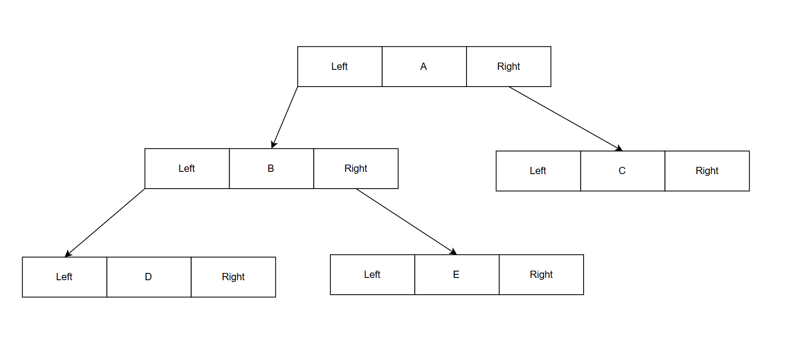

那么我们现在要对这个树进行线索化的过程，那我们可以思考一下，我们引入两个辅助指针，一个叫做curr，一个叫做prev，我们一开始初始化的让curr等于树根的位置，然后让prev等于空，如下图：

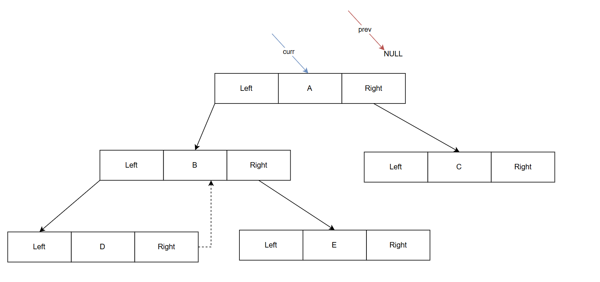

这时候我们让curr按照二叉树的方式一直向左走，直到走到无法再走的时候，这时候curr是不是要返回上一个结点，我们在返回前，我们让prev等于curr，然后按照这个逻辑：

cur->left=prev; prev->right=curr;那这就实现了线索化的过程，变成了下图：

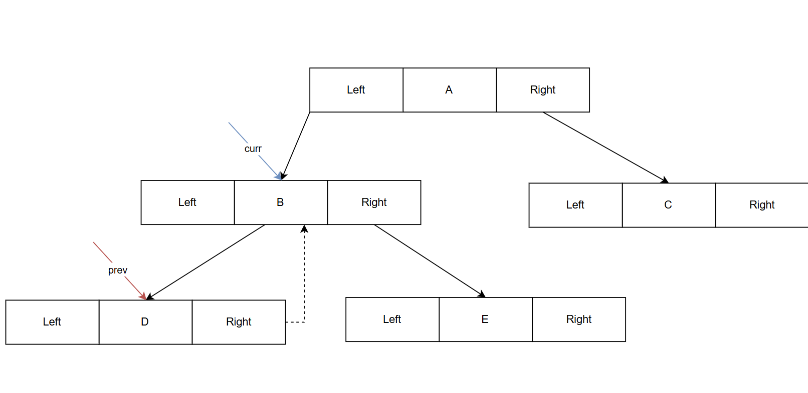

那么按照这个逻辑，如果cur向右边走的时候，我们是不是还是让prev变更到cur变化前的位置，然后按照上述逻辑更新结点，也拒收如下图：

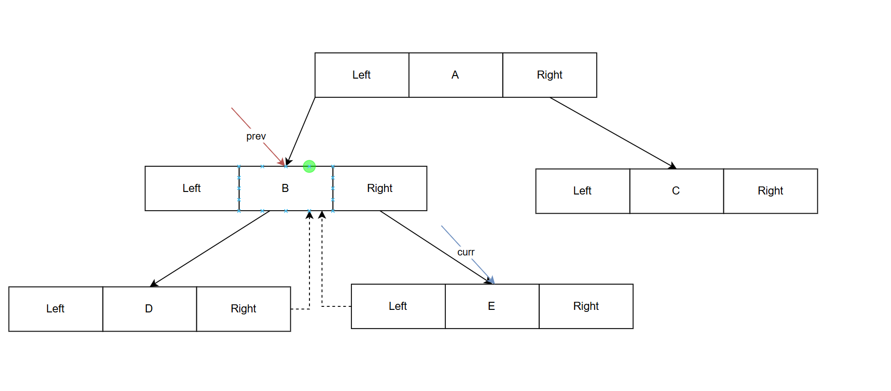

这个线索化的本质是中序遍历，但是在这个过程中我们把空指针域结合运用了起来，我们运用了双指针，接下来我们来看代码吧，可能上述逻辑讲的有点模糊
代码如下：

```c
static BTNode *pre = NULL;
static void inOrderThreading(BTNode *node) {
	if (node) {
		inOrderThreading(node->left);
		if (node->left == NULL) {
			node->lTag = 1;
			node->left = pre;
		}
		if (pre && pre->right == NULL) {
			pre->right = node;
			pre->rTag = 1;
		}
		pre = node;
		inOrderThreading(node->right);
	}
}
```

中序线索化过程通过递归遍历实现，其核心是维护一个名为 `prev` 的全局指针，用于指向前一个被访问的结点。算法遵循中序遍历的框架，具体步骤如下：

1. **递归左子树**：首先深入递归当前结点的左子树，直至到达最左侧的结点。
2. **建立前驱线索**：处理当前结点。若其左子指针为空，则将其左标志位置为线索状态，并让此指针指向 `prev` 所指的前驱结点。
3. **建立后继线索**：检查 `prev` 指针是否有效且其右子指针是否为空。若条件满足，则将 `prev` 所指结点的右标志位置为线索状态，并让其右指针指向当前结点，从而完成前驱结点到当前结点的后继链接。
4. **更新前驱指针**：将 `prev` 指针指向当前结点，使其成为下一个被处理结点的前驱。
5. **递归右子树**：最后，递归处理当前结点的右子树，重复上述过程。

整个过程通过 `prev` 指针的动态更新与判断，系统地将所有空指针域转化为中序遍历序列中的前驱或后继线索，最终形成完整的线索二叉树结构。

```c
void inOrderThreadingBTree(ThreadedBTree* tree) {
	if (tree) {
		inOrderThreading(tree->root);
	}
}
```

然后对应的线索化就是将根结点传入即可

##### 线索二叉树的中序遍历

```c
void InOrderTbTree(ThreadedBTree* tree) {
	BTNode *node = tree->root;
	while (node) {
		// 一直往左走
		while (node->lTag == 0) {
			node = node->left;
		}
		// 找到了线索化的首节点
		visitTbtNode(node);
		// 向右进行中序线索化后的结果
		while (node->rTag && node->right) {
			node = node->right;
			visitTbtNode(node);
		}
		// 将这个不是右线索化的节点，当做新节点，再进行循环
		node = node->right;
	}
}
```

中序线索二叉树的遍历过程完全利用已建立的线索结构，无需递归或辅助栈，实现了高效且空间复杂度为常数的线性遍历。其算法流程严谨而清晰，具体步骤如下：

1. **定位中序序列起点**：遍历始于根结点。算法持续检查当前结点的左标志位，若其指示左指针指向的是真实左孩子（非线索），则循环沿左指针下行。此步骤旨在找到整棵树在中序遍历下的第一个结点，即整个序列中“最左下方”的结点。
2. **访问当前结点并处理直接后继**：成功定位结点后，立即访问该结点。随后，算法检查当前结点的右标志位。若标志位指示其右指针是一条指向其后继结点的线索，则算法直接沿此线索移动至下一个结点，并立即访问它。这个“检查线索-移动-访问”的循环会持续进行，从而高效地遍历由线索直接串联起来的一条有序结点链。
3. **处理子树转换**：当循环过程中遇到某个结点的右标志位指示其右指针并非线索，而是指向其右子树的根结点时，循环终止。此时，算法将当前结点移动至该右子树的根结点。随后，流程立即跳转回第一步，在这个全新的子树中重新寻找其“最左下方”的结点，从而继续遍历。这一步是关键，它完成了从一个子树到另一个子树的过渡，确保了整个遍历序列的连续性。

整个算法通过交替进行“沿左孩子深入寻找起点”、“沿右线索快速访问后继”和“转向右子树”这三个核心操作，系统且不重复地访问所有结点，最终完成整个中序遍历。其优越性在于彻底规避了递归调用栈的开销，仅通过操作指针和检查标志位即可实现高效遍历。

#### 线索二叉树的总结

线索二叉树是一种通过改造二叉树物理存储结构而形成的高效数据结构。其核心思想是充分利用二叉链表中的空指针域，使其指向二叉树在某种遍历顺序下的前驱或后继结点。这些附加的指针被称为“线索”。

**一、核心思想与实现基础** 线索二叉树的实现建立在标准二叉链表之上。它在结点结构中增加了两个标志域（通常为`ltag`和`rtag`），用于区分指针域指向的是真实的孩子结点还是遍历序列中的线索。通过特定的算法（如中序、先序、后序线索化），对二叉树进行一次遍历，即可完成空指针域的线索填充，从而将一棵树线性化，使其既保有树形结构，又具备链表的线性访问特性。

**二、核心优点**

1. **极高的遍历效率**：这是线索二叉树最显著的优势。对于需要频繁遍历的场景，它无需使用递归或维护辅助栈，空间复杂度为O(1)。通过线索，可以从任一结点直接找到其前驱或后继，使得遍历操作的时间复杂度稳定在O(n)，且常数因子很小。
2. **有效的空间利用率**：巧妙地将原本闲置的n+1个空指针域转化为有用的线索信息，在不额外申请存储空间的前提下，存储了遍历序列的逻辑关系，实现了空间效率的提升。
3. **简化前驱/后继查找**：在未线索化的普通二叉树中，查找某结点在特定遍历序列下的前驱或后继较为麻烦。而线索二叉树将此操作的时间复杂度降为O(1)，只需跟随线索即可。
4. **便于逆向遍历**：通过增加一个头结点并形成双向线索链表，可以非常方便地实现从序列末尾到开头的逆向遍历，这在某些应用场景下极为有用。

**三、固有缺点与局限性**

1. **增加维护成本**：线索虽然提升了查询效率，但增加了数据结构的复杂性。插入或删除一个结点时，不仅需要调整孩子指针，还需要检查和维护其自身、其前驱及其后继结点的线索，操作逻辑变得非常复杂，容易出错。这使得它不适合需要频繁动态更新的场景。
2. **额外的存储开销**：每个结点需要增加两个标志位来存储指针类型信息。虽然利用空指针节省了空间，但标志位的引入也带来了额外的存储开销。在结点数据域本身很小的极端情况下，这种开销的相对占比会显得较高。
3. **复杂度集中于初始化**：线索化的过程本身需要一次O(n)时间的遍历操作。因此，如果仅进行一次遍历，那么创建线索树的开销与直接递归遍历的开销相比可能并无优势。其效益体现在多次遍历查询时均摊了初始化的成本。
4. **理解与实现门槛**：其概念和算法相对于普通二叉树更为抽象，对程序员的理解和实现能力有更高要求。

**四、主要应用场景** 鉴于其优缺点，线索二叉树并非通用结构，而是在特定条件下发挥巨大作用：

- **内存受限的系统**：在嵌入式系统等内存资源紧张的环境中，无法承受递归栈带来的空间开销，线索二叉树的无栈遍历特性极具价值。
- **频繁遍历与查询操作**：适用于需要反复对二叉树进行遍历，或大量进行前驱、后继结点查询的场景。例如，在数据库索引的某些实现中，或作为更复杂数据结构（如平衡树）的底层优化。
- **作为复杂结构的基础**：它常被用作其他更高阶数据结构（如线程二叉排序树）的基础，为其提供高效的遍历能力。

**五、结论** 总而言之，线索二叉树是一种典型的**以空间换时间**和**以初始化成本换运行时效率**的设计策略。它通过精巧的结构改造，将非线性结构的遍历问题转化为线性结构的扫描问题，显著提升了访问性能。然而，这种性能提升是以牺牲更新操作的简便性和增加结构复杂性为代价的。因此，在选择是否采用线索二叉树时，必须仔细权衡应用的需求：**如果查询远多于更新，且对遍历性能有极高要求，那么线索二叉树是一个出色的选择；反之，如果数据结构需要频繁变动，那么传统的二叉树或其它结构可能更为合适。** 它是数据结构优化中一个经典而有力的工具，体现了在计算机科学中针对不同问题特性进行特化设计的核心思想。

### 二叉搜索树

#### 二叉搜索树概述

**一、 核心定义**

二叉搜索树是一种基于二叉树的经典数据结构。它或者是一棵空树，或者是具有以下性质的二叉树：

1. 若它的左子树不空，则左子树上所有结点的值均**小于**它的根结点的值。
2. 若它的右子树不空，则右子树上所有结点的值均**大于**它的根结点的值。
3. 它的左、右子树也分别为二叉搜索树。

这个定义的核心在于**递归性**，即树中的每一个子树本身也是一个二叉搜索树。

**二、 关键特性**

二叉搜索树的设计使其具备了一系列重要特性，这些特性是其高效操作的基础。

1. **有序性（中序遍历有序性）**：对二叉搜索树进行**中序遍历**（即访问顺序为：左子树 -> 根节点 -> 右子树），可以得到一个所有节点值的有序序列（通常是升序序列）。这是二叉搜索树最重要的特性，意味着数据在树中以一种隐含的排序方式存储。
2. **查找效率**：二叉搜索树的核心优势在于其查找效率。在平均情况下，每次比较都能将搜索范围缩小大约一半。因此，对于一棵平衡的二叉搜索树，查找、插入和删除操作的时间复杂度均为 **O(log n)**，其中 n 是树中节点的个数。这个效率远高于在链表或数组中的顺序查找。
3. **结构可变性**：二叉搜索树的形状取决于元素被插入的先后顺序。相同的元素集合，不同的插入顺序，可能生成结构完全不同的树（例如，可能生成一棵高度最低的平衡树，也可能退化成一条单向链表）。

**三、 基本操作原理**

所有操作都充分利用了“左小右大”的性质来指导搜索路径。

1. **查找（Search）**：
   - 从根节点开始比较。
   - 若目标值等于当前节点值，则查找成功。
   - 若目标值小于当前节点值，则进入其左子树继续查找。
   - 若目标值大于当前节点值，则进入其右子树继续查找。
   - 重复此过程，直到找到目标值或到达空子树（查找失败）。
2. **插入（Insert）**：
   - 首先执行查找操作，寻找新节点的正确插入位置。
   - 当查找过程到达一个空子树（即NULL指针）时，这个位置就是新节点应该被插入的地方。
   - 在此位置创建新节点并将其链接到它的父节点上。
3. **删除（Delete）**： 删除操作是二叉搜索树中最复杂的操作，需要处理三种情况：
   - **情况一：删除叶子节点**。直接将其父节点对应的指针置为空。
   - **情况二：删除仅有一个子节点的节点**。将其父节点指向该节点的指针，改为指向该节点的子节点。
   - **情况三：删除有两个子节点的节点**。这是最复杂的情况。标准做法是找到该节点**中序遍历下的直接后继**（即其右子树中的最小节点），或用其**直接前驱**（即其左子树中的最大节点）来替代它。然后用这个后继（或前驱）节点的值覆盖待删除节点的值，最后递归或迭代地删除那个用来替代的后继（或前驱）节点（此时它必定满足情况一或情况二）。

**四、 性能与局限性**

二叉搜索树的性能高度依赖于树的**高度**（即从根到最远叶子的路径长度）。

1. **最佳情况**：当树完全平衡时，其高度约为 log₂n，此时所有操作的时间复杂度为 O(log n)，效率最高。
2. **最坏情况**：当插入的序列本身是有序（升序或降序）时，树会退化成一条**线性链表**。例如，依次插入 1, 2, 3, 4, 5，树会变成一个所有节点都只有右子节点的结构。此时树的高度为 n，所有操作的时间复杂度都退化为 **O(n)**，丧失了其效率优势。

正是为了克服最坏情况下的性能退化问题，才衍生出了如**AVL树**、**红黑树**等自平衡二叉搜索树，它们通过额外的规则和旋转操作来维持树的平衡，从而保证操作效率始终接近 O(log n)。

**五、二叉搜索树图示**

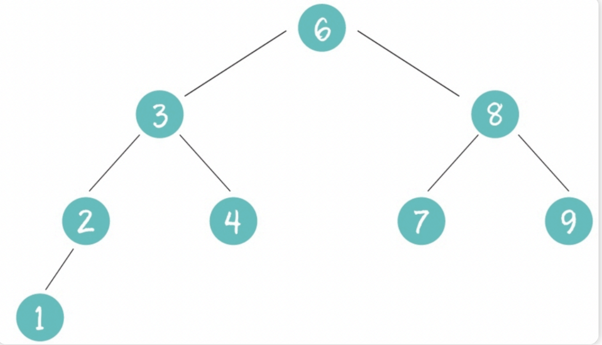

#### 二叉搜索树代码实现

```c
typedef int Element;
// 定义二叉搜索树的节点结构
typedef struct _bs_node {
    Element data;
    struct _bs_node *left;
    struct _bs_node *right;
} BSNode;

// 定义二叉搜索树的头节点
typedef struct {
    BSNode *root;
    int count;
    const char *name;
} BSTree;
```

二叉搜索树的结构体封装跟二叉树一致，所以这里直接引用

 **结点封装：双指针结构**

为实现上述逻辑，每个结点需包含以下三个核心部分：

1. **数据域**：用于存储该结点的实际数据。
2. **左指针域**：一个指针，用于指向其 **左子结点**。
3. **右指针域**：一个指针，用于指向其 **右子结点**。

这种一个数据域搭配两个指针域的构造，是二叉树区别于单向链表（单指针）的关键。

**树头封装：管理整棵树**

为高效管理整棵二叉树，我们通常会封装一个 **树头（Tree Head）** 结构。它包含两个主要成员：

1. **根结点指针**：一个指向二叉树 **根结点** 的指针。这是访问整棵树的起点。
2. **结点计数器**：一个记录当前二叉树 **结点总数** 的变量。此成员非必需，但能极大方便我们快速获取树的大小，无需遍历。

有了上述的两个结构我们就可以开始写代码了

##### 创建二叉搜索树

```c
BSTree* createBSTree(const char* name) {
	BSTree* tree = malloc(sizeof(BSTree));
	if (tree == NULL) {
		return NULL;
	}
	tree->name = name;
	tree->root = NULL;
	tree->count = 0;
	return tree;
}
```

创建二叉搜索树非常的简单，还是下面的几个步骤

- 首先申请一个树的空间，也就是树头
- 然后赋值名字，根结点默认为空，数量为0
- 返回这棵树即可

这就是创建二叉搜索树

##### 创建二叉搜索树的结点

```c
static BSNode *createBSNode(Element e) {
	BSNode *node = malloc(sizeof(BSNode));
	if (node == NULL) {
		return NULL;
	}
	node->data = e;
	node->left = node->right = NULL;
	return node;
}
```

创建结点呢，也是下面几个步骤

- 为这个结点申请一个新的空间
- 将结点里面的数据域的值赋值给e
- 将结点的左边和右边分别指向为空
- 最后返回这个结点

这就是创建二叉搜索树的结点

##### 二叉搜索树的插入操作

接下来是重点，我们来看下图：

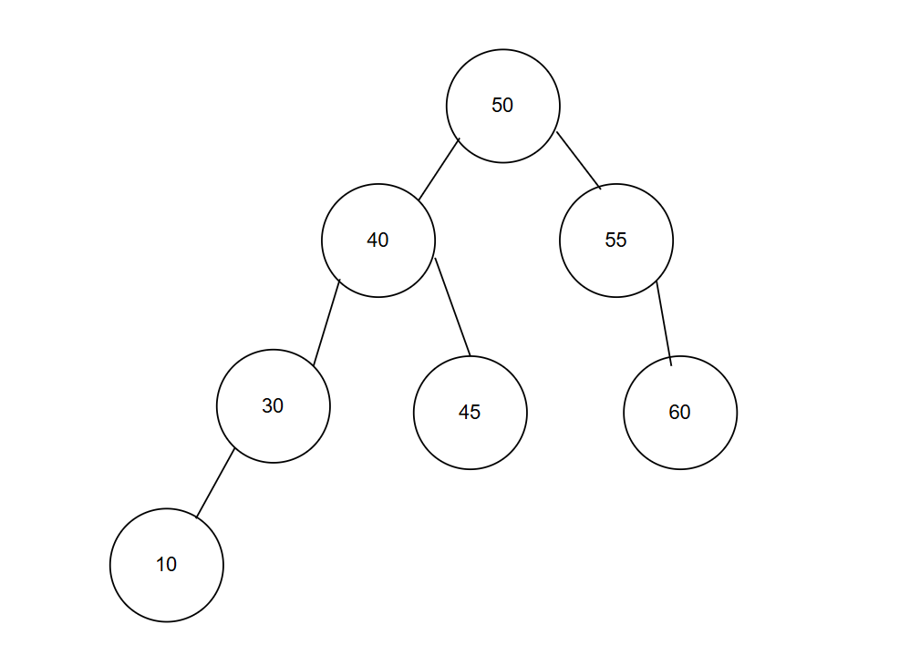

在上面一棵二叉搜索树，我现在要插入43这个元素，按照我们上面说的二叉搜索树的概念，树的左边元素是比树根小的，而树的右边是比树根大的元素，我们按照左小右大的操作，这时候你插入43的元素，它比50小往左边走，然后它比40大，你可能觉得它应该放在40和45之间的位置，但是如果你将43放在40和45中间就会出现一个问题，你这样的话他就不是一棵树了，它变成了一个链表了，所以在二叉搜索树里面有这么一个定义，就是不允许在两个节点之间插入元素，只能在空位置插入元素，也就是应该变成下面的样子
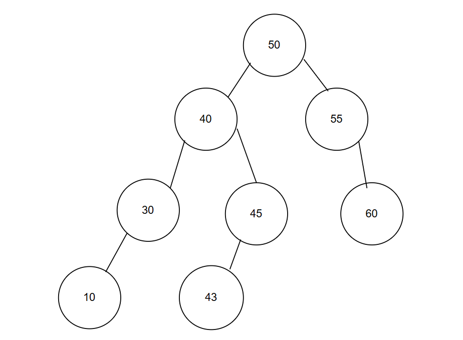

插入操作的核心是利用“左子树值均小于根、右子树值均大于根”的特性，通过递归逐层定位插入位置，最终在空树位置完成新节点的创建。以下以向目标树中插入值为 **43** 的节点为例，拆解递归逻辑的完整路径：

**一、递归的起点：从根节点开始比较**

递归操作的入口是树的根节点，整个过程遵循“**当前节点为空则插入，不为空则按大小关系进入左/右子树**”的原则。

- **初始状态**：目标树的根节点为 **50**，需插入的新值为 **43**。
- **第一步比较**：43 < 50，根据“左小右大”规则，确定新节点应插入到 **50的左子树**中。此时递归进入50的左子节点（值为40）。

**二、递归的中层：逐层缩小范围，定位子树**

在递归过程中，每一层都以上一层的子节点为新的“当前节点”，重复比较和路径选择，直到找到空树位置。

1. **第二层：以40为当前节点**
   - 比较43与40：43 > 40，确定新节点应插入到 **40的右子树**中。递归进入40的右子节点（值为45）。
2. **第三层：以45为当前节点**
   - 比较43与45：43 < 45，确定新节点应插入到45的左子树中。此时检查45的左子节点是否为空：
     - 若不为空，继续递归进入该左子节点；
     - 若为空（即当前路径已到达“空树位置”），则在此处插入新节点。

**三、递归的终止：在空树位置创建新节点**

当递归进入某节点的左/右子树时，若该子树为空（即当前节点的左/右指针指向NULL），则此位置就是新节点的最终插入点。

- **终止条件触发**：在上述第三步中，45的左子树为空（无左子节点），因此直接在 **45的左指针位置创建新节点**，存储值43。

**四、递归的返回：向上传递插入结果**

新节点插入完成后，递归函数逐层向上返回，将新节点的地址传递给上一层的父节点，完成父子关系的链接。

- 返回过程：
  - 插入43后，45的左指针指向新节点，递归返回45节点；
  - 40的右指针维持指向45（因45是原右子节点，仅其左子树新增节点），递归返回40节点；
  - 50的左指针维持指向40，递归返回50节点；
  - 最终返回到根节点，整个插入过程结束，树的结构更新完成。

**五、递归逻辑的核心总结**

整个插入过程可概括为“**找空树→插节点→返结果**”的三步递归模型：

1. **基准情况（终止条件）**：若当前节点为空（NULL），则创建新节点并返回该节点地址（表示在此处完成插入）。

2. 递归调用（路径选择）

   ：若当前节点不为空，比较插入值与当前节点值：

   - 若插入值 < 当前节点值：递归调用左子树，并用当前节点的左指针接收递归返回的结果（新节点或原左子树）。
   - 若插入值 > 当前节点值：递归调用右子树，并用当前节点的右指针接收递归返回的结果（新节点或原右子树）。

3. **返回当前节点**：每层递归完成后，返回当前节点的地址，确保上层父节点能正确链接子树。

通过这种自顶向下的递归遍历，插入操作既能准确定位空树位置，又能自动维护树的结构关系，体现了二叉搜索树“逻辑自洽、操作简洁”的特点。

那么接下来我们来看代码实现：

```c
static BSNode* insertBSNode(BSTree *tree, BSNode *node, Element e) {
	if (node == NULL) {
		tree->count++;
		return createBSNode(e);
	}
	if (e < node->data) {
		node->left = insertBSNode(tree, node->left, e);
	} else if (e > node->data) {
		node->right = insertBSNode(tree, node->right, e);
	}
	return node;
}

void insertBSTree(BSTree* tree, Element e) {
	tree->root = insertBSNode(tree, tree->root, e);
}
```

那么整个代码的内容如上：

- 首先按照上述的递归逻辑，我们先判断插入的点位置在哪，按照上述的递归逻辑一直找
- 找到上述插入位置以后，我们创建新的节点
- 最后返回这个结点
- 传入根

这就是二叉搜索树的插入

##### 二叉搜索树的删除操作

二叉搜索树要分几种情况来讲，我们先讲一下逻辑，如下图：

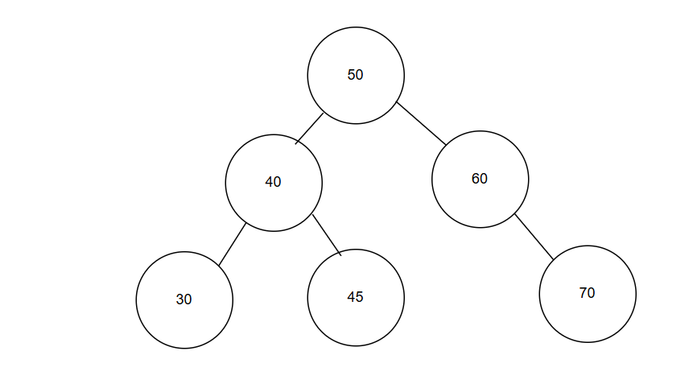

我们现在要分为下面几个情况：

1. 删除度为0的节点
2. 删除度为1的节点
3. 删除度为2的节点

我们来看第一种删除度为0的节点，最简单，我们直接删除就可，因为他不会对整棵树造成一些别的额外影响，比如我们要删除45，那是不是直接删除即可，就变成了下图：

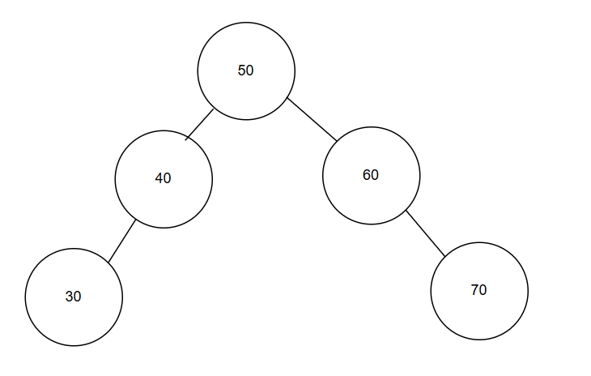

接下来我们来看删除度为1的节点，我们返回到最上面那个图，假设我现在要删除60，那对于度为1的结点来说，我们有一个思想就是替换，什么意思呢，对于度为1的节点我们肯定不能直接删除，而是要把他后面的结点全部给替换到接到度为1的这个结点前面一个位置就比如我要删除60，那我肯定得把70接在50的后面，然后再删除60，这就是度为1的节点删除操作，如下图

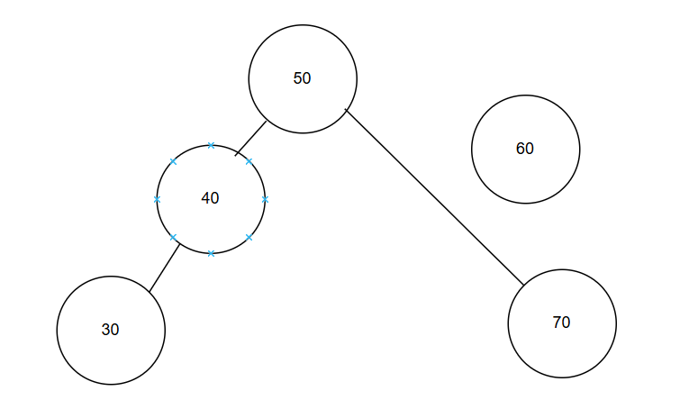

那么接下来我们来看最难的删除度为2的节点，其实看起来很难，实际并不难，在这里面有一个重要的思想就是转换矛盾什么意思呢，我们来看，下面这个图：

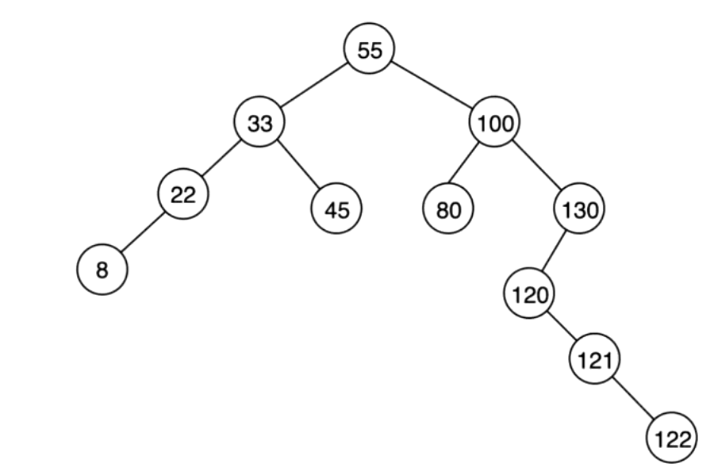

比如这时候我们要删除100这个结点，我们现在知道整个二叉搜索树的中序遍历如下：

8、22、33、45、55、80、**100**、120、121、122、130

如果我们删除100，我们是不是要变成下面这样的排序

8、22、33、45、55、80、120、121、122、130

那么现在我们找一下100的前驱和后继，100的前驱我们可以理解为左边节点的最大值，后继则为右边节点的最小值，那么现在对于我们来说我们可以这么操作，我让100的结点数值等于右边的后继120，那是不是就变成了下面这样
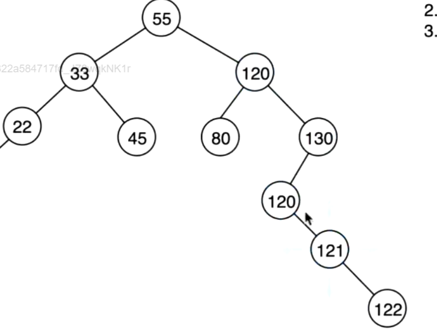

那是不是我么只要删掉后面那个120即可，这样是不是也不影响整棵树的排序，也就是说从原本的
8、22、33、45、55、80、**120**、120、121、122、130

删掉后面的120后变为

8、22、33、45、55、80、**120**、121、122、130

因为后面的120是度为1或者度为0的节点，删除操作也比较简单，所以我们这就实现了度为2的节点删除操作，这就是转移矛盾法

那么接下来我们来看代码：

```c
static BSNode *maxValueBSNode(BSNode *node) {
	while (node && node->right) {
		node = node->right;
	}
	return node;
}

static BSNode* deleteBSNode(BSTree* tree, BSNode *node, Element e) {
	if (node == NULL) {
		return NULL;
	}
	if (e < node->data) {
		node->left = deleteBSNode(tree, node->left, e);
	} else if (e > node->data) {
		node->right = deleteBSNode(tree, node->right, e);
	} else {
		BSNode *tmp;
		if (node->left == NULL) {		// 度为1或0
			tmp = node->right;
			free(node);
			tree->count--;
			return tmp;
		}
		if (node->right == NULL) {		// 度为1
			tmp = node->left;
			free(node);
			tree->count--;
			return tmp;
		}
		// 此时说明待删除的节点，度为2，替换当前节点的值（后继或前驱）
		// 找这个节点的左节点的最大值
		tmp = maxValueBSNode(node->left);
		node->data = tmp->data;
		node->left = deleteBSNode(tree, node->left, node->data);
	}
	return node;
}
// 找后继节点，右边的最左值
static void deleteMiniNode(BSNode *node) {
	BSNode *mini = node->right;
	BSNode *pre = node;
	while (mini && mini->left) {
		pre = mini;
		mini = mini->left;
	}
	if (pre->data == node->data) {
		pre->right = mini->right;
	} else {
		pre->left = mini->right;
	}
	node->data = mini->data;
	free(mini);
}

void deleteBSTree(BSTree* tree, Element e) {
	if (tree) {
		tree->root = deleteBSNode(tree, tree->root, e);
	}
}
```

**一、辅助函数：查找左子树最大值节点（maxValueBSNode）**

该函数的作用是**在以指定节点为根的子树中，找到值最大的节点**（即左子树的最右侧节点），用于删除“度为2”的节点时寻找前驱节点（中序遍历的直接前驱）。

- **逻辑**：从指定节点开始，持续向右子树移动（因右子树值均大于当前节点），直到遇到右子树为空的节点，该节点即为左子树中的最大值节点。

**二、核心递归删除函数（deleteBSNode）**

该函数是删除操作的核心，通过递归实现对目标节点的查找和删除，处理三种不同节点类型（度为0、度为1、度为2）的删除逻辑，并返回更新后的子树根节点。

**1. 递归终止条件：未找到目标节点**

- 若当前节点为空（`node == NULL`），说明目标值不在当前子树中，返回`NULL`（无需修改子树结构）。

**2. 递归查找目标节点**

- 若目标值`e`小于当前节点值（`e < node->data`）：递归删除当前节点的**左子树**，并将左子树的更新结果（递归返回值）赋给当前节点的左指针（`node->left = ...`）。
- 若目标值`e`大于当前节点值（`e > node->data`）：递归删除当前节点的**右子树**，并将右子树的更新结果赋给当前节点的右指针（`node->right = ...`）。

**3. 找到目标节点：分三种情况删除**

当`e == node->data`（找到目标节点）时，根据节点的子树情况（度）处理：

- **情况1：度为0或1（左子树为空）**

  - 若当前节点左子树为空

    ```
    node->left == NULL
    ```

    则直接用右子树替代当前节点：

    - 临时保存右子树指针（`tmp = node->right`），释放当前节点内存，树节点计数减1（`tree->count--`），返回右子树指针（`tmp`），完成子树链接。

- **情况2：度为1（右子树为空）**

  - 若当前节点右子树为空

    ```
    node->right == NULL
    ```

    则直接用左子树替代当前节点：

    - 临时保存左子树指针（`tmp = node->left`），释放当前节点内存，树节点计数减1，返回左子树指针（`tmp`）。

- **情况3：度为2（左右子树均非空）**

  - **核心逻辑**：用**左子树的最大值节点（前驱节点）** 替代当前节点，再递归删除前驱节点（前驱节点必为度0或1，可简化删除）。
  - 步骤：
    1. 调用`maxValueBSNode(node->left)`找到左子树的最大值节点（前驱节点）。
    2. 将前驱节点的值赋给当前节点（`node->data = tmp->data`），覆盖原节点值。
    3. 递归删除左子树中的前驱节点（此时目标值为前驱节点的值），并更新当前节点的左子树指针（`node->left = deleteBSNode(...)`）。

**4. 返回更新后的子树根节点**

无论是否删除节点，每层递归结束后均返回当前节点指针，确保上层父节点能正确链接更新后的子树（如删除后子树的根节点变化）。

**三、辅助函数：删除右子树最小值节点（deleteMiniNode）**

该函数用于**删除“度为2”的节点时寻找后继节点**（中序遍历的直接后继，即右子树的最左侧节点），并替换当前节点值（与`maxValueBSNode`功能类似，对应不同前驱/后继选择）。

- 逻辑：
  1. 从当前节点的右子树开始，持续向左子树移动（因左子树值均小于当前节点），找到最小值节点（`mini`）及其父节点（`pre`）。
  2. 根据父节点与最小值节点的位置关系（父节点是当前节点本身，或其父节点的左子节点），调整父节点指针，跳过最小值节点（`pre->right = mini->right` 或 `pre->left = mini->right`）。
  3. 将最小值节点的值赋给当前节点（覆盖目标节点值），释放最小值节点内存。

**四、对外接口函数（deleteBSTree）**

该函数是删除操作的入口，简化用户调用流程，确保在树结构有效时（`tree != NULL`）启动递归删除。

- **逻辑**：调用`deleteBSNode`从根节点开始递归删除目标值，并将更新后的树的根节点（递归返回值）赋给树结构的根指针（`tree->root`）。

**总结**

删除操作通过**递归查找定位目标节点**，根据节点的度（子树数量）分三种情况处理：

- **度为0/1**：直接用子树替代节点，释放内存；
- **度为2**：通过寻找前驱（左子树最大值）或后继（右子树最小值）节点替代当前节点值，再递归删除前驱/后继节点（转化为度0/1的情况）。 整个过程严格遵循二叉搜索树的“左小右大”特性，确保删除后树的有序性和结构正确性。

##### 二叉搜索树的中序遍历

```c
void visitBSNode(const BSNode* node) {
	printf("\t%d", node->data);
}

static void inOrderBSNode(const BSNode *node) {
	if (node) {
		inOrderBSNode(node->left);
		visitBSNode(node);
		inOrderBSNode(node->right);
	}
}

void inOrderBSTree(const BSTree* tree) {
	printf("[%s]Tree: ", tree->name);
	inOrderBSNode(tree->root);
	printf("\n");
}
```

二叉搜索树的中序遍历，跟二叉树差不多，这里不再过多赘述逻辑，仍然选择递归的方式去写

#### 二叉搜索树总结

**一、核心定义与本质**

二叉搜索树是一种基于“**左子树值均小于根，右子树值均大于根**”规则的有序二叉树，其本质是通过递归定义的结构，将动态数据集合组织为隐含的有序序列（中序遍历可得到升序序列）。它既具备链表的动态插入/删除能力，又通过“二分查找”特性优化了数据访问效率，是平衡树（如AVL树、红黑树）的基础原型。

**二、核心特性**

1. **有序性**：中序遍历（左→根→右）可直接输出所有节点的升序序列，无需额外排序操作，这是其区别于普通二叉树的核心标志。
2. **高效的动态操作**：在理想平衡状态下，查找、插入、删除操作的时间复杂度均为 **O(log n)**（n为节点数），因每次比较可排除约一半子树，接近二分查找效率。
3. **结构动态性**：树的形态完全依赖元素插入顺序。例如，有序插入（如1,2,3,4）会导致树退化为链表（高度为n），而随机插入可能形成接近平衡的结构（高度为log n）。
4. **递归性**：每个子树本身也是二叉搜索树，所有操作（查找、插入、删除）均可通过递归实现，逻辑简洁且符合结构定义。

**三、优势解析**

1. **高效的查找性能**
   - 平衡状态下，查找操作的时间复杂度为O(log n)，远优于数组的顺序查找（O(n)）和链表的遍历（O(n)）。
   - 适用于频繁查找、动态更新（插入/删除）的场景（如数据库索引、缓存系统）。
2. **动态数据管理**
   - 插入和删除操作无需移动大量元素（如数组的插入需移动后续元素），仅需修改少量指针即可完成节点增减，平均时间复杂度为O(log n)。
3. **天然有序性**
   - 中序遍历可直接获取有序序列，支持范围查询（如查找“50~100之间的所有元素”），无需额外排序步骤。
4. **实现简洁性**
   - 核心操作（查找、插入、删除）逻辑清晰，基于“左小右大”的递归规则即可实现，无需复杂的辅助结构。

**四、局限性与挑战**

1. **平衡性依赖插入顺序，存在性能退化风险**
   - **最坏情况**：若插入序列有序（如升序或降序），树会退化为单链表，此时所有操作的时间复杂度降为 **O(n)**（与链表无异），完全丧失二分查找优势。
   - **解决方案**：需通过自平衡二叉树（如AVL树、红黑树）或其他数据结构（如B树）主动维护平衡，代价是增加旋转等调整操作。
2. **删除操作复杂度较高**
   - 对于“度为2”的节点（同时存在左右子树），需先查找前驱（左子树最大值）或后继（右子树最小值）节点替代其值，再递归删除前驱/后继节点，逻辑较查找和插入更复杂，易出现指针处理错误。
3. **不适合频繁范围遍历**
   - 尽管中序遍历可获取有序序列，但相比数组的随机访问（O(1)），树的遍历需按路径访问每个节点（O(n)），连续范围查询的效率低于数组。
4. **空间开销**
   - 每个节点需额外存储左右子树指针，相比数组的连续内存存储，空间利用率较低（尤其在节点值较小的场景下）。

**五、典型应用场景**

1. **索引结构**：数据库和文件系统中用于快速查找记录（如MySQL的B+树索引基于BST思想扩展）。
2. **动态集合管理**：如实现有序映射（Map）、有序集合（Set）等数据结构，支持高效的增删查改。
3. **缓存淘汰策略**：结合二叉搜索树的有序性，实现LRU（最近最少使用）等缓存淘汰算法的底层结构。
4. **编译器符号表**：在编译过程中管理变量、函数等符号的定义与查找，需频繁插入和查询。

**六、与其他数据结构的对比**

| **对比维度**        | 二叉搜索树（平衡时） | 有序数组         | 链表             | 哈希表           |
| ------------------- | -------------------- | ---------------- | ---------------- | ---------------- |
| 查找时间复杂度      | O(log n)             | O(log n)（二分） | O(n)             | O(1)（平均）     |
| 插入/删除时间复杂度 | O(log n)             | O(n)（移动元素） | O(1)（已知位置） | O(1)（平均）     |
| 有序性              | 天然有序（中序遍历） | 物理有序         | 无序             | 无序             |
| 空间开销            | 中（需指针）         | 低（连续存储）   | 中（需指针）     | 高（哈希表冗余） |

**七、总结**

二叉搜索树是**有序性与动态性的平衡产物**，通过“左小右大”的递归结构，在理想情况下实现了O(log n)的高效增删查改，成为处理动态有序数据的基础工具。但其性能高度依赖平衡性，实际应用中需结合自平衡机制（如红黑树）或根据场景选择其他结构（如范围查询多用数组，高频插入删除多用哈希表）。理解二叉搜索树的核心逻辑，是掌握更复杂树结构（如平衡树、B树）的关键基础。

### 二叉平衡树

#### 二叉平衡树概述

**一、 引言：为什么需要二叉平衡树？**

在计算机科学中，二叉查找树（Binary Search Tree, BST）是一种高效的数据结构，它允许我们快速地进行查找、插入和删除操作，其时间复杂度在理想情况下为 O(log n)，其中 n 是树中节点的数量。

然而，这种理想的时间复杂度严重依赖于树的形态。在最坏的情况下，例如当插入的数据本身就是有序序列（如连续插入1, 2, 3, 4, 5...）时，二叉查找树会退化成一条线性链表。此时，树的高度等于节点的数量，所有操作的时间复杂度都恶化至 O(n)，完全丧失了其高效的优势。

二叉平衡树（Balanced Binary Tree）正是为了解决二叉查找树可能退化的这一根本缺陷而提出的。它的核心目标是：**通过在插入和删除节点后执行特定的平衡操作，主动维护树的平衡性，确保树的高度始终保持在 O(log n) 级别**，从而保证所有基于查找的操作（插入、删除、查询）在最坏情况下也能维持高效的时间复杂度。

**二、 二叉平衡树的定义与核心概念**

**1. 定义** 二叉平衡树，首先是一棵二叉查找树，即满足以下性质：

- 若它的左子树不空，则左子树上所有节点的值均小于它的根节点的值。
- 若它的右子树不空，则右子树上所有节点的值均大于它的根节点的值。
- 它的左、右子树也分别为二叉查找树。

在此基础上，它增加了一个**平衡条件（Balance Condition）**，要求树中**任意一个节点的左子树和右子树的高度差不能超过一个特定的限度**。这个限度通常为1。

**2. 平衡因子（Balance Factor）** 为了量化一个节点的平衡程度，我们引入了**平衡因子**的概念。一个节点的平衡因子定义为它的**左子树的高度减去它的右子树的高度**。 即：`平衡因子 = height(left subtree) - height(right subtree)` 根据定义，二叉平衡树要求树中**每个节点的平衡因子只能取 -1、0 或 1** 这三个值之一。如果任何一个节点的平衡因子的绝对值大于1，则认为这棵树失去了平衡，需要通过旋转操作来恢复平衡。

**3. 树的高度（Height）** 这里所指的**高度**，通常定义为从该节点到其最深后代叶子节点所经过的边的最大数量。根据这个定义，叶子节点的高度为0，空树（null）的高度通常定义为-1。

**三、 维持平衡的关键：旋转（Rotation）**

当插入或删除一个节点后，可能会导致某个祖先节点的平衡因子绝对值变为2（或更大），破坏了平衡条件。此时，需要通过一种称为**旋转**的操作来调整树的结构，使其重新满足平衡条件。旋转操作是局部调整，只涉及少数几个节点，因此可以在常数时间内完成。

旋转主要有四种基本类型：

1. **左旋（Left Rotation）**
   - **场景**：当一个节点的右子树比左子树高太多（平衡因子为-2），且其右子节点的右子树较高（平衡因子为-1）时使用。
   - **操作描述**：以该不平衡节点（称为A）的右子节点（称为B）为轴进行旋转。将B提升为新的子树根节点，将A降为B的左子节点。同时，将B原来的左子树“过继”给A，成为A的新右子树。
2. **右旋（Right Rotation）**
   - **场景**：当一个节点的左子树比右子树高太多（平衡因子为+2），且其左子节点的左子树较高（平衡因子为+1）时使用。它是左旋的镜像操作。
   - **操作描述**：以不平衡节点（称为A）的左子节点（称为B）为轴进行旋转。将B提升为新的子树根节点，将A降为B的右子节点。同时，将B原来的右子树“过继”给A，成为A的新左子树。
3. **左右旋（Left-Right Rotation）**
   - **场景**：当一个节点的左子树比右子树高太多（平衡因子为+2），但其左子节点（B）的右子树反而较高（B的平衡因子为-1）时使用。这是一种复合情况。
   - **操作描述**：先对节点A的左子节点B执行一次**左旋**，将情况转化为上述可右旋的场景。然后再对节点A执行一次**右旋**。
4. **右左旋（Right-Left Rotation）**
   - **场景**：当一个节点的右子树比左子树高太多（平衡因子为-2），但其右子节点（B）的左子树反而较高（B的平衡因子为+1）时使用。这是左右旋的镜像操作。
   - **操作描述**：先对节点A的右子节点B执行一次**右旋**，将情况转化为上述可左旋的场景。然后再对节点A执行一次**左旋**。

通过这四种旋转组合，可以处理所有因插入或删除而导致的树不平衡的情况。

**四、 操作流程概述**

以插入操作为例，其流程可概括为：

1. **标准BST插入**：按照二叉查找树的规则，递归地找到新节点的插入位置并将其插入。
2. **回溯更新高度与检查平衡**：在递归插入函数回溯到父节点的过程中，更新沿途每个祖先节点的**高度**，并计算其**平衡因子**。
3. **判断与旋转**：一旦发现某个祖先节点的平衡因子绝对值大于1（即 |BF| > 1），则根据其子树的高度情况，判断属于上述四种不平衡场景中的哪一种，并执行对应的旋转操作。
4. **调整完成**：旋转完成后，被调整的子树恢复平衡，且其高度会与插入前保持一致，因此无需再继续向上回溯调整。

删除操作遵循类似的回溯、检查和旋转流程，但情况可能更为复杂。

**五、 总结与特性**

- **目的**：克服普通二叉查找树可能退化为链表的缺点，保证操作效率。
- **核心特性**：对于树中任意节点，其左、右子树的高度差（平衡因子）绝对值不超过1。
- **性能保证**：通过强制维持平衡，二叉平衡树能够将高度严格控制在 O(log n) 范围内。因此，其查找、插入和删除操作的**最坏情况时间复杂度均为 O(log n)**。
- **代价**：维持平衡需要额外的开销，即在插入和删除时需要计算平衡因子和执行旋转操作。但这些操作都是常数时间 O(1) 的，因此总的时间复杂度仍为 O(log n)。这是一种以小幅的常数因子时间代价换取最坏情况性能巨大提升的经典策略。

二叉平衡树是众多高效数据结构与算法（如数据库索引、集合类库）的重要基础，其中最著名的一种实现是**AVL树**（由发明者Adelson-Velsky和Landis的名字命名），它严格遵循了上述定义。此外，红黑树也是一种被广泛使用的近似平衡的二叉查找树。

**六、二叉平衡树图示**

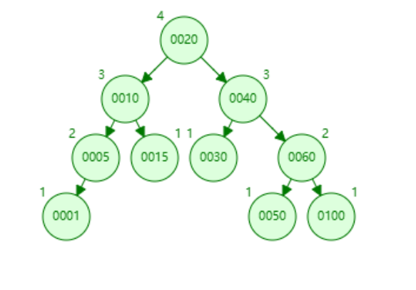

#### 二叉平衡树代码实现

```c
typedef int Element;
// 平衡二叉树的节点结构
typedef struct _avl_node {
	Element data;
	struct _avl_node *left, *right;
	int height;					// 当前节点的高度（这个节点左子树的高度和右子树高度的最大值 + 1）
} AVLNode;

// 平衡二叉树的树头结构
typedef struct {
	AVLNode *root;
	int count;
} AVLTree;
```

那我们来看一下二叉平衡树的结构体封装
**结点封装**

- 首先跟二叉树保持一致，对应的数据域和指针域
- 新增一个树的高度存储空间，这里面的高度算法是**左子树和右子树的高度最大值+1**

那么为什么要+1呢，我们看下面这个图：


比如这时候我要知道10这个结点的高度，对于10这个结点，它的左子树是最高的，也就是2，那么在加上他本身，所以是2+1它的高度为3，所以这就是为什么要+1

**树头封装**

- 根指针的存放
- 树的结点数量

这个跟二叉树保持一致不变

##### 创建二叉平衡树

```c
AVLTree* createAVLTree() {
	AVLTree* tree = malloc(sizeof(AVLTree));
	if (tree == NULL) {
		printf("Memory allocation failed");
		return NULL;
	}
	tree->count = 0;
	tree->root = NULL;

	return tree;
}
```

对于创建二叉平衡树我们还是跟二叉树一致

- 首先为整棵树或树头申请一个内存空间
- 树的根一开始初始化为空，数量也为0

这就是创建二叉平衡树

##### 二叉平衡树的高度

```c
int heightAVLTree(const AVLTree* tree) {
	if (tree) {
		return tree->root->height;
	}
	return 0;
}
```

二叉平衡树的高度比较简单直接传入根结点就知道高度了，接下来是最难的二叉平衡树的插入和删除

##### 二叉平衡树的插入

我们知道二叉平衡树分为左旋和右旋，我们先来看下面这棵树

<span style="font-size:1.2em;">**LL：**</span>

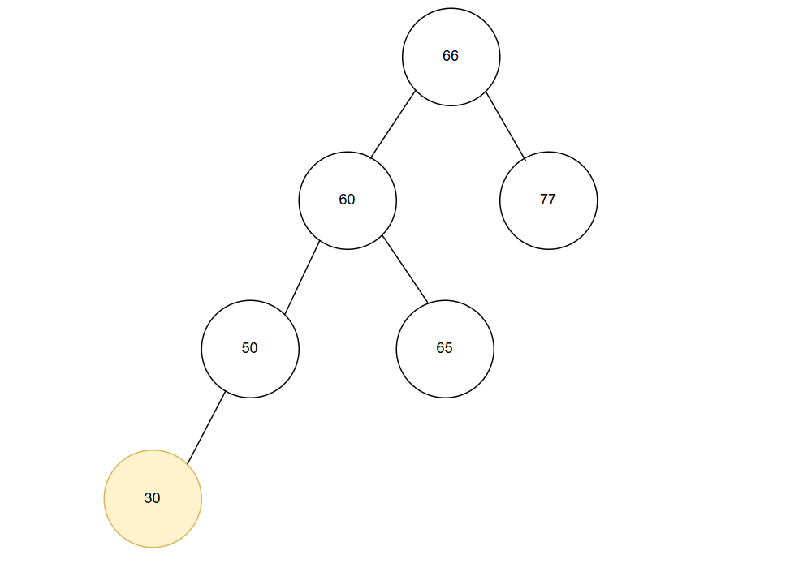

我们按照之前讲的二叉平衡树的定义，会发现66这个点出现了失衡，那么这个失衡点为什么是LL形式呢

我们先看失衡点是在66的左边，到了60以后，我们以60为根的子树结点再去看30，发现它还是在60的左边，所以这种形式我们称之为LL

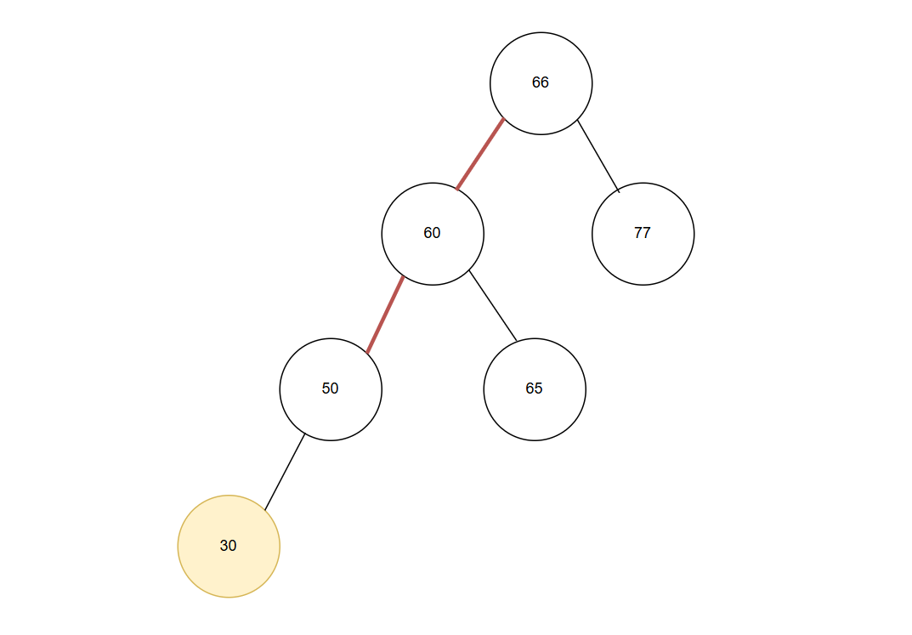

那接下来我们来看怎么操作，让它变为平衡状态

我们可以理解为一个升国旗的操作，我们发现极左边非常的重右边很轻，那我们就可以想象把77往下拽，什么意思呢，就是相当于把77拽到65那一层，66会被拽到70那一层，60对应会往上，但是这时候有个问题65放哪呢，很显然按照二叉搜索树的性质65应该接到66的左边，也就是下面这个图的操作：

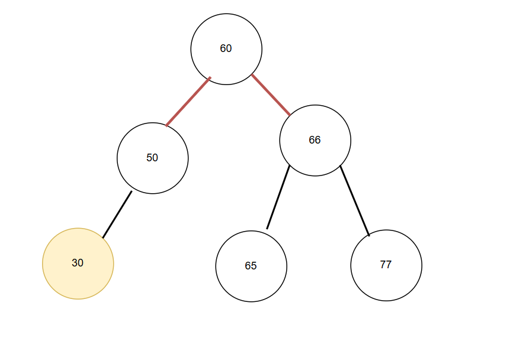

那这样是不是对于极左的失衡树我们就给它操作平衡了

总结来说，**就是失衡点上右旋一次**

<span style="font-size:1.2em;">**LR：**</span>

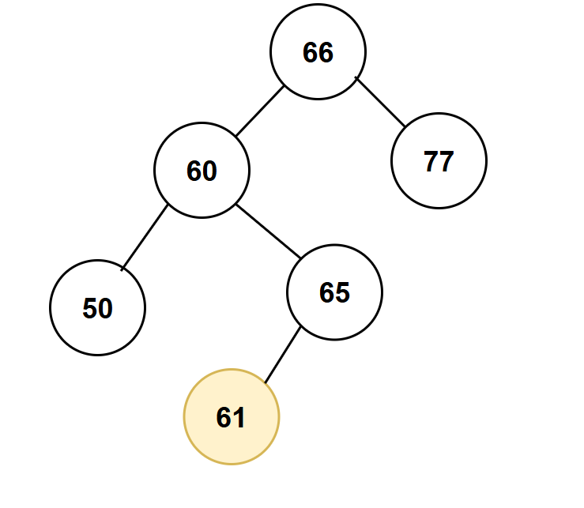

那么接下来我们来看第二种情况，这时候也是很明显的66失衡了，那么它是什么情况呢

按照上面来讲我们插入61这个结点以后导致了66失衡，很显然61在60的左边，好60先往左边走激活第一个子树根结点60，那么这时候是不是先L，然后61是不是在65的左边，65在60的右边，所以60这时候往右走，那么这就是LR

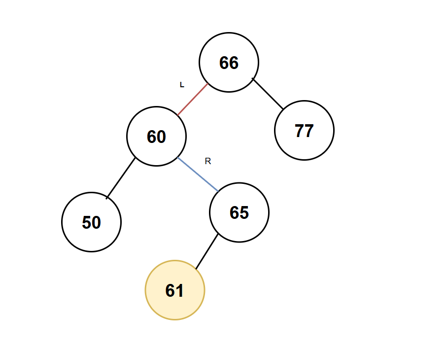

那么接下来我们来看怎么让它平衡

上面我们已经知道LL怎么操作了，那么我们是不是可以想一下怎么让LR转换成LL，我们来看对于R来说，是60这个结点，那我们想一下我们是不是可以把50往下拽，然后我们让65放到60的前面，这样是不是也是符合二叉搜索树的规律，也就是说LR转成LL的情况下，我们把50向下拽，把60也带下去，然后让65放到60的前面，这时候61是不是自然的衔接到60的右边，也就变成了下图：

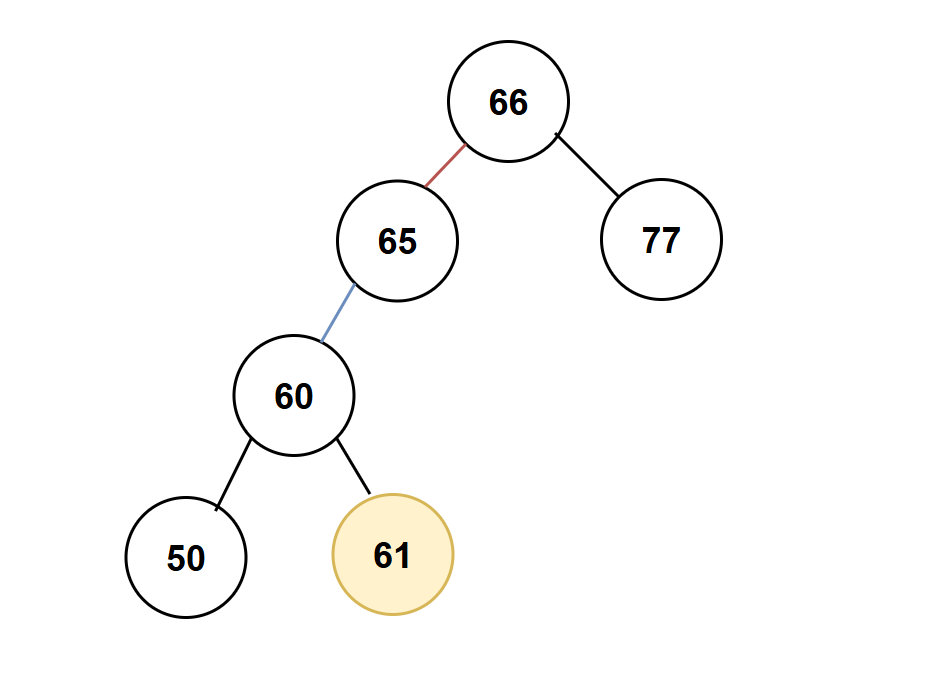

那么这时候是不是就变成了LL模式，那我们是不是对应的把77往右边往下拽，是不是就可以实现平衡，就变成下面：

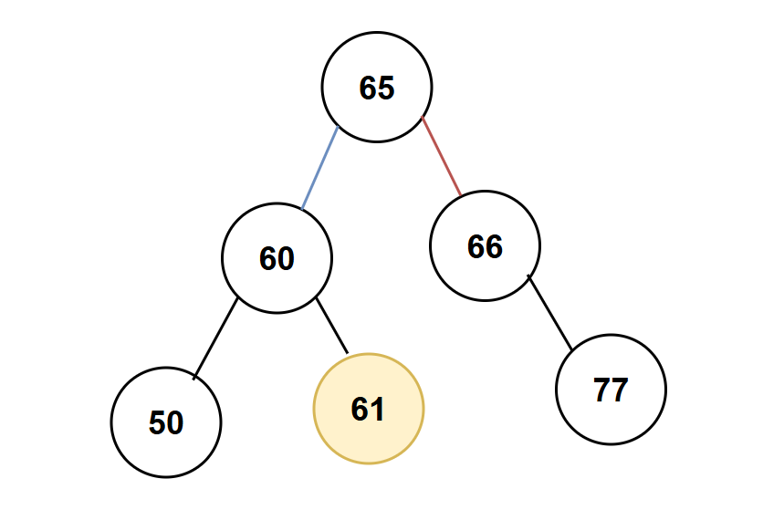

那么对于LR来说我们要做的就是转移矛盾，转移成LL的形式

<span style="font-size:1.2em;">**RR：**</span>

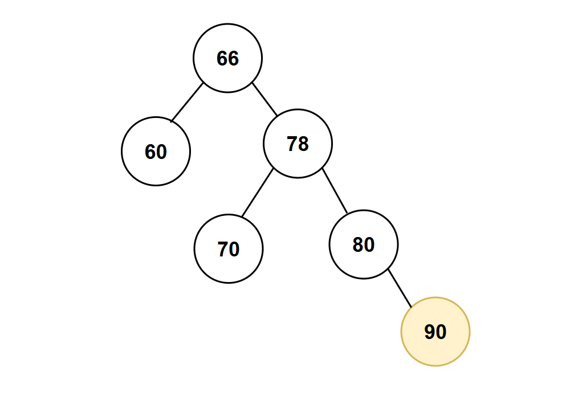

接下来看第三种情况，第三种情况也很明显插入90过后66失衡了，我们来看是什么情况

我们知道90在66的右边，所以66的右边第一个字树根结点78，这时候我们再看90在78的哪里，90的在80的右边，而80在70的右边，所以对应的模型应该为RR，如下：

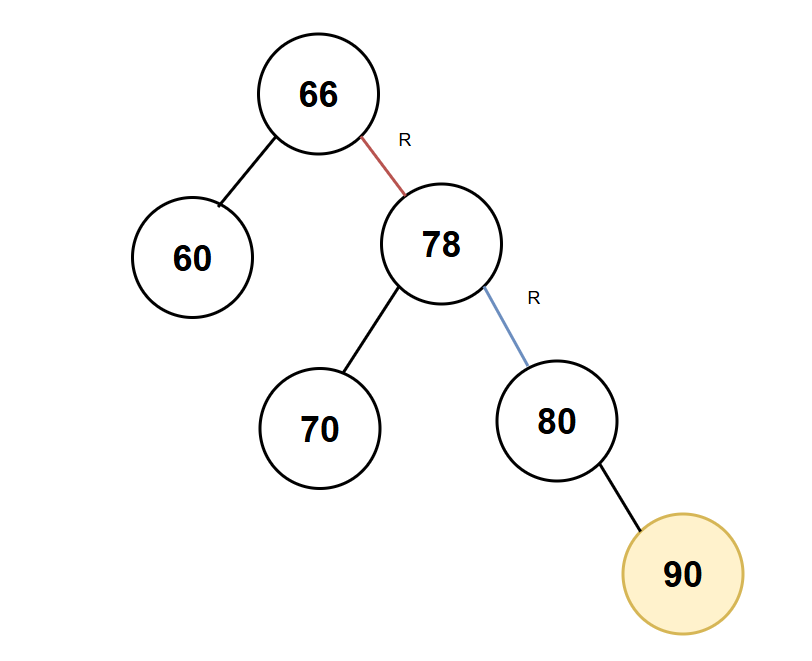

那么接下来我们来看怎么操作，对于RR其实就是LL的另一种对称的方法

我们按照上面说的LL的操作方法，我们将60像升国旗一样给它往下拽这时候66会往下走，那么78是不是对应往上升了，这时候我们要把78左边的节点70放到66的右边，那么这样我们就完成了平衡操作，变成了下图：
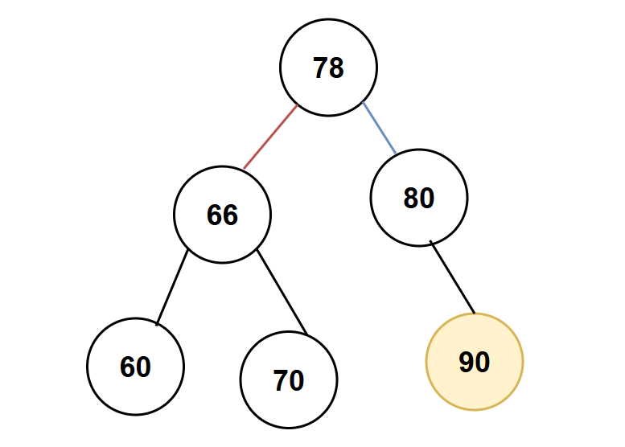

**<span style="font-size:1.2em;">RL：</span>**

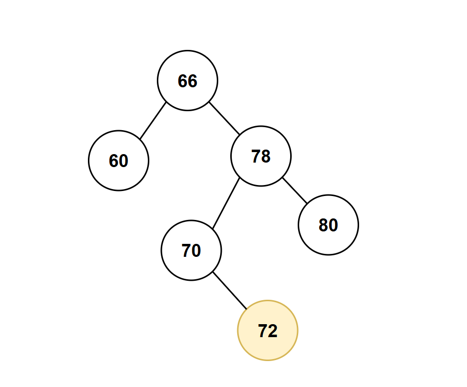

那么接下来来看最后一种情况，这时候还是66失衡了，那么是什么情况呢

我们先看插入72的时候，72比60大所以在66的右边，我们看66右边的右子树的根节点78，这时候我们在跟72进行比较，72是在70的右边，而70在78的左边，所以对应是RL模型

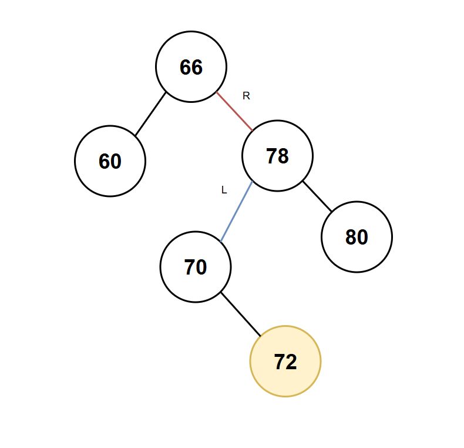

那么接下来我们看怎么让它平衡

对于RL结构来说，我们对标LR，LR处理的位置是不是在失衡点下面的子树根节点，那么RL也是一样的处理思路，那么这时候我们处理的节点就是78，那按照LR的思路，我们就是将72往下拽，让70升到78的前面，这时候就完成了第一步，让RL转换成RR

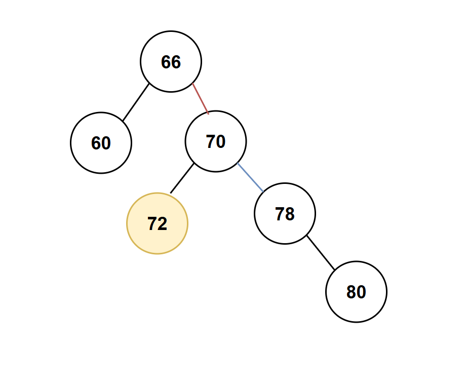

那么接下来按照RR的操作即可，将60往下拽就可以了，那么最后就变成了下图：

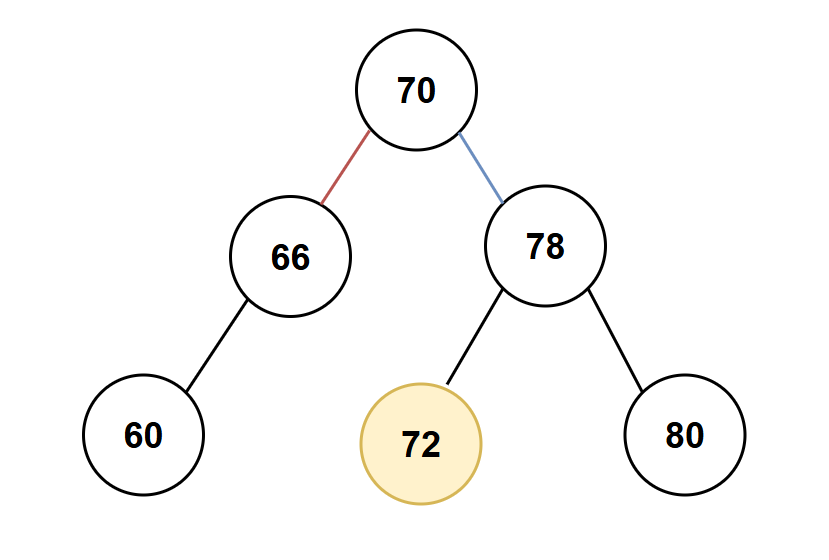

好讲完了二叉树的插入基本逻辑情况，接下来我们来看代码

```c
static int maxNum(int a, int b) {
	return (a > b) ? a : b;
}
static int h(const AVLNode *node) {
	if (node == NULL) {
		return 0;
	}
	return node->height;
}

/* 左旋操作
 *     px
 *     |
 *     x
 *   /  \
 * lx    y
 *      / \
 *     ly ry
 * */
static AVLNode *leftRotate(AVLNode *x) {
	AVLNode *y = x->right;
	x->right = y->left;
	y->left = x;

	x->height = maxNum(h(x->left), h(x->right)) + 1;
	y->height = maxNum(h(y->left), h(y->right)) + 1;
	return y;
}

/* 右旋操作
 *       py
 *       |
 *       y
 *     /  \
 *    x   ry
 *   / \
 * lx  rx
 * */
static AVLNode *rightRotate(AVLNode *y) {
	AVLNode *x = y->left;
	y->left = x->right;
	x->right = y;

	y->height = maxNum(h(y->left), h(y->right)) + 1;
	x->height = maxNum(h(x->left), h(x->right)) + 1;
	return x;
}
```

这段代码是 AVL（自平衡二叉搜索）树实现中，用于在插入或删除节点后维持树平衡的核心操作集。它不直接包含删除逻辑，但为删除后必要的再平衡提供了基础工具。

**第一部分：基础辅助函数** 代码始于两个简单的工具函数。`maxNum` 函数通过比较返回两个整数中的较大值，其唯一目的是为后续的高度计算提供支持。`h` 函数是一个安全的高度获取器；它接收一个节点指针作为参数，其核心逻辑是处理空指针情况，防止程序访问无效内存。若节点为空，则返回高度 0；若节点有效，则直接返回该节点对象中存储的 `height` 属性值。这个函数封装了高度访问逻辑，使得后续代码更加简洁和安全。

**第二部分：左旋操作 (Left Rotation)** 左旋操作用于矫正因节点的**右子树过深**而导致的不平衡状态。 该函数以一个即将失去平衡的节点（代码中的 `x`）作为参数。其核心执行流程如下：首先，它定位到 `x` 的右子节点（称为 `y`），这个节点将成为新的局部根节点。接着，它进行子树重组：将 `y` 原本的左子树（`ly`）转移，设置为 `x` 的新的右子树。然后，它建立新的父子关系，将 `x` 自身设置为 `y` 的左子节点。至此，节点间的链接关系调整完毕。 紧接着是关键一步：**更新高度**。由于子树结构发生变化，节点 `x` 和 `y` 的高度很可能已不再准确。函数通过 `maxNum` 和 `h` 函数，分别计算 `x` 和 `y` 的新高度。新高度由其左右子树中较高的那个高度加一（自身所在层）来决定。最后，函数返回新的局部根节点 `y`，其父节点（如果存在）需要接收这个返回值以完成链接。

**第三部分：右旋操作 (Right Rotation)** 右旋操作与左旋对称，用于矫正因节点的**左子树过深**而引起的不平衡。 该函数以不平衡节点 `y` 为参数。其逻辑流程与左旋镜像对应：首先定位 `y` 的左子节点 `x`，它将上升为新的根节点。然后进行子树重组，将 `x` 原本的右子树（`rx`）剥离，设置为 `y` 的新的左子树。随后，将 `y` 设置为 `x` 的右子节点。 同样，在旋转之后必须**重新计算高度**。函数分别计算了 `y` 和 `x` 的新高度值，确保数据的准确性。最终，函数返回新的局部根节点 `x`，以供上层调用者更新其父节点的指针。

**核心要点总结：** 这些函数共同构成了 AVL 树平衡操作的基石。`leftRotate` 和 `rightRotate` 不仅仅是交换指针，它们严格遵循了二叉搜索树的性质，确保了旋转后左子树所有节点仍小于根节点，右子树所有节点仍大于根节点。同时，通过立即重新计算受影响节点的高度，为后续可能的进一步平衡操作提供了正确的判断依据。在完整的删除操作中，当沿着搜索路径回溯时，会检查每个节点的平衡因子（左右子树高度差），一旦发现绝对值大于 1 的不平衡，就会根据具体情形（左左、左右、右右、右左）调用一次或多次这些旋转函数来恢复全局平衡。

```c
static int getBalance(const AVLNode *node) {
	if (node == NULL) {
		return 0;
	}
	return h(node->left) - h(node->right);
}

static AVLNode *createAVLNode(Element data) {
	AVLNode *node = malloc(sizeof(AVLNode));
	if (node == NULL) {
		printf("Memory allocation failed");
		return NULL;
	}
	node->data = data;
	node->left = node->right = NULL;
	node->height = 1;
	return node;
}

static AVLNode *insertAVLNode(AVLTree *tree,  AVLNode *node, Element e) {
	// 1. 递归的初始化位置
	if (node == NULL) {
		tree->count++;
		return createAVLNode(e);
	}
	// 1.1 递的过程
	if (e < node->data) {
		node->left = insertAVLNode(tree, node->left, e);
	}
	else if (e > node->data) {
		node->right = insertAVLNode(tree, node->right, e);
	} else {
		return node;
	}
	// 2. 运行到这里的代码，已经进入到归的过程，更新这条路径上节点高度，同时监测平衡因子
	// 2.1 归过程中的节点高度的更新
	node->height = maxNum(h(node->right), h(node->left)) + 1;
	// 2.2 计算机当前节点的平衡因子
	int balance = getBalance(node);
	if (balance > 1) {
		// 失衡点子节点是L还是R，LL or LR
		if (e > node->left->data) {
			// LR
			node->left = leftRotate(node->left);
		}
		// LL
		return rightRotate(node);
	}
	if (balance < -1) {
		if (e < node->right->data) {
			// RL
			node->right = rightRotate(node->right);
		}
		// RR
		return leftRotate(node);
	}
	return node;
}

void insertAVLTree(AVLTree* tree, Element data) {
	if (tree) {
		tree->root = insertAVLNode(tree, tree->root, data);
	}
}
```

这段代码的核心目标是向一棵 AVL 树（自平衡二叉搜索树）中插入一个新节点，并在插入后通过必要的旋转操作来维持树的平衡，从而确保其查找、插入和删除操作的时间复杂度始终为 O(log n)。

**二、 辅助函数解析**

**1. 平衡因子计算函数 (`getBalance`)**

- **功能**：计算并返回给定节点的平衡因子。
- 逻辑：
  - 首先进行安全检查，如果传入的节点指针为空，则返回平衡因子 0。
  - 对于非空节点，其平衡因子计算公式为：`左子树高度 - 右子树高度`。
- **意义**：平衡因子是判断当前节点是否失衡（绝对值 > 1）以及决定如何旋转的关键依据。

**2.节点创建函数 (`createAVLNode`)**

- **功能**：在堆内存中动态创建一个新的 AVL 树节点并进行初始化。
- **逻辑：**
  - 使用 `malloc` 申请内存。如果申请失败，则报错并返回空指针。
  - 初始化新节点的 `data` 字段为传入的元素值 `e`。
  - 将新节点的左右子节点指针 (`left`, `right`) 均设为 `NULL`。
  - 将新节点的高度 (`height`) 初始化为 1，因为作为叶子节点，其自身高度为 1。
- **意义**：封装了节点创建和初始化的过程，是构建树的基础操作。

**三、 核心插入函数解析 (`insertAVLNode`)**

该函数采用递归方式实现，其执行过程可分为“递”和“归”两个阶段。

阶段一：递归向下查找插入位置（“递”的过程）

- **终止条件**：如果当前节点 (`node`) 为空，意味着找到了插入位置。此时增加树的节点计数器 (`tree->count++`)，并调用 `createAVLNode(e)` 创建新节点作为子树返回。
- **递归查找：**
  - 如果待插入值 `e` **小于**当前节点的值，则递归地进入**左子树**进行插入。
  - 如果 `e` **大于**当前节点的值，则递归地进入**右子树**进行插入。
  - 如果 `e` **等于**当前节点的值，根据代码逻辑，直接返回当前节点（这是一种常见的处理方式，意味着不允许重复值，或者视情况更新节点）。

**阶段二：递归向上回溯并维护平衡（“归”的过程）**

当递归调用返回时，程序开始回溯到上一层调用。此时，新节点已经插入到子树中，需要做三件事：

1. **更新当前节点高度**：
   - 当前节点的高度需要重新计算，因为它子节点的高度可能已经改变。
   - 计算公式为：`当前节点高度 = max(左子树高度, 右子树高度) + 1`。
2. **检查当前节点是否失衡**：
   - 调用 `getBalance(node)` 计算当前节点的平衡因子 `balance`。
3. **根据失衡情况进行旋转调整（共四种情况）**：
   - **情况一：Left Left (LL - 左子树的左子树插入导致失衡)**
     - **条件**：`balance > 1` (左子树高) 且 `e < node->left->data` (新节点插在了左子树的左边)。
     - **操作**：对当前节点执行一次**右旋** (`rightRotate`)，使树恢复平衡。
   - **情况二：Left Right (LR - 左子树的右子树插入导致失衡)**
     - **条件**：`balance > 1` (左子树高) 但 `e > node->left->data` (新节点插在了左子树的右边)。
     - **操作**：这是一个双旋转操作。先对当前节点的**左孩子**执行一次**左旋** (`leftRotate`)，将情况转换为 LL 型；再对**当前节点**执行一次**右旋** (`rightRotate`)。
   - **情况三：Right Right (RR - 右子树的右子树插入导致失衡)**
     - **条件**：`balance < -1` (右子树高) 且 `e > node->right->data` (新节点插在了右子树的右边)。
     - **操作**：对当前节点执行一次**左旋** (`leftRotate`)，使树恢复平衡。
   - **情况四：Right Left (RL - 右子树的左子树插入导致失衡)**
     - **条件**：`balance < -1` (右子树高) 但 `e < node->right->data` (新节点插在了右子树的左边)。
     - **操作**：这是一个双旋转操作。先对当前节点的**右孩子**执行一次**右旋** (`rightRotate`)，将情况转换为 RR 型；再对**当前节点**执行一次**左旋** (`leftRotate`)。

- 完成旋转调整后，函数返回新的子树根节点。如果无需调整，则直接返回原节点。

四、 用户接口函数 (`insertAVLTree`)

- **功能**：作为提供给用户调用的插入接口，隐藏了内部递归实现的细节。
- **逻辑：**
  - 首先检查传入的树指针 `tree` 是否有效。
  - 然后调用核心递归函数 `insertAVLNode`，从整棵树的根节点 (`tree->root`) 开始进行插入操作。
  - 最后将递归函数返回的（可能经过旋转后新的）根节点赋值回 `tree->root`。

这就是二叉平衡树的插入操作

##### 二叉平衡树的删除

```c
static int getBalance(const AVLNode *node) {
	if (node == NULL) {
		return 0;
	}
	return h(node->left) - h(node->right);
}

static AVLNode *deleteAVLNode(AVLTree *tree, AVLNode *node, Element e) {
	if (node == NULL) {
		return NULL;
	}
	// 1. 找到要删除的节点
	if (e < node->data) {
		node->left = deleteAVLNode(tree, node->left, e);
	} else if (e > node->data) {
		node->right = deleteAVLNode(tree, node->right, e);
	} else {
		// 找到了e值的元素
		AVLNode *tmp;
		if (node->left == NULL || node->right == NULL) {
			tmp = node->left ? node->left : node->right;
			if (tmp == NULL){
				// 度为0，直接删除
				tree->count--;
				free(node);
				return NULL;
			}
			// 度为1，将tmp的值直接替换成node
			node->data = tmp->data;
			node->left = tmp->left;
			node->right = tmp->right;
			tree->count--;
			free(tmp);
		}
		else {
			// 度为2的点，找前驱节点
			tmp = node->left;
			while (tmp->right) {
				tmp = tmp->right;
			}
			node->data = tmp->data;
			node->left = deleteAVLNode(tree, node->left, tmp->data);
		}
	}
	// 2. 归的过程中，更新平衡因子
	node->height = 1 + maxNum(h(node->left), h(node->right));
	int balance = getBalance(node);
	if (balance > 1) {
		// L
		if (getBalance(node->left) < 0) {
			// R
			node->left = leftRotate(node->left);
		}
		return rightRotate(node);
	}
	if (balance < -1) {
		if (getBalance(node->right) > 0) {
			node->right = rightRotate(node->right);
		}
		return leftRotate(node);
	}
	return node;
}

/* 平衡二叉树中删除元素e
 * 1. 按照二叉搜索树的规则，递归找到元素e的节点
 * 2. 判断度的情况，是否转移矛盾
 * 3. 归的过程中，根据平衡因子进行调整
 */
void deleteAVLTree(AVLTree* tree, Element e) {
	if (tree) {
		tree->root = deleteAVLNode(tree, tree->root, e);
	}
}

```

这段代码实现了 AVL 树（自平衡二叉搜索树）的删除操作。其核心目标是在删除指定节点后，不仅维持二叉搜索树的有序性，更重要的是通过旋转操作恢复并保持树的平衡，确保所有操作的时间复杂度维持在 O(log n) 级别。

整个删除过程采用递归算法实现，分为两个明确的阶段：

1. **递归下降阶段**：查找目标节点并执行删除
2. **递归回溯阶段**：更新高度并恢复平衡

**二、 详细函数解析**

函数：`deleteAVLNode` (核心递归函数)

阶段一：递归查找与节点删除（向下过程）

1. **递归基线条件**：

   - 如果当前节点 (`node`) 为 `NULL`，说明已经遍历到空子树，未找到目标元素，直接返回 `NULL`。

2. **递归查找过程**：

   - 比较目标值：

     ```
     e
     ```

     与当前节点值：

     ```
     node->data
     ```

     - 若 `e` 较小，递归进入**左子树**：`node->left = deleteAVLNode(tree, node->left, e)`
     - 若 `e` 较大，递归进入**右子树**：`node->right = deleteAVLNode(tree, node->right, e)`
     - 若相等，**找到目标节点**，进入节点删除处理流程。

3. **节点删除处理（三种情况）**：

   - **情况A：叶子节点（度为0）**
     - **操作**：直接释放该节点内存，树节点计数器 `tree->count` 减一，并返回 `NULL` 给父节点（相当于父节点对应的指针变为 `NULL`）。
   - **情况B：仅有一个子节点（度为1）**
     - 操作：
       - 确定存在的子节点（`tmp = node->left ? node->left : node->right`）。
       - 采用“复制替代”策略：将子节点 `tmp` 的**数据**、**左指针**、**右指针**全部复制到当前节点 `node` 中。
       - 释放子节点 `tmp` 的内存。
       - 树节点计数器 `tree->count` 减一。
     - **优势**：此策略避免了直接修改父节点指针，简化了链表操作。
   - **情况C：有两个子节点（度为2）**
     - **策略**：采用“前驱替代”法。选择左子树中的最大节点（前驱）来替代被删除节点。
     - 操作步骤：
       - **查找前驱**：从当前节点的左子树出发，一直向右遍历，找到值最大的节点 `tmp`。
       - **数据替换**：将前驱节点 `tmp` 的数据复制到当前待删除节点 `node` 中。此时，`node` 中原有的值已被覆盖（即被删除）。
       - **递归删除前驱**：转而递归地删除左子树中的前驱节点（值为 `tmp->data` 的节点）。这个递归删除最终一定会落到一个度为0或1的节点上，从而由情况A或B完成物理删除。

**阶段二：更新高度与平衡修复（向上回溯过程）**

当递归调用开始返回时，程序自底向上回溯到每个父节点，进行平衡维护。

1. **更新节点高度**：
   - 由于子树可能发生了变化，当前节点的高度需要重新计算：`node->height = 1 + max(h(node->left), h(node->right))`。
2. **计算平衡因子**：
   - 调用 `getBalance(node)` 计算当前节点的平衡因子：`balance = h(left) - h(right)`。
3. **判断失衡并旋转修复（四种情况）**：
   - **情况1：LL型失衡 (Left Left Case)**
     - **特征**：`balance > 1`（左子树高）且 `getBalance(node->left) >= 0`（左子树的左子树更高或等高）。
     - **修复**：对当前节点执行一次**右旋** (`rightRotate`)。
   - **情况2：LR型失衡 (Left Right Case)**
     - **特征**：`balance > 1`（左子树高）但 `getBalance(node->left) < 0`（左子树的右子树更高）。
     - 修复：这是一个双旋转操作。
       - 先对当前节点的**左孩子**执行**左旋** (`leftRotate`)，将结构转换为 LL 型。
       - 再对**当前节点**本身执行**右旋** (`rightRotate`)。
   - **情况3：RR型失衡 (Right Right Case)**
     - **特征**：`balance < -1`（右子树高）且 `getBalance(node->right) <= 0`（右子树的右子树更高或等高）。
     - **修复**：对当前节点执行一次**左旋** (`leftRotate`)。
   - **情况4：RL型失衡 (Right Left Case)**
     - **特征**：`balance < -1`（右子树高）但 `getBalance(node->right) > 0`（右子树的左子树更高）。
     - 修复：这是一个双旋转操作。
       - 先对当前节点的**右孩子**执行**右旋** (`rightRotate`)，将结构转换为 RR 型。
       - 再对**当前节点**本身执行**左旋** (`leftRotate`)。
4. **返回当前子树根节点**：
   - 如果执行了旋转，则返回旋转后新的根节点。
   - 如果无需旋转，则返回原来的节点。

**函数：`deleteAVLTree` (对外接口)**

- **功能**：作为模块对外的公共接口，封装内部递归逻辑，供用户调用。
- 实现：
  - 检查传入的树指针 `tree` 非空。
  - 调用核心递归函数 `deleteAVLNode`，从树的根节点开始执行删除。
  - 将递归函数返回的（可能经过旋转调整的）新根节点赋值给 `tree->root`。

**三、 核心要点总结**

1. **递归结构**：算法利用递归天然的回溯特性，在“归”的过程中自底向上地检查并修复每一个可能失衡的节点。
2. **删除策略**：对度为2的节点采用“前驱替代”法，将其转换为删除度为0或1节点的问题，简化了操作。
3. **平衡修复**：根据当前节点及其子节点的平衡因子精确判断失衡类型，并选择对应的单旋或双旋操作进行修复。
4. **高度维护**：在回溯过程中，必须及时更新每个节点的高度，因为旋转操作和平衡判断都依赖于准确的高度信息。
5. **封装设计**：通过一个公共接口函数隐藏了内部复杂的递归实现细节，提供了清晰的使用方式。

这段代码完整体现了AVL树删除操作的所有关键环节，通过严谨的逻辑判断和精细的指针操作，在复杂的数据结构变更中确保了性能与正确性。

#### 二叉平衡树的总结

**一、 核心概念与定义**

平衡二叉搜索树，最典型的代表是 **AVL树**，是一种高度自平衡的二叉搜索树（BST）。它在普通二叉搜索树的基础上增加了一个关键的约束条件：**任何节点的左子树和右子树的高度差的绝对值不超过 1**。这个高度差被称为**平衡因子**。

AVL树的发明旨在解决普通二叉搜索树在极端情况下（如插入有序序列）退化成链表，从而导致查找、插入、删除等操作的时间复杂度从理想的 O(log n) 恶化为 O(n) 的问题。

**二、 核心操作原理**

AVL树的核心在于通过**旋转操作**在插入和删除节点后动态地调整树的结构，以恢复其平衡性。

**1.旋转操作（核心维护手段）**

旋转是AVL树保持平衡的基础，分为四种基本类型：

- **左旋 (Left Rotation)**：
  - **场景**：当一个节点的右子树比左子树高太多（平衡因子 < -1）时使用。
  - **逻辑**：以该节点（A）的右孩子（B）为新的根节点，将A变为B的左孩子，同时将B原来的左子树变为A的右子树。此操作将一棵向右倾斜的树拉回平衡。
- **右旋 (Right Rotation)**：
  - **场景**：当一个节点的左子树比右子树高太多（平衡因子 > 1）时使用。
  - **逻辑**：以该节点（A）的左孩子（B）为新的根节点，将A变为B的右孩子，同时将B原来的右子树变为A的左子树。此操作将一棵向左倾斜的树拉回平衡。
- **先左旋后右旋 (Left-Right Rotation)**：
  - **场景**：解决LR型失衡。即节点的左子树的右子树插入了新节点导致不平衡。
  - **逻辑**：先对失衡节点的左孩子进行一次左旋，将问题转换为LL型失衡；再对失衡节点本身进行一次右旋。
- **先右旋后左旋 (Right-Left Rotation)**：
  - **场景**：解决RL型失衡。即节点的右子树的左子树插入了新节点导致不平衡。
  - **逻辑**：先对失衡节点的右孩子进行一次右旋，将问题转换为RR型失衡；再对失衡节点本身进行一次左旋。

2. **插入操作**

1. **标准BST插入**：首先按照二叉搜索树的规则，递归地找到新节点的插入位置并将其作为叶子节点插入。
2. **更新高度与检查平衡**：在递归回溯的过程中，更新路径上每个节点的高度。
3. **恢复平衡**：一旦发现某个节点的平衡因子绝对值大于1，立即根据其子树的平衡情况判断属于四种失衡类型中的哪一种，并执行对应的旋转操作。

3. **删除操作**

删除操作是AVL树中最复杂的操作。

1. **标准BST删除**：首先找到目标节点，并根据其子节点数量（0个、1个或2个）按BST规则进行删除。
2. **更新高度与检查平衡**：与插入类似，在递归回溯的过程中，更新路径上每个节点的高度。
3. **恢复平衡**：检查每个节点的平衡因子，若发现失衡，则执行相应的旋转操作。**注意：删除操作可能引起从删除点直到根节点路径上多个节点的失衡，因此需要自底向上多次旋转。**

**三、 优点**

1. **稳定的高效性能**：这是AVL树最核心的优点。由于其严格的平衡性，对于包含n个节点的AVL树，其高度始终保持在 O(log n) 量级。因此，**查找、插入、删除等操作的最坏时间复杂度均稳定在 O(log n)**。这对于需要保证最坏情况性能的场景（如实时系统、关键任务系统）至关重要。
2. **高效的查找操作**：对于需要频繁进行查找操作的场景，AVL树是极佳的选择，因为其结构保证了最快的查找路径。
3. **结构紧凑**：与同样支持高效查找的数据结构（如红黑树）相比，在存储相同数量节点时，AVL树的高度通常更矮，这意味着平均查找长度更短。

**四、 缺点**

1. **维护平衡的开销较大**：为了维持严格的平衡，**插入和删除操作可能需要执行一次或多次旋转**。特别是在删除操作中，可能需要进行多达 O(log n) 次旋转。这使得其插入和删除的性能在常数因子层面上通常低于其他平衡树（如红黑树）。
2. **实现复杂度高**：相对于普通BST，AVL树的实现要复杂得多。需要维护每个节点的高度或平衡因子，并且要正确实现四种旋转逻辑以及复杂的递归回溯调整，代码实现和调试难度较大。
3. **频繁的旋转操作**：对于需要频繁进行插入和删除操作的场景，大量的旋转操作会成为性能瓶颈。

**五、 典型应用场景**

- **数据库系统**：用于构建数据库表中的索引，特别是在需要快速响应查询且数据修改（增删改）频率不是极端高的场景。
- **内存中的有序数据结构**：许多编程语言标准库中的有序集合（如 `std::set`、`std::map` 在某些实现中）或字典背后使用了AVL树或类似的平衡树。
- **实时应用和游戏**：在这些对操作耗时上限有严格要求的领域，AVL树可预测的最坏情况性能比平均性能更重要。
- **文件系统**：用于快速定位和管理文件块或目录结构。

**六、 总结与对比**

AVL树通过强制实施严格的平衡条件，**牺牲了一部分插入和删除的性能，换来了无与伦比的查找效率和最坏情况下的性能保证**。

它非常适合 **“查询密集型”** 的应用场景，即数据被频繁查找，但相对不频繁修改的情况。反之，如果应用场景是 **“修改密集型”** ，即需要频繁插入和删除节点，那么维护AVL树平衡的开销可能会变得显著，此时另一种平衡树——**红黑树**往往是更受欢迎的选择，因为它通过放宽平衡条件（非严格平衡）来减少旋转次数，从而在整体上提供了更高效的插入和删除性能。


### 并查集

#### 并查集概述

**一、并查集的起源与需求背景**

在计算机科学中，**动态连通性问题**是一类常见且重要的问题。这类问题通常涉及对一组元素进行动态的合并与查询操作，例如：

- 判断社交网络中两个人是否间接好友关系
- 计算图中连通分量的数量
- 判断网络中的两个节点是否可达

若使用传统数据结构（如链表或数组）处理这类问题，每次合并或查询操作可能需要线性时间复杂度，效率较低。**并查集**（Disjoint Set Union, DSU）应运而生，它通过树形结构组织数据，实现了接近常数时间的合并与查询操作。

**二、并查集的核心概念**

1. 基本结构

- 每个集合用一棵树表示，树的根节点作为该集合的**代表元**。
- 每个节点记录其父节点信息，根节点的父节点指向自身。

2. 三种基本操作

- **初始化（makeSet）**：将每个元素初始化为一个独立的集合，即每个元素自成一棵树。
- **查找（find）**：查找某个元素所在集合的根节点（代表元）。
- **合并（union）**：将两个元素所在的集合合并为一个集合。

**三、并查集的实现方式**

1. 存储结构

通常使用一个数组`parent[]`来记录每个节点的父节点。初始化时，`parent[i] = i`，表示每个节点都是根节点。

2. 查找操作的实现

- 从当前节点开始，不断向上查找父节点，直到找到根节点（父节点为自身的节点）。
- 为提升后续查找效率，可引入**路径压缩**优化：在查找过程中，将路径上的所有节点直接指向根节点。

示例步骤：

1. 若查找节点`x`，首先找到其父节点`parent[x]`。
2. 若`parent[x]`不是根节点，则递归查找`parent[x]`的根节点。
3. 在递归返回时，将路径上所有节点的父节点直接指向根节点。

3. 合并操作的实现

- 分别找到两个元素所在的根节点`rootX`和`rootY`。
- 若`rootX != rootY`，则将其中一棵树合并到另一棵树下。
- 为保持树的平衡，可引入**按秩合并**优化：将高度较小的树合并到高度较大的树下，避免树退化为链状。

示例步骤：

1. 查找元素`x`和`y`的根节点。
2. 比较两棵树的高度（或节点数），将矮树的根节点指向高树的根节点。
3. 更新合并后树的高度（若两树高度相等，合并后高度加1）。

**四、并查集的优化策略**

1. 路径压缩（Path Compression）

- 在查找过程中 flatten 路径，使后续查询更快。
- 不改变树的实际高度，但大幅减少平均查找时间。

2. 按秩合并（Union by Rank）

- 总将小树合并到大树下，控制树的高度增长。
- 秩可定义为树的高度或节点数，选择依据具体场景。

**五、并查集的应用场景**

1. **图的连通性判断**：判断无向图中两个节点是否连通。
2. **最小生成树算法（Kruskal）**：快速判断加入边是否会形成环。
3. **社交网络分析**：动态合并朋友圈，查询是否属于同一群体。
4. **图像处理**：连通区域标记与合并。

六、并查集的特点总结

- **高效性**：经路径压缩和按秩合并优化后，单次操作时间复杂度接近常数级（O(α(n))，其中α为反阿克曼函数）。
- **简洁性**：代码实现简单，逻辑清晰。
- **灵活性**：支持动态合并与查询，适用于多种复杂场景。

通过上述实现与优化，并查集成为处理动态连通性问题的首选数据结构，在算法竞赛和工程实践中均有广泛应用。****

- **高效性**：经路径压缩和按秩合并优化后，单次操作时间复杂度接近常数级（O(α(n))，其中α为反阿克曼函数）。
- **简洁性**：代码实现简单，逻辑清晰。
- **灵活性**：支持动态合并与查询，适用于多种复杂场景。

通过上述实现与优化，并查集成为处理动态连通性问题的首选数据结构，在算法竞赛和工程实践中均有广泛应用。

#### 并查集的具体实现思路

##### 快速查找

我们先来看一下下面一组的数据元素：
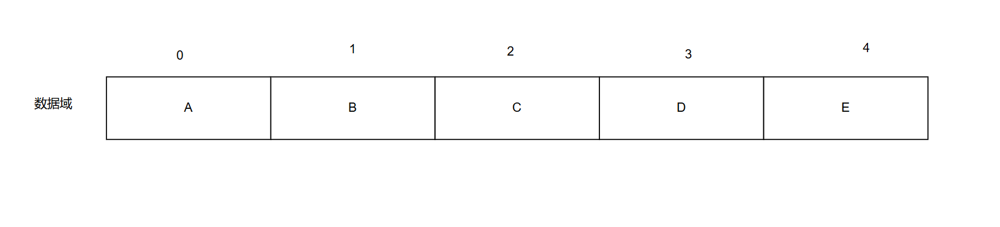

假设现在我们按照上面讲的，现在上面每个数据之间没有任何关系，现在呢，对于并查集来说，我们还需要一个数组用来指向他们之间的关系域，也就是如下：

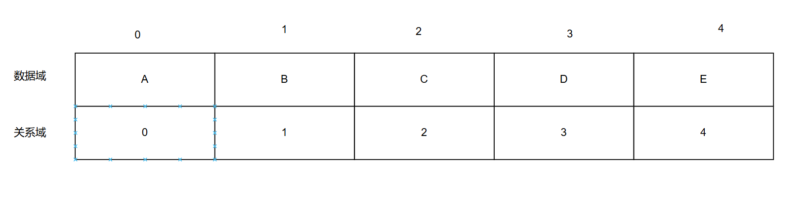

那么由于一开始的时候，我们并没有设置他们之间的集合或者说是关系，所以一开始的时候它们都是属于自己管理自己，好那么现在我要让它们之间合并，具体合并怎么实现我们这里先不说，我们先让0--4union 再让2--4union 最后3--4union，那么这里呢，关系域我们用一个groupid来标注，这个什么意思呢，我们把每个数据域存放的地方看成一个集合，这个groupid就像每个集合的称号或者是就类似于班级的班级名称一样，我们现在合并，是不是要更新groupid，也就变成了下面这样：

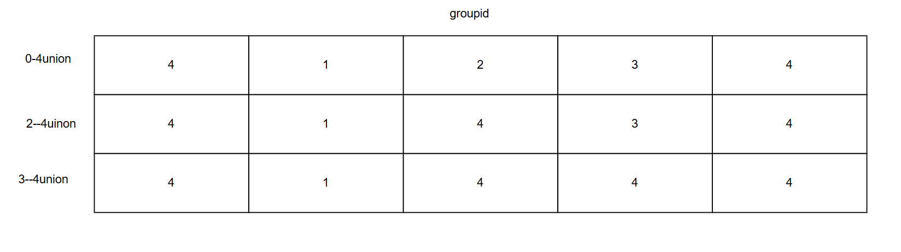

我们这里的合并是不是就可以想象成两个班级合并，让一个班到另一个班级里面，那么对应的“班级名称”是不是也需要更换了，那么这个就是合并的一个过程，当然我们这里主要讲的是查找，那对于查找来说，我们上面说的查找并不是别的查找某一个元素之类的，我们这里的查找指的是查找两个集合是否合并，那其实很简单，思路就如下：

1. 输入要查找的两个集合，看他们的groupid是否相同
2. 如果相投则返回true，如果不同则返回false

那么这就是快速查找的思路，对于这种快速查找，我们的时间复杂度在O(c)级别，也是很快的，但对于合并来说就有点慢了

##### 快速合并

还是看上面的图，如下：


那么这时候，和快速查找不同的时候，我们上面说的是groupid，这里面我们改为父节点，也就是parentid，如下图：

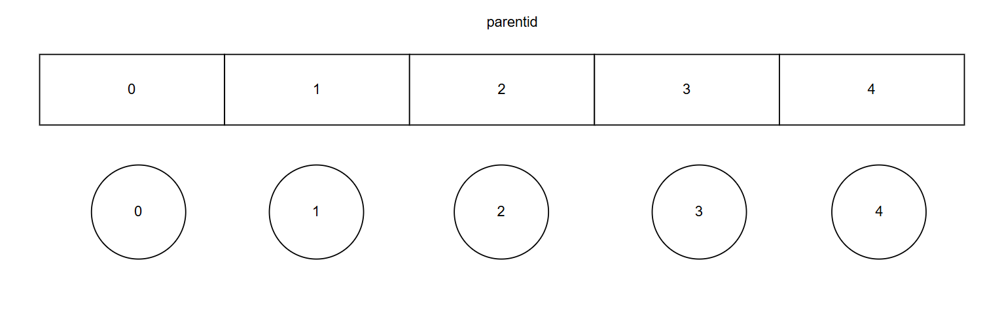

那么接下来我门来看一下，按照上面的思路来处理一下0--3合并  2--4合并，那很显然变成下面这样：
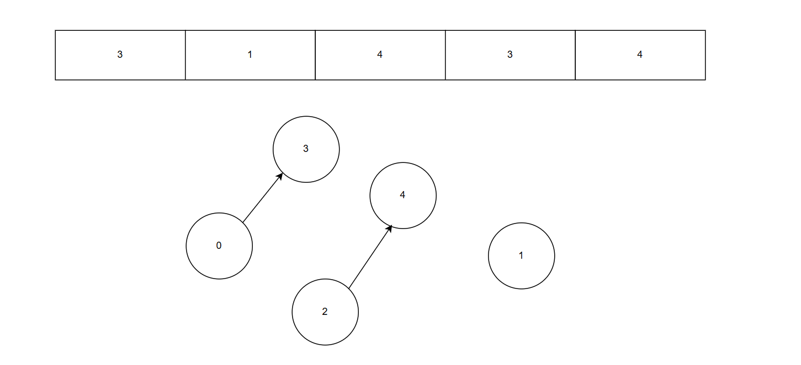

这个相对来说比较简单，只要将每个节点的指向位置更新一下即可，那么我们再看0--4怎么合并，因为这时候0和3先合并了，那么这时候，我们是不是要拿着3进行更改，因为你看如果将0接到4的位置，是不是0会出现两个父节点，所以这时候是不是不太适合，所以对于这时候的合并思路来说，我们应该将3进行更改接到2后面这是一种思路，当然也可以直接将3接到4的位置，我们看前面的情况是不是变成了下面这种情况：
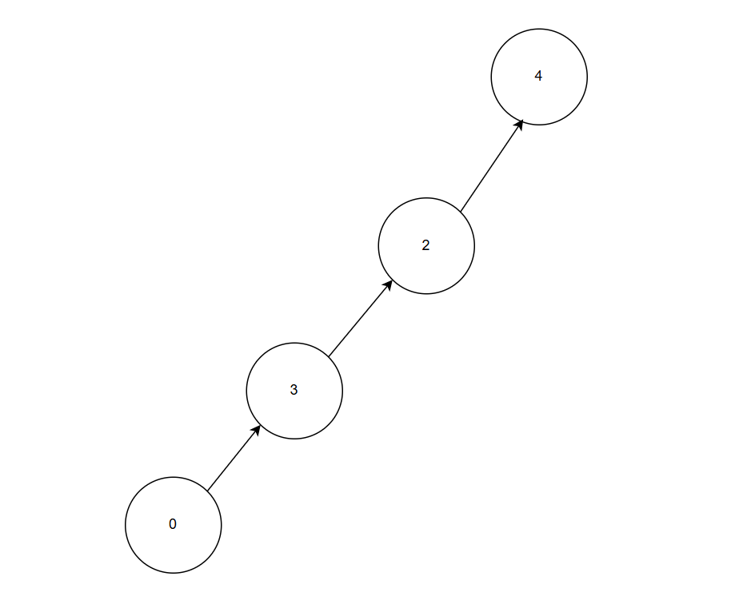

那么对于这个来说，如果我们要查找他们是否合并了，我们是不是应该查找他们对应的根结点即可，如果根结点一样，那么他们是不是就是合并了，当然这个查找来说如果按照我们这样的接法，是不是会随着树的高度增加而增加，所以查找效率相对低了一点，不过对于合并来说就是稍微快一点，这就是快速合并

#### 并查集代码实现

##### 快速查找

```c
typedef struct {
	Element *data;			// 存放具体数据，利用索引来建立数据元素的关系
	int *groupID;			// 每个元素的组编号，利用索引值找到组ID信息
	int n;					// 并查集中元素的个数
} QuickFindSet;
```

那么对于这个结构体的封装快速查找封装很简单，上面有注释这里不再赘述

###### 快速查找的创建、初始化、释放

```c
QuickFindSet* createQuickFindSet(int n) {
	QuickFindSet *setQF = malloc(sizeof(QuickFindSet));
	if (setQF == NULL) {
		printf("setQF malloc failed!\n");
		return NULL;
	}
	setQF->data = malloc(sizeof(Element) * n);
	setQF->groupID = malloc(sizeof(int) * n);
	setQF->n = n;

	return setQF;
}

void releaseQuickFindSet(QuickFindSet* setQF) {
	if (setQF) {
		if (setQF->data) {
			free(setQF->data);
		}
		if (setQF->groupID) {
			free(setQF->groupID);
		}
		free(setQF);
	}
}

void initQuickFindSet(const QuickFindSet* setQF, const Element* data, int n) {
	for (int i = 0; i < n; ++i) {
		setQF->data[i] = data[i];
		setQF->groupID[i] = i;
	}
}
```

由于这个不是我们此次重点，这里不再赘述，比较简单

###### 快速查找之查

```c
static int findIndex(const QuickFindSet *setQF, Element e) {
	for (int i = 0; i < setQF->n; ++i) {
		if (setQF->data[i] == e) {
			return i;
		}
	}
	return -1;
}

int isSameQF(QuickFindSet* setQF, Element a, Element b) {
	int aIndex = findIndex(setQF, a);
	int bIndex = findIndex(setQF, b);
	if (aIndex == -1 || bIndex == -1) {
		return 0;
	}
	return setQF->groupID[aIndex] == setQF->groupID[bIndex];
}
```

快速查找代码，也很简单，思路如下：

1. 因为本身是一个数组，我们引入一个辅助指针来查找它的对应的下标，找到了返回数值没找到就返回-1
2. 引入两个辅助值记录我们要查找的集合，然后比较它们两的下标

这就是快速查找里面查的思路

###### 快速查找之合

```c
void unionQF(QuickFindSet* setQF, Element a, Element b) {
	// 把b的老大管理的人，都合并到a上面
	int aIndex = findIndex(setQF, a);
	int bIndex = findIndex(setQF, b);
	int gID = setQF->groupID[bIndex];

	for (int i = 0; i < setQF->n; ++i) {
		if (setQF->groupID[i] == gID) {
			setQF->groupID[i] = setQF->groupID[aIndex];
		}
	}
}
```

整个函数的核心目标是：将元素 `b` 所在的集合合并到元素 `a` 所在的集合中，使它们同属一个集合。

其逻辑执行步骤如下：

1. **定位与查询**：函数首先通过 `findIndex` 辅助函数（代码中未展示）分别找到元素 `a` 和元素 `b` 在数组中的位置索引 `aIndex` 和 `bIndex`。紧接着，它查询并记录下元素 `b` 当前所属的组编号 `gID`。
2. **遍历与合并**：函数进入一个循环，遍历并查集中所有元素的组编号。对于每一个元素，它会检查其当前的组编号是否与 `b` 的组编号 `gID` 相同。如果相同，则说明该元素原本与 `b` 属于同一个集合，需要将其组编号修改为 `a` 的组编号。
3. **完成合并**：通过这次遍历和修改，所有原本属于 `b` 所在集合的元素，其组编号都被统一更新为 `a` 的组编号。至此，两个集合的合并操作完成。

**核心要点**：这个算法的特点是合并操作效率较低（时间复杂度为 O(n)），因为它需要遍历整个数组来修改组编号。但它的优点是查找操作非常快，可以直接通过组编号判断两个元素是否属于同一集合。

##### 快速合并

###### 快速合并的创建、初始化、释放

```c
QuickUnionSet* createQuickUnionSet(int n) {
	QuickUnionSet* setQU = malloc(sizeof(QuickUnionSet));
	if (setQU == NULL) {
		return NULL;
	}
	setQU->data = malloc(sizeof(Element) * n);
	setQU->parent = malloc(sizeof(int) * n);
	setQU->size = malloc(sizeof(int) * n);
	setQU->n = n;

	return setQU;
}

void releaseQuickUnionSet(QuickUnionSet* setQU) {
	if (setQU) {
		if (setQU->data)
			free(setQU->data);
		if (setQU->parent)
			free(setQU->parent);
		if (setQU->size)
			free(setQU->size);
	}
}

void initQuickUnionSet(QuickUnionSet* setQU, const Element* data, int n) {
	for (int i = 0; i < n; ++i) {
		setQU->data[i] = data[i];
		setQU->parent[i] = i;
		setQU->size[i] = 1;
	}
}
```

这里不再过多解释

###### 快速合并之查

```c
static int findIndex(const QuickUnionSet* setQU, Element e) {
	for (int i = 0; i < setQU->n; ++i) {
		if (setQU->data[i] == e) {
			return i;
		}
	}
	return -1;
}

static int findRootIndex(const QuickUnionSet* setQU, Element e) {
	int curIndex = findIndex(setQU, e);
	if (curIndex == -1) {
		return -1;
	}
	// 向上遍历，直到父节点和自身索引值一致，那么根节点找到
	while (setQU->parent[curIndex] != curIndex) {
		curIndex = setQU->parent[curIndex];
	}
	return curIndex;
}

int isSameQU(const QuickUnionSet* setQU, Element a, Element b) {
	int aRoot = findRootIndex(setQU, a);
	int bRoot = findRootIndex(setQU, b);
	// printf("aRoot = %d, bRoot = %d\n", aRoot, bRoot);
	if (aRoot == -1 || bRoot == -1) {
		return 0;
	}
	return aRoot == bRoot;
}

```

整个代码模块包含三个静态函数，它们协同工作，下面我们逐层进行解析。

**第一层：辅助函数 `findIndex`**

这个函数扮演的是一个**定位器**的角色。

- **根本任务**：在一个给定的数组中，寻找特定元素值所在的物理位置（即索引）。

- 工作流程

  ：

  1. 函数接受一个元素值作为输入。
  2. 它从这个数组的起点开始，逐个位置地进行线性扫描。
  3. 一旦在某一个位置上发现了与目标值完全相等的元素，它就立刻停止扫描，并将这个位置的索引号返回。
  4. 如果它从头到尾扫描了整个数组都没有发现目标值，则会返回一个特殊的错误标志 `-1`，表示查找失败。

- **核心作用**：它为外部的调用者提供了一个桥梁，将用户所理解的元素值转换成了系统内部进行操作时所需要的数组下标。

第二层：核心函数 `findRootIndex`

这个函数是整个逻辑的**决策中心**，负责找到一个元素所在集合的“代表元”——也就是根节点。

- **根本任务**：确定给定元素最终归属于哪个集合。这是通过找到该元素对应树的根节点来实现的。

- 工作流程

  ：

  1. 它首先调用上述的 `findIndex` 函数，获取该元素在数组中的起始位置。如果一开始就找不到，同样返回 `-1`。
  2. 进入一个关键的循环阶段。在这个循环中，它会不断地查看当前节点所记录的“父节点”是谁（这个信息存储在 `parent` 数组里）。
  3. 循环持续的条件是“当前节点的父节点不是它自己”。只要这个条件成立，就将当前节点更新为它的父节点，然后继续向上探查。
  4. 当循环结束时，意味着找到了一个节点，它的父节点指针指向了自己。根据定义，这个节点就是整棵树的根节点，也就是这个集合的代表元。此时，函数返回这个根节点的索引。

- **核心思想**：在这个数据结构中，判断两个元素是否同属一个集合，最终归结为判断它们是否拥有同一个根节点。这个函数正是完成这一关键判定的准备工作。

**第三层：对外接口函数 `isSameQU**`

这个函数是提供给外部使用的**最终查询工具**，也是所有前期工作的价值体现。

- **根本任务**：回答一个明确的问题——“元素A和元素B在同一个集合里吗？”

- 工作流程

  ：

  1. 它分别对元素A和元素B调用 `findRootIndex` 函数，从而得到它们各自的根节点索引。
  2. 在进行正式比较之前，它先进行一次安全检查：只要这两个根节点索引中有任何一个为 `-1`（意味着至少有一个元素不在集合中），函数就会立即返回 `0`（代表`false`），表示两者不属于同一集合。
  3. 如果两个根节点都能被成功找到，那么最终的判决就非常简单：直接比较这两个根节点的索引是否完全相同。如果相同，返回 `1`（代表`true`）；如果不同，返回 `0`。

- **核心价值**：它以非常高效的方式，通过两次寻根操作和一次整数比较，解决了集合归属关系的判定问题。

**总结与全局视角**

总而言之，这三个函数构成了一个完整的链条：

1. `findIndex` 将元素映射为内部索引。
2. `findRootIndex` 利用内部索引追溯到集合的绝对代表——根节点。
3. `isSameQU` 通过比较两个元素的根节点来完成终极判断。

这种设计的巧妙之处在于，它将复杂的集合关系维护问题，简化为了对树形结构的根节点查找问题，并通过扁平的数据结构（数组）来实现，从而获得了较高的效率。值得注意的是，这里展示的 `findRootIndex` 是其最基本的形式，在实际应用中通常还会加入“路径压缩”等优化策略来进一步提升长期运行的性能。

###### 快速合并之合

```c
/* 将元素a和元素b进行合并
 * 1. 找到a和b的根节点，原本是b的父节点指向a的父节点
 * 2. 引入根节点的size有效规则，谁的元素多，让另外一个接入元素多的组
 */
void unionQU(QuickUnionSet* setQU, Element a, Element b) {
	int aRoot = findRootIndex(setQU, a);
	int bRoot = findRootIndex(setQU, b);
	if (aRoot == -1 || bRoot == -1) {
		return;
	}
	if (aRoot != bRoot) {		// a和b不在一个集合里
		// 根据根节点的索引找到对应size空间里保存的根所在树的总节点数
		int aSize = setQU->size[aRoot];
		int bSize = setQU->size[bRoot];
		if (aSize >= bSize) {		// 将b元素的根节点指向a元素的根节点
			setQU->parent[bRoot] = aRoot;
			setQU->size[aRoot] += bSize;
		} else {
			setQU->parent[aRoot] = bRoot;
			setQU->size[bRoot] += aSize;
		}
	}
}

```

**函数核心使命**

此函数的根本任务是执行集合的合并操作。它将两个原本可能独立的集合，或者已经存在于同一系统中的不同集合，归并为一个大集合。

**操作执行的先决条件**

函数开始时，首要首要工作是定位两个输入元素各自的身份标识。它通过调用 `findRootIndex` 函数，分别找出元素 `a` 和元素 `b` 所在集合的根节点。根节点在此处充当着一个集合的唯一代表。如果其中任何一个元素未被识别（即其根节点索引为无效值），函数将不作任何修改，立即终止执行。

**核心合并逻辑与优化策略**

在确认两个元素均存在且分属不同集合后，函数进入关键的合并决策环节。此处引入了名为“按大小联合”的高的高效优化策略，旨在控制合并后树形结构的高度，从而提升未来查询操作的效率。

**具体的决策与执行过程如下：**

1. **数据评估**：函数会比较两个待合并集合的规模，即它们所包含的成员总数。这一信息预先存储在一个专门的 `size` 数组中，可通过根节点索引直接访问。
2. **定向挂接**：根据评估结果，函数会执行一种非对称的合并操作。它将规模较小的那个集合的根节点，重新指向规模较大的那个集合的根节点。形象地说，就是将小树“挂接”到大树之下，成为其子树。
3. **规模更新**：完成挂接后，新形成的合并集合的规模需要被准确记录。函数会将原先两个集合的规模数值相加，并将结果保存在新的、统一的根节点所对应的 `size` 字段中。这一步对于维持“按大小联合”策略的正确性至关重要。

**策略优势与最终成果**

通过始终坚持“小树接大树”的原则，该优化策略能有效地避免合并过程中树形结构退化为近似线性链表的最坏情况。它能保证任何节点的查找路径长度（即树即树的高度）呈对数级增长，从而使得包括合并与查询在内的系列操作，其平均时间复杂度接近常数级别。

### Huffuman树

#### Huffuman树概述

##### 基础概念铺垫

在理解哈夫曼树之前，需先明确与 “树的路径、权值” 相关的核心定义，这些是哈夫曼树的理论基础。

**1.1 路径（Path）**

- 定义：在树结构中，从一个节点到另一个节点之间的**若干条边的序列**，称为这两个节点之间的路径。

- 示例：若树中有节点 A、B、C，且 A 是 B 的父节点，B 是 C 的父节点，则从 A 到 C 的路径为 “A→B→C”，由两条边组成。

- 特点：路径是 “单向” 的，只能从父节点指向子节点（或从根节点指向任意子节点），不存在反向路径（如子节点指向父节点）。

**1.2 路径长度（Path Length）**

- 定义：路径中包含的**边的数量**，称为该路径的长度。

- 示例：根节点到其直接子节点的路径长度为 1；根节点到其子节点的子节点（即孙子节点）的路径长度为 2。

- 扩展：树的路径长度通常指 “从根节点到所有叶子节点的路径长度之和”，但哈夫曼树中会结合 “权值” 进一步定义。

**1.3 节点的权值（Weight of Node）**

- 定义：为树中的每个节点赋予的一个**非负数值**，该数值通常代表某种实际意义（如字符出现的频率、数据的优先级等），称为节点的权值。

- 示例：在字符编码场景中，若字符 “a” 在文本中出现 10 次，“b” 出现 5 次，则可将节点 “a” 的权值设为 10，节点 “b” 的权值设为 5。

- 作用：权值是哈夫曼树构建的核心依据，哈夫曼树的优化目标与节点权值直接相关。

**1.4 带权路径长度（Weighted Path Length, WPL）**

- 定义：对于树中的某个节点，其 “路径长度”（从根节点到该节点的边数）与 “节点权值” 的**乘积**，称为该节点的带权路径长度；所有叶子节点的带权路径长度之和，称为**树的带权路径长度**。

- 公式：设树中有 n 个叶子节点，第 i 个叶子节点的权值为 wᵢ，其到根节点的路径长度为 lᵢ，则树的 WPL = Σ（wᵢ × lᵢ）（i 从 1 到 n）。

- 关键：哈夫曼树的本质是 “在给定 n 个带权叶子节点的情况下，构建出 WPL 最小的二叉树”，因此哈夫曼树也被称为 “最优二叉树”。

##### 哈夫曼树的定义与核心特性

**2.1 哈夫曼树的正式定义**

给定 n 个带权值的叶子节点，构造一棵二叉树，使得该二叉树中**所有叶子节点的带权路径长度之和（WPL）最小**，这样的二叉树称为哈夫曼树（或最优二叉树）。

**2.2 哈夫曼树的核心特性**

**叶子节点数量与总节点数量的关系**：

若哈夫曼树中有 n 个叶子节点，则树的总节点数为 2n-1。因为哈夫曼树的构建过程中，每次会合并 2 个节点为 1 个新节点，最终合并 n 个叶子节点需要 n-1 次合并，产生 n-1 个非叶子节点，总节点数 = 叶子节点数 + 非叶子节点数 = n+(n-1)=2n-1。

**非叶子节点的权值特性**：

哈夫曼树中所有非叶子节点的权值，等于其左、右两个子节点的权值之和（这是由哈夫曼树的构建规则决定的）。

**权值与路径长度的关联**：

权值越大的叶子节点，其到根节点的路径长度越短；权值越小的叶子节点，路径长度越长。这一特性是 “WPL 最小” 的直接体现 —— 通过让权重大的节点更靠近根，减少整体的带权路径和。

**结构唯一性**：

哈夫曼树的结构可能不唯一（例如，当两个节点权值相等时，左、右子树的位置可互换），但**树的 WPL 一定是唯一且最小的**。

##### 哈夫曼树的构建逻辑（实现思路）

哈夫曼树的构建遵循 “贪心算法” 思想，核心是 “每次选择权值最小的两个节点合并”，具体步骤可概括为以下 4 步：

**3.1 初始化：生成初始节点集合**

- 将 n 个带权值的叶子节点，各自作为一棵 “只有一个节点的二叉树”，构成一个初始的节点集合（或优先队列，用于快速获取权值最小的节点）。

- 示例：若有 4 个叶子节点，权值分别为 {5, 6, 2, 3}，则初始集合为 {5（树）, 6（树）, 2（树）, 3（树）}。

**3.2 合并：生成新节点与新树**

- 从当前节点集合中，**选出权值最小的两个节点**，将它们作为一棵新二叉树的左、右子节点（左、右顺序可互换，不影响 WPL）。

- 计算新节点的权值：新节点的权值 = 左子节点权值 + 右子节点权值。

- 将这两个被合并的节点从原集合中删除，同时将新生成的二叉树（以新节点为根）加入到节点集合中。

**3.3 循环：重复合并直至只剩一棵树**

- 重复执行 “3.2 合并” 步骤：每次从集合中选权值最小的两个节点合并，生成新节点和新树，更新集合。

- 终止条件：当节点集合中只剩下**一棵二叉树**时，这棵树就是哈夫曼树。

**3.4 示例（简化）**

以初始叶子节点权值 {2, 3, 5, 6} 为例：

第一次合并：选 2 和 3，生成新节点 5，集合变为 {5（原）, 5（新）, 6}；

第二次合并：选 5（原）和 5（新），生成新节点 10，集合变为 {6, 10}；

第三次合并：选 6 和 10，生成新节点 16，集合只剩 {16（根节点的树）}，哈夫曼树构建完成。

##### 哈夫曼编码（Huffman Coding）逻辑

哈夫曼树的典型应用是 “哈夫曼编码”，用于数据压缩（如文本压缩、图像压缩等），其核心逻辑是 “利用哈夫曼树的路径为字符分配二进制编码”，具体思路如下：

**4.1 编码原理：路径与二进制的映射**

- 规定哈夫曼树中 “左子树路径” 对应二进制位 “0”，“右子树路径” 对应二进制位 “1”（反之亦可，只要规则统一）。

- 对于每个叶子节点（代表一个字符），从根节点到该叶子节点的 “路径序列”（由 0 和 1 组成），就是该字符的哈夫曼编码。

- 示例：若从根节点到字符 “a” 的路径是 “左→右→左”（对应 0→1→0），则 “a” 的哈夫曼编码为 “010”。

**4.2 编码特性**

1. **前缀编码特性**：任意一个字符的编码，都不是另一个字符编码的 “前缀”（例如，若 “a” 的编码是 “01”，则不会有字符的编码是 “0” 或 “010”）。这一特性确保了解码时不会出现歧义，可直接根据编码序列逐字符解析。

1. **压缩效率**：权值大的字符（如出现频率高的字符）编码长度短，权值小的字符编码长度长，整体可减少数据的存储或传输体积，实现数据压缩。

##### 总结

哈夫曼树是基于 “贪心算法” 构建的最优二叉树，核心目标是最小化树的带权路径长度（WPL）；其构建依赖于 “每次合并权值最小的两个节点” 的规则，且总节点数与叶子节点数满足固定关系（2n-1）。哈夫曼编码是哈夫曼树的核心应用，通过 “路径映射二进制” 的方式为字符分配前缀编码，可有效实现数据压缩。哈夫曼树的价值不仅在于数据压缩，还可用于任务调度、决策优化等场景（需结合节点权值的实际意义设计）。

#### Huffuman树构造

对于哈夫曼树的实现，我们来看下面的一个例子：

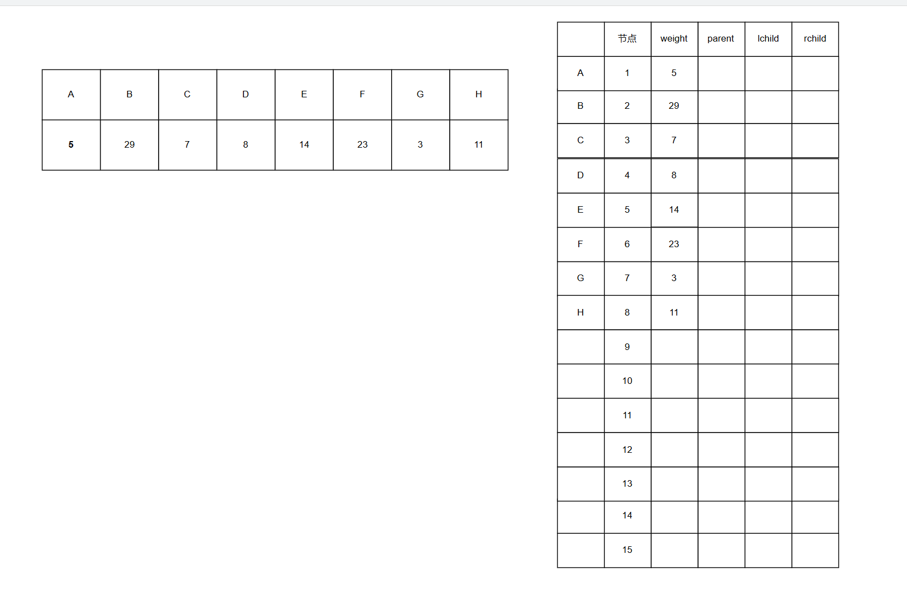

这里呢有一个我们要实现对上面这些节点的实现哈夫曼树的排序，对于哈夫曼树来说，我们要结合一个算法叫做贪心算法，那什么是贪心算法呢，简单来说就是这个人很贪，这里要找节点的权值，我们就直接找最小的，那么对于第一遍遍历的时候，我们先找最小值很显然是G，那么第二小的值是A，那么他们就组合在一起，如下图：
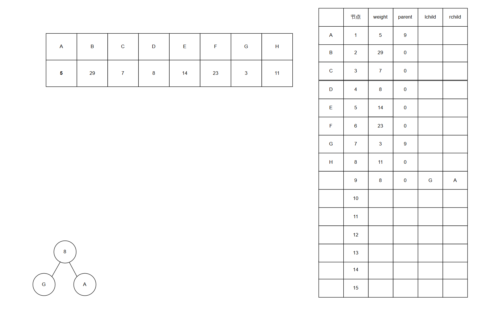

那么这时G和A组成的新的节点是不是对应放到9的位置，因为我们知道哈夫曼树有2n-1个节点，所以这时候我们更新G和A的父亲，他们对应的是9，接下来我们来找第二组，这时候C和D是不是最小的，那我们接着按照上面的操作，如下：

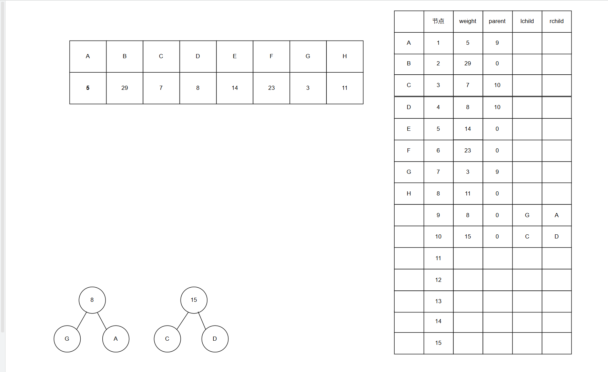

后续的操作跟上述一致我们这里不再赘述，接着往后：

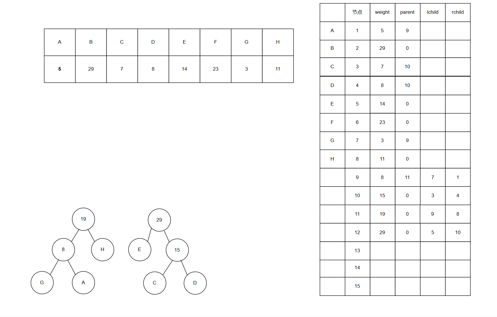

这里就快速过一下，接着来，我这直接给出最后的结果：

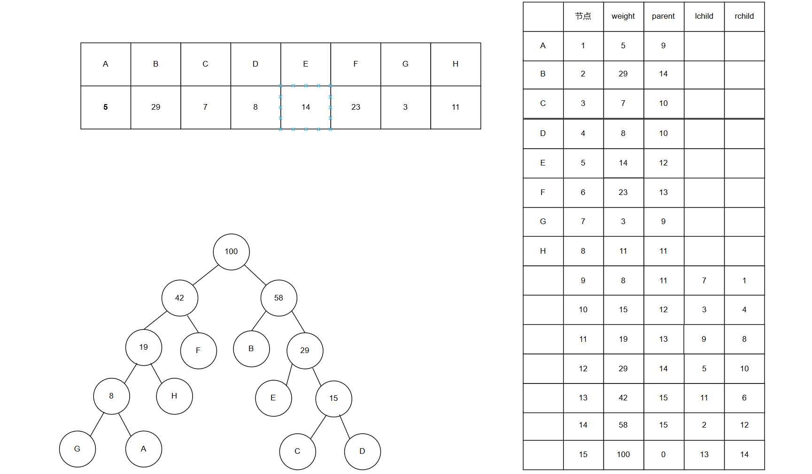

那么这就是哈夫曼树的构造逻辑，那对于编码来说，其实也很简单了，只要按照左0右1即可，例如，对于A来说就是1110，对于G来说就是1111，那么这就是哈夫曼树的构造逻辑

#### Huffuman树代码实现

```c
// 定义Huffman树的节点结构，采用顺序存储方式，下标索引来标识不同的节点
typedef struct {
	int weight;
	int parent;
	int lChild;
	int rChild;
} HuffmanNode, *HuffmanTree;
```

因为哈夫曼树我们能知道它的大小，所以这里我们选择顺序存储，我们按照上面右边那张表，来封装一个结构体，对应里面就是权值、父亲、左孩子、右孩子，*HuffmanTree指的是这个空间的首地址，node则是这个结构体

##### 创建Huffuman树

```c
static void selectNode(HuffmanTree tree, int n, int *s1, int *s2) {
	int mini = 0;
	// 找到第一个父节点为0的编号
	for (int i = 1; i <= n; ++i) {
		if (tree[i].parent == 0) {
			mini = i;
			break;
		}
	}
	for (int i = 1; i <= n; ++i) {
		if (tree[i].parent == 0) {
			if (tree[i].weight < tree[mini].weight) {
				mini = i;
			}
		}
	}
	*s1 = mini;
	// 开始找第二个最小权值的点
	for (int i = 1; i <= n; ++i) {
		if (tree[i].parent == 0 && i != *s1) {
			mini = i;
			break;
		}
	}
	for (int i = 1; i <= n; ++i) {
		if (tree[i].parent == 0 && i != *s1) {
			if (tree[i].weight < tree[mini].weight) {
				mini = i;
			}
		}
	}
	*s2 = mini;
}

HuffmanTree createHuffmanTree(const int* w, int n) {
	HuffmanTree tree;
	int m = 2*n - 1;
	// 1.1 申请2n个单元，从1号索引开始存储数据
	tree = malloc(sizeof(HuffmanNode) * (m + 1));
	if (tree == NULL) {
		return NULL;
	}
	// 初始化1 ~ 2n-1个节点
	for (int i = 1; i <= m; ++i) {
		tree[i].parent = tree[i].lChild = tree[i].rChild = 0;
		tree[i].weight = 0;
	}
	// 1.2 设置初始化权值
	for (int i = 1; i <= n; ++i) {
		tree[i].weight = w[i - 1];
	}
	// 填充 n+1下标到m下标的空间
	int s1, s2;
	for (int i = n + 1; i <= m; ++i) {
		// 在[1 ... i-1]范围内，父节点为0，权值最小的两个点
		selectNode(tree, i - 1, &s1, &s2);
		// 将这2个权值最小的节点，组合到第i个位置上（父节点）
		tree[s1].parent = tree[s2].parent = i;
		tree[i].lChild = s1;
		tree[i].rChild = s2;
		tree[i].weight = tree[s1].weight + tree[s2].weight;
	}
	return tree;
}
```

这段代码完整实现了哈夫曼树的构建过程，包含两个关键函数：`selectNode`用于在构建过程中筛选符合条件的节点，`createHuffmanTree`则基于输入的权值数组完成整棵树的创建。哈夫曼树是一种带权路径长度最短的二叉树，核心思想是通过反复合并权值最小的节点构建树结构，以下是具体实现细节。

**函数一：筛选最小权值节点（selectNode）**

**核心功能**

在哈夫曼树构建的某一阶段，从指定范围内筛选出**两个权值最小且尚未被合并**（即父节点标识为 0）的节点，这两个节点将作为新节点的左右子节点。

**详细实现步骤**

1. **查找第一个最小权值节点（s1）**
   - 首先进行第一轮遍历：从编号 1 开始到指定范围上限（n），逐个检查节点的父节点标识，找到第一个父节点为 0 的节点，将其编号暂存为当前最小值节点（mini）。这一步的目的是确定一个初始的比较基准。
   - 接着进行第二轮遍历：同样从 1 到 n 遍历节点，仅关注父节点为 0 的节点（未被合并的节点），将每个节点的权值与当前 mini 节点的权值比较。若某节点权值更小，则更新 mini 为该节点编号。遍历结束后，mini 即为第一个权值最小的节点编号，将其赋值给`s1`（通过指针传出）。
2. **查找第二个最小权值节点（s2）**
   - 首先进行第一轮遍历：从 1 到 n 遍历节点，筛选出 “父节点为 0 且编号不等于 s1” 的节点（排除已选中的第一个节点），找到第一个符合条件的节点，将其编号暂存为 mini 作为初始基准。
   - 接着进行第二轮遍历：同样从 1 到 n 遍历，仅关注 “父节点为 0 且编号不等于 s1” 的节点，将每个节点的权值与当前 mini 节点的权值比较。若某节点权值更小，则更新 mini 为该节点编号。遍历结束后，mini 即为第二个权值最小的节点编号，将其赋值给`s2`（通过指针传出）。

**设计细节**

- 两次筛选均采用 “先找初始基准，再全面比较” 的策略，确保能在无序的节点中准确找到最小权值节点。
- 通过父节点标识为 0 来判断节点是否已被合并，保证每次筛选的都是未参与过合并的节点。

**函数二：构建哈夫曼树（createHuffmanTree）**

**核心功能**

根据输入的权值数组（长度为 n），按照哈夫曼算法构建完整的哈夫曼树，返回树的根节点结构。

**详细实现步骤**

1. **计算节点总数与分配内存**
   - 哈夫曼树的节点总数公式为`2n-1`（n 个初始叶子节点 + n-1 个中间合并节点），因此先计算总节点数`m = 2n - 1`。
   - 为树分配内存空间，大小为`(m + 1)`个节点（从编号 1 开始存储，0 号位置闲置）。若内存分配失败（返回 NULL），则直接返回空值。
2. **初始化所有节点的基础属性**
   - 遍历编号 1 到 m 的所有节点，将每个节点的父节点、左子节点、右子节点均初始化为 0（表示无关联），权值初始化为 0。这一步是为了确保所有节点的初始状态一致。
   - 为初始叶子节点赋值：将输入权值数组`w`中的元素依次赋给编号 1 到 n 的节点（因数组下标从 0 开始，故`tree[i].weight = w[i-1]`），这些节点将作为树的初始叶子节点。
3. **逐步构建中间节点（合并过程）**
   - 从编号n+1开始到 m（共 n-1 个节点），依次构建每个中间节点：
     - 调用`selectNode`函数，在编号 1 到`i-1`的范围内（已存在的节点）筛选出两个权值最小且未合并的节点，得到它们的编号`s1`和`s2`。
     - 将`s1`和`s2`的父节点标识设为当前正在构建的节点`i`（表示这两个节点已被合并到`i`节点下）。
     - 设置当前节点`i`的左子节点为`s1`，右子节点为`s2`（固定左小右大的关联方式）。
     - 计算当前节点`i`的权值：为`s1`和`s2`的权值之和（体现合并后的总权值）。
   - 重复上述过程，直到所有中间节点（编号 n+1 到 m）均被构建完成。此时，编号为 m 的节点即为哈夫曼树的根节点。
4. **返回构建结果**
   - 当所有节点构建完成后，返回指向整棵树的指针。

##### Huffuman树编码

```c
HuffmanCode* createHuffmanCode(HuffmanTree tree, int n) {
	// 生成n个字符的编码表，每个表项里保存编码的空间首地址
	HuffmanCode *codes = malloc(sizeof(HuffmanCode) * n);
	if (codes == NULL) {
		return NULL;
	}
	memset(codes, 0, sizeof(HuffmanCode) * n);
	// 每求一个字符时，倒序构建，n个节点，树的高度最高是n，编码个数最多为n
	char *temp = malloc(sizeof(char) * n);
	int start;				// temp空间的起始位置
	int p;					// 存放当前节点的父节点信息
	int pos;				// 当前编码的位置
	// 逐个字符求Huffman编码
	for (int i = 1; i <= n; ++i) {
		start = n - 1;
		temp[start] = '\0';
		pos = i;
		p = tree[i].parent;
		while (p) {
			--start;
			temp[start] = (tree[p].lChild == pos) ? '0' : '1';
			pos = p;
			p = tree[p].parent;
		}
		// 第i个字符编码分配的空间
		codes[i - 1] = malloc(sizeof(HuffmanCode) * (n - start));
		strcpy(codes[i - 1], &temp[start]);
	}
	free(temp);
	return codes;
}

```

这段代码的功能是根据已经构建好的哈夫曼树，为树中的每个初始叶子节点（对应原始的 n 个字符）生成对应的哈夫曼编码，并将这些编码整理成一个编码表返回。哈夫曼编码是一种前缀编码，能实现数据的高效压缩，下面详细解释其实现过程。

**函数整体功能**

该函数接收一个已构建好的哈夫曼树和初始叶子节点的数量 n，最终返回一个包含 n 个哈夫曼编码的数组。每个编码对应哈夫曼树中的一个初始叶子节点，编码由 0 和 1 组成（通常 0 表示左分支，1 表示右分支）。

详细实现步骤

1. **初始化编码表和临时空间**

- **创建编码表数组**：首先为存储 n 个编码的数组分配内存。这个数组中的每个元素将保存一个字符的哈夫曼编码（以字符串形式存在）。如果内存分配失败，就返回空值。
- **清空编码表**：将编码表数组的所有内容初始化为 0，确保初始状态干净，避免残留的垃圾数据影响结果。
- **创建临时缓冲区**：分配一个长度为 n 的临时字符数组。因为哈夫曼树中 n 个叶子节点的最大编码长度不会超过 n（最坏情况下树呈链式结构），所以这个长度足够临时存储任何一个编码。

2. **逐个生成叶子节点的编码**

对每个初始叶子节点（编号从 1 到 n），依次执行以下操作生成其对应的哈夫曼编码：

**（1）初始化临时变量**

- `start`：标记临时缓冲区中当前编码的起始位置，初始设为临时缓冲区的最后一个位置（n-1），并在这个位置放入字符串结束符`\0`（确保最后生成的编码是有效的字符串）。
- `pos`：记录当前节点的位置，初始化为当前正在处理的叶子节点编号（i）。
- `p`：记录当前节点的父节点位置，初始化为当前叶子节点的父节点（从哈夫曼树中获取）。

**（2）回溯生成编码（核心步骤）**

通过循环从当前叶子节点向上回溯到根节点，逐步记录路径信息：

- 每次循环中，先将`start`减 1（向前移动一个位置，为新的编码字符腾出空间）。
- 判断当前节点（pos）是父节点（p）的左子节点还是右子节点：如果是左子节点，就在临时缓冲区的`start`位置存入字符`'0'`；如果是右子节点，就存入`'1'`。
- 更新`pos`为当前父节点的位置（p），更新`p`为这个父节点的父节点，继续向上回溯。
- 当`p`为 0 时（表示已经回溯到根节点，因为根节点没有父节点），循环结束。此时，临时缓冲区中从`start`位置到结尾的内容，就是当前叶子节点的哈夫曼编码（例如可能是`"010"`这样的字符串）。

**（3）保存编码到编码表**

- 为当前编码在编码表中分配内存：根据临时缓冲区中编码的长度（n - start），申请足够的空间。
- 将临时缓冲区中从`start`位置开始的编码字符串，复制到编码表对应的位置（因为初始叶子节点编号是 1 到 n，而编码表数组下标从 0 开始，所以存放在`codes[i-1]`中）。

3. **释放临时资源并返回结果**

- 所有叶子节点的编码生成完成后，释放之前创建的临时缓冲区（因为已经不需要了）。
- 返回构建好的编码表数组。

关键逻辑说明

- **编码生成方式**：哈夫曼编码是从叶子节点向根节点回溯生成的，因为路径方向是 “叶子→父→根”，但编码需要表示 “根→叶子” 的路径，所以采用临时缓冲区倒序存储的方式（先存的字符在编码的前面）。
- **0 和 1 的含义**：编码中的`'0'`和`'1'`分别对应从父节点到左子节点和右子节点的路径，这是哈夫曼编码的约定，确保不同字符的编码不会互相成为前缀（前缀编码特性）。
- **内存管理**：函数中为编码表和每个编码字符串都单独分配了内存，使用完成后需要手动释放，避免内存泄漏。

总结

这个函数通过 “回溯路径→记录编码→保存结果” 的流程，利用已构建的哈夫曼树为每个初始字符生成了唯一的哈夫曼编码。生成的编码表可以直接用于数据的编码（将字符转换为对应的 01 字符串），是哈夫曼压缩算法中的关键步骤。

##  时间复杂度

### **时间复杂度概述**

#### 时间复杂度的定义

时间复杂度是衡量算法执行时间随输入规模增长而变化的趋势的一种度量。它不直接表示算法的具体执行时间，而是描述算法运行时间与输入规模之间的关系。通常用大O符号（O）表示，称为**渐进时间复杂度**。

大O符号（Big O Notation）

大O符号是描述函数渐进行为的数学符号，用于表示算法时间复杂度的上界。其定义如下：

> 若存在正常数 C*C* 和 n0*n*0，使得对于所有 n≥n0*n*≥*n*0，有 T(n)≤C⋅f(n)*T*(*n*)≤*C*⋅*f*(*n*)，则称 T(n)=O(f(n))*T*(*n*)=*O*(*f*(*n*))。

#### 大O符号的特性：

1. **忽略常数项**：例如，O(2n)*O*(2*n*) 简化为 O(n)*O*(*n*)。

2. **忽略低阶项**：例如，O(n2+n)*O*(*n*2+*n*) 简化为 O(n2)*O*(*n*2)。

3. **描述最坏情况**：大O符号通常用于描述算法在最坏情况下的时间复杂度。

   **大O表示法的核心特性**

   | 特性         | 说明                       | 示例                                 |
   | ------------ | -------------------------- | ------------------------------------ |
   | 忽略常数项   | 常数系数不影响增长趋势     | O(2n)→O(n)*O*(2*n*)→*O*(*n*)         |
   | 忽略低阶项   | 只保留最高阶项             | O(n2+n)→O(n2)*O*(*n*2+*n*)→*O*(*n*2) |
   | 描述最坏情况 | 通常分析算法的最坏运行情况 | 查找算法最坏情况为 O(n)*O*(*n*)      |

#### 常见的时间复杂度

以下是常见的时间复杂度，按效率从高到低排列：

| 时间复杂度 | 名称         | 描述                                                         |
| ---------- | ------------ | ------------------------------------------------------------ |
| O(1)       | 常数时间     | 算法的执行时间不随输入规模变化。                             |
| O(log n)   | 对数时间     | 算法的执行时间随输入规模呈对数增长。                         |
| O(n)       | 线性时间     | 算法的执行时间与输入规模成正比。                             |
| O(n log n) | 线性对数时间 | 算法的执行时间介于线性时间和平方时间之间，常见于高效排序算法。 |
| O(n²)      | 平方时间     | 算法的执行时间与输入规模的平方成正比。                       |
| O(n³)      | 立方时间     | 算法的执行时间与输入规模的立方成正比。                       |
| O(2ⁿ)      | 指数时间     | 算法的执行时间随输入规模呈指数增长，通常不可用于大规模数据。 |
| O(n!)      | 阶乘时间     | 算法的执行时间随输入规模呈阶乘增长，效率极低。               |

#### 时间复杂度的意义

1. **评估算法效率**：通过时间复杂度可以直观地比较不同算法的效率。
2. **预测算法性能**：对于大规模数据，时间复杂度可以帮助预测算法的运行时间。
3. **指导算法选择**：在实际应用中，可以根据数据规模选择合适时间复杂度的算法。

#### 时间复杂度的计算规则

1. **顺序执行**：多个操作按顺序执行，总时间复杂度为各操作时间复杂度的最大值。
2. **条件判断**：条件语句的时间复杂度取各分支中的最大值。
3. **循环结构**：循环的时间复杂度为循环体的时间复杂度乘以循环次数。
4. **嵌套循环**：嵌套循环的时间复杂度为各层循环次数的乘积。

#### 时间复杂度与问题类型

1. **P问题**：可以在多项式时间内解决的问题，例如 O(nk)*O*(*n**k*)。
2. **NP问题**：可以在多项式时间内验证解的正确性，但尚未找到多项式时间解法的问题。

#### 总结

时间复杂度是算法分析的核心概念之一，它帮助我们理解算法随输入规模增长时的性能变化。通过大O符号，我们可以忽略具体实现的细节，专注于算法的渐进行为。在实际应用中，合理选择时间复杂度较低的算法，可以有效提升程序的运行效率。

### 时间复杂度的解题方法

#### 一重循环

**基本思路：循环次数和数据规模之间的关系**

1. 找到**终止条件**
2. 找**循环次数**和**循环终止变量**之间的关系
3. 等式联立，推到关系

那具体什么意思呢，我们来看下面的题目：

##### 例题1

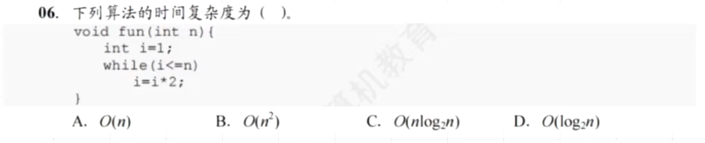

那么我们来按照上面的思路来做题，首先先找终止条件，对于这道题，终止条件是不是就是 **i>n**,好接下来我们来找循环次数和循环终止变量之间的关系，如果无法直观看出，可以看下面的表格：

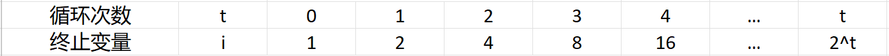

我们这里设循环次数为t，终止变量我们知道是i，那么由我们上面列出来的表格不难看出，它们之间的关系，也就是下面：

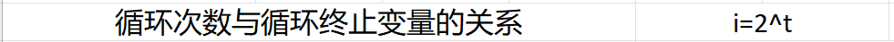

那最后一步就是寻找**循环次数和数据规模之间的关系**

那我们上面知道终止的时候是 i>n,那么同理我们可以得到 2^t>n,由此可以解开 t>log2n;

如下：

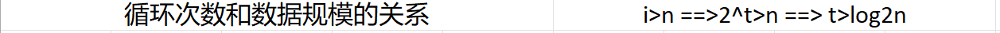

那这就是我们要求的时间复杂度，也就是这道题选C

##### 例题2

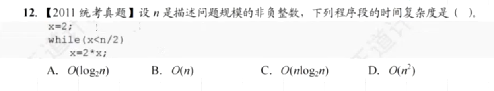

还是跟上面一样先看终止条件 **x>n/2**

接下来列出表格，找循环次数和终止变量之间的关系

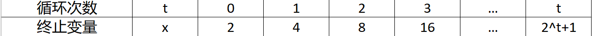

那很明显 **x=2^t+1**

最后联立求解得：

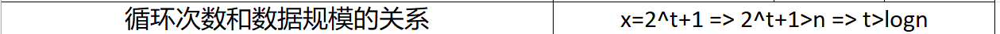

那很明显这道题选 **A**

#### 二重循环

**基本思路：循环次数和数据规模之间的关系**

1. 找到**外层循环**的次数
2. 找到**内层循环**的次数，构造**二维矩阵**
3. 二维矩阵的**节点数量**就是**循环次数**
4. 等式联立，推导关系

具体什么意思我们用题目来看

##### 例题一

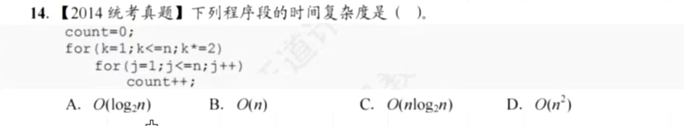

我们先来看按照上面的思路，先看外层循环，外层循环我们按照一重循环的思路，先找外层循环的循环次数之间的关系
那很显然，外层循环终止条件是 **k>n**,我们还是列一下表格：

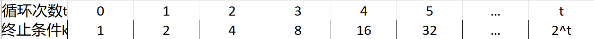

那这样我们就能够推到 **2^t>n => t>log2n**

那这样我们就知道了大概有log2n列，这时候我们再来看内层循环，来确定矩阵的行

那很显然内层循环每一次循环的时候都是n次，所以对应有n行，那矩阵我们就确定了如下：

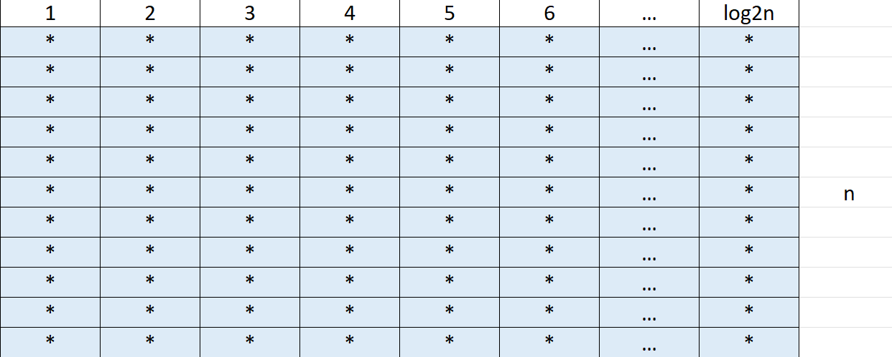

那这个对应的时间复杂度，就是矩阵的行列乘积，也就是nlog2n

##### 例题二

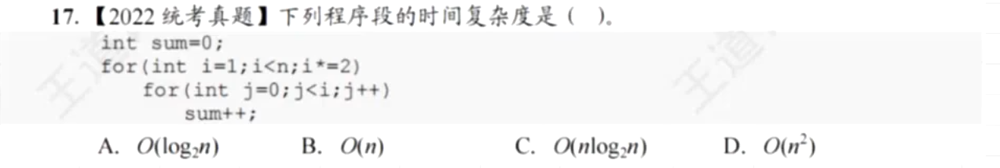

继续看这道题，外层循环跟上道题一样，所以我们能推到上面那个关系为log2n

接下来是内层循环，我们来看下面这个图：

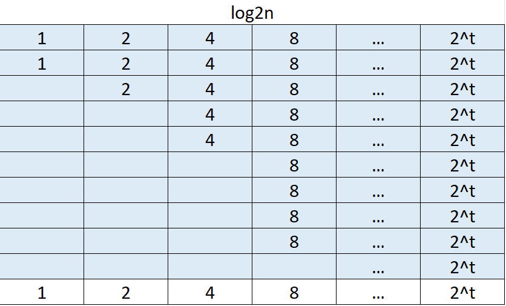

这里对于内层循环次数来说，或者说总共循环次数，最下面是不是一个等比数列相加求和也就是1+2+4+8+...+2^t

最后求出来为2^t-1，那这里的t是什么呢，就是我们上面求得log2n，我们带入式子可以得到最后结果为n

## 图状结构

### 图的相关概念

#### 图的核心构成

图是为解决 “多对多” 复杂关系而生的数据结构，弥补了线性表（一对一）和树形结构（一对多）的局限，其核心构成可从定义和现实意义两方面理解：

- **形式化定义**：图用\(G=(V, E)\)表示，由顶点集合\(V\)和边集合\(E\)组成。

- 顶点集合\(V\)：是有限且非空的集合，里面的元素叫 “顶点” 或 “点”，比如\(V=\{v_1, v_2, v_3\}\)。用\(|V|\)表示顶点的总数，比如这个例子里\(|V|=3\)。

- 边集合\(E\)：是由\(V\)中顶点配对组成的有限集合，元素叫 “边”（有向图里叫 “弧”）。同一对顶点可重复出现在\(E\)中（需标注 “边的重数”），用\(|E|\)表示边的总数。

- **几何与现实意义**：画图时，顶点用黑点表示，边用连接顶点的线表示。现实中，顶点代表具体事物（如社交网络的用户），边代表事物间的联系（如用户间的好友关系），简单说就是 “用点代表事物，用线代表联系”。

#### 图的分类

根据不同特征，图可分为多种类型，常见分类如下：

##### 按边的特性分类

- **简单图**：同时满足两个条件：一是没有 “自环边”（即顶点自己连自己的边，比如\((v_3, v_3)\)）；二是没有重复边（同一对顶点之间只有一条边）。

- **无向图**：边的两个顶点没有顺序，比如边\((v_1, v_2)\)和\((v_2, v_1)\)是同一条，只表示 “两点有联系”，不区分方向，就像朋友关系没有先后。

- **有向图**：边的两个顶点有顺序，用尖括号表示，比如\(<v_1, v_2>\)，其中\(v_1\)是起点（弧尾），\(v_2\)是终点（弧头），表示 “从起点到终点的定向联系”，比如社交网络的 “关注” 关系。注意：一个图要么是无向图，要么是有向图，没有混合情况。

- **混合图**：同时有有向边和无向边，属于特殊自研概念，实际用得很少，了解即可。

##### 按顶点连接密度分类

- **完全图**：任意两个不同顶点之间都有边，分为两种：

- 完全无向图：\(n\)个顶点有\(\frac{n(n-1)}{2}\)条边，比如 3 个顶点有 3 条边（每两个顶点间一条）。

- 完全有向图：\(n\)个顶点有\(n(n-1)\)条边，比如 3 个顶点有 6 条边（每对顶点间有两个方向的边）。

- **稠密图与稀疏图**：按边数和顶点数的关系划分，通常认为边数\(|E| < n\log n\)（\(n\)是顶点数）的是稀疏图，比如路网中 “城市（顶点）” 和 “道路（边）”，边数远少于完全图；反之是稠密图，比如亲密好友圈里的连接，几乎人人互相认识。

####  与顶点、边相关的基础概念

这些概念是理解图的核心，需结合实例区分：

##### 端点和邻接点

- 无向图：若有边\((i, j)\)，则\(i\)和\(j\)是这条边的端点，且互为邻接点（直接相连的顶点）。

- 有向图：若有边\(<i, j>\)，则\(i\)和\(j\)是端点，仍互为邻接点，但\(i\)是起点，\(j\)是终点。

##### 顶点的度、入度和出度

度是顶点连接边的数量，有向图和无向图计算不同：

- 无向图：顶点的度就是它连接的边数，比如一个顶点连了 3 条边，度就是 3。

- 有向图：度分为入度和出度：

- 入度：指向该顶点的边数（以该顶点为终点的边）。

- 出度：从该顶点出发的边数（以该顶点为起点的边）。

- 总度 = 入度 + 出度，比如一个顶点有 2 条入边、3 条出边，总度就是 5。

- 核心性质：任何图中，所有顶点的度之和等于\(2×|E|\)（因为每条边都给两个顶点各加 1 个度）。

##### 权与网

边附带的数值叫 “权”，可以表示距离、成本、时间等实际意义，比如路网中，边的权就是两个城市间的距离。带有权的图叫 “带权图”，也叫 “网”。

####  与路径、回路相关的概念

路径和回路是描述顶点间 “可达性” 的关键：

##### 路径与路径长度

- 路径：从顶点\(i\)到顶点\(j\)的顶点序列，比如\(i→i_1→i_2→j\)。无向图中，序列里相邻顶点的边要在\(E\)中；有向图中，相邻顶点的有向边要在\(E\)中。

- 路径长度：路径中经过的边的数量，比如\(v_1→v_2→v_3\)的长度是 2（经过 2 条边）。

- 简单路径：除了起点和终点可以相同，其余顶点都不重复的路径，比如\(v_1→v_2→v_3\)是简单路径，而\(v_1→v_2→v_1→v_3\)不是（\(v_1\)重复了）。

##### 回路（环）

起点和终点是同一个顶点的路径，主要分三种：

- 简单回路：起点 = 终点，且其余顶点不重复，比如\(v_1→v_2→v_3→v_1\)。

- 欧拉环路：经过图中所有边一次且仅一次的回路，长度等于边数，比如路径\(C→A→B→A→D→C→D→B→C\)（每条边都走了一次）。

- 哈密尔顿环路：经过图中所有顶点一次且仅一次的回路，长度等于顶点数，比如路径\(C→A→D→B→C\)（每个顶点都走了一次）。

#### 与连通性相关的概念

连通性描述顶点间是否能 “到达”，无向图和有向图的定义不同：

##### 无向图的连通性

- 连通：从顶点\(i\)到顶点\(j\)有路径，就说两者连通。

- 连通图：任意两个顶点都连通的图，比如 3 个顶点用 2 条边连起来，任意两点都能到。

- 非连通图：存在至少一对顶点不连通的图，比如两个独立的三角形，分属不同三角形的顶点无法到达。

- 连通分量：图中的 “极大连通子图”（不能再添加其他顶点仍保持连通的子图）。连通图只有 1 个连通分量（它自己）；非连通图有多个，比如两个独立三角形有 2 个连通分量。

- 极小连通子图：只有连通图有这个概念，指包含所有顶点且边数最少的连通子图，边数 = 顶点数 - 1。比如 4 个顶点的四边形，去掉 1 条边后变成 3 条边，就是极小连通子图（再去掉 1 条就不连通了）。

##### 有向图的连通性

- 强连通：从顶点\(i\)到\(j\)、从\(j\)到\(i\)都有路径，才叫强连通。

- 强连通图：任意两个顶点都强连通的图，比如 3 个顶点构成的有向环\(v_1→v_2→v_3→v_1\)，任意两点互达。

- 强连通分量：有向图中的极大强连通子图。强连通图只有 1 个分量（自己）；非强连通图有多个，比如\(v_1→v_2→v_3\)且\(v_2→v_1\)，则\(\{v_1, v_2\}\)是一个分量，\(\{v_3\}\)是另一个。

#### 子图与生成树

- 子图：设图\(G=(V, E)\)和\(G'=(V', E')\)，如果\(V'\)是\(V\)的子集，且\(E'\)是\(E\)的子集，那么\(G'\)就是\(G\)的子图。比如\(G\)有 4 个顶点、5 条边，取其中 3 个顶点、2 条边组成的图就是子图。

- 连通图的生成树：属于极小连通子图，必须满足两个条件：一是包含图中所有\(n\)个顶点；二是只有\(n-1\)条边。比如 4 个顶点的连通图，生成树就是 4 个顶点加 3 条边，去掉任意一条边都会不连通。

#### 图的存储结构

图的存储要体现顶点和边的关联，核心是处理 “多对多” 关系，常见结构如下：

##### 邻接矩阵

用 “一维数组存顶点、二维数组存边”，适合稠密图：

- 核心构成：一维顶点数组存所有顶点信息（比如\(vertex[4] = \{v_0, v_1, v_2, v_3\}\)）；二维邻接矩阵\(arc[n][n]\)（\(n=|V|\)）存边的关系。

- 不同图的实现：

- 无向图：有边则\(arc[i][j]=1\)，无边则\(arc[i][j]=0\)，矩阵是对称的（因为边无方向）。顶点的度就是该行（或列）的元素和。

- 有向图：有向边\(<i,j>\)则\(arc[i][j]=1\)，无边则 0，矩阵不对称。顶点出度是该行和，入度是该列和。

- 带权图（网）：有边则存权值，无边则存一个极大的数（代表无穷大），无向网矩阵对称，有向网不对称。

- 优缺点：查询两点是否有边、计算度的效率高，但稀疏图会浪费空间（大部分位置是 0 或无穷大）。

##### 邻接表

用 “一维数组存顶点、单链表存邻接点”，结合数组和链表优势，适合稀疏图：

- 核心构成：一维顶点数组，每个元素含 “顶点数据” 和 “邻接点链表头指针”；每个顶点的邻接点用单链表存，链表节点含 “邻接点的数组下标”（带权图还要存权值）。

- 不同图的实现：

- 无向图：每条边在两个顶点的链表中各存一次，比如边\((v_0, v_1)\)，\(v_0\)的链表存\(1\)，\(v_1\)的链表存\(0\)，顶点的度就是链表长度。

- 有向图：分正向和逆邻接表。正向表存从顶点出发的边（求出入度），逆邻接表存指向顶点的边（求出度）。

- 优缺点：空间利用率高，但查询两点是否有边需遍历链表，效率较低。

##### 十字链表

整合邻接表和逆邻接表，专为有向图设计，方便查入度和出度：

- 核心构成：顶点数组每个元素含 “数据、指向弧头的边的指针（firstIn）、指向弧尾的边的指针（firstOut）”；边节点含 “弧尾下标、弧头下标、指向同弧头的边的指针（headLink）、指向同弧尾的边的指针（tailLink）”。

- 实现方式：查以\(v_i\)为弧尾的边，从 firstOut 沿 tailLink 遍历；查以\(v_i\)为弧头的边，从 firstIn 沿 headLink 遍历。

- 优缺点：兼顾两种表的功能，效率高，但结构复杂，无向图不用。

##### 邻接多重表

为无向图设计，解决邻接表边操作不便的问题：

- 核心构成：顶点数组和邻接表类似；边节点含 “两个顶点的下标（iVex、jVex）、指向两顶点其他边的指针（iLink、jLink）、可选的访问标记”。

- 实现方式：一条边只存一个节点，通过 iLink 和 jLink 关联两个顶点的其他边，删除或标记边时只需改一个节点。

- 优缺点：边操作高效，但结构比邻接表复杂。

##### 边集数组

用两个一维数组存顶点和边，适合关注边本身的场景（如 Kruskal 算法）：

- 核心构成：顶点数组存顶点数据；边数组每个元素含 “起点下标、终点下标、权值（可选）”，无向图中起点和终点无顺序。

- 优缺点：存储简单，便于按边遍历或排序，但查顶点邻接点需遍历整个边数组，效率低。

#### 图的遍历

遍历是从指定顶点出发，按规则访问所有顶点且不重复，核心是处理环路，主要有两种方式：

#####  深度优先搜索（DFS）

类似 “走迷宫优先走到底，不通再回头”，核心是递归和回溯：

- 核心步骤：

1. 选起始顶点\(v\)，标记为 “已访问”。

1. 从\(v\)的未访问邻接点中选一个\(u\)，标记后递归遍历\(u\)。

1. 若\(v\)的邻接点都已访问，回溯到上一个顶点，重复步骤 2，直到所有顶点访问完。

- 实例说明：无向图\(V=\{v_0, v_1, v_2, v_3\}\)，\(E=\{(v_0,v_1), (v_0,v_2), (v_1,v_3)\}\)，从\(v_0\)出发：

- 标记\(v_0\)，选\(v_1\)标记，递归到\(v_1\)；选\(v_3\)标记，递归到\(v_3\)。

- \(v_3\)无未访问邻接点，回溯到\(v_1\)；\(v_1\)无未访问邻接点，回溯到\(v_0\)。

- 选\(v_2\)标记，遍历结束，顺序可能是\(v_0→v_1→v_3→v_2\)（邻接点选择不同会变）。

- 关键要点：用 “访问标记数组” 避免重复，邻接矩阵存储时效率为\(O(n^2)\)，邻接表为\(O(n+|E|)\)。

##### 广度优先搜索（BFS）

类似 “水波扩散，逐层访问”，核心是队列：

- 核心步骤：

1. 选起始顶点\(v\)，标记后加入队列。

1. 若队列非空，取出队首顶点\(u\)，遍历其未访问邻接点，标记后加入队列。

1. 重复步骤 2，直到队列为空。

- 实例说明：同上无向图，从\(v_0\)出发：

- 标记\(v_0\)入队，队列：\([v_0]\)。

- 取出\(v_0\)，标记\(v_1、v_2\)入队，队列：\([v_1, v_2]\)。

- 取出\(v_1\)，标记\(v_3\)入队，队列：\([v_2, v_3]\)。

- 取出\(v_2\)（无新顶点），取出\(v_3\)（无新顶点），队列空，顺序：\(v_0→v_1→v_2→v_3\)（较固定）。

- 关键要点：需队列和标记数组，效率和 DFS 相同，可求无权图最短路径（层数即路径长度）。

##### 遍历的注意事项

- 非连通 / 非强连通图：单个起点无法访问所有顶点，需遍历未访问顶点，逐个作为起点重复遍历。

- 有向图特殊性：边有方向，可能存在顶点不可达，需按非强连通图处理。

- 标记数组重置：每次遍历前要把标记数组设为 “未访问”，避免干扰下次遍历。

### 邻接矩阵

#### 邻接矩阵概述回顾

上面呢我们已经讲述了邻接矩阵的基本概念，但还是有些抽象，我们来看下面的图：

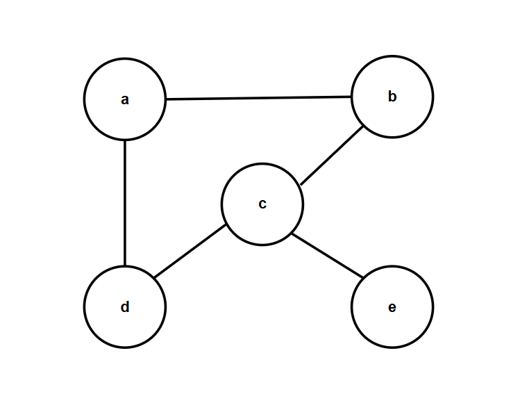

下面这个很明显是一个无向图，那么如果按照我们上面说的邻接矩阵的概念，我们用一维数组存顶点，二维数组存放边，我们先看一下顶点是怎么放的，如下图：

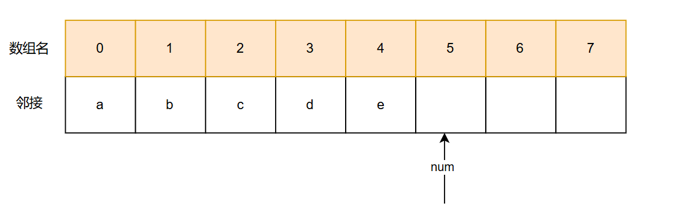

我们来讲一下这个图，对于顶点集合来说是一维数组，上面橙色颜色标注的区域是用来辅助理解的，实际存储结构和代码里面不会有，对于邻接矩阵来说，我们一般会额外增加几个空间，以防图的扩容之类的，这里的num是一个索引或者理解为指针，用来告诉我们实际这个数组存储了多少的顶点，这样可以在遍历的时候不需要进行遍历到底，那么我们再看一下边的结构怎么表示的，如下：

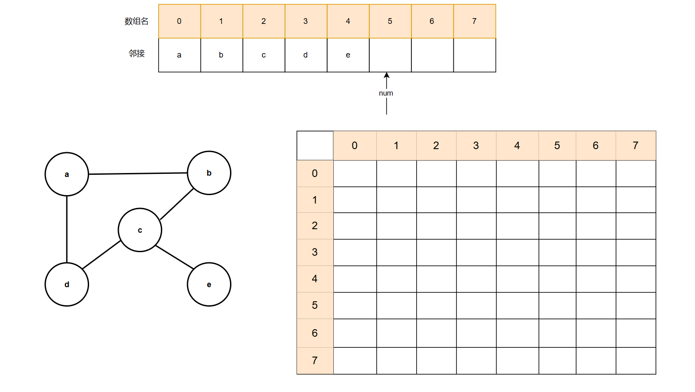

还是跟上述的一样，橘黄色的部分是用来辅助我们理解的，实际存储空间并不存在。

那么我们来看一下怎么表示边，一般这里呢，我们使用0和1来表示有没有边的存在，0代表没有边，1代表有边，那这里我们看结合上面的顶点数组，我们看a到b是有一条边的，也就是说[0,1]所在的数组位置是不是填1，因为我们这里没有方向也没有自环。所以[0,0]这种位置都是0，按照这个原则，我们可以填充右边的边数组的表格，也就如下：

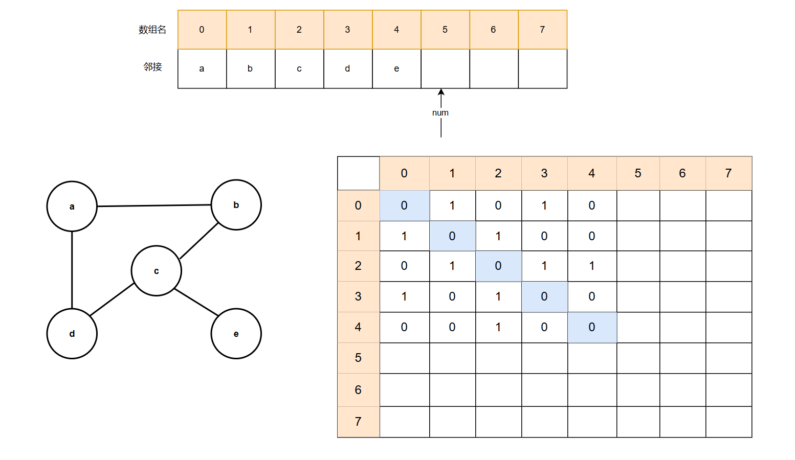

（这里呢我们填充的原则是，两个顶点直接的直接连接，就是中间没有别的顶点，例如b到d没有直接的路径，虽然可以通过c到达d，但是这里我们不算做）

那么填充完上面的图，你会发现，对于无向图来说，邻接矩阵里面的内容是跟中间那条蓝色的部分两边刚好对称，我们可以理解为左边和上边，就比如[1,0]意思就是1到0（b到a）有没有路径，很显然有，反过来对于无向图来说，那么0到1（a到b）也是有路径的，所以两边是对称的

那么这就是邻接矩阵一个概述，我们接下来看代码实现

#### 邻接矩阵代码实现

```c
#define MaxNodeNum	20
#define INF			1E4

// 邻接矩阵的顶点结构，表示一个顶点信息
typedef struct {
	int no;				// 顶点编号
	char *show;			// 显示行为
} MatrixVertex;

typedef int MatrixEdge;
// 图的邻接矩阵表示法
typedef struct {
	MatrixVertex vex[MaxNodeNum];				// 存储顶点信息，使用一维数组存储顶点
	int nodeNum;								// 约束实际的顶点数量
	MatrixEdge edges[MaxNodeNum][MaxNodeNum];	// 存储边的结构，矩阵
	int edgeNum;								// 边的数量
	int directed;								// 是否有向
}MGraph;
```

我们先来做一下准备工作，对于邻接矩阵来说，我们说了有一个存储顶点的数组或者顶点集合，还有一个专门存储边的集合，我们先看顶点集合，也就是顶点编号，如果不理解看下图：


因为我们说了是按照一维数组存储的，所以这里我们存储顶点编号，当然char *show指的是里面存储的内容，因为图有很多每个顶点的名字不同所以用一个char *show来存储，当然这个可有可无

接着就是图的邻接矩阵表示法，那这里面有什么呢：

- 首先我们定义一个宏来限制最大的数量，也就是二维数组的最大容量
- 利用上面封装的顶点结构体，定义一个一维数组，也就是顶点集合，大小则是我们定义宏的大小
- nodenum也就是我们上面说的num用来规范实际的大小
- 这里我们定义一个额外的类型就是指边，那么我们按照上面说的边的集合是二维数组，所以存储边的结构
- edgenum指的是边的实际数量，跟nodenum一个原理
- directed是表示是否有向，因为邻接矩阵可以表示无向图和有向图都可以的

那么这就是我们的前置条件

##### 初始化邻接矩阵

```c
void initMGraph(MGraph* graph, char* names[], int num, int directed, int edgeValue) {
	graph->directed = directed;
	graph->nodeNum = num;
	graph->edgeNum = 0;

	memset(graph->vex, 0, sizeof(graph->vex));
	memset(graph->edges, 0, sizeof(MatrixEdge) * MaxNodeNum * MaxNodeNum);
	for (int i = 0; i < num; ++i) {
		graph->vex[i].no = i;
		graph->vex[i].show = names[i];
		for (int j = 0; j < num; ++j) {
			graph->edges[i][j] = edgeValue;
		}
	}
}
```

我们先看传入的参数：

1. 传入你创建的图
2. 传入的顶点名称数组，也就是对应顶点集合里的char*show
3. 传入顶点的数量
4. 这个图是否有方向，传入方向
5. edgevalue指的是在二维数组里面到底显示什么，比如显示0还是显示1（就是如何表示这两个顶点之间有边），并不是边的权

接下来我们来看代码内容：

- 初始化部分按照我们上面封装的结构体对应传入参数，方向对应方向，顶点数量等于传入数量，初始化边的数量为0
- 初始化两个顶点空间为0，利用string.h里面的memset，这里初始化的就是顶点集合和边的集合，两个初始化内存为0
- 第一个for循环，将顶点的编号传入，同时也将顶点里面的内容和names对应上
- 第二个for循环，将边传入，用我们的edgevalue来显示

##### 邻接矩阵添加边

```c
static int isEdge(int weight) {
	if (weight > 0 && weight < INF) {
		return 1;
	}
	return 0;
}

void addMGraphEdge(MGraph* graph, int x, int y, int w) {
	if (x < 0 || x > graph->nodeNum) {
		return;
	}
	if (y < 0 || y > graph->nodeNum) {
		return;
	}
	if (!isEdge(graph->edges[x][y])) {
		graph->edges[x][y] = w;
		if (graph->directed == 0) {
			graph->edges[y][x] = w;
		}
		graph->edgeNum++;
	}
}
```

代码内容如下：

- 首先辅助函数isEdge是用来判断，两个顶点之间是否有边，我们这里传入的是weight也就是值，如果weight>0且weight<无穷大，就说明有边存在，反之则不存在
- 判断x和y也就是顶点的有效性，如果小于0或者大于了实际数量，直接return返回
- 接下来就是判断是否存在边引入上面的辅助函数，如果没有边，那么我们就创造边，w也就是传入的表示方法
- 接着判断directed是否为0，如果为0则说明无向，根据我们说的无向图是对称的，所以x到y有边，那么y到x也有边
- 最后增加边的数量

##### 邻接矩阵访问节点

```c
void visitMGraphNode(MatrixVertex* node) {
	printf("\t%s", node->show);
}
```

这段代码内容简单，直接查看show即可

##### 邻接矩阵的深度搜索遍历(DFS)

再看代码之前，我们先看一下逻辑上是怎么实现的，看下图：

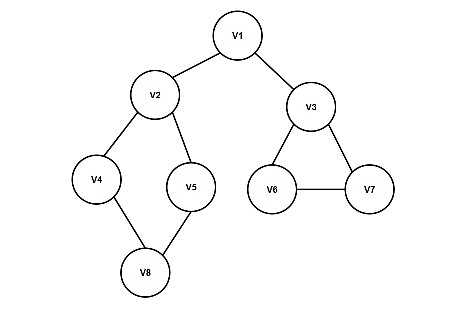

现在我要对上面这个图进行深度搜索，我们知道在树里面，深度搜索是一路走到头，然后通过递归的方式返回，但是图里面有一个问题，比如看上面我V1往左边走，走到V2的时候，出现了个问题，V2可以往V1、V4、V5走，但是V1已经被看过了，那我还能往V1走吗，所以这时候我们就得引入一个辅助数组visited，意思就是已访问数组，这样在我们深搜的时候就可以避免查看已经看过的节点，因为图并非树，树的方向是很明确的，所以不会出现问题，那么对于上图的深度搜索结果就是

V1->V2->V4->V8->V5->V3->V6->V7

那具体的实现我们来看下面的代码

```c
static int MGraphVisited[MaxNodeNum];
void initVisited() {
	memset(MGraphVisited, 0, sizeof(MGraphVisited));
}

void DFS_MGraph(MGraph* graph, int v) {
	visitMGraphNode(&graph->vex[v]);
	MGraphVisited[v] = 1;
	for (int i = 0; i < graph->nodeNum; ++i) {
		if (isEdge(graph->edges[v][i]) && MGraphVisited[i] == 0) {
			DFS_MGraph(graph, i);
		}
	}
}
```

代码内容如下：

- 首先按照上面说的，我们需要定义一个辅助数组visited用来记录我们是否访问了一个结点，我们初始化它为0
- 首先第一遍DFS时候我们传入我们一开始的顶点V，这时候我们先看它里面的内容，然后我们将对应的辅助数组设置为1
- 接下来开始循环，一直循环到实际顶点数量大小的前面，这时候我们先判断是否有边，如果有边我们才能访问，同时要满足这个顶点没有被访问，我们才执行DFS，也就是一直往后走，直到所有的都被访问完了，就结束了

这就是邻接矩阵的深度搜索

##### 邻接矩阵的广度搜索遍历(BFS)

还是先看下面的图：


那么按照我们之前讲树的广度搜索的时候，需要引入队列来帮我们辅助处理任务，因为广度搜索不具有记忆功能，那么如下：

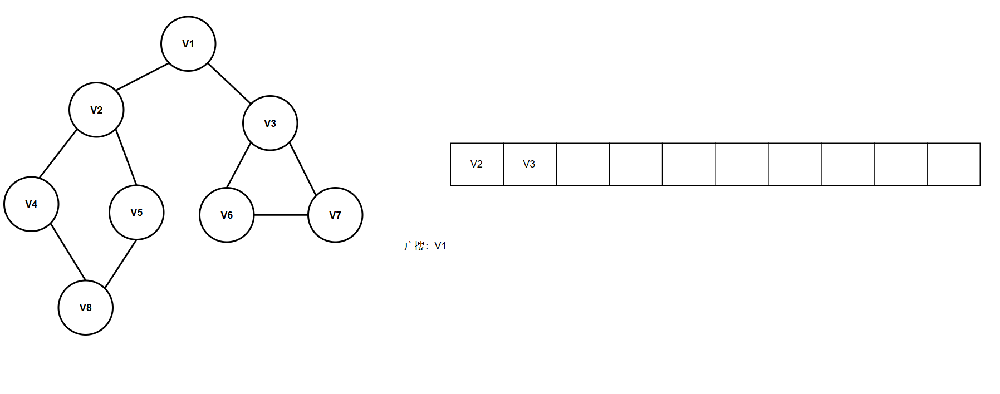

那么我们访问V1的时候，我们将V2和V3放入队列里面，作为后面处理任务，但是我们访问到V2的时候，这时候难道还要将V1放入队列吗，很显然不需要还是按照上面的思路，引入一个辅助数组vistied，用来帮我们记录已经访问的顶点，所以最终访问顺序也就是：

V1>V2>V3>V4>V5>V6>V7>V8

那么接下来来看代码具体的实现：

```c
static int MGraphVisited[MaxNodeNum];
void initVisited() {
	memset(MGraphVisited, 0, sizeof(MGraphVisited));
}

void BFS_MGraph(MGraph *graph, int v) {
	int que[MaxNodeNum];
	int rear = 0, front = 0; int cur;

	rear = (rear + 1) % MaxNodeNum;
	que[rear] = v;
	MGraphVisited[v] = 1;
	while (front != rear) {
		front = (front + 1) % MaxNodeNum;
		cur = que[front];

		visitMGraphNode(&graph->vex[cur]);
		for (int i = 0; i < graph->nodeNum; ++i) {
			if (isEdge(graph->edges[cur][i]) && !MGraphVisited[i]) {
				rear = (rear + 1) % MaxNodeNum;
				que[rear] = i;
				MGraphVisited[i] = 1;
			}
		}
	}
}
```

代码内容如下：

- 首先我们得定义一个队列，要有队列的大小，队头、队尾，curr是用来辅助我们取出我们要执行的任务的
- 我们一开始先传入我们开始的顶点v，放入队列里面
- 然后当队头不等于队尾的时候一直循环，队头往后走，取出队头里面的元素，也就是访问
- for循环里面的内容是，判断curr这个编号和i之间有没有边，且同时没有被访问
- 这时候队尾往后走，将i这个编号插入到队尾里面，也就是上面访问了V1然后看V1的左右两边有没有任务，有的话放入队列里面，同时将它们标记为已经访问

这就是广度搜索

#### 邻接矩阵总结

##### 核心优缺点

1. **优点**

- 查询高效：检查两顶点间是否存在边的时间复杂度为 O (1)，仅需直接访问二维数组对应元素。

- 实现直观：结构简单易懂，无向图的邻接矩阵呈对称特性，有权图可直接用元素值存储边权重。

- 支持矩阵运算：便于开展路径计算（如 Floyd 算法）、连通性分析等图论操作，适配多种算法场景。

1. **缺点**

- 空间开销大：需占用 V×V（V 为顶点数）的存储单元，空间复杂度达 O (V²)，稀疏图中大量零值元素造成严重浪费。

- 遍历低效：查找某顶点的所有邻接点需遍历整行 / 列，时间复杂度为 O (V)，远超邻接表的 O (k)（k 为顶点度数）。

- 扩展性差：增减顶点需重新分配矩阵空间，操作繁琐且易导致数据迁移。

##### 适用条件

- 图结构固定：顶点数量长期稳定，无频繁增减需求。

- 操作需求明确：以边的存在性查询、矩阵运算为核心操作，如 AI 路径规划中的邻接关系判断。

- 资源允许：内存空间充足，可容纳 V² 规模的存储开销，尤其适合顶点数量不大的场景。

##### 适配与不适配图类型

1. **适合的图类型**

- 稠密图：边数接近 V (V-1)/2（无向图）或 V (V-1)（有向图），如通信网络拓扑图，空间浪费少且查询优势显著。

- 有权图：边权重可直接存储于矩阵元素中，无需额外数据结构，如交通路网的距离权重表示。

- 简单图：无平行边和自环，矩阵元素 0/1（或权重值）可清晰表达连接关系。

1. **不适合的图类型**

- 稀疏图：边数远小于 V²，如社交网络用户关系图，存储空间利用率极低（常低于 10%），邻接表更优。

- 动态图：需频繁添加 / 删除顶点或边，如实时更新的物流配送网络，矩阵结构难以适配动态变化。

- 超大规模顶点图：顶点数达数万以上时，V² 存储量会突破内存限制，如互联网节点连接图。

### 邻接表

#### 邻接表概述回顾

在写代码之前我们还是来先回顾一下，看下图：

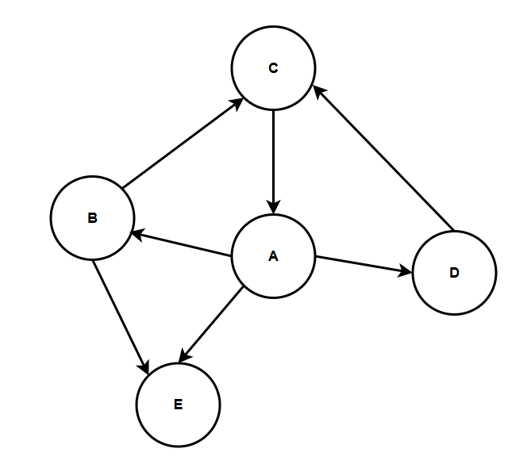

这是一幅有向图，对于这幅图，它是一个有向图，那么我们该如何用邻接表，去描述这个图呢，我们先来回顾一下概念，邻接表全名是邻接链表，是用链表的形式串联的，用一维数组和单链表存储图，那么这个数组里面包含元素的数据，同时还有一个指针包含在里面，当热我们这里写的邻接表是针对图的每个顶点的出度，那具体是什么样子的呢，我们看下图：

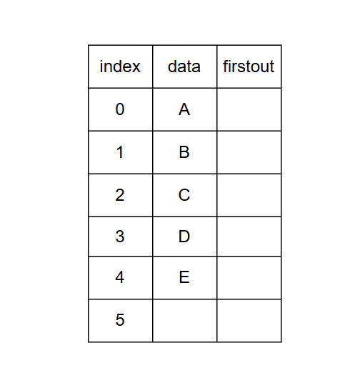

我们上面说了用一维数组来存储，这个数组里面包含数据域和指针域，这个指针就是指向这个顶点到别的顶点的方向，我们看上图，比如A到D、B、E是不是都有路径，那么他就变成了下面这样表示

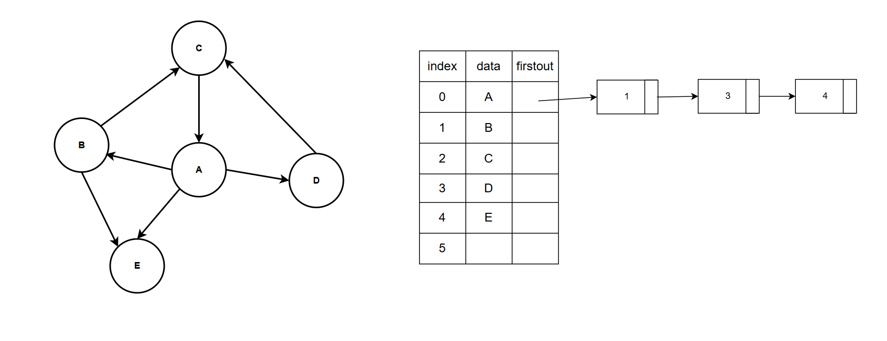

那么以此类推整个有向图就可以按照下面的表示：

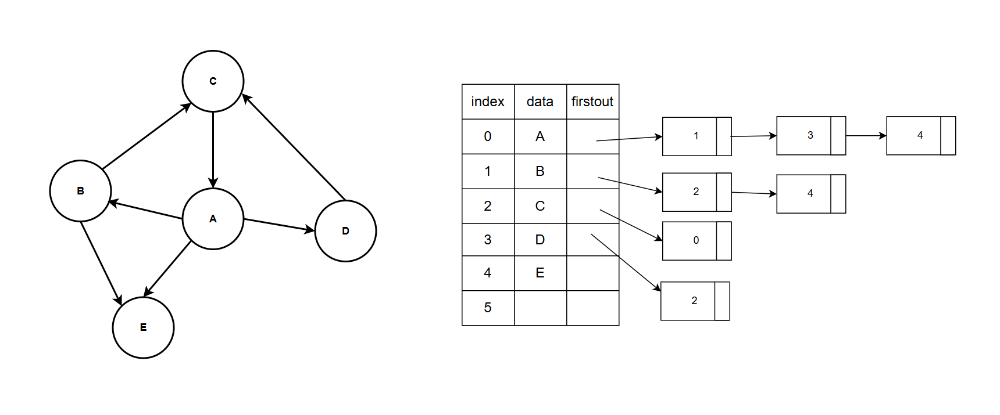

那么右边的部分就是邻接表，对于无向图来说，也可以使用邻接表，但是用起来并没有邻接矩阵方便，为什么呢，对于无向图来说，两个顶点之间的路径你是按一次算还是按两次算呢，所以一般情况下，我们不会用邻接表表示无向图，并不是它不可以，只是相对比较麻烦，一般来说来表示有向图

为什么不表示入度呢，入度其实也可以表示，我们后面讲到的十字链表就是入度和出度在一块的结构，这里如果把出度改为入度可能不是很好理解，所以我们这里以入度为例子

那么接下来我们来看代码

#### 邻接表代码实现

```c
// 边的结构
typedef struct arcEdge{
	int no;					// 边的顶点编号
	int weight;				// 边的权值
	struct arcEdge* next;	// 指向下一条边结构
} ArcEdge;

// 顶点的结构
typedef struct {
	int no;					// 顶点的编号
	char *show;				// 顶点的显示内容
	ArcEdge *firstEdge;		// 当前顶点指向其他顶点的 边的链表首地址
} ArcNode;

// 邻接表来表示图，多个顶点的结构来描述
typedef struct {
	ArcNode *nodes;			// 图中顶点的集合
	int *visited;			// 图遍历时的以遍历标志
	int nodeNum;			// 图中顶点的个数
	int edgeNum;			// 图中边的个数
	int directed;			// 是否是有向图
} AGraph;
```

我们来看这段代码定义了什么

- 首先先定义了边的结构体，那对于边来说我们也有一个编号，同时呢我们还可以考虑这个边有没有权值，这个对后面的算法有用，最后我们需要加一个next的指针，这个指针是用来指向下一条边的结构
- 接着是结点的定义，结点相较于邻接矩阵就多了一个内容，就是当前顶点指向别的顶点时候，边的链表首地址，其他部分跟邻接矩阵一致
- 最后就是封装这个邻接表表示图结构体，里面很显然安装我们上面说的包含顶点集合，也就是一维数组，其次呢就是按照我们上面说的遍历的时候需要引入一个vistied数组用来存储我们已经访问的边或者顶点，后面的就是顶点数量和边的数量还有方向

那么接下来我们来写代码

##### 创建邻接表

```c
AGraph* createAGraph(int n) {
	AGraph* graph = malloc(sizeof(AGraph));
	if (graph == NULL) {
		return NULL;
	}
	graph->edgeNum = 0;
	graph->directed = 0;
	graph->nodeNum = n;

	graph->nodes = malloc(sizeof(ArcNode) * n);
	graph->visited = malloc(sizeof(int) * n);
	if (graph->nodes == NULL || graph->visited == NULL) {
		free(graph);
		return NULL;
	}
	memset(graph->nodes, 0, sizeof(ArcNode) * n);
	memset(graph->visited, 0, sizeof(int) * n);

	return graph;
}
```

代码内容如下：

- 首先我们跟创建图一样，申请一个图，那么这里面一开始里面边的数量为0，结点数量为设置的n等于n，方向一开始也是0的
- 接下来就是为顶点数组和已访问的顶点数组初始化内存空间，并且将里面的数值全部设置为0
- 最后返回这个图

这就是创建邻接表

##### 初始化邻接表

```c
void initAGraph(AGraph* graph, char* names[], int num, int directed) {
	graph->directed = directed;
	for (int i = 0; i < num; ++i) {
		graph->nodes[i].no = i;
		graph->nodes[i].show = names[i];
		graph->nodes[i].firstEdge = NULL;
	}
}
```

初始化内容如下：

- 首先我们给这个图赋值我们传入的方向
- 接下来是我们需要的大小，并不是创建的时候最大容量，for循环将顶点集合里面的顶点编号赋值，然后将show也就是数据域内容个name数组里面的内容对应上，最后将第一条边设置为空，因为这个时候链表并没有插入任何内容

##### 邻接表添加边

```c
static ArcEdge *createArcEdge(int v, int w) {
	ArcEdge *edge = malloc(sizeof(ArcEdge));
	if (edge == NULL) {
		return NULL;
	}
	edge->no = v;
	edge->weight = w;
	edge->next = NULL;
	return edge;
}

void addAGraph(AGraph* graph, int x, int y, int w) {
	if (x < 0 || x >= graph->nodeNum || y < 0 || y >= graph->nodeNum) {
		return;
	}
	if (x == y) return;
	ArcEdge *edge = createArcEdge(y, w);
	edge->next = graph->nodes[x].firstEdge;
	graph->nodes[x].firstEdge = edge;
	graph->edgeNum++;
	if (graph->directed == 0) {
		edge = createArcEdge(x, w);
		edge->next = graph->nodes[y].firstEdge;
		graph->nodes[y].firstEdge = edge;
		graph->edgeNum++;
	}
}
```

我们来看代码内容

- 首先因为我们这里的边用的是链表的方法来表示，所以这里我们要先创建边，当然这里有一点点抽象，我们这里创建的相当于就是上图的firstout它就类似于一个空结点或者是链表的头结点，我们后面创建的都是新节点，可以这么想，第一个函数里面的v指的是目标顶点编号，w则是它的权值，那么创建的时候，我们将对应的边的编号赋值给它，然后权值就是权值，这个结点的下一个指针是空
- 接着我们看下面的函数怎么写的，我们需要传入这个图，x和y就相当于我们要连接的顶点，w还是权值的意思，那么一开始肯定要判断x和y的有效性，如果x和y超出边界值或者相等，那么自然直接返回即可，这时候我们引入edge创建新的边，那么后面就是头插法插入结点不理解看下图：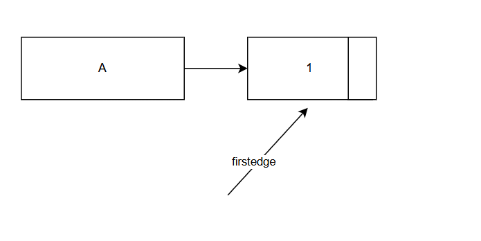比如这时候要在A和1之间插入一个新的结点，那么按照上面的逻辑就是先更新新节点的next，让新节点的next指向firstedge，也就是上图指向1然后这时候，让firstedge到新结点的位置，这就是为什么这个指针叫做firstedge，它的位置一直在第一个结点就是第一条边，如下：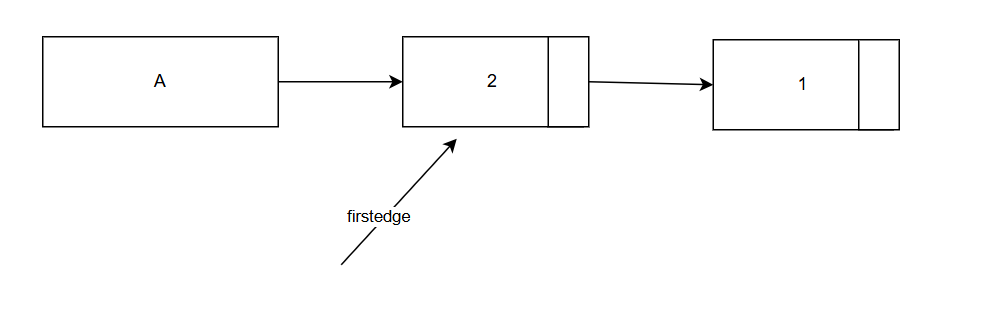

那这就很显然明显了

- 后面则是加边的数量，后面的内容，就是如果是无向图，做一次相反的步骤即可，我们这里认为无向图两个顶点之间是两条边的，这就是邻接表添加边的方法

##### 邻接表访问节点

```c
void visitAGraphNode(const ArcNode* node) {
	printf("\t%s", node->show);
}
```

这里访问不再做过多解释很简单，跟邻接矩阵一样

##### 邻接表的深度搜索遍历(DFS)

我们还是看一下下图：


这个图深度搜索怎么搜呢，我们举个例子，比如这时候我们从0开始，让0作为起点，我们先访问0这个结点，然后这时候我们找到0相邻的第一条边也就是1，我们传入1这个顶点，再DFS一次，这时候会发现1的第一个邻接边是2，那我们再访问2（注意每次访问到新节点的时候要判断一下vistied里面为0还是为1，如果为1不访问）2的邻接是0，但0已经访问过了，所以这时候跳过，发现后面是空的，所以返回继续处理1，以此类推

这就是DFS的逻辑上的思路，我们看代码

```c
void DFS_AGraph(const AGraph* graph, int v) {
	ArcEdge *p;
	graph->visited[v] = 1;
	visitAGraphNode(&graph->nodes[v]);
	p = graph->nodes[v].firstEdge;
	while (p) {
		if (graph->visited[p->no] == 0) {
			DFS_AGraph(graph, p->no);
		}
		p = p->next;
	}
}
```

代码内容如下：

- 引入一个辅助指针p，类似于链表里面遍历链表的辅助指针
- 传入第一个开始的编号V，然后访问v里面的内容，同时标记为1，这时候让p等于与v最相邻的第一条边
- 然后当p存在的时候，看一下p->no里面是否被访问过，如果没有则DFS，如果有则继续往后深搜

那么这就是邻接表的深度搜索

##### 邻接表的广度搜索遍历(BFS)

我们还是以下面这个图讲一下大概思路：


那么对于广度搜索来说，还是跟上面的一样我们引入一个队列来暂时存放任务，比如这时候我们一开始访问0，这时候我们处理0这个任务，也就是访问一下它，然后这时候，我们将0里面的两条边1和2存入队列，这时候我们再处理1发现2和4，然后我们将2和4放入队列中，但是因为2之前已经放入了，vistied变为1了，所以这时候2不放入，只放入4，那么队列里面是不是就剩2和4，以此类推

那么接下来我们来看代码：

```c
void BFS_AGraph(const AGraph* graph, int v) {
	int *que = malloc(sizeof(int) * graph->nodeNum);
	int front = 0, rear = 0;
	ArcEdge *p;
	int cur;

	rear = (rear + 1) % graph->nodeNum;
	que[rear] = v;
	graph->visited[v] = 1;
	while (front != rear) {
		front = (front + 1) % graph->nodeNum;
		cur = que[front];
		visitAGraphNode(&graph->nodes[cur]);

		p = graph->nodes[cur].firstEdge;
		while (p) {
			if (graph->visited[p->no] == 0) {
				rear = (rear + 1) % graph->nodeNum;
				que[rear] = p->no;
				graph->visited[p->no] = 1;

			}
			p = p->next;
		}
	}
	free(que);
}
```

代码内容如下：

- 首先广度搜索我们还是需要定义一个队列结构，这个队列有多大呢，取决于我们实际的顶点数量
- 接着定义辅助指针p，仍然辅助我们遍历
- 初始化让rear往后走一位，这时候我们让开始的顶点v入队，并在vistied数组里面标记v为1
- 开始大的循环，当队头不等于队尾的时候，我们让队头往后走，并引入一个curr用来辅助我们取出元素。让curr等于que[fornt]也就是我们当前出队的元素编号，这时候我们再访问这个结点
- 接着让p等于这个结点相邻的第一个边，开始第二层循环，如果p所在的边编号如果在vistied数组里面为0，则我们让这个元素入队，同时设置它为1，然后p=p->next往后走

这就是广度搜索

#### 邻接表总结

邻接表采用 “顶点数组 + 邻接链表” 的存储结构，顶点表以数组形式存储顶点信息，每个顶点对应一条链表记录其邻接顶点及边的属性，是图存储的核心方式之一。其特性与适用场景如下：

##### 核心优缺点

1. **优点**

- 空间利用率高：空间复杂度为 O (n+e)（n 为顶点数，e 为边数），仅存储实际存在的边，避免了邻接矩阵在稀疏图中大量无效元素的空间浪费。

- 动态操作高效：插入或删除边时，只需在对应顶点的链表中增删结点，时间复杂度为 O (1)，适配图结构频繁变更的场景。

- 邻接遍历便捷：查找某顶点的所有邻接顶点时，直接遍历其对应链表即可，时间复杂度为 O (dᵢ)（dᵢ为该顶点的度或出度），逻辑清晰高效。

1. **缺点**

- 相邻判断低效：判断两顶点是否存在边时，需遍历对应顶点的链表，最坏情况下时间复杂度达 O (V)，远低于邻接矩阵的 O (1)。

- 无向图存在冗余：无向图中同一条边需在两个顶点的链表中各存储一次，虽保证了遍历效率，但造成少量空间冗余。

##### 适用条件

1. **图特性适配**：边数远小于顶点数平方（e≪n²）的稀疏图，空间优势显著。

1. **操作需求适配**：需频繁执行边的增删、邻接顶点遍历操作，且对 “两顶点相邻判断” 效率要求较低的场景。

1. **环境限制适配**：内存资源受限的系统，如嵌入式设备或大规模图处理场景，其空间经济性更为关键。

##### 适配与不适配的图类型

1. **适合的图类型**

- 开放世界游戏地图：地点（顶点）间道路（边）连接稀疏，需动态加载 / 卸载道路，邻接表可快速增删边并节省内存。

- 社交网络关系图：用户（顶点）间好友关系（边）稀疏，需频繁遍历某用户的好友列表，适配邻接表的遍历优势。

- 任务依赖图：任务（顶点）间依赖关系（边）动态变化，邻接表可高效维护依赖链条的增删。

1. **不适合的图类型**

- 完全图：每个顶点与其他所有顶点均相连（e≈n²），邻接表空间复杂度接近 O (n²)，失去空间优势且相邻判断效率低下。

- 稠密通信网络：顶点间连接密集，需频繁判断两节点是否连通，邻接矩阵的 O (1) 查询效率更具优势。

- 需执行 Floyd-Warshall 等全局路径算法的图：此类算法依赖快速边查询，邻接表的遍历特性会降低运算效率。

### 十字链表

#### 十字链表概述回顾

我们先来看下面的这幅图：

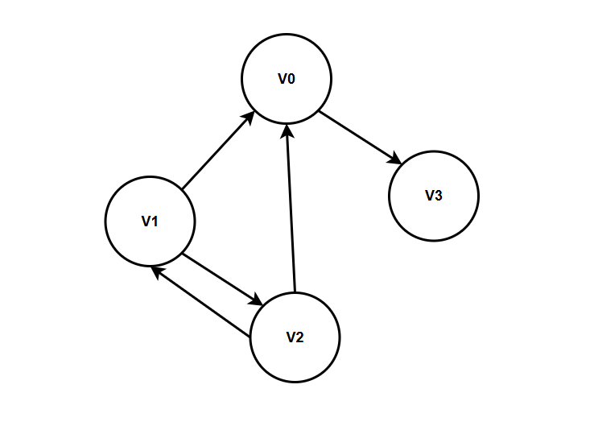

这是一幅有向图，我们先来回顾一下十字链表使用情况，对于十字链表来说，我们是在邻接表的基础上增加了一些东西，比如邻接表是单方面的入度或者出度，通常是以出度为核心的，那么对于十字链表来说，则是将两个部分合在了一起，既能表示出度也能表示入度也能表示入度，那我们先想一下他这个顶点结构和边的结构怎么去封装，对于顶点来说，我们比邻接表多了一个入度的存在，也就是下面这种：

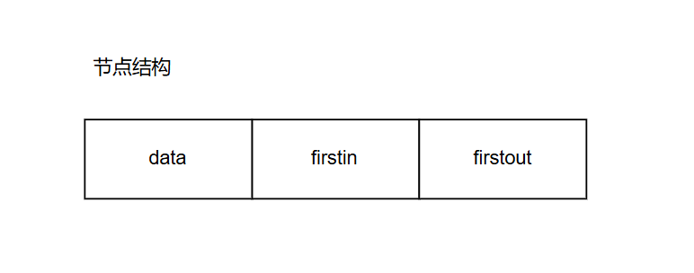

那接下来我们再看弧的结构或者说是边的结构，如下：

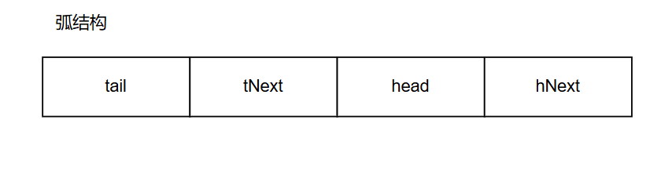

那我来解释一下这个结构，tail相当于是一个弧的尾巴，也就是可以表示一个结点的出度，而head指的是一个弧的头，可以表示一个结点的入度，那这样有点抽象，我们看下图具象化一下，如下：

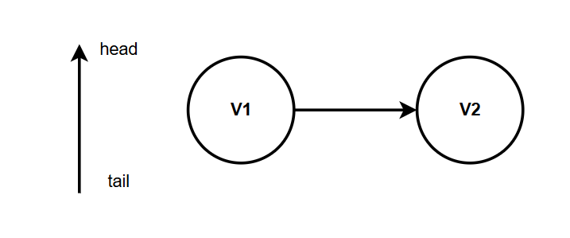

可以理解为上面的箭头的头就是我们上面head的意思，因为在有向图中，是有方向的，而箭头一直指向入度的顶点，所以自然而然我们这里认为是入度，对于箭头的尾巴那就是从另一个顶点出发，例如上面从V1出发到V2，那么尾巴是出度

那么我们再看看怎么表示一个有向图，我们先把概念理解清楚，看下图：

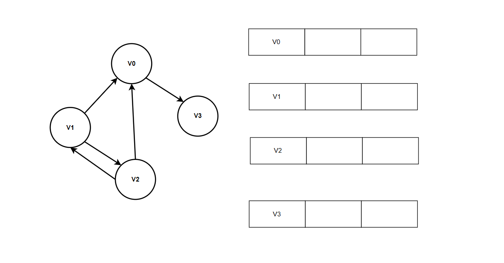

如果我们现在来表示一个边，比如我们从V0开始表示V0->V3这条边怎么表示呢，我们看下图：

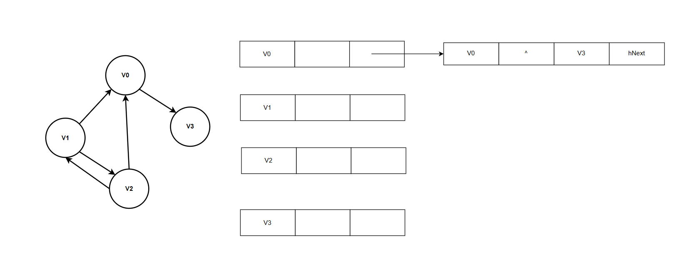

那么我们知道节点里面封装的时候我们用的是firstout，所以这是候我们从firstout引出一个链表指向tail，这个就代表我出度是从V0开始，那我找我的头，我的头就是V3所以这就是表示了一条边，V0->v3,那为什么tNext是空的呢，是因为看上图我们发现并没有V0有任何的出度了所以这时候为0，那我们再举个V1的例子V1->V0,V1->V2,V2->V1,那整个图是什么样子呢，如下：

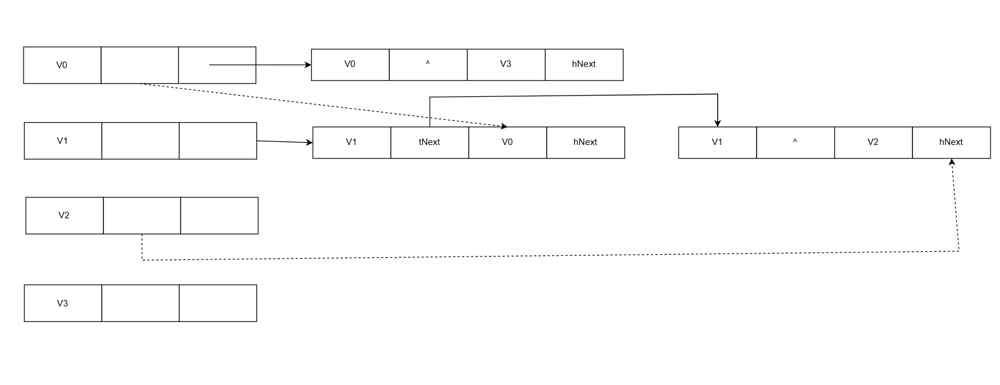

那很显然V1这里tNext就指向了后面的一条边，所以如果有多个出度，那么我们这里可以使用tNext来实现表示多个出度，这时候如果表示入度，那就用上面的虚线表示，指向head，这样就表示了入度

那么接下来就不画完整的了，十字链表和邻接多重表在本科阶段用的相对较少，所以这里不再赘述，我们简单看一下代码

#### 十字链表代码实现

```c
// 十字链表的边结构
typedef struct arcBox {
	int tailVertex;					// 弧尾编号，tailVertex作为顶点的出度信息
	struct arcBox *tailNext;		// 下一个以tailVertex作为弧尾的下一条边
	int headVertex;					// 弧头编号，以headVertex作为顶点的入度信息
	struct arcBox *headNext;		// 下一个以headVertex作为弧头的下一条边
	int weight;						// 弧权值
} ArcBox;

// 十字链表的顶点结构
typedef struct {
	int no;
	const char *show;
	ArcBox *firstIn;				// 该节点的入度
	ArcBox *firstOut;				// 该节点的出度
} CrossVertex;

// 利用十字链表的结构实现图的结构
typedef struct {
	CrossVertex *nodes;
	int numVertex;
	int numEdge;
}CrossGraph;
```

该代码通过分层定义结构体，实现了有向图的十字链表存储模型。十字链表的核心价值在于解决传统邻接表查询入度需遍历全图的低效问题，通过边节点与顶点节点的交叉关联，让每个顶点的出边和入边都能直接访问。

**ArcBox 结构：边（弧）的核心定义**

此结构体用于描述图中的每一条有向边（弧），每个边节点会同时存在于两个链表中，形成十字交叉的存储逻辑：

- tailVertex：存储弧尾顶点的编号，该编号与对应顶点的出度信息直接关联，标识边的起点；

- tailNext：指向另一个 ArcBox 类型的指针，用于链接所有以当前 tailVertex 为弧尾的边，构成顶点的出边链表（类似邻接表的边表）；

- headVertex：存储弧头顶点的编号，关联对应顶点的入度信息，标识边的终点；

- headNext：指向另一个 ArcBox 类型的指针，用于链接所有以当前 headVertex 为弧头的边，构成顶点的入边链表（类似逆邻接表的边表）；

- weight：存储该边的权值数据，适用于带权有向网（如表示距离、成本等），无权图可省略此成员。

**CrossVertex 结构：顶点的信息与链接入口**

此结构体对应十字链表中的顶点节点，每个顶点通过指针与边链表建立关联，实现出入度的集中管理：

- no：顶点的唯一编号，用于快速定位顶点在结构中的位置；

- show：指向常量字符的指针，存储顶点的显示信息（如顶点名称、标签等）；

- firstIn：指向 ArcBox 类型的指针，指向以当前顶点为弧头的第一条边，是遍历该顶点入边链表的起始入口；

- firstOut：指向 ArcBox 类型的指针，指向以当前顶点为弧尾的第一条边，是遍历该顶点出边链表的起始入口。

**CrossGraph 结构：图的整体封装**

此结构体整合顶点集合与图的基本属性，形成完整的十字链表图结构：

- nodes：指向 CrossVertex 类型的指针，实际指向一个存储所有顶点的数组（或动态链表），是访问所有顶点信息的总入口；

- numVertex：记录图中顶点的总数量，用于边界判断和遍历控制；

- numEdge：记录图中边（弧）的总数量，辅助图的初始化、修改等操作的校验。

**结构关联逻辑**

十字链表的核心在于 "交叉链接"：每个 ArcBox 节点通过 tailNext 接入弧尾顶点的出边链表（由 firstOut 引导），同时通过 headNext 接入弧头顶点的入边链表（由 firstIn 引导）。这种设计使查询顶点出度时可沿 firstOut→tailNext 遍历，查询入度时沿 firstIn→headNext 遍历，无需额外维护逆邻接表，空间复杂度仍保持 O (n+e)（n 为顶点数，e 为边数），兼顾效率与空间。

##### 创建十字链表

```c
CrossGraph* createCrossGraph(int n) {
	CrossGraph* graph = malloc(sizeof(CrossGraph));
	if (graph == NULL) {
		return NULL;
	}
	graph->nodes = malloc(sizeof(CrossVertex) * n);
	if (graph->nodes == NULL) {
		free(graph);
		return NULL;
	}
	graph->numEdge = 0;
	graph->numVertex = n;
	return graph;
}
```

该函数的主要作用是创建并初始化一个CrossGraph类型的实例，用于表示某种图结构，参数n指定了图中顶点的数量。

首先，函数会为CrossGraph结构体本身分配内存空间。这一步是为了在内存中开辟一块区域来存储图的整体信息，包括顶点数组、边的数量、顶点数量等。分配完成后，会检查内存分配是否成功，如果失败（即未获取到有效的内存空间），函数会直接返回空指针，表明图创建失败。

 若CrossGraph结构体的内存分配成功，接下来会为该结构体中的nodes成员分配内存。nodes成员是一个用于存储顶点信息的数组，其元素类型为CrossVertex，数组的长度由参数n决定，也就是图中顶点的数量。这一步的目的是为所有顶点预留存储位置。 同样，在为nodes数组分配内存后，需要检查分配是否成功。

如果分配失败，为了避免内存泄漏（即已经分配的CrossGraph结构体内存无法释放），函数会先释放之前为CrossGraph结构体分配的内存，然后返回空指针，表明图创建失败。 当CrossGraph结构体和nodes数组的内存都分配成功后，函数会对图的其他成员进行初始化。

其中，numEdge被设置为0，这是因为刚创建的图还没有添加任何边；numVertex被设置为参数n，用于记录图中顶点的实际数量，与nodes数组的长度保持一致。 

最后，函数返回初始化完成的CrossGraph结构体指针，此时这个指针指向的内存区域已经包含了图的基本结构信息，可用于后续的图操作。

##### 十字链表的其他代码

```c
void initCrossGraph(CrossGraph* graph, const char* names[], int num) {
	for (int i = 0; i < num; ++i) {
		graph->nodes[i].no = i;
		graph->nodes[i].show = names[i];
		graph->nodes[i].firstIn = graph->nodes[i].firstOut = NULL;
	}
}

void addCrossArc(CrossGraph* graph, int tail, int head, int w) {
	ArcBox *box = malloc(sizeof(ArcBox));
	if (box == NULL) {
		return;
	}
	box->weight = w;
	// 从出度关系上进入插入（头插法）
	box->tailVertex = tail;
	box->tailNext = graph->nodes[tail].firstOut;
	graph->nodes[tail].firstOut = box;
	// 从入度关系上进入插入（头插法）
	box->headVertex = head;
	box->headNext = graph->nodes[head].firstIn;
	graph->nodes[head].firstIn = box;
}

int inDegreeCrossGraph(const CrossGraph* graph, int no) {
	int count = 0;
	ArcBox *box = graph->nodes[no].firstIn;
	while (box) {
		count++;
		box = box->headNext;
	}

	return count;
}

int outDegreeCrossGraph(const CrossGraph* graph, int no) {
	int count = 0;
	ArcBox *box = graph->nodes[no].firstOut;
	while (box) {
		count++;
		box = box->tailNext;
	}
	return count;
}
```

本文详解的四段代码均围绕**十字链表**展开，十字链表是有向图的高效链式存储结构，通过顶点表同时管理入度和出度链表，解决了传统邻接表查询入度效率低的问题。以下将按函数功能逐一解析其设计逻辑与实现细节。

1. **initCrossGraph 函数：十字链表初始化**

**1.1 核心功能**

该函数是十字链表的 “基础搭建工具”，负责为图的所有顶点完成初始设置，确保后续弧的添加、度数计算等操作能正常进行，是使用十字链表前的必备步骤。

**1.2 实现逻辑拆解**

1. **遍历顶点集合**：根据传入的顶点数量，依次对每个顶点进行初始化处理，保证不遗漏任何节点。

1. **设置顶点标识**：为每个顶点分配唯一编号（从起始值开始递增），同时绑定对应的显示名称（如顶点的文字标识），让顶点具备可识别性。

1. **初始化链表指针**：将每个顶点的两个关键指针（指向入度链表的头指针、指向出度链表的头指针）均设为空值。这是因为初始状态下，顶点既没有指向它的弧（入度为 0），也没有从它出发的弧（出度为 0）。

**1.3 关键意义**

初始化操作奠定了十字链表的结构基础：编号让顶点可被精准定位，名称满足可视化需求，空指针则为后续添加弧时构建链表预留了入口。

2. **addCrossArc 函数：弧的创建与插入**

**2.1 核心功能**

作为十字链表的 “连接工具”，该函数负责创建带有权重的弧（即有向边），并将其同时插入到对应顶点的出度链表和入度链表中，实现十字链表的双链关联特性。

**2.2 实现逻辑拆解**

1. **分配弧的内存空间**：为存储弧信息的结构体申请内存，若申请失败（如内存不足）则直接终止操作，避免程序异常。

1. **设置弧的基础属性**：将传入的权重值存入弧的属性中，权重可表示路径长度、成本等业务信息。

1. **出度方向插入（头插法）**：

- 关联弧与尾顶点：记录该弧的尾顶点编号，明确弧的起点。

- 连接链表：让新弧的尾指针指向当前尾顶点出度链表的头节点，相当于 “接住” 原链表的所有节点。

- 更新头指针：将尾顶点的出度链表头指针改为指向新弧，使新弧成为出度链表的第一个节点。这种 “插队” 式的头插法插入效率极高，仅需修改两个指针即可完成。

1. **入度方向插入（头插法）**：

- 关联弧与头顶点：记录该弧的头顶点编号，明确弧的终点。

- 连接链表：让新弧的头指针指向当前头顶点入度链表的头节点。

- 更新头指针：将头顶点的入度链表头指针改为指向新弧，完成入度方向的插入。

**2.3 设计亮点**

同一弧同时存在于两个链表中：在尾顶点的出度链表中代表 “出发的弧”，在头顶点的入度链表中代表 “到达的弧”，这种双链关联正是十字链表的核心设计，让入度和出度的查询都能高效进行。

3. **inDegreeCrossGraph 函数：入度计算**

**3.1 核心功能**

作为十字链表的 “入度统计工具”，该函数用于计算指定顶点的入度，即所有指向该顶点的弧的总数，解决了传统邻接表需全表遍历的效率问题。

**3.2 实现逻辑拆解**

1. **初始化计数器**：创建计数变量并设为 0，用于累计入弧的数量。

1. **定位入度链表起点**：获取指定顶点的入度链表头指针，该指针直接指向第一条以该顶点为终点的弧。

1. **遍历入度链表**：

- 若当前弧指针不为空（表示还有未统计的入弧），计数器加 1。

- 移动指针至下一条入弧（通过弧的头指针链进行跳转），重复统计过程。

1. **返回统计结果**：当指针为空时，遍历结束，计数器的值即为该顶点的入度。

**3.3 效率优势**

得益于十字链表的结构设计，入度查询无需遍历整个图，只需顺着目标顶点的入度链表依次计数即可，时间复杂度与入度大小成正比，远高于传统邻接表。

4. **outDegreeCrossGraph 函数：出度计算**

**4.1 核心功能**

作为十字链表的 “出度统计工具”，该函数用于计算指定顶点的出度，即所有从该顶点出发的弧的总数，与入度计算函数形成互补。

**4.2 实现逻辑拆解**

1. **初始化计数器**：创建计数变量并设为 0，用于累计出弧的数量。

1. **定位出度链表起点**：获取指定顶点的出度链表头指针，该指针直接指向第一条以该顶点为起点的弧。

1. **遍历出度链表**：

- 若当前弧指针不为空（表示还有未统计的出弧），计数器加 1。

- 移动指针至下一条出弧（通过弧的尾指针链进行跳转），重复统计过程。

1. **返回统计结果**：当指针为空时，遍历结束，计数器的值即为该顶点的出度。
2. **与入度计算的异同**

- **相同点**：均采用 “指针遍历 + 计数” 的核心逻辑，依赖十字链表的顶点表指针快速定位链表起点。

- **不同点**：遍历的链表类型不同（出度链表 vs 入度链表），跳转依赖的弧指针也不同（尾指针链 vs 头指针链），分别对应 “出发弧” 和 “到达弧” 的统计场景。

#### 十字链表的总结

##### 一、十字链表的核心定义

十字链表（Orthogonal List）是一种特殊的链式存储结构，其核心特征是节点通过多维度指针构建 “十字交叉” 的网状关系，主要用于解决稀疏矩阵和有向图的高效存储与操作问题。它巧妙融合了邻接表与逆邻接表的优势，同时优化了稀疏数据的空间利用效率。

##### 二、核心应用场景

1. 有向图存储

- 解决传统存储结构的痛点：邻接表难以快速查询顶点入度，逆邻接表难以快速查询出度，而十字链表可同时高效获取这两类信息。

- 典型结构组成：包含顶点节点和弧节点两类核心节点，顶点节点记录入边、出边的起始指针，弧节点记录边的起止顶点及相邻边指针。

2. 稀疏矩阵存储

- 针对矩阵中绝大多数元素为零的场景，仅存储非零元素，通过行、列双维度链表组织数据，避免二维数组的空间浪费。

- 节点包含行列标号、权值及行、列方向的后继指针，可通过行头指针和列头指针分别遍历任意行或列。

##### 三、基础结构组成

1. 有向图中的结构

- 顶点节点：存储顶点信息，包含first_out（出边链表起始指针）和first_in（入边链表起始指针）。

- 弧节点：存储边的信息，包含弧尾顶点编号、弧头顶点编号、权值，以及tlink（同弧尾的下一条出边指针）和hlink（同弧头的下一条入边指针）。

2. 稀疏矩阵中的结构

- 节点包含行列标号、元素值，以及右指针（本行下一个非零元素）和下指针（本列下一个非零元素）。

- 通过行头指针数组和列头指针数组管理整个矩阵的链接关系，形成十字网状结构。

##### 四、性能与优缺点分析

1. 关键性能指标

- 空间复杂度：存储有向图时为 O (|V|+|E|)（|V | 为顶点数，|E | 为边数）；存储稀疏矩阵时为 O (M+N+k)（M、N 为矩阵行列数，k 为非零元素数）。

- 时间复杂度：遍历某行 / 列或查询入度 / 出度时，最坏情况为 O (节点所在链长度)，插入删除操作仅需修改局部指针，效率较高。

2. 优点

- 操作高效：可同时快速查询有向图顶点的入度与出度，便于稀疏矩阵的行、列遍历及元素增删。

- 空间优化：相比二维数组（O (M*N)），对稀疏数据的空间利用率提升显著；相比邻接表，无需为无向图边存储两份数据。

- 场景适配：适用于电力系统仿真（电网拓扑存储）、图形学（对象连接管理）等动态复杂场景。

3. 缺点

- 结构复杂：需定义多类节点及指针关系，实现难度高于普通链表和邻接表。

- 内存开销：每个节点需额外存储多个指针，相比压缩稀疏行（CSR）等紧凑格式，内存占用略高。

- 适用局限：仅针对有向图和稀疏矩阵，数据量较小时优势不明显，甚至不如简单结构高效。

##### 五、本科阶段学习定位

本科数据结构课程中，十字链表的学习重点在于**理解核心思想与应用价值**，而非深入实现细节：

1. 掌握其 “融合邻接表与逆邻接表” 的设计逻辑，明确解决的传统结构痛点（如入度查询难题）。

1. 了解节点基本构成与空间复杂度特征，能与邻接表、二维数组等结构进行优劣对比。

1. 知晓其典型应用场景，为后续进阶学习或工程实践奠定概念基础，无需深究代码实现与算法优化细节。

### Kruskal算法(最小生成树)

#### Kruskal算法概述以及最小生成树概述

##### 定义

生成树是连通图的 “极小连通子图”，简单来说，它需要满足两个关键条件：一是包含原图中全部的 n 个顶点；二是只保留构成一棵树的 n-1 条边。这里的 “极小” 意味着少一条边就会断开连接，多一条边就会形成环路。

##### 关键属性

| 属性内容                   | 通俗解释                                                     |
| -------------------------- | ------------------------------------------------------------ |
| 一个连通图可有多棵生成树   | 连接所有顶点的方式不止一种，只要符合边数和无环要求都是生成树 |
| 所有生成树顶点数和边数相同 | 无论哪种生成树，都有 n 个顶点和 n-1 条边                     |
| 生成树中不存在环           | 没有 “绕圈” 的边，否则边数会超过 n-1                         |
| 移除任意一条边会导致不连通 | 边的数量是维持连通的最少数量，缺一不可                       |
| 添加任意一条边会形成环     | 原本边已足够连通，新增边必然造成 “绕圈”                      |

##### 最小生成树的概念与形象例子

**核心定义**

最小生成树是针对 “带权图”（即每条边都有对应数值，如成本、距离）的概念。它首先是一棵生成树，其次满足 “边的权值之和小于或等于其他所有生成树”，简单说就是 “连通所有顶点且总代价最低” 的生成树。若图不带权值，则只有生成树，不存在 “最小” 的说法。

**形象例子**

假设某地区有 5 个村庄（对应 5 个顶点），现在要架设网线让所有村庄连通，每条可能的网线（对应边）都有不同的铺设成本（对应权值）。我们的目标是用最少的总钱数完成架设，这就需要找最小生成树：

- 不能有环路：比如村庄 A→B→C→A 的环路会浪费网线成本，必须去掉一条边；

- 边数固定：5 个村庄需要 4 条网线，少一条则有村庄孤立；

- 总代价最低：从所有可能的 4 条无环网线组合中，选成本加起来最少的那组，这组网线构成的就是最小生成树。

##### 贪心算法：最小生成树的核心思想支撑

**基本思路**

贪心算法是一种 “走一步看一步” 的策略，它不追求从整体上规划最优解，而是每次都做出当前看起来最好的选择（即局部最优选择），最终希望通过一系列局部最优得到整体最优。虽然它不能解决所有问题，但对最小生成树这类问题，能精准得到最优解。

**核心要素**

1. 贪心选择性质：问题的整体最优解可以通过一系列局部最优选择实现。比如选最小生成树时，每次选权值最小的合适边或最近的顶点，最终能得到总权值最小的结果。

1. 最优子结构性质：问题的最优解包含了其子问题的最优解。比如最小生成树的任意子部分，也是该子部分的最小生成树。

##### 经典最小生成树算法思路

**Kruskal 算法：从 “边” 出发的贪心策略**

Kruskal 算法以 “边” 为核心，初始时把图中的每个顶点都看成一棵独立的 “树”（整个图就是一片森林）。之后不断从所有边中选择权值最小的边，且这条边连接的两棵树此前不连通（避免形成环），直到森林合并成一棵包含所有顶点的树（此时边数为 n-1），这棵树就是最小生成树。

**Prim 算法：从 “顶点” 出发的贪心策略**

Prim 算法以 “顶点” 为核心，先把所有顶点分成两类：一类是已纳入生成树的顶点（A 类），另一类是未纳入的顶点（B 类）。初始时 A 类只有一个任意选定的顶点，B 类包含其余所有顶点。之后每次从 B 类中选一个到 A 类顶点权值最小的顶点，将其移入 A 类，重复该过程直到 B 类为空，此时 A 类顶点和连接它们的边就构成了最小生成树。

#### Kruskal算法逻辑详解

我们接下来看一下Kruskal算法到底怎么个求法，我们看下图：

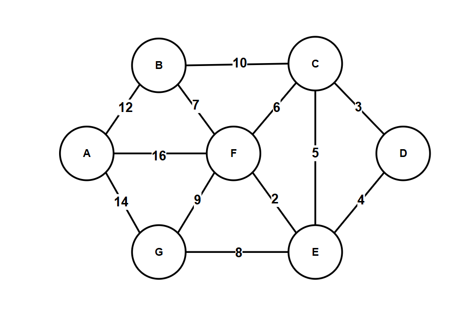

那么对于这个图，我们来看一下它的最小生成树，我们知道假设一个图有n个节点，那么它就只需要n-1条边就可以实现它的最小生成树，我们知道Kruskal算发是基于贪心算法来的，那我们来看，其实就这几个步骤：

1. 在n个顶点里面找n-1条边，每个边的权值都尽可能最小
2. 找的边里面所对应的节点不能形成环

其实总共就上面两个步骤，那我们来一步步看怎么做，以上图为例子，我们一开始从小到大开始找，那最小的是不是就是2这条边，它所对应的顶点是不是E和F，那这时候就激活E和F，如下：

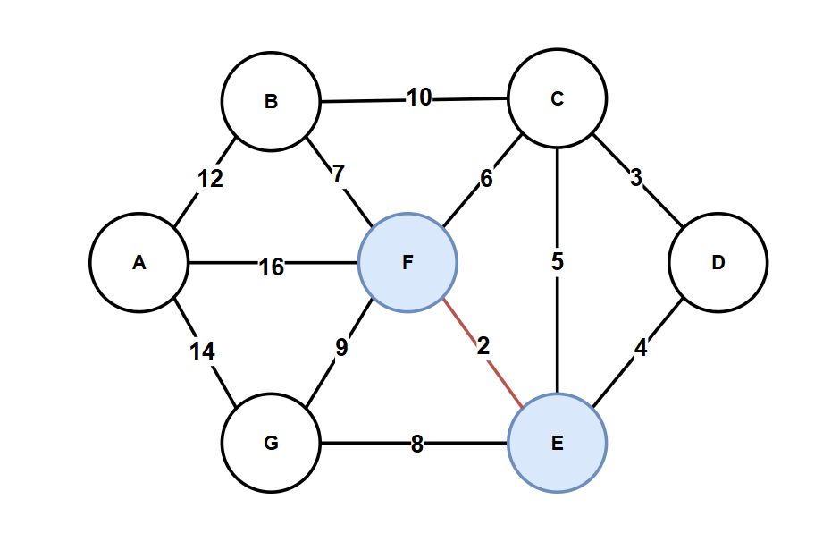

（红色的代表找到的边，蓝色的为激活的节点）

那我们接着按照贪心算法的思路去找，这时候发现是不是对应找3这个边，那么这时候我们激活3这条边和顶点，如下：

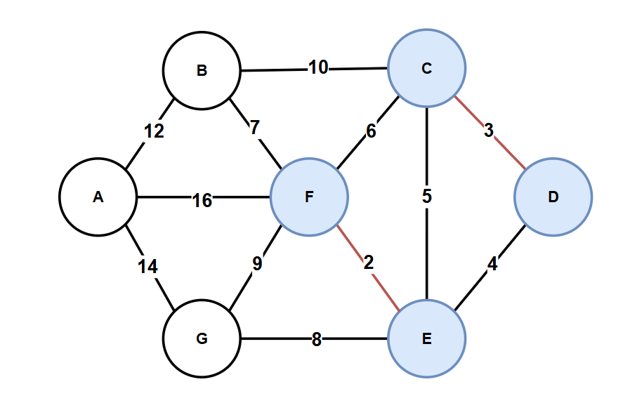

那么接着我们激活4这个边，这时候你会发现4对应的E和D是不是都被激活了，但是此时你发现它们并没有形成环，所以这条边是可以选择的，如下：

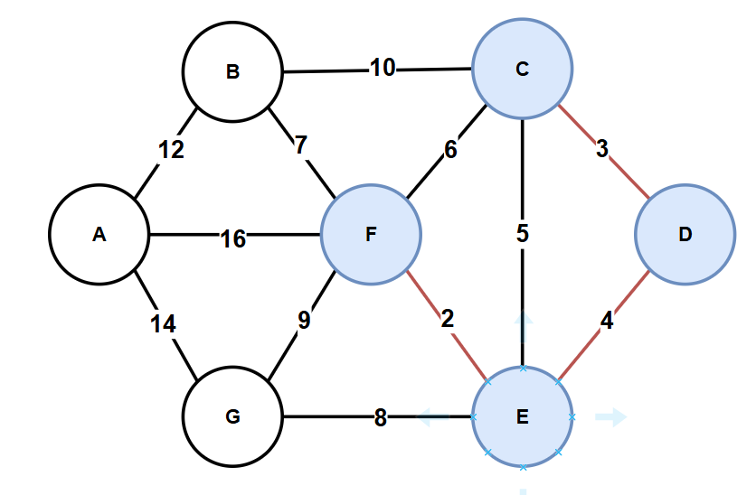

那这时候接着按照从小到大找是不是对应找5了，但这时候你看如果5这条边被选择，这时候是不是会发现C、D、E三个顶点形成了一个环，那这时候按照我们上面说的是不是不能形成环，那我们只能放弃5这条边，那接着看6,6是不是也形成了一个环，所以也得放弃，那我们只能激活7，这时候发现7这个边是可以正常使用的，所以我们这时候激活7这个边，对应激活B这个顶点，如下：

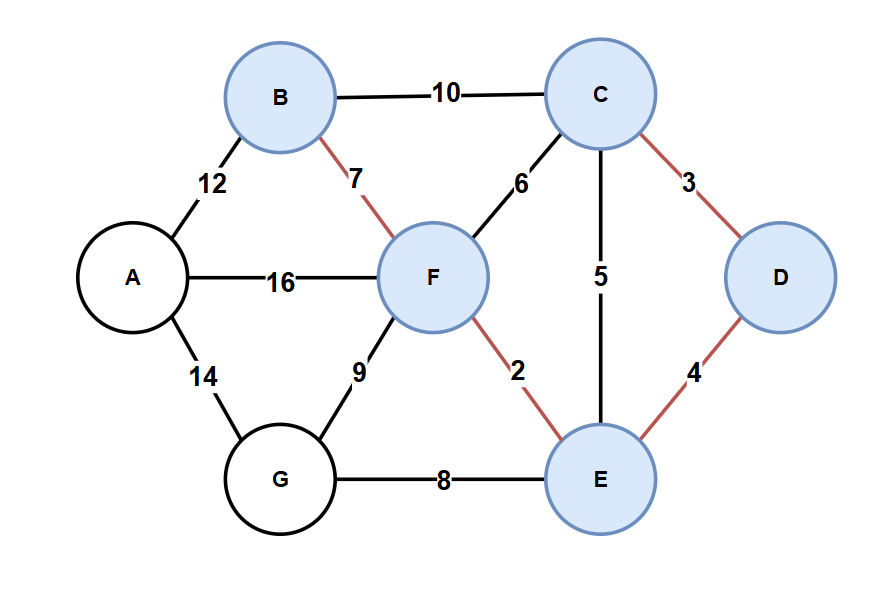

那么接下来是8,8这条边激活发现并不会形成环，所以可以激活，如下：

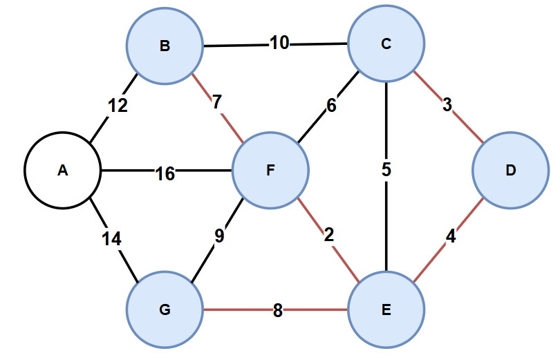

那这时候看10，会发现10这条边会形成环，所以舍弃，这时候看12,12并不会形成所以这时候，可以选择12，如下：

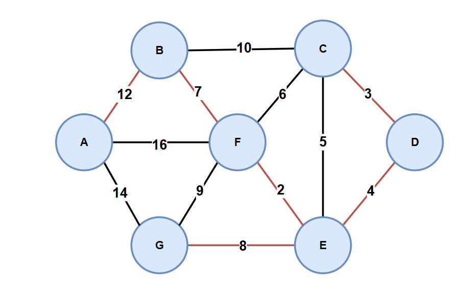

那这时候你发现你是不是找到了六条边，那对应的最小生成树是不是也找到了，那么这就是KrusKal算法的一个实现思路，上面的权值和是36，也是和别的生成树相比是最小的，那么接下来我们来看代码

#### Kruskal算法代码实现

```c
/* 边集的结构 */
typedef struct {
	int begin;		// 边的起点（顶点1）
	int end;		// 边的终点（顶点2）
	int weight;		// 边的权值
} EdgeSet;
```

 对于Kruskal的代码实现呢，我们需要引入两个内容，一个是边集数组，一个是邻接矩阵，其中主要运用的还是边集数组，因为这个算法是从边开始找的，邻接矩阵只是为了我们方便存储这个对应的图结构

##### 初始化边集数组

```c
void initEdgeSet(const MGraph* graph, EdgeSet* edges) {
	int k = 0;
	for (int i = 0; i < graph->nodeNum; ++i) {				// 遍历每个顶点
		for (int j = i + 1; j < graph->nodeNum; ++j) {		// 遍历上三角
			if (graph->edges[i][j] > 0) {
				edges[k].begin = i;
				edges[k].end = j;
				edges[k].weight = graph->edges[i][j];
				k++;
			}
		}
	}
}
```

代码内容如下：

- 首先定义一个k来辅助我们后续操作
- 无向图中，边`(i,j)`和边`(j,i)`是同一条边（没有方向），因此邻接矩阵是对称的，即`graph->edges[i][j] = graph->edges[j][i]`。
- 如果遍历整个矩阵（`i`和`j`都从 0 到 n-1），会导致同一条边被重复处理两次（比如`i=0,j=1`和`i=1,j=0`会被认为是两条边，但实际是同一条）。
- 而`j = i + 1`的设计，只遍历矩阵中`i < j`的部分（上三角区域），既能覆盖所有边，又能避免重复。
- 这时候我们将begin和end分别赋值，同时也赋值权重

这就是初始化的操作

##### 排序边集数组

```c
void sortEdgeSet(EdgeSet* edges, int num) {
	EdgeSet tmp;
	for (int i = 0; i < num; ++i) {
		for (int j = i + 1; j < num; ++j) {
			if (edges[j].weight < edges[i].weight) {
				memcpy(&tmp, &edges[i], sizeof(EdgeSet));
				memcpy(&edges[i], &edges[j], sizeof(EdgeSet));
				memcpy(&edges[j], &tmp, sizeof(EdgeSet));
			}
		}
	}
}
```

我们来看代码内容：

- 这里的排序选择的是选择排序
- 首先我们这里比较的是从i和i+1比较，也就是它自己和他后面的一个人比较，一开始默认i的权值最小，如果j比i还小，那么这时候进行交换的操作实现这个排序，这里用memcpy是为了方便操作，如果不是memcpy的写法得按照下面的写法

```c
 				tmp.begin = edges[i].begin;
                tmp.end = edges[i].end;
                tmp.weight = edges[i].weight;

                edges[i].begin = edges[j].begin;
                edges[i].end = edges[j].end;
                edges[i].weight = edges[j].weight;

                edges[j].begin = tmp.begin;
                edges[j].end = tmp.end;
                edges[j].weight = tmp.weight;
```

##### 算法实现

```c
static int getRoot(const int *uSet, int a) {
	while (uSet[a] != a) {
		a = uSet[a];
	}
	return a;
}

int KruskalMGraph(const EdgeSet* edges, int num, int node_num, EdgeSet* result) {
	int *uSet;
	int count = 0;
	int sum = 0;
	// 1. 初始化并查集
	uSet = malloc(sizeof(int) * node_num);
	if (uSet == NULL) {
		printf("malloc failed\n");
		return -1;
	}
	for (int i = 0; i < node_num; ++i) {
		uSet[i] = i;
	}
	// 2. 从已经排序好的边集中，找到最小的边，不构成环
	for (int i = 0; i < num; ++i) {
		int a = getRoot(uSet, edges[i].begin);
		int b = getRoot(uSet, edges[i].end);
		if (a != b) {
			// 不构成环
			uSet[a] = b;
			result[count].begin = edges[i].begin;
			result[count].end = edges[i].end;
			result[count].weight = edges[i].weight;
			sum += edges[i].weight;
			count++;
			if (count == node_num - 1) {
				break;
			}
		}
	}
	free(uSet);
	return sum;
}

```

那么之前我们已经讲述了Kruskal算法怎么实现，我们这里有一个关键的点，就是不能让它们形成环，但是怎么做才能不让他们形成环呢，这时候就用到我们之前讲的一个结构了并查集，他可以帮我们查看这几个结点是否形成环，那很显然我们这里运用快速合并的思路，按照我们之前说的快速合并，就是查找其根结点是否一致即可，那我们来看代码具体内容：

- 在并查集中我们习惯将每个元素的根结点或者父节点初始化自己，那么这里找根的时候，我们向上查找，直到找到uset[a]=a,也就是找到了，这里可以这么想，假设合并了，就比如：

- 假设并查集数组 `uSet` 的初始状态是 `[0,1,2,3]`（4 个顶点，各自为根），然后经过几次合并后变成了 `[1,1,3,3]`（即：

  - `uSet[0] = 1`（0 的父节点是 1）
  - `uSet[1] = 1`（1 的父节点是自己，是根）
  - `uSet[2] = 3`（2 的父节点是 3）
  - `uSet[3] = 3`（3 的父节点是自己，是根）

  现在调用 `getRoot(uSet, 0)`：

  1. 检查 `uSet[0]` 是否等于 0？`uSet[0] = 1 ≠ 0`，进入循环。
  2. 让 `a = uSet[0] = 1`（现在 a 指向 1）。
  3. 检查 `uSet[1]` 是否等于 1？`uSet[1] = 1`，满足条件，退出循环。
  4. 返回 `a = 1`（1 是 0 的根节点）。

  再调用 `getRoot(uSet, 2)`：

  1. 检查 `uSet[2] = 3 ≠ 2`，进入循环。
  2. 让 `a = uSet[2] = 3`。
  3. 检查 `uSet[3] = 3`，满足条件，退出循环。
  4. 返回 `a = 3`（3 是 2 的根节点）。

- 那么我们再看核心代码内容，首先我们初始化并查集，具体步骤这里不再详细说明，接着我们看后面的代码，这时候是不是我们开始取边，如果这时候end和begin的根结点不一样，那这时候就可以开始执行我们的算法，我们先把新的节点或者没构成环的，添加到并查集里面，然后我们将结果赋值给，结果这个存储空间，sum就是我们最后要求的权值和，count则是我们边的数量，++即可，最后当count等于我们上面说的n-1条边时候，跳出循环，最后返回sum即可

### Prim算法(最小生成树)

#### Prim算法逻辑详解

我们知道Prim算法是从顶点出发，去找一个图里面的最小生成树，但是具体怎么做呢，我们还是以下图为例子：


（我们先讲一下算法逻辑上怎么去想，再讲代码的逻辑）

首先这里我们随便激活一个顶点，比如激活顶点A，这时候我们看A是不是有三条路径可以通往别的地方，分别是B、F、G，那么他们之间的路径权值最小的是不是12，那也就是选择通往B这个顶点，那就如下：

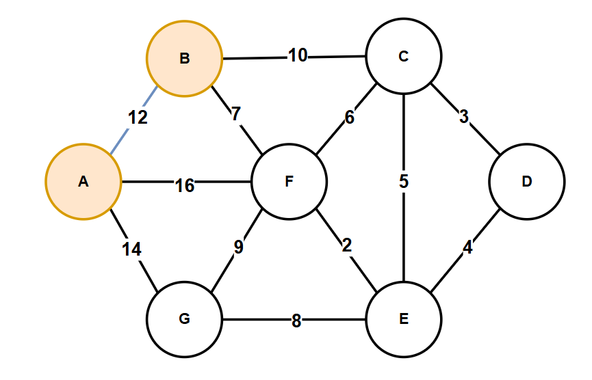

好这时候激活B了，那我们再走B看，这时候B是不是有两条路径，按照我们说的贪心算法，这里选择7这个边，对应激活F，如下：

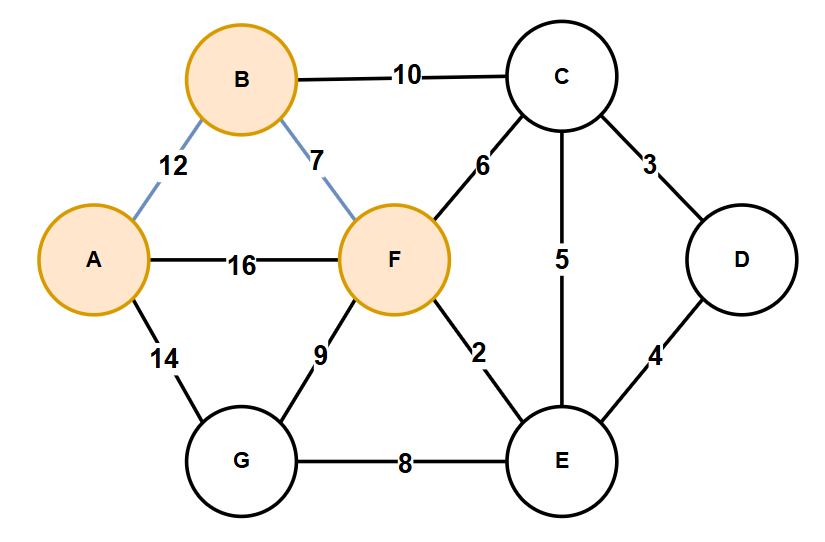

这时候F激活我们再看F，F有5条边，这里我们还是选择最小的，那么对应选择2，这时候激活E，如下:

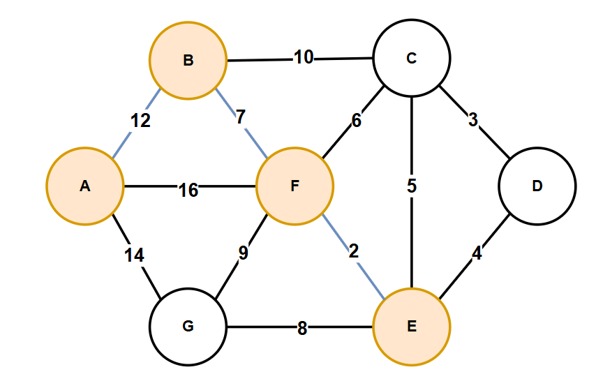

那后面就不再赘述，E激活以后下一个对应是4，激活D，如下：

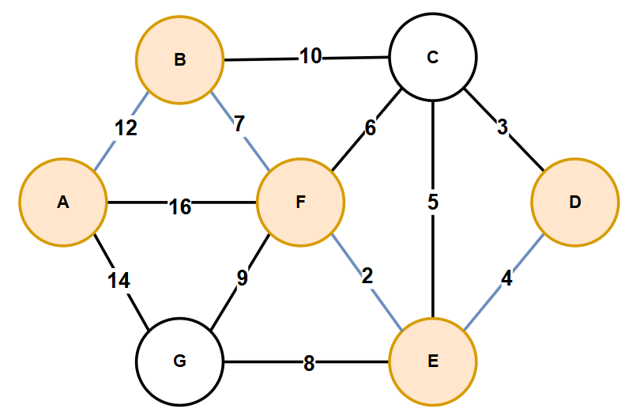

那这时候再看D，D这里很显然选择3这条边，激活C，如下:

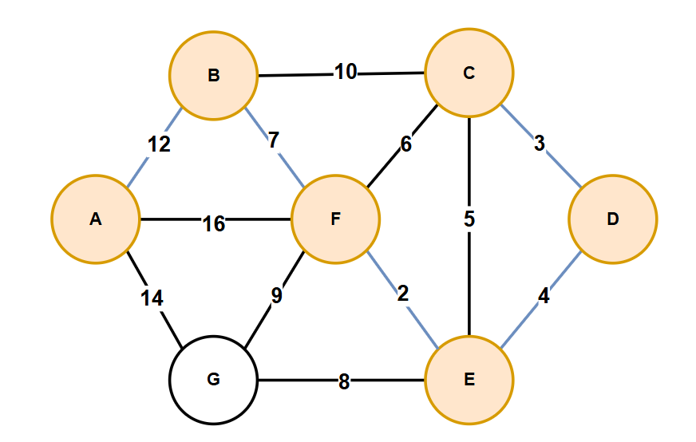

这时候再看C，注意，这时候看C你会发现C的四条边是不是对应的顶点是不是都被激活了，很多时候可能会认为就是跟着顶点跟着边走，但这里不是，这里C激活以后后面没有顶点了，那么我们这时候直接激活G，因为整个顶点就剩G没激活了，那这时候G的三条边，我们选择最小的肯定就是8了，也就如下：

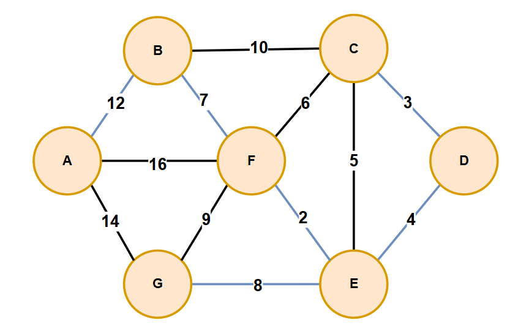

那么这就是Prim算法的一个基本思路，你会发现这个图最后的最小生成树根Kruskal算法生成的树是一样的，但在实际中其实并不是一样的，只是因为这个图设计的问题，所以不要认为Kruskal算法和Prim算法最后生成的树是一样的，那我们接着来看代码怎么写怎么设计

#### Prim算法代码实现

##### Prim代码逻辑分析

首先我们来思考一下，我们这时候可能需要这么几个集合，第一个是cost集合，什么意思呢，就是我那些顶点被激活，同时这个边又是怎么激活的，还有一个vistied集合，这个是用来存储我们已经激活的顶点，用来防止我们再次重复激活顶点

那我们先看初始化的时候怎么初始化，一开始的时候这些边的权值是不是都不知道，或者说没有顶点激活的时候我们看不到这些边，那我们初始化的时候是不是需要把这些边设置什么大小的值呢？很明显我们得设置为无穷大，为什么不能设置为0，因为如果设置0的话，我们激活这些顶点的时候，拿到边的权值跟0比怎么比都是0最小，所以这时候我们选择无穷大，也就如下：

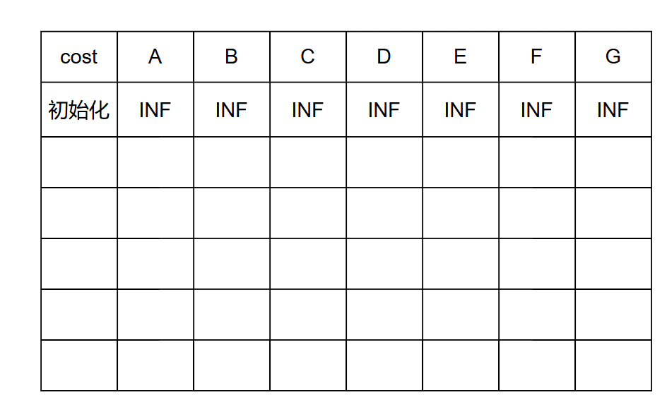

那么这时候我们激活第一个顶点A，那么这时候对应的vistied是不是要标记一下A被激活了，那A能看到3个边分别是B、G、F那么权值我们在上面的表格里面修改一下，如下：

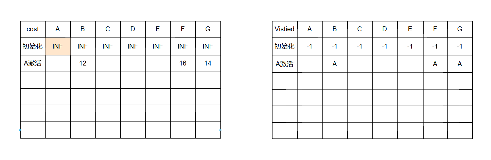

那这时候看权值最小的就是B，那这时候激活B，如下：

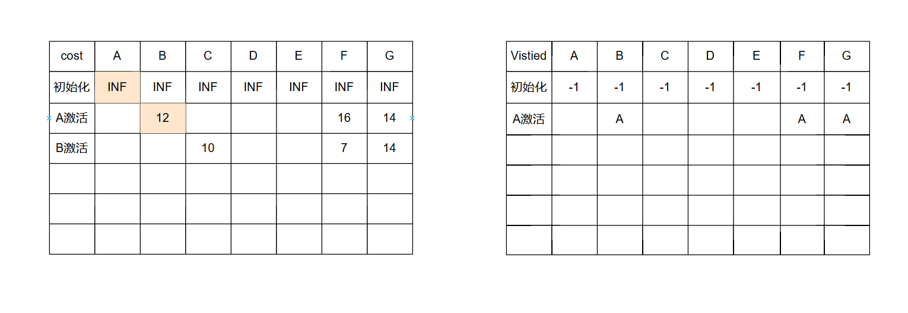

那么以此类推，最后就变成这样：

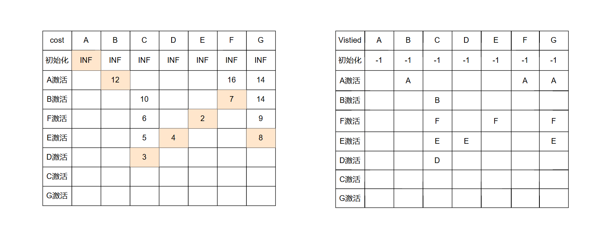

当然这里看D激活3以后激活C，C这里会发现到别的边都激活了，所以这时候激活最上面的那个8，也就是把G激活，我们后面那个图表示的我那个顶点能到你这个顶点，整体的设计差不多就这样，我们来看具体代码

##### Prim具体代码

```c
int PrimMGraph(const MGraph* graph, int startV, EdgeSet* result) {
	int *cost = malloc(sizeof(int) * graph->nodeNum);			// 图中各顶点的权值数组
	int *mark = malloc(sizeof(int) * graph->nodeNum);			// 图中顶点激活的状态
	int *visited = malloc(sizeof(int) * graph->nodeNum);		// 从哪个顶点开始访问，-1表示没有被访问到
	int sum = 0;
	// 1. 更新第一个节点激活的状态
	for (int i = 0; i < graph->nodeNum; i++) {
		cost[i] = graph->edges[startV][i];
		mark[i] = 0;
		// 1.1 更新visit信息，从哪个节点可以访问
		if (cost[i] < INF) {
			visited[i] = startV;
		} else {
			visited[i] = -1;
		}
	}
	mark[startV] = 1;
	int k = 0;
	// 2. 动态激活节点，找最小值
	for (int i = 0; i < graph->nodeNum - 1; ++i) {
		int min = INF;
		k = 0;
		for (int j = 0; j < graph->nodeNum; ++j) {
			if (mark[j] == 0 && cost[j] < min) {
				min = cost[j];
				k = j;
			}
		}
		mark[k] = 1;
		result[i].begin = visited[k];
		result[i].end = k;
		result[i].weight = min;
		sum += min;
		// 每激活一个顶点，需要更新cost数组
		for (int j = 0; j < graph->nodeNum; ++j) {
			if (mark[j] == 0 && graph->edges[k][j] < cost[j]) {
				cost[j] = graph->edges[k][j];
				visited[j] = k;
			}
		}
	}

	free(cost);
	free(mark);
	free(visited);

	return sum;
}

```

那我们来看一下这个代码具体写了什么，这个代码要包含之前写的邻接矩阵和边集数组，代码内容如下：

```
 graph: 表示指向邻接矩阵的图结构
 * startV:表示激活的第一个顶点坐标
 * result:表示最小生成树的边的激活情况
```

- 首先按照我们上面说的，我们定义一个cost数组，这个数组指的是图里面的权值数组，然后是mark数组，这里代表的是图的顶点激活状态就是指的是我们是否激活这个顶点了，当然我上面说的内容有点瑕疵，vistied数组指的是我从哪个顶点访问的，-1就代表没有顶点访问
- 接下来我们看第一部分内容，这一部分的内容有点类似于初始化，startV我们传入的第一个激活坐标，这时候我们一个循环，cost[i]这里等于的使我们邻接矩阵里面的权值，如果没有那我们就默认为INF，这时候我们再让mark[I]里面的内容都为0，我们用0来表示是没访问了，1表示访问了，这时候再做个比较，如果cost[i]值为INF那就说明没有任何结点相互访问，这时候vitied[I]也就是-1
- 那这时候进入第二部分，开始正式的Prim算法，我们先标记我们这个开始的顶点为1，这时候我们再定义一个k来辅助我们，那接下来就是找最小值，我们定义一个min为INF，这时候我们再写一个循环，来遍历我们上面的cost数组来找里面权值最小的，找到以后我们标记这个顶点为激活状态，然后我们传入result数组，那么他的开始肯定就是vistied里面的值，结束也就是k，然后sum++它的权值
- 这时候我们每激活一个顶点，我们都要更新一下cost数组，因为按照我们上面说的cost，每一次都是在一行一行的找，所以这里需要更新一下，更新的逻辑也很简单

那么这就是Prim算法

#### Prim算法与Kruskal算法的比较

##### 1. 最小生成树的基本概念

在连通带权无向图中，最小生成树（Minimum Spanning Tree, MST）是指包含所有顶点且边权之和最小的子树（无环、连通）。Kruskal 算法和 Prim 算法是求解最小生成树的两种经典贪心算法，核心思想均为 “每次选择当前最优解”，但实现方式和适用场景存在显著差异。

##### 2. Kruskal 算法实现最小生成树的过程

Kruskal 算法以 “边” 为核心，通过逐步选择权重最小的边构建生成树，同时避免形成环。具体步骤如下：

1. **排序所有边**：将图中所有边按权重从小到大排序；
2. **初始化数据结构**：创建并查集（Union-Find），用于记录顶点的连通关系（初始时每个顶点独立成树）；
3. **筛选边并构建树**：按排序后的顺序遍历边，若边的两个顶点属于不同连通分量（通过并查集判断），则将该边加入生成树，并合并两个顶点的连通分量；
4. **终止条件**：当生成树中包含`n-1`条边（`n`为顶点数）时，停止遍历，此时已得到最小生成树。

##### 3. Prim 算法实现最小生成树的过程

Prim 算法以 “顶点” 为核心，从一个起始顶点出发，逐步扩展生成树的顶点集，始终保持树的连通性。具体步骤如下：

1. 初始化数据结构：
   - 标记数组：记录顶点是否已加入生成树（初始时仅起始顶点被标记）；
   - 优先级队列（最小堆）：存储 “候选边”（即一端已在生成树中、另一端未在的边），按权重从小到大排序；
2. 扩展生成树：
   - 从堆中取出权重最小的边，若该边的未标记顶点未被加入树，则将其标记为 “已加入”，并将该边加入生成树；
   - 遍历新加入顶点的所有邻边，若邻边的另一端未被标记，则将该邻边加入优先级队列；
3. **终止条件**：当生成树中包含`n-1`条边时，停止扩展，此时已得到最小生成树。

##### 4. 两种算法的核心差异

| 对比维度     | Kruskal 算法                   | Prim 算法                                    |
| ------------ | ------------------------------ | -------------------------------------------- |
| 处理核心     | 以 “边” 为中心，全局筛选最小边 | 以 “顶点” 为中心，从局部扩展顶点集           |
| 核心数据结构 | 并查集（用于检测环）+ 排序算法 | 优先级队列（最小堆，用于选最小边）+ 标记数组 |
| 环检测方式   | 通过并查集判断两顶点是否连通   | 天然无环（仅从已选顶点扩展新顶点）           |
| 扩展逻辑     | 边的筛选与合并连通分量         | 顶点的逐步加入与邻边更新                     |

##### 5. 两种算法的优缺点分析

###### 5.1 Kruskal 算法的优缺点

- 优点：
  - 对稀疏图（边数少）效率更高，因为排序边的成本（`O(E log E)`）低于遍历大量边的开销；
  - 实现逻辑直观，依赖的并查集操作（合并、查询）时间复杂度接近`O(1)`（路径压缩 + 按秩合并优化后）。
- 缺点：
  - 对稠密图（边数多）效率较低，因为排序大量边会导致时间成本激增；
  - 必须先存储所有边才能排序，不适用于边动态生成的场景。

###### 5.2 Prim 算法的优缺点

- 优点：
  - 对稠密图（边数接近`V²`）效率更高，使用二叉堆时时间复杂度为`O(E log V)`，若用斐波那契堆可优化至`O(E + V log V)`；
  - 无需存储所有边，可边遍历边处理（适合边动态生成的场景）。
- 缺点：
  - 对稀疏图效率低于 Kruskal 算法，因为堆操作（插入、删除）的次数较多；
  - 依赖优先级队列的实现，若堆效率低（如未优化的二叉堆），整体性能会下降。

##### 6. 适用场景总结

- **Kruskal 算法**：更适合稀疏图（如社交网络、路由拓扑图），或需要显式处理边排序的场景；
- **Prim 算法**：更适合稠密图（如电路连接图、稠密通信网络），或边动态生成、无需预存所有边的场景。

两种算法均能得到最优解，但需根据图的稠密程度和数据存储方式选择更高效的实现。

### Dijkstra算法(最短路径)

#### Dijkstra算法概述

**一、最短路径相关核心概念**

1. 源点与终点​

路径起始的第一个顶点称为源点（Source），最后一个顶点称为终点（Destination）。二者是相对一条具体路径而言的，图中的任意一个顶点都可作为源点或终点。例如在路径 V0->V1->V4->V6->V8 中，V0 是源点，V8 是终点；若路径变为 V8->V6->V4，则 V8 成为源点，V4 成为终点。

2. 最短路径的定义​

最短路径的具体含义随图的类型有所不同：

- 无向图中，从源点到终点的最短路径通常指包含边的数量最少的路径，可通过广度优先搜索获取，当搜索到终点时即可终止。

- 带权图中，最短路径指路径上所有边的权值之和最小的路径，权值可代表距离、时间、费用等实际指标，此时需通过专门的最短路径算法计算。

**二、最短路径算法的存在意义**

1. 现实问题的解决需求​

在日常生活和生产中，大量场景需要寻找 “最优路线”，本质上都是最短路径问题。这类问题无法通过简单的直观判断解决，尤其当路径选项繁多、存在多重约束（如距离、时间、成本）时，必须依赖系统化的算法进行计算。

2. 典型应用场景举例​

以从北京大兴机场到天安门的路线规划为例：

- 若追求换乘最少（对应无向图中 “边数最少” 的最短路径），需找到途经站点数量最少的公共交通方案；

- 若追求耗时最少（对应带权图中 “权值和最小” 的最短路径），需综合考虑各段路程的行驶时间、换乘等待时间等，计算总耗时最短的路线。

我们日常使用的导航系统，其道路规划功能的底层逻辑就依赖于最短路径算法，只不过会额外结合实时路况等动态信息进行优化。

**三、迪杰斯特拉（Dijkstra）算法概述**

1. 算法定位与核心目标​

Dijkstra 算法是一种 “单源点” 最短路径算法，核心目标是求得从图中某一个指定源点出发，到其他所有顶点的最短路径。与需计算任意两顶点间路径的弗洛伊德（Floyd）算法不同，它专注于单一源点的路径求解，若需获取所有顶点间的路径，可通过重复执行 n 次（n 为顶点数）实现。

2. 基本实现思路简化解析​

算法通过维护三个辅助变量完成计算，核心逻辑为 “逐步确定最短路径”：

- 辅助向量 D：存储当前已找到的从源点到各顶点的最短路径长度，初始时，若源点到某顶点有直接边，则 D 的值为该边的权值，否则为无穷大；

- 路径向量 P：存储最短路径的前驱顶点下标，用于后续追溯完整路径；

- 向量 Final：标记各顶点的最短路径是否已确定，值为 1 表示已求得，初始时仅源点的 Final 值为 1。

计算过程围绕 “迭代更新” 展开：每次从 Final 值为 0 的顶点中，找到 D 值最小的顶点，标记其 Final 值为 1，然后以该顶点为中间点，更新源点到其他未确定顶点的最短路径长度（若经中间点的路径更短，则更新 D 和 P 的值），重复此过程直至所有顶点的 Final 值均为 1。

**四、算法的适用场景与局限性**

1. 适用场景​

适用于不含负权值边的图，包括无向图和有向图，尤其在交通路线规划、网络数据传输路径优化、物流配送路线设计等场景中应用广泛。例如物流行业中，以仓库为源点，计算到各配送点的最短路径可降低运输成本。

2. 主要局限性​

- 无法处理含负权值边的图：若图中存在负权边，算法可能会得出错误的最短路径结果；

- 单源点限制：仅能求解单一源点的路径，若需多源点路径，计算效率相对较低（时间复杂度为 O (n³)，与弗洛伊德算法一致，但实现不如后者简洁）。不过实际场景中，负权值情况较少，且可通过小顶堆等方式优化其基础计算效率。

#### Dijkstra算法逻辑详解

好那么我们再看一下Dijkstra算法具体是怎么实现的，我们来看下图：

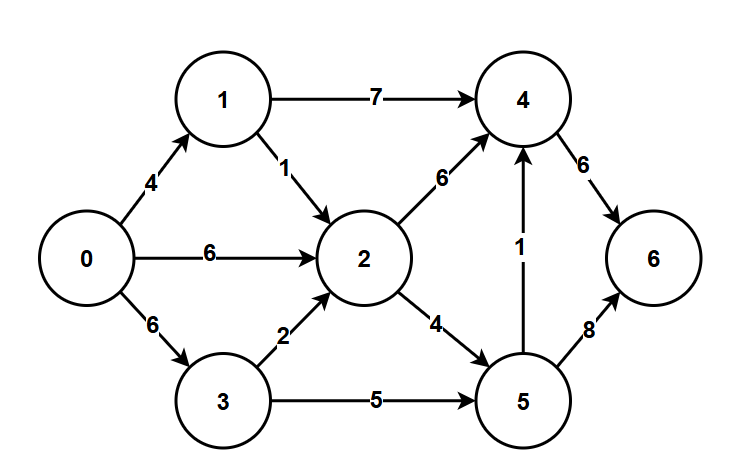

我们这里的迪杰斯特拉算法是指的是我们选一个源点，然后这个源点到其他每个顶点的最短路径，也就是不会给出任何终点，这里我们要求的是源点到每个顶点的最短路径，这时候我们看，假设我们以0为源点，我们看0到其他每个顶点的最短路径是什么，这时候激活0我们看有三条路径到三个顶点，分别是1、2、3，那我们这时候0到1、2、3为它们这个边本身，那我们这里按照迪杰斯特拉算法思想，我们找最小的，这时候激活1，也就如下：

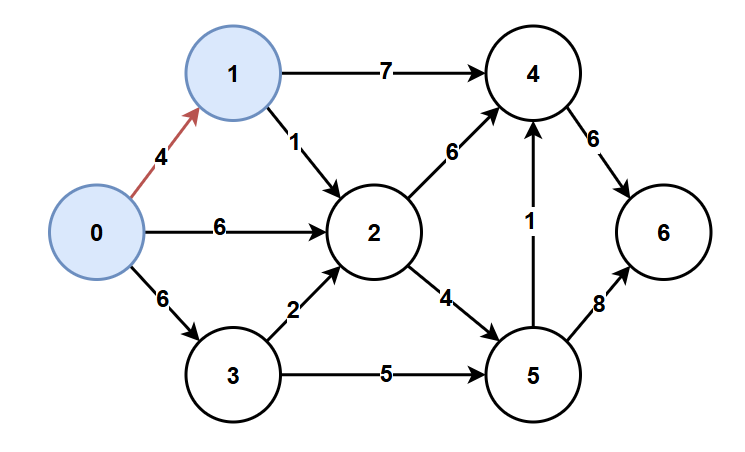

（这里注意我们这里标注颜色只是辅助我们理解，我们这里并没有终点这个概念）

那这时候我们看1这个顶点，又会发现两条新的路径，这时候注意我们发现到2的这个权值和是不是要小于0直接到2的那条边权值，那我们这时候是不是就可以更新0-2最短路径也就是5，这时候我们发现0-4最短路径也有值了那就是11，那这时候再按照贪心算法的思想，这里我们选择一这条边走到2这个顶点，如下：

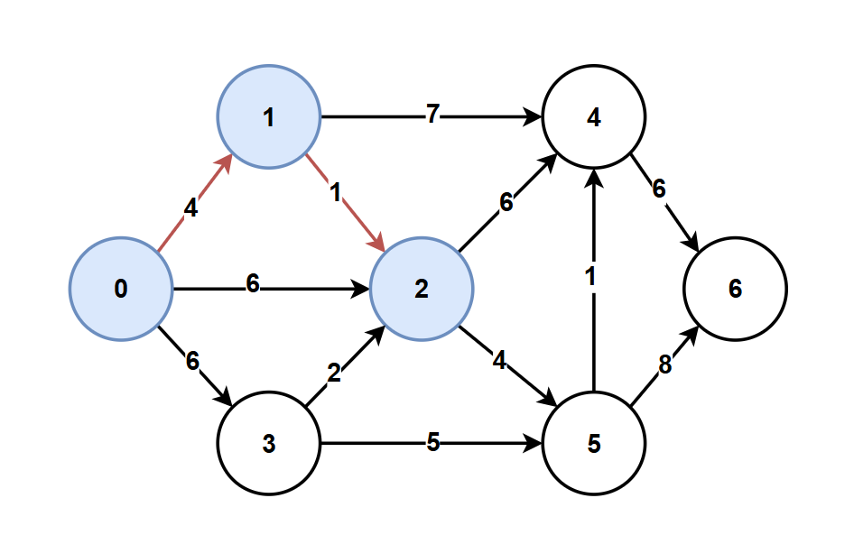

那这时候走到2的时候会发现，2是不是有两条边，那我们这时候看，0-4路径是不是可以0-1-2-4但这时候权值不变，所以这个我们也不需要修改，这时候看5,0-5是不是0-1-2-5这时候最小，权值为9，那这时候我们就可以激活5这个顶点，如下：

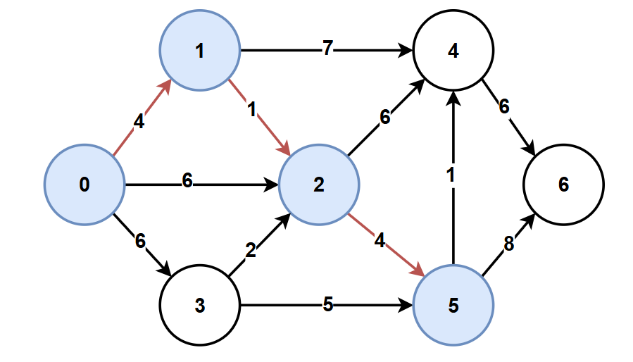

那这时候到5的时候是不是也有两条路，这时候我们看5-4和5-6，那这时候会发现0-1-2-5-4和0-1-4的权值相比更小，所以这时候我们就可以更新0-4权值更新为10，同样我们激活4这个顶点，如下：

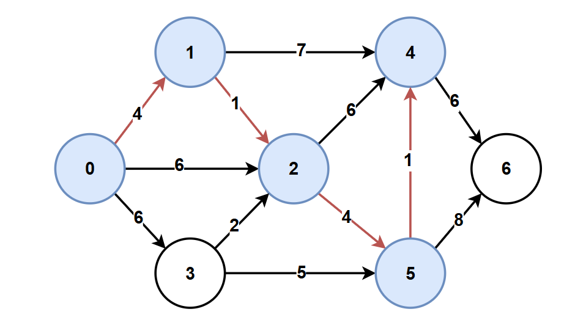

那这时候很明显4只有一条路径通往6，那我们0-6的最短路径是不是也就找到了，那很显然权值为16，那么整个这个图的从源点到任意顶点的最短路径我们就找到了，也就是下面的：

- 0-1：4
- 0-2：5
- 0-3：6
- 0-4：10
- 0-5： 9
- 0-6： 16

那么这就是迪杰斯特拉算法的一个核心思路，本质上还是需要贪心算法，用来找源点到顶点之间的最短路径

那我们接下来看一下从代码的角度怎么去写

#### Dijkstra算法代码实现

##### Dijkstra算法代码逻辑概述

那我们来想一下我们可能需要哪些结构，首先我们需要一个dist数组，这个是干什么的，这个是用来存储每个源点到其他顶点之间的距离，或者就是权值，整体如下：

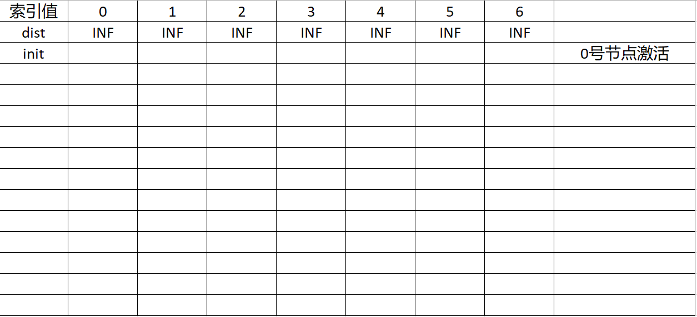

那我们初始化的时候肯定要把边的权值全部初始化为INF，为什么要是无穷大跟之前说的prim算法是一个逻辑，那么还有一个是什么呢，那就是path数组，这个是用来存储最短路径这个路是怎么走的，就是比如我们要找0-4这个结点最短路径是怎么走的，也就是下面这样：

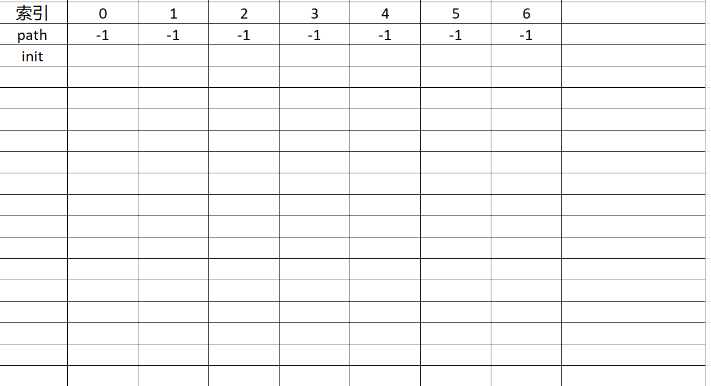

那么一开始初始化肯定都是-1，那我们接着举个例子看一下，比如这时候激活0号节点，也就是源点，那我们上面怎么修改，如下：

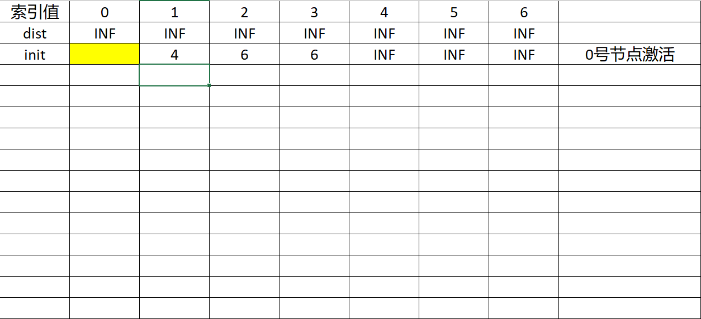

那这时候我们就更新一下路径值，这时候我们知道0可以看到1、2、3这时候权值就可以更新为4、6、6其他的这时候没有发现路径，那么这时候其他保持不变还是INF，那么对于path数组来说，也就如下：

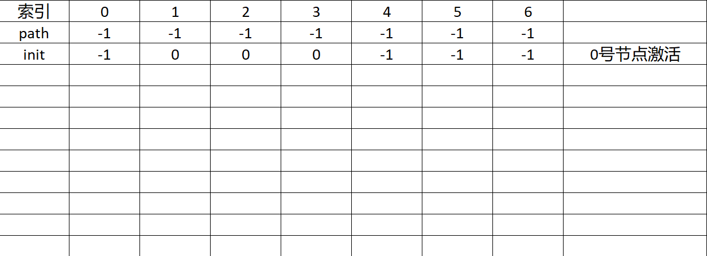

我们这时候更新对应的数字索引即可，那么后续不再举例子，我们看最终结果，如下：

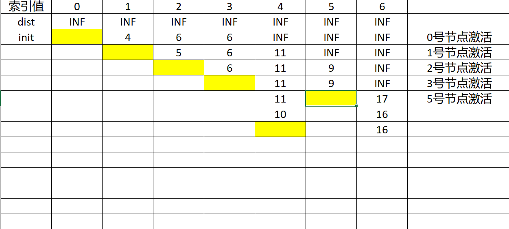

那这就是代码设计的大概思路，那我们接下来看具体代码实现。

##### Dijkstra算法代码具体实现

```c
void DijkstraMGraph(const MGraph* graph, int start, int dist[], int path[]) {
	int *mark;			// 节点的访问记录
	mark = malloc(graph->nodeNum * sizeof(int));
	// 1. 激活start后，节点距离表dist更新，path数组的初始化，根节点对应-1
	for (int i = 0; i < graph->nodeNum; ++i) {
		dist[i] = graph->edges[start][i];
		mark[i] = 0;
		if (dist[i] < INF) {
			path[i] = start;
		} else {
			path[i] = -1;
		}
	}
	mark[start] = 1;
	path[start] = -1;
	dist[start] = 0;
	// 2. 从dist里找最小值
	int mini;
	int tmpIndex = 0;
	for (int i = 0; i < graph->nodeNum - 1; ++i) {
		mini = INF;
		// 从未激活的节点中，找到一个源点的最短路径
		for (int j = 0; j < graph->nodeNum; ++j) {
			if (mark[j] == 0 && dist[j] < mini) {
				mini = dist[j];
				tmpIndex = j;
			}
		}
		mark[tmpIndex] = 1;
		// 以刚激活的节点，更新源点到其他节点路径
		for (int j = 0; j < graph->nodeNum; ++j) {
			if (mark[j] == 0 && dist[tmpIndex] + graph->edges[tmpIndex][j] < dist[j]) {
				dist[j] = dist[tmpIndex] + graph->edges[tmpIndex][j];
				path[j] = tmpIndex;
			}
		}
	}

	free(mark);
}
```

代码内容如下：

- 首先我们看传入的参数，传入的参数很显然，我们要传入图，然后传入源点，然后这里传入dist数组和path数组
- 然后第一大块的内容，类似于prim算法里面的初始化，这里我们还是要引入一个辅助的mark数组，用来标记哪些结点我们已经访问过了，然后第一个for循环，很简单，我们传入源点里面的第一个相邻的边的权值，如果这时候有权值了，那么我们可以在path里面更改为源点，结束以后，源点我们是不是看过了所以为1，然后path因为我们这里是走源点出去的，没有人会回到源点，所以这里为-1，最后源点到自己本身的距离肯定为0.
- 第二部分从dist里面找最小值，我初始化了以后激活了源点以后后面是不是对应dist数组里面有值了，这里面我们去找最小值，找到以后我们返回索引值，然后标记这个索引值为1
- 那接下来就从激活的这个结点继续去遍历，如果这时候发现dist索引值加上新的边这时候发现比原来的小，那么这时候我们更新原来的权值，同时更新path路径
- 最后释放mark

那么这就是迪杰斯特拉算法的核心要素

#### Dijkstra算法总结

##### 1. 算法核心作用

Dijkstra 算法是一种用于求解**单源最短路径**的经典算法。其核心功能是：在一个带权图（可以是有向图或无向图）中，从指定的起点（源点）出发，计算该起点到图中所有其他顶点的最短路径长度。

##### 2. 适用条件

- **图的类型**：适用于带权图（边具有非负权重），支持有向图和无向图。
- **权重限制**：图中所有边的权重必须为**非负数**（≥0）。这是关键限制，若存在负权边，算法可能会得出错误结果（因贪心策略无法处理负权导致的路径长度回退）。
- **路径存在性**：默认图是连通的（或至少源点能到达其他顶点），若某顶点不可达，其最短路径长度通常记为无穷大（∞）。

##### 3. 基本思想

Dijkstra 算法基于**贪心策略**，核心思路是：

1. 维护一个 “已确定最短路径的顶点集合”（记为 S）和一个 “未确定最短路径的顶点集合”（记为 U）。
2. 初始时，仅源点属于 S，其到自身的最短路径长度为 0；其他顶点属于 U，到源点的初始距离为无穷大（除源点的直接邻接点，初始距离为对应边的权重）。
3. 每次从 U 中选择**当前距离源点最近的顶点**，将其加入 S，并以该顶点为中间点，更新 U 中剩余顶点到源点的距离（若经过该顶点的路径更短，则更新距离）。
4. 重复步骤 3，直到所有顶点都加入 S，此时所有顶点的最短路径长度均已确定。

##### 4. 算法步骤

1. **初始化**：
   - 设源点为 v₀，创建距离数组 dist []，其中 dist [i] 表示源点到顶点 i 的最短路径长度。初始时 dist [v₀] = 0，其他 dist [i] = ∞。
   - 创建布尔数组 visited []，标记顶点是否已加入集合 S（已确定最短路径），初始时 visited [v₀] = true，其他为 false。
2. **迭代更新**：
   - 从 U（未标记顶点）中找到 dist 值最小的顶点 u，将其标记为 visited [u] = true（加入 S）。
   - 对所有与 u 相邻且未标记的顶点 v，若 dist [v] > dist [u] + 边 (u, v) 的权重，则更新 dist [v] = dist [u] + 边 (u, v) 的权重。
3. **终止条件**：
   - 当所有顶点均被标记（visited [] 全为 true）时，算法结束，dist [] 中存储的即为源点到各顶点的最短路径长度。

##### 5. 时间复杂度分析

时间复杂度取决于 “从 U 中查找 dist 最小值” 和 “更新邻接顶点距离” 的实现方式，核心影响因素是顶点数 n 和边数 m：

- **用数组线性查找最小值**：
  - 每次从 U 中找最小值需遍历 n 个顶点，共需 n 次迭代，时间为 O (n²)。
  - 更新邻接顶点距离的总操作次数为 O (m)（每条边最多被处理一次）。
  - 总时间复杂度：O (n² + m)，适用于稠密图（m 接近 n²）。
- **用二叉堆（优先队列）查找最小值**：
  - 每次插入 / 提取最小值的时间为 O (logn)，共需 O (n) 次提取和 O (m) 次插入（或更新），总堆操作时间为 O ((m + n) logn)。
  - 总时间复杂度：O ((m + n) logn)，适用于稀疏图（m 远小于 n²）。
- **用斐波那契堆优化**：
  - 提取最小值时间为 O (logn)，更新距离时间为 O (1)，总时间复杂度可降至 O (m + nlogn)，但因实现复杂，实际应用中较少使用。

##### 6. 优缺点

- **优点**：
  - 效率高：在非负权图中，是求解单源最短路径的高效算法，尤其适合稀疏图（堆优化后性能优异）。
  - 思路直观：基于贪心策略，逻辑清晰，易于理解和实现。
- **缺点**：
  - 无法处理负权边：若图中存在负权边，算法可能失效（无法保证找到最短路径）。
  - 仅支持单源路径：每次运行只能计算一个源点到其他顶点的路径，若需多源路径需多次运行。
  - 存储空间：需维护距离数组和标记数组，空间复杂度为 O (n)。

##### 7. 与其他最短路径算法的区别

- **与 Floyd-Warshall 算法**：
  - Floyd-Warshall 是多源最短路径算法（一次计算所有顶点间的路径），时间复杂度 O (n³)，支持负权边（但不支持负环），适用于顶点数少的图。
  - Dijkstra 是单源算法，时间复杂度更低，仅支持非负权边。
- **与 Bellman-Ford 算法**：
  - Bellman-Ford 支持负权边，还能检测负环（若存在负环，最短路径无意义），但时间复杂度 O (nm)，效率低于 Dijkstra。
  - Dijkstra 不支持负权边，但在非负权场景下效率更高。

### 拓扑排序

#### 拓扑排序概述

**定义**

拓扑排序是图论中的一种线性排序算法，仅适用于有向无环图（DAG）。其核心是将图中所有顶点排列成一个序列，满足两个条件：一是每个顶点仅出现一次；二是若图中存在从顶点 A 到顶点 B 的有向边，则 A 在序列中必然排在 B 之前。简单来说，这是将图中顶点的 “偏序关系”（部分顶点存在先后依赖）转化为 “全序关系”（所有顶点形成明确先后顺序）的过程。

**关键前置概念**

- 有向无环图（DAG）：指由有向边连接顶点，且不存在任何闭环的图。这是拓扑排序的前提，若图中存在环，则无法进行拓扑排序（如 “任务 A 依赖任务 B，任务 B 依赖任务 A” 的矛盾关系）。

- 入度与出度：入度指指向某一顶点的边的数量（即该顶点的 “前置依赖” 数量）；出度指从该顶点出发的边的数量（即该顶点的 “后续影响” 范围）。

- AOV 网：即 “活动顶点网”，是一种特殊的有向无环图，其中顶点代表活动（如任务、课程），有向边代表活动间的先后依赖关系，拓扑排序本质上就是为 AOV 网构造合理执行顺序的过程。

**拓扑排序的典型应用场景**

**课程安排问题**

在高校课程体系中，许多课程存在先修要求（如 “数据结构” 需先修 “程序设计基础”）。此时可将课程抽象为顶点，先修关系抽象为有向边（从先修课程指向后续课程），通过拓扑排序即可得到合法的学习顺序。例如，若课程 0 需先修课程 1，课程 1 无先修要求，则拓扑排序结果为 “1→0”；若课程 3 需先修课程 1 和 2，课程 1、2 需先修课程 0，则可能的排序结果为 “0→1→2→3” 或 “0→2→1→3”。

**任务调度问题**

在项目开发中，任务间常存在依赖关系（如 “开发后端 API” 需先完成 “设计数据库”，“编写文档” 需先完成 “设计数据库”）。将任务作为顶点，依赖关系作为有向边，拓扑排序可避免执行顺序冲突。例如，任务 A（设计数据库）、B（开发后端 API，依赖 A）、C（开发前端界面，依赖 B）、D（编写文档，依赖 A），通过拓扑排序可得到 “ A→B→C→D ” 或 “ A→D→B→C ” 等合法执行顺序。

**拓扑排序的实现逻辑**

拓扑排序主要有两种经典实现方法，核心均围绕 “处理入度为 0 的顶点” 展开，同时可检测图中是否存在环。

**Kahn 算法（基于入度）**

这是一种直观的贪心算法，核心通过维护顶点入度实现排序，步骤如下：

1. 初始化：遍历图中所有顶点，计算每个顶点的入度，并构建邻接表（记录每个顶点的后续邻接顶点）。

1. 构建初始队列：将所有入度为 0 的顶点加入队列（这类顶点无前置依赖，可直接开始处理）。

1. 循环处理队列：

- 从队列中取出一个顶点，将其加入排序结果序列。

- 遍历该顶点的所有邻接顶点，将每个邻接顶点的入度减 1（相当于移除 “当前顶点指向邻接顶点” 的边）。

- 若某邻接顶点的入度减为 0，说明其所有前置依赖已处理完毕，将其加入队列。

1. 结果校验：若排序结果序列的长度等于图中顶点总数，则排序成功；否则说明图中存在环，无法完成拓扑排序。

**DFS 算法（基于深度优先遍历）**

该方法通过深度优先遍历探索顶点的依赖链，核心是 “后序遍历 + 逆序输出”，步骤如下：

1. 初始化：创建访问标记数组（标记顶点是否已处理），以及临时栈（存储遍历结果）。

1. 递归遍历：

- 选取一个未访问的顶点，标记为 “正在访问”，防止检测到环。

- 递归遍历该顶点的所有邻接顶点，直至某顶点无邻接顶点（或邻接顶点均已处理）。

- 将当前顶点压入栈中，并标记为 “已处理”。

1. 检测环：若遍历过程中遇到 “正在访问” 的顶点，说明图中存在环，无法排序。

1. 生成结果：将栈中的顶点依次弹出，得到的序列即为拓扑排序结果（因后序遍历确保了后续顶点先入栈，逆序后满足前驱顶点在前的要求）。

**拓扑排序的核心特性与复杂度**

**核心特性**

- 结果不唯一：同一有向无环图可能存在多种合法的拓扑排序结果，只要满足依赖关系即可。

- 环检测能力：两种实现方法均能通过结果长度（Kahn 算法）或访问标记（DFS 算法）检测图中是否存在环，这是判断依赖关系是否存在矛盾的关键。

**时间与空间复杂度**

- 时间复杂度：两种算法的时间复杂度均为 O (V+E)，其中 V 为顶点数，E 为边数。构建邻接表需 O (E) 时间，遍历所有顶点和边需 O (V+E) 时间。

- 空间复杂度：为 O (V+E)，主要用于存储邻接表（O (E)）、入度数组或访问标记（O (V)）以及队列 / 栈（O (V)）。

#### 拓扑排序算法逻辑详解

那么接下来我们来看看拓扑排序怎么实现吧，如下图：

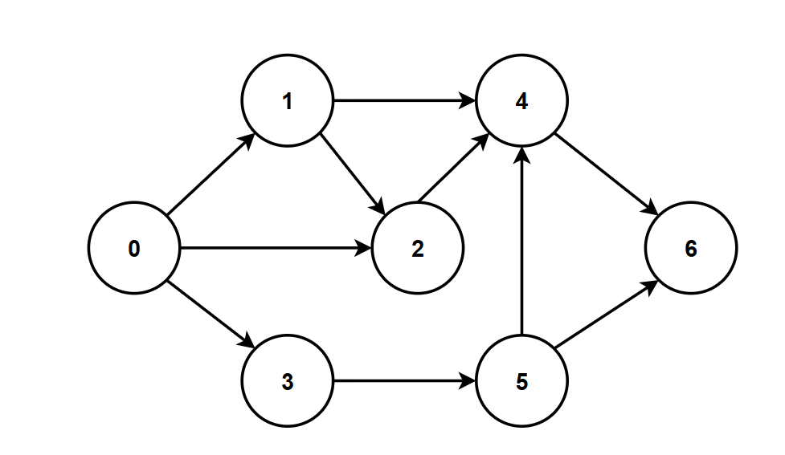

这很显然是一个有向无环图，拓扑排序适用条件也是有向无环图，那么接下来我们看它是个怎么个排法

拓扑排序其实就下面的这几步：

1. 找到图中入度为0的顶点，把这些顶点放入缓存区（栈、队列）
2. 从缓存区中取出一个顶点，放入结果集，这个顶点任务执行完毕
3. 顶点的出度对应的其余顶点的入度清0
4. 查找入度为0的顶点，如果有继续放入缓存区
5. 重复2-3-4
6. 缓存区为空时，结果集中的顶点个数和实际图中顶点个数，如果相等，没有环

那么这就是拓扑排序的思路，那我们这时候把0拿出来，入栈，那么这时候对应是不是下面这样：

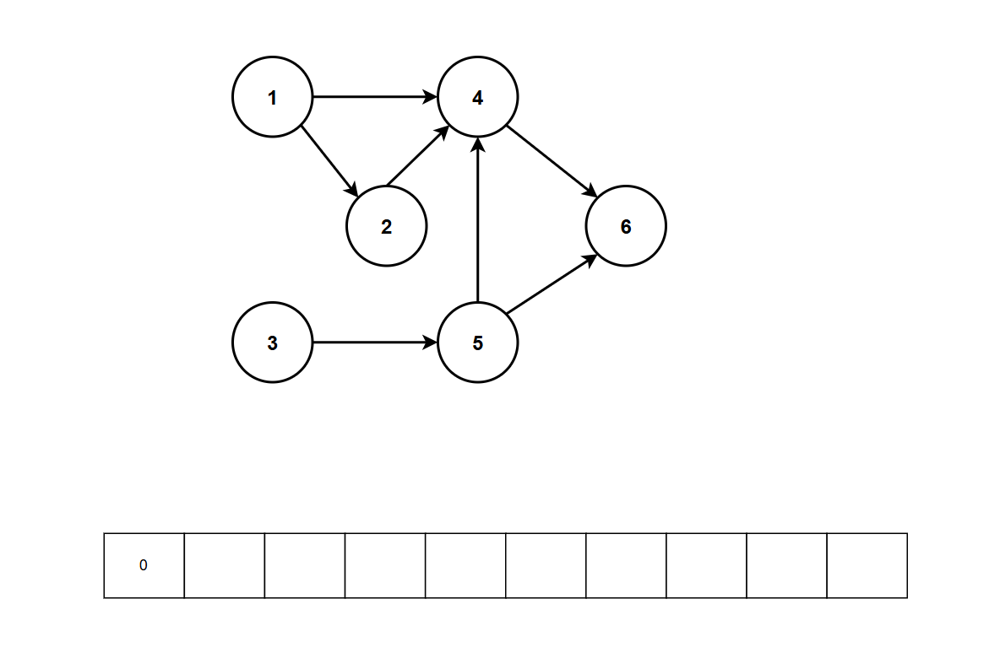

那么这个时候我们再将0出栈，入到结果集里面，这时候我们发现1和3的入度是不是为0，那么这时候我们再入栈，也就如下：

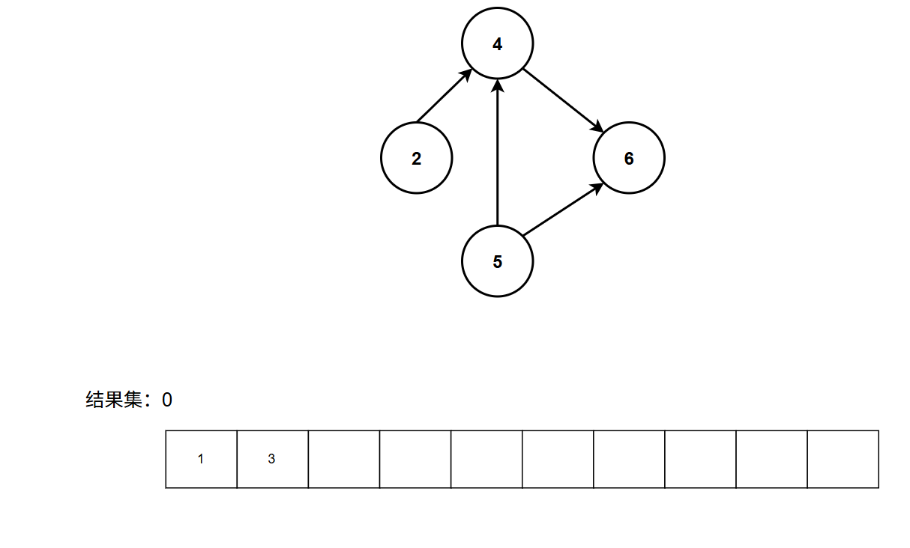

那么接下来的操作跟上述一致，这里不再举例，最后入的是不是6出的是不是也是6，那么最后结果集也就如下：

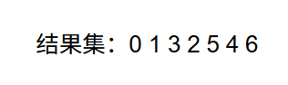

那么这就是拓扑排序的一个算法思路，那么我们接下来看代码怎么实现

#### 拓扑排序代码实现

##### 拓扑排序代码逻辑概述

那我们接下来来想一下拓扑排序可能需要用到那些结构，我们知道这里面我们要计算入度那这时候是不是我们之前写的邻接表就用的到了，但这时候可能还缺了一样东西，这时候我们再额外设计一个入度值，什么意思呢，这个是用来辅助我们让我们知道每个顶点的入度值是多少，这样可以方便我们写拓扑排序，也就如下：

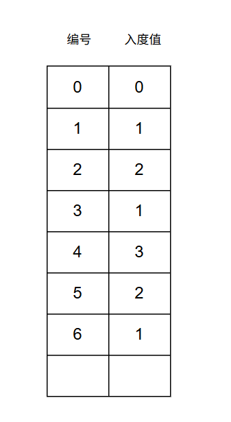

那这个入度值是怎么计算的，很简单我们只需要在遍历邻接表的时候，统计一下顶点的出度值，然后转换成对应顶点的入度值+1即可，当然初始化的时候我们肯定是默认为0的，那么这就是拓扑排序所需要的代码结构，接下来我们看具体怎么写

##### 拓扑排序具体代码实现

```c
int TopologicalSortAGrap(const AGraph* graph) {
	int count = 0;
	// 定义一个入度记录表，便于发现入度为0时，放入缓存区
	int *inDegree;
	inDegree = malloc(sizeof(int) * graph->nodeNum);
	if (inDegree == NULL) {
		return -1;
	}
	memset(inDegree, 0, sizeof(int) * graph->nodeNum);
	// 初始化入度记录表
	for (int i = 0; i < graph->nodeNum; i++) {
		if (graph->nodes[i].firstEdge) {		// 说明i节点开始有边
			ArcEdge *edge = graph->nodes[i].firstEdge;
			while (edge) {
				++inDegree[edge->no];
				edge = edge->next;
			}
		}
	}

	// 查找入度记录表，度为0的顶点，设计一个链式栈的缓存区，更新入度记录表时，发现0，就放入任务栈
	int *stack = malloc(sizeof(int) * graph->nodeNum);
	if (stack == NULL) {
		free(inDegree);
		return -1;
	}
	int top = -1;
	for (int i = 0; i < graph->nodeNum; ++i) {
		if (inDegree[i] == 0) {
			stack[++top] = i;
		}
	}

	// 根据任务栈里的数据，弹出第一个任务，这个任务对应的节点相关的入边个数删除
	// 更新入度记录表，如果更新过程中，发现入度为0，直接入栈
	int index;
	while (top != -1) {
		index = stack[top--];
		count++;
		visitAGraphNode(&graph->nodes[index]);
		// 更新入度信息
		ArcEdge *edge = graph->nodes[index].firstEdge;
		while (edge) {
			--inDegree[edge->no];
			if (inDegree[edge->no] == 0) {
				stack[++top] = edge->no;
			}
			edge = edge->next;
		}
	}

	free(inDegree);
	free(stack);
	if (count == graph->nodeNum) {
		return 0;
	} else {
		return 1;
	}
}
```

代码内容如下：

- 首先我们定义一个count用来统计顶点个数，我们知道拓扑排序可以判断一个有向图是有环还是无环的，count最后如果根图里面的顶点个数一样，那么就是有环，反之则没有
- 然后我们按照上面说的定义一个indegree也就是入度数组，这个辅助我们进行操作
- 然后我们就可以开始初始化了，我们循环这个邻接表,从i结点开始也就是0，我们先判断它有没有边，如果有边的话，这时候我们再引入一个辅助指针edge来帮助我们遍历。edge存在的时候，我们++indegree[edge->no]也就是对应加1，然后edge往后走、
- 初始化结束以后我们开始查入度表，开始进行入栈的操作，既然要入栈那肯定我们得有一个栈吧，那怎么入栈呢，很简单遍历一下，判断一下入度表里面有没有等于0的如果等于0，那么这时候就可以入栈了，top指针也可以++了
- 那这时候我们就可以处理缓存区了，我们开始弹栈，我们定义一个index用来帮我们获取对应的索引号，这时候每出栈一次count++，然后我们访问里面对应的节点就可以了，那这时候我们同时也要更新入度表里面的信息，因为我们这里取出一个顶点相当于给它删了，那么这时候我们减去对应入度表里面的值，然后继续遍历，如果发现等土0，继续入栈，重复上述操作
- 最后释放栈和入度表，并判断count是否等于邻接表的顶点数量，结束	

那么这就是拓扑排序的代码实现

#### 拓扑排序总结

**一、拓扑排序的定义与核心性质**

1. **基本定义**

拓扑排序是对**有向无环图（DAG）** 顶点的线性排序方式，若图中存在有向边 (u, v)，则排序序列中 u 必然位于 v 之前。无向图或有环有向图不存在拓扑排序。

1. **关键性质**

- 仅适用于 DAG，有环图无法生成拓扑序列；

- 一个 DAG 可能存在多个有效拓扑序列（除非含哈密尔顿通路）；

- 本质是将图中顶点的偏序关系扩展为全序关系（基于 Szpilrajn 扩展定理）。

**二、拓扑排序的适用场景**

1. **任务调度类场景**

- 项目管理：确定任务执行顺序（如关键路径分析 CPM），计算项目最短完成时间；

- 半导体制造：晶圆工序排序、测试机分配、MES 任务调度等，解决工序依赖问题。

1. **依赖解析类场景**

- 课程安排：根据先修关系生成可行选课序列（如修课需先完成前置课程）；

- 编译系统：解析源文件依赖关系，确定编译顺序避免冲突。

1. **算法扩展场景**

- 并行任务调度：识别可同时执行的任务组（入度为 0 的节点集合）；

- 字典序排序：结合优先队列生成字典序最小的拓扑序列。

**三、核心算法实现与复杂度分析**

**（一）两种经典算法**

1. **Kahn 算法（基于入度表）**

- 步骤：计算顶点入度→入度为 0 的顶点入队→出队并更新邻接顶点入度→重复至队空；

- 优势：天然支持环检测（排序后未处理顶点数≠总顶点数则有环），并行化潜力高。

1. **DFS-based 算法（基于回溯）**

- 步骤：递归遍历顶点→所有邻接顶点访问完毕后入栈→栈顶弹出即为拓扑序（逆后序）；

- 特点：实现简洁，但环检测需额外处理递归状态。

**（二）复杂度与性能对比**

| 特性       | Kahn 算法      | DFS 算法          |
| ---------- | -------------- | ----------------- |
| 时间复杂度 | O(V+E)         | O(V+E)            |
| 空间复杂度 | O(V)           | O (V)（含递归栈） |
| 环检测难度 | 易（直接判断） | 难（需额外标记）  |
| 实际性能   | 通常更快       | 递归开销较大      |
| 适用场景   | 迭代环境       | 深度优先场景      |

**四、算法题中的应用价值**

1. **典型题型**

- 课程顺序问题：如输入 n 门课程及先修关系，返回可行修课序列（若有环返回空）；

▶ 示例：n=4，先修关系 [(1,0),(2,0),(3,1),(3,2)]，可行序列为 [0,2,1,3]。

1. **解题优势**

- 时间复杂度 O (V+E)，可高效处理大规模图（如 V<10⁵、E<10⁶）；

- 同时解决 “排序可行性” 与 “序列生成”，环检测功能可直接判断问题无解情况。

**五、补充关键知识点**

1. **环检测原理**

拓扑排序的核心附加功能：若 Kahn 算法最终处理顶点数＜总顶点数，或 DFS 中遇到已访问的递归栈顶点，则图中存在环。

1. **与其他路径的区别**

- 拓扑排序≠哈密尔顿路径：前者仅满足边的前驱关系，后者需经过所有顶点恰好一次；

- 拓扑排序≠欧拉路径：前者关注顶点顺序，后者关注边的遍历完整性。

1. **优化策略**

- 稀疏图用邻接表存储减少空间；

- 动态图支持增量更新入度表；

- 并行处理入度为 0 的顶点组提升效率。


### 关键路径

#### 关键路径概述

##### 1. AOE 网相关基础概念

###### 1.1 AOE 网的定义

AOE 网（Activity On Edge）是一种带权的有向无环图，专门用于描述工程的进度计划。其中顶点代表事件，弧代表活动，弧上的权值表示完成该活动所需的时间。例如 “打开冰箱门”“将大象装进去”“关上冰箱门” 都是活动，对应图中的弧，而 “冰箱门打开”“大象已装入” 则是事件，对应图中的顶点。

与 AOV 网（顶点表示活动）不同，AOE 网的核心是通过 “边” 来体现具体任务，且能直观展示活动之间的并行关系，比如工程中同时进行的 “采购材料” 和 “场地搭建” 就可作为并行的弧存在。

###### 1.2 源点与汇点

AOE 网中入度为零的顶点称为源点，代表工程的开始；出度为零的顶点称为汇点，代表工程的结束。以 “将大象装进冰箱” 的工程为例，源点是 “接到装大象任务” 这一初始事件，汇点是 “大象成功装入冰箱” 这一完成事件。一个完整的工程对应的 AOE 网只有一个源点和一个汇点。

##### 2. 关键路径的核心定义

关键路径是 AOE 网中从源点到汇点的最长路径，其长度即为完成整个工程所需的最短时间。这一概念容易被误解为 “最短路径”，但实际因工程中多个活动可并行进行，只有耗时最长的路径才会决定整体工期。

举个典型例子：唐僧师徒从长安去西天取经，需四人同时到达才能取到真经。孙悟空一盏茶时间到达，八戒和沙僧一天到达，唐僧需 14 年到达。由于徒弟要等师傅，唐僧所走的路径就是关键路径，决定了取经任务的总时长。

再如某工程的 AOE 网中，路径 V1→V2→V5→V7→V9 的活动耗时总和为 6+1+9+2=18，是所有路径中最长的，这条路径就是关键路径，该工程最短完成时间即为 18 天。

##### 3. 关键路径计算的四大核心概念

###### 3.1 ETV：事件最早发生时间

ETV（Earliest Time Of Vertex）指某个事件（顶点）最早能开始的时间，计算方式是从源点出发，累加路径上的活动耗时，取到达该顶点的最大权值和。

例如事件 V2 仅能通过活动 a1（耗时 6 天）从源点 V1 到达，所以 V2 的 ETV 为 6；事件 V6 需等待活动 a3（耗时 5 天）和 a6（耗时 2 天）完成，两条路径累加后最大为 5+2=7，故 V6 的 ETV 为 7。

###### 3.2 LTV：事件最晚发生时间

LTV（Latest Time Of Vertex）指某个事件最晚必须开始的时间，若超过此时间会延误整个工期，计算方式是从汇点倒推，用汇点的 ETV 减去该事件到汇点的路径耗时。

以关键路径长度为 18 的工程为例，汇点 V9 的 ETV 和 LTV 均为 18。事件 V2 到汇点 V9 的路径耗时为 1+9+2=12，所以 V2 的 LTV 为 18-12=6，与其实 TV 相等。而事件 V6 到汇点 V9 的路径耗时为 4+4=8，其 LTV 为 18-8=10，比 ETV（7）晚 3 天，说明该事件可延迟 3 天开始而不影响工期。

###### 3.3 ETE：活动最早开工时间

ETE（Earliest Time Of Edge）指某项活动（弧）最早能开始的时间，等于该活动起始顶点（前置事件）的 ETV。

比如活动 a4 连接 V2 和 V5，V2 的 ETV 为 6，所以 a4 的 ETE 为 6；活动 a9 连接 V6 和 V8，V6 的 ETV 为 7，所以 a9 的 ETE 为 7。

###### 3.4 LTE：活动最晚开工时间

LTE（Latest Time Of Edge）指某项活动最晚必须开始的时间，等于该活动结束顶点（后置事件）的 LTV 减去该活动的耗时。

例如活动 a4 耗时 1 天，其结束顶点 V5 的 LTV 为 7，所以 a4 的 LTE 为 7-1=6；活动 a9 耗时 4 天，其结束顶点 V8 的 LTV 为 14，所以 a9 的 LTE 为 14-4=10。

##### 4. 关键路径算法实现概述

###### 4.1 第一步：计算事件的 ETV

通过拓扑排序实现。先建立 AOE 网的邻接表，初始化所有顶点的 ETV 为 0；将入度为 0 的源点入栈，随后依次出栈并遍历其邻接顶点，更新邻接顶点的入度和 ETV（取当前值与 “出栈顶点 ETV + 活动耗时” 的较大值），直至所有顶点的 ETV 计算完毕。

###### 4.2 第二步：计算事件的 LTV

从汇点反向推导。初始化汇点的 LTV 等于其 ETV，将拓扑排序的出栈序列反向入栈；依次出栈并遍历其前驱顶点，计算前驱顶点的 LTV（取当前值与 “出栈顶点 LTV - 活动耗时” 的较小值），直至所有顶点的 LTV 计算完毕。

###### 4.3 第三步：计算活动的 ETE 与 LTE

遍历 AOE 网的所有活动，ETE 直接取活动起始顶点的 ETV；LTE 取活动结束顶点的 LTV 减去活动耗时。

###### 4.4 第四步：确定关键路径

筛选出 ETE 与 LTE 相等的活动，这些活动即为关键活动。由关键活动组成的从源点到汇点的路径，就是关键路径。

##### 5. 关键路径的实际意义

关键路径能明确工程的最短完成时间和核心任务。1956 年美国杜邦公司将其用于化工厂建设，使工期缩短 4 个月，一年节省 100 万美元。在项目管理中，可优先给关键活动配置资源以压缩工期，从非关键活动中调配资源支援关键路径，同时需注意关键路径是动态的，非关键路径可能因延误转化为关键路径。

#### 关键路径算法逻辑详解

##### 关键路径非代码层面

我们先来看下面的图：

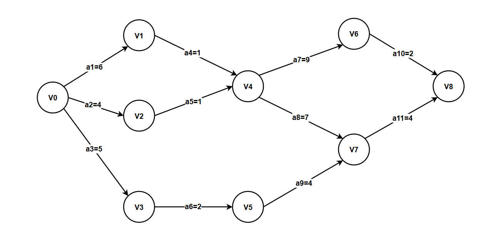

很显然我们知道这里的源点是V0，汇点是V8，那么现在我们来看怎么求它们之间的关键路径

我们知道关键路径是整个工期里面时间最长的一个，与最短路径相比正好相反，那我们这时候看，我们从V0开始到V1需要6天完成，V0到V2需要4天，V0到V3需要5天，那么这时候V0到V1是不是关键路径，因为它需要6天才能完成相较于另外两条路径它们只需要比6天少的时间完成，关键路径上的活动没有缓冲空间，任何一个活动延误，整个项目都会跟着延期。而短路径上的活动即使轻微延误，只要不超过缓冲时间，就不会影响总工期。所以这时候如果V0到V3了，它可以休息一天都不会影响总工期，所以这时候V0到V1是第一条关键路径，我们标注一下，如下：

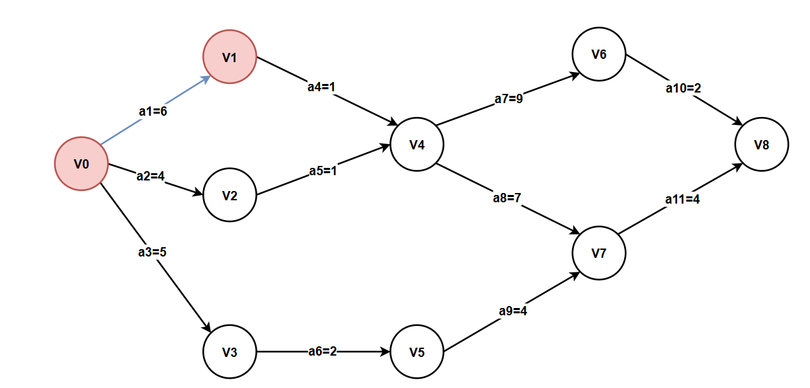

那这时候V1这个事件激活了，我们看V1到V4需要一天，V2到V4也需要一天，但这时候我们就得结合前面的工期来看V0到V4，走V0-V1-V4是不是需要7天，V0-V2-V4只需要5天，那很明显V0-V1-V4为关键路径，这里就不再重复概念了，如下：

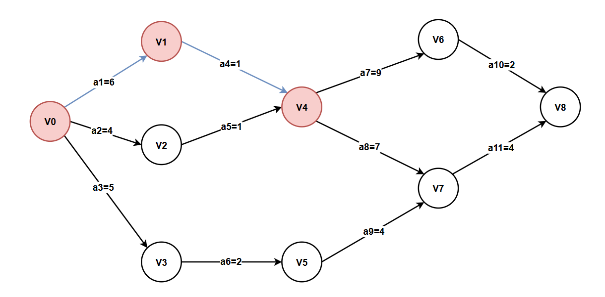

那我们接着看V4到V6是不是需要9天，V4到V7只需要7天，按照前面说的这里很明显V0-V1-V4-V6是最长的，那这是不是也是一条关键路径，也就是V0-V6需要16天，那么如下：

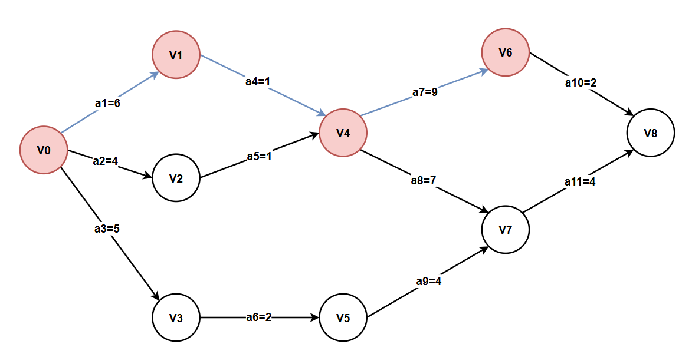

那这时候看V0-V8的关键路径是什么，V6到V8需要2天，加上上述的是18天，但这时候注意V0-V1-V4-V7-V8也是18天，所以这时候对应的关键路径有两天，因为一个关键路径我们主要看的是源点到汇点的关键路径，它可能不止一条，所以这时候这两天都是关键路径，也就如下：

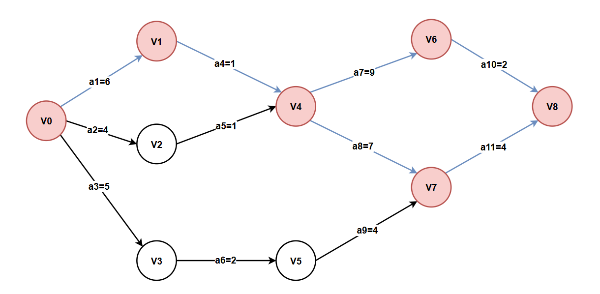

那么这就是从图上直接手推的一种方法，那么接下来我们来看从代码层面怎么描述

##### 关键路径代码层面

那接着从代码层面来讲，我们肯定需要这么几个东西，ETV、LTV、ETE、LTE这几个数据，那也就是填表，我们看一下下图怎么个填法：

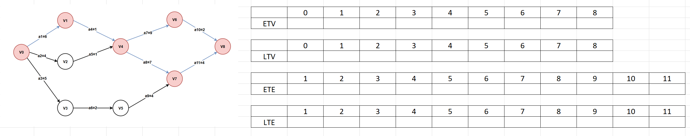

那我们先来看一下第一个ETV怎么填，ETV的概念上面解释了，也就是对于顶点的最早开始时间，很显然，对于0来说开始时间就是0，因为它是源点，那1呢看边，V0-V1需要6天，那很显然最早发生时间也就是6，以此类推V2、V3分别是4、5，那到了V4的时候很多人就疑惑可能认为是5，但这里是7，为什么呢，就算你V0-V2任务完成了，但是V0-V1还没有完成，只有前置最长的路径完成了，才能开始，或者可以理解就是取最大值，也就是7，那后面V5、V6、V7、V8这里就不再重复，就是7、16、14、18，如下：

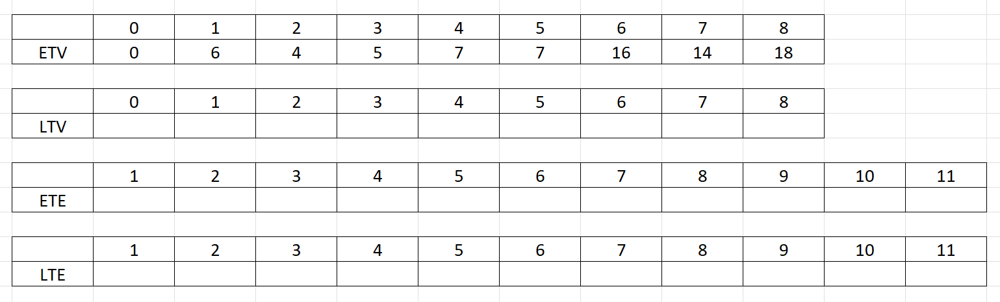

那接着我们再看LTV，LTV这时候我们可以反着推，我们从V8开始逆向推，V8最早发送是18，那么很显然最晚是不是也需要18天，那么V8就是18，这时候看V7，V7到V8需要4天，那么减去这4天是不是就是最晚发生的时间，如果超出那是不是就危险了，那很显然V7就是14，那同理V6是18-2也就是16，以此类推我们就得到了LTV，如下：

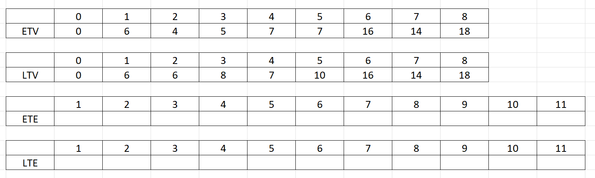

那么这时候看ETE，这里对应的是边，这里我们要参照ETV，看1、2、3他们是不是对应V0的出度，那V0发生了事件才能去处理活动，那么对应的1、2、3都是0，那接着看4这个边，它是受V1决定的，V1最早发生时间是6天，那么4这条边最早发生也就是6，以此类推，边是由顶点发送最早时间决定的，所以ETE如下：

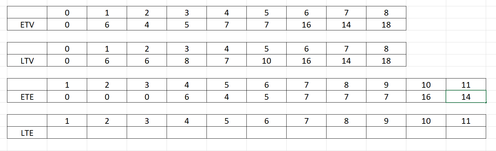

那接着我们看最后的LTE怎么推，那我们还是逆向推，我们看11这条边，它指向的V8顶点最晚发生是不是18，那对应它这个边的权值是4，那这个边最晚发生时间是不是18-4也就是14，那么11这条边对应的就是14，那我们再看10也是指向V8这个顶点，所以同理10最晚发生时间是18-2也就是16，那后面的边都是一个道理，拿对应顶点的最晚发生时间减去这个边的权值，我们就得到了LTE这个数据，也就如下:

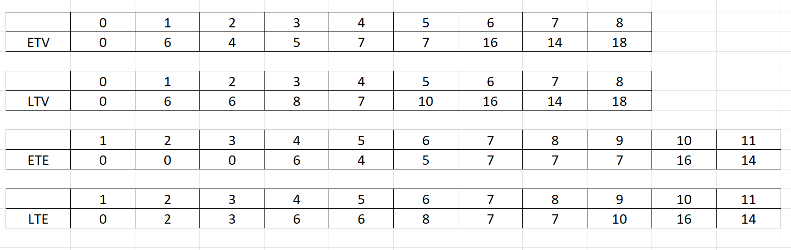

那么这就是关键路径从代码层面来说我们要设计的东西，最后判断哪些是关键路径只要判断ETE是否等于LTE，如果有等于的值那么就是关键路径

接下来看具体代码

#### 关键路径代码实现

```c
static int topologicalOrder(const AGraph *grap, int *ETV, int *LTV) {
	int *inDegree = malloc(sizeof(int) * grap->nodeNum);		// 入度记录表
	if (inDegree == NULL) {
		return -1;
	}
	memset(inDegree, 0, sizeof(int) * grap->nodeNum);
	// 1. 初始化图中所有顶点的入度记录表
	for (int i = 0; i < grap->nodeNum; i++) {
		if (grap->nodes[i].firstEdge) {
			ArcEdge *edge = grap->nodes[i].firstEdge;
			while (edge) {
				++inDegree[edge->no];
				edge = edge->next;
			}
		}
	}
	// 2. 将入度为0的节点入栈，出栈的时候
	int top = -1;
	int *stack = malloc(sizeof(int) * grap->nodeNum);
	int *topOut = malloc(sizeof(int) * grap->nodeNum);
	// 2.1 将初始化的入度为0的顶点编号压入栈，此点就是源点
	for (int i = 0; i < grap->nodeNum; ++i) {
		if (inDegree[i] == 0) {
			stack[++top] = i;
			break;				// 关键路径默认只有一个源点
		}
	}
	// 2.2 不断地弹栈，更新入度记录表
	int tmp = 0;			// 从栈上弹出的顶点编号
	int index = 0;			// 记录排序结果的情况
	while (top != -1) {
		tmp = stack[top--];
		topOut[index++] = tmp;
		ArcEdge *edge = grap->nodes[tmp].firstEdge;
		while (edge) {
			--inDegree[edge->no];
			if (inDegree[edge->no] == 0) {
				stack[++top] = edge->no;
			}
			if (ETV[tmp] + edge->weight > ETV[edge->no]) {
				ETV[edge->no] = ETV[tmp] + edge->weight;
			}
			edge = edge->next;
		}
	}
	free(inDegree);
	free(stack);
	if (index < grap->nodeNum) {		// 有环
		free(topOut);
		return -1;
	}
	tmp = topOut[--index];
	// 3. 更新LTV
	for (int i = 0; i < grap->nodeNum; ++i) {
		LTV[i] = ETV[tmp];
	}
	while (index) {
		int getTopNo = topOut[--index];
		ArcEdge *edge = grap->nodes[getTopNo].firstEdge;
		while (edge) {
			if (LTV[edge->no] - edge->weight < LTV[getTopNo]) {
				LTV[getTopNo] = LTV[edge->no] - edge->weight;
			}
			edge = edge->next;
		}
	}
	free(topOut);
	return 0;
}

static void showTable(int *table, int n, const char *name) {
	printf("%s", name);
	for (int i = 0; i < n; ++i) {
		printf(" %d", table[i]);
	}
	printf("\n");
}

void keyPath(const AGraph* graph) {
	// 1. 计算顶点的ETV和LTV
	int *ETV = malloc(sizeof(int) * graph->nodeNum);
	if (ETV == NULL) {
		return;
	}
	int *LTV = malloc(sizeof(int) * graph->nodeNum);
	if (LTV == NULL) {
		free(ETV);
		return;
	}
	memset(ETV, 0, sizeof(int) * graph->nodeNum);
	memset(LTV, 0, sizeof(int) * graph->nodeNum);
	topologicalOrder(graph, ETV, LTV);
	showTable(ETV, graph->nodeNum, "ETV: ");
	showTable(LTV, graph->nodeNum, "LTV: ");

	// 2. 计算边的ETE和LTE，直接输出关键路径
	for (int i = 0; i < graph->nodeNum; ++i) {		// 计算每个边的ETE和LTE
		ArcEdge *edge = graph->nodes[i].firstEdge;
		while (edge) {
			// 每个边的最早发生时间就是边的弧尾的ETV
			// 每个边的最晚发生时间就是边的弧头的LTV减去当前边的权重值
			if (ETV[i] == LTV[edge->no] - edge->weight) {
				printf("<%s> ---%d--- <%s>\n",
					   graph->nodes[i].show, edge->weight, graph->nodes[edge->no].show);
			}
			edge = edge->next;
		}
	}
	free(ETV);
	free(LTV);
}
```

代码内容如下：

<span style="font-size:1.3em;">**函数`topologicalOrder`详解**</span>

该函数的核心作用是对有向图进行拓扑排序，同时计算顶点的最早发生时间（ETV）和最晚发生时间（LTV），为关键路径的求解做准备，最终返回排序是否成功（无环则成功，有环则失败）。

**步骤 1：初始化入度记录表**

首先，函数会创建一个入度记录表（数组），用于存储图中每个顶点的入度（即指向该顶点的边的数量）。

- 先为入度记录表分配内存，若分配失败则返回错误。
- 初始化入度记录表，将所有顶点的初始入度设为 0。
- 遍历图中所有顶点，对于每个顶点，若它有出边（即存在从该顶点出发的边），则通过遍历这些出边，更新对应目标顶点的入度（每有一条边指向目标顶点，其入度就加 1）。

**步骤 2：基于栈的拓扑排序过程**

拓扑排序的核心是逐步处理入度为 0 的顶点（这类顶点没有前驱约束，可以优先处理），这里使用栈来暂存这些顶点。

- **初始化栈**：创建一个栈和一个数组（`topOut`），栈用于存放待处理的入度为 0 的顶点，`topOut`用于记录拓扑排序的结果顺序。

- **入栈第一个源点**：遍历入度记录表，找到第一个入度为 0 的顶点（注释说明关键路径默认只有一个源点），将其压入栈中。

- 处理栈中顶点

  ：进入循环，不断从栈中弹出顶点（即处理该顶点）：

  - 弹出的顶点会被记录到`topOut`数组中，用于后续记录拓扑顺序。
  - 遍历该顶点的所有出边：
    - 对于每条出边指向的目标顶点，将其入度减 1（因为当前顶点已被处理，相当于移除了这条边的约束）。
    - 若目标顶点的入度减为 0，说明它已无前置约束，将其压入栈中等待处理。
    - 同时更新目标顶点的 ETV（最早发生时间）：ETV 表示顶点最早能开始的时间，其值为所有前驱顶点的 ETV 加上对应边的权重中的最大值（即取 “最晚到达” 的时间，确保所有前置工作完成）。

**步骤 3：判断图是否有环并处理 LTV**

- 拓扑排序结束后，若`topOut`数组记录的顶点数量小于图的总顶点数，说明图中存在环（因为有顶点始终无法满足入度为 0 的条件），此时释放内存并返回错误。
- 若无环，则开始计算 LTV（最晚发生时间）：LTV 表示顶点最晚必须开始的时间（不能晚于此时，否则会延误整个流程）。
  - 初始化 LTV：将所有顶点的 LTV 设为最后一个拓扑顶点的 ETV（因为最后一个顶点无后续工作，其最早和最晚发生时间相同）。
  - 逆序遍历拓扑排序结果（从最后一个顶点向前），对于每个顶点，遍历其所有出边，更新该顶点的 LTV：其值为所有后继顶点的 LTV 减去对应边的权重中的最小值（即确保后续工作能按时开始的最晚时间）。

**步骤 4：释放资源并返回结果**

释放入度记录表、栈和拓扑排序结果数组的内存，若排序成功则返回 0，否则返回 - 1。

<span style="font-size:1.3em;">**函数`showTable`详解**</span>

该函数的作用是打印数组内容，方便直观展示数据。

- 接收三个参数：待打印的数组、数组长度、数组名称（如 “ETV:”）。
- 先打印数组名称，再依次打印数组中的每个元素，最后换行，让输出格式清晰易读。

<span style="font-size:1.3em;">**函数`keyPath`详解**</span>

该函数是求解关键路径的主函数，关键路径是指图中从起点到终点的最长路径（决定整个流程的最短完成时间），路径上的边称为关键边。

**步骤 1：准备 ETV 和 LTV 数组**

- 为 ETV（最早发生时间）和 LTV（最晚发生时间）数组分配内存，若分配失败则释放已分配的内存并返回。

- 初始化两个数组（初始值设为 0），调用`topologicalOrder`函数计算 ETV 和 LTV。

**步骤 2：展示 ETV 和 LTV**

通过`showTable`函数分别打印 ETV 和 LTV 数组，直观展示每个顶点的最早和最晚发生时间。

**步骤 3：识别关键边并输出关键路径**

关键边的判断依据是：边的最早发生时间（ETE）等于最晚发生时间（LTE）。

- 遍历图中所有顶点，对于每个顶点的所有出边：
  - ETE（边的最早发生时间）等于该边起点顶点的 ETV（起点最早开始，边就能最早发生）。
  - LTE（边的最晚发生时间）等于该边终点顶点的 LTV 减去边的权重（确保终点能在最晚时间前开始，边就不能晚于此时发生）。
  - 若某条边的 ETE 等于 LTE，则该边是关键边，打印该边的起点、权重和终点，形成关键路径。

**步骤 4：释放资源**

最后释放 ETV 和 LTV 数组的内存，避免内存泄漏。

这就是关键路径代码实现

#### 关键路径总结

##### 一、关键路径核心逻辑梳理

关键路径本质是 AOE 网中从源点到汇点的最长路径，其核心通过计算事件最早发生时间（ETV）、事件最晚发生时间（LTV）、活动最早开工时间（ETE）及活动最晚开工时间（LTE）确定，当 ETE 与 LTE 相等时即为关键活动。算法实施以拓扑排序为基础进行正向求 ETV，再通过汇点逆向推导 LTV，最终筛选关键活动形成关键路径，核心目标是明确工程最短完成时间与核心影响因素。

##### 二、考研视角下的关键路径

**（一）考察核心与形式**

1. **题型聚焦计算应用**：多以解答题形式出现，要求基于给定 AOE 网计算 ETV、LTV、ETE、LTE 并确定关键路径，占数据结构图论模块 10-15 分左右，如 2023 年某高校真题直接考察 “含 10 个事件的 AOE 网关键路径求解”。

1. **高频关联考点**：与拓扑排序深度绑定，常需先完成拓扑排序再推导关键路径，需注意拓扑序列唯一性对计算结果的影响，以及环结构对 AOE 网有效性的破坏（考研常设置此类陷阱）。

**（二）备考重点与策略**

1. **步骤标准化训练**：需牢记 “正向求 ETV（取最大值）、逆向求 LTV（取最小值）、推导 ETE/LTE” 的固定流程，避免因计算顺序错误丢分。

1. **核心特性记忆**：关键路径长度等于工程最短工期、关键活动延误必影响总工期、非关键活动存在自由时差等结论需精准掌握，可应对选择题中的特性判断。

##### 三、实际工程中的关键路径

**（一）核心应用价值**

1. **工期与资源优化**：如杜邦公司 1957 年将其应用于化工厂建设，通过识别关键活动缩短工期 4 个月，年节省成本 100 万美元，核心逻辑是 “向关键路径要时间，向非关键路径要资源”。

1. **风险管控工具**：可提前定位不可控任务，通过规避关键路径安排降低工期风险，同时动态监控非关键路径状态，防止其因延误转化为关键路径。

**（二）实施关键策略**

1. **动态迭代计算**：工程实施中需定期重算关键路径，如软件开发项目中，需求变更可能导致活动时间调整，需同步更新关键路径以适配变化。

1. **资源倾斜配置**：对关键活动优先分配人力、设备等核心资源，如建筑工程中 “混凝土浇筑” 若为关键活动，需确保搅拌设备 24 小时待命。

##### 四、关键路径的适用场景总结

**（一）学术应试场景**

适用于考研数据结构（计算机、软件工程等专业）、管理类联考等涉及 AOE 网分析的科目，尤其针对 “给定网络图求关键路径” 的标准化题型。

**（二）工程管理场景**

1. **大型线性工程**：如化工建设、桥梁施工等活动依赖清晰、时间可量化的项目，能有效解决并行活动的工期统筹问题。

1. **项目管理认证**：为 PMP 等资质考试核心考点，是项目经理进行工期管控与资源配置的必备工具。

##### 五、关键路径的优缺点分析

**（一）优势**

1. **目标导向明确**：直接锁定影响总工期的核心活动，避免资源分散投入，考研中可快速定位计算焦点。

1. **可操作性强**：算法流程标准化，工程中只需明确活动依赖关系与时间，即可通过固定步骤推导结果。

1. **量化决策依据**：将工期影响因素转化为具体活动参数，如 ETV/LTV 的差值可直接反映非关键活动的缓冲时间。

**（二）局限性**

1. **时间估算依赖高**：工程中若活动时间预估偏差大（如研发项目），会导致关键路径误判，考研中则因题目给定固定数据无此问题。

1. **动态适应性不足**：工程中需人工反复重算以应对变更，缺乏实时响应机制，而考研题型多为静态网络图，无此局限。

1. **不适用于非线性项目**：对活动依赖复杂、时间不可量化的场景（如创意设计项目）适配性差，难以有效识别关键路径。


## 排序算法
