# 计算机组成原理

## 1.计算机总概述

计算机的分类有很多种，例如：**个人计算机**、**服务器**、**嵌入式计算机**等等，种类非常多

那对于用户来说能直接操作硬件吗，肯定是不行的，所以在用户与硬件之间，有一个操作系统，使得用户可以通过操作操作系统来间接操作计算机硬件，也就是如下图：
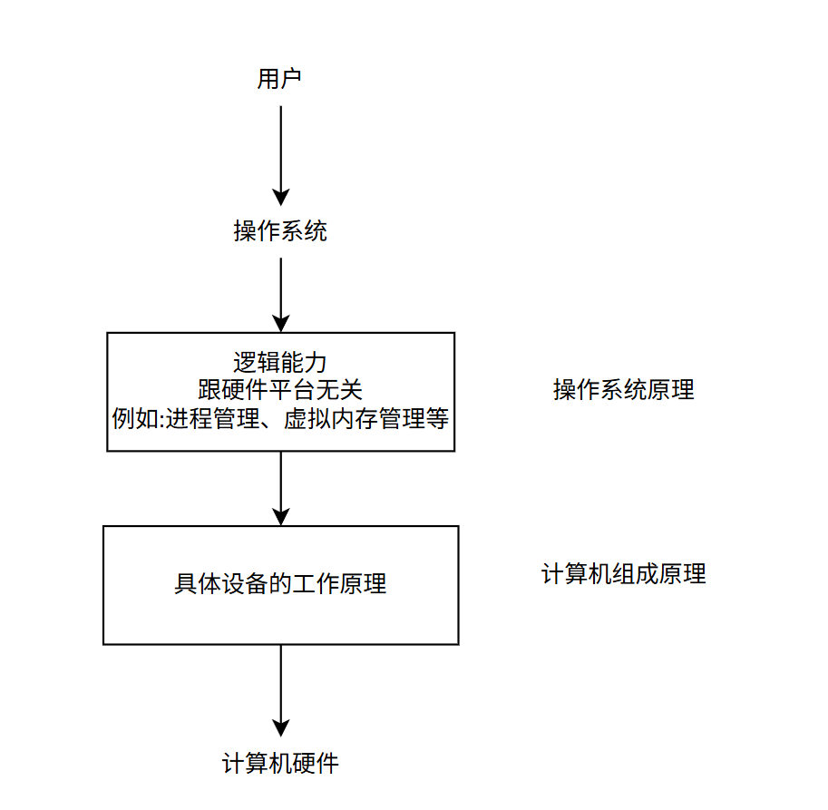

很显然在操作系统到硬件之间还有一层隐藏的东西，这个就是操作系统和原理与计算机组成原理

对于后续的计算机发展以及衍生出很多，类似于现在的**个人移动设备**、**云计算**等等

所以什么是计算机呢？其实我们可以认为，通过一些硬件设备或者程序 帮助某些东西进行计算的设备，就是计算机

当然这里不再过多赘述无关的知识点

## 2.计算机的系统结构思想

### 2.1 面向摩尔定律的设计

**摩尔定律：**由Intel的创始人之一戈登·摩尔在1965年提出，它指出在一个芯片上集成的晶体管数量每18到24个月就会翻一番。

当然对于摩尔定律来说，它必定会受到一个物理限制，因为对于芯片来说，它的大小是固定的，它所能集成的晶体管数量也是有限的，所以它并不可能永久实现

### 2.2 使用抽象来简化设计

什么是抽象？抽象是一个非常重要的思想，在计算机的架构当中，包括程序的架构中.我们必须发明一个能够提升产生、提升生产效率的技术.这个技术之一就是抽象。‘

那抽象为什么能提升效率呢？抽象主要就是用来表示不同的设计层次，高层次的看不见低层次的细节，只能看见一个简化的模型.

例如对于计算机的系统设计里面，分为以下几层

1.**应用层**：这是用户直接交互的层，如浏览器、文字处理软件等.在这个层次上，我们看不到硬件的具体细节，只能看到各种应用程序.

2.**操作系统层**：这一层管理计算机的硬件资源，并为应用程序提供服务.在这一层，我们看不到硬件的具体操作，只能看到操作系统提供的接口和功能

3.**硬件驱动层**：这一层是操作系统和硬件之间的桥梁，负责控制和管理硬件设备.在这一层，我们看不到硬件的物理结构，只能看到驱动程序提供的接口.

4.**硬件层**：这是系统的最底层，包括处理器、内存、硬盘等硬件设备.在这一层，我们可以
看到物理设备的具体细节.

那通过这些分层，设计师和程序员就可以更加高效地工作，因为他们不需要同时关注所有的细节.每个层次的抽象都为上一层提供了一个简化的模型，使得设计和开发过程更加可控和可管理

那具体是什么呢，我们举个例子，如下图：

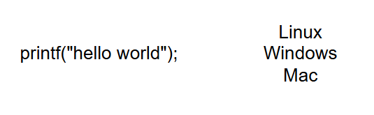

比如你会发现，在我们学习C语言的时候，你会发现printf这个函数，在三种不同的操作系统上面都能运行起来，那这是怎么做到的呢？继续往下看：

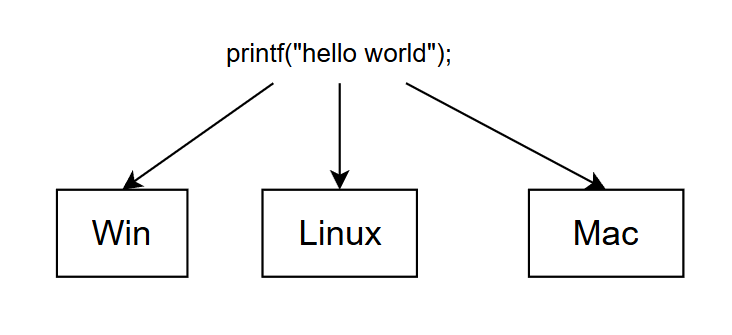

你会发现你并没有办法，可以让printf直接在三个操作系统上面运行起来，那这个对于我们来说是不是就无法抽象了，所以为了解决这个问题，我们引入了一个新的东西就是标准C库

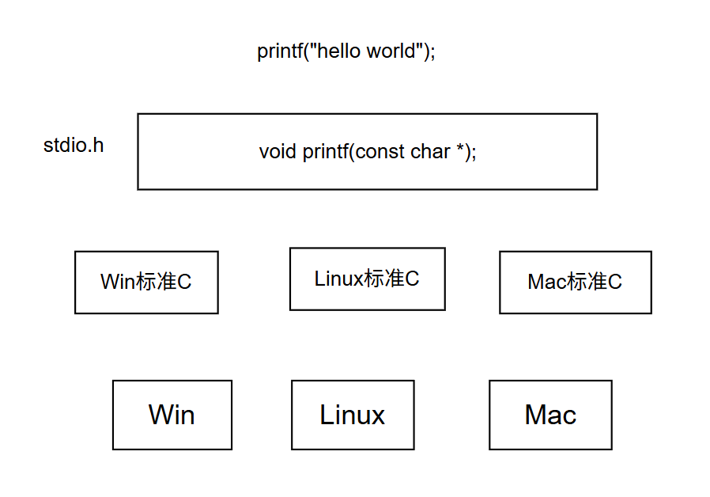

那我只要设计一个针对于三个系统的标准C，那这时候里面是不是有一个标准头文件，然后我将标准头文件和各个系统的标准C抽象在一起，那这样是不是就可以解决这个问题了，标准C库的设计只要关心在不同的操作系统下的怎么设计标准C库就行，那在说举个例子，那Windows怎么操作硬件呢，那对应的设计，也就是驱动如下图：

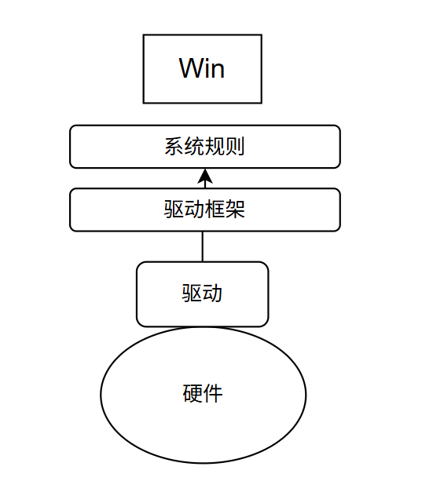


抽象之所以能够提高我们的效率，主要是因为它允许我们关注问题的核心，而不是被不必要的细节所困扰。通过将复杂系统分解为更小、更易于管理的部分，并定义这些部分之间的接口和行为，我们可以更高效地设计、开发和维护系统。这样，高层次的设计者可以不必关心底层的实现细节，只需关注高层次的设计问题，从而提高了开发效率。


### 2.3 加速大概率事件

加速大概率事件就是：实际上这是计算机科学和工程中的一个普遍原则：优化瓶颈（BottleneckOptimization）。在许多系统中，大部分的时间或资源往往被少数几个关键操作或组件所消耗。这些操作或组件就构成了系统的瓶颈，它们限制了系统的整体性能或效率，也就是说有80%的时间在干20%的事情，所以我们优化的是这些20%的关键组件。

那我们下需要先找到哪些资源是大概率的(由统计来决定)，然后把这些资源策略处理，那有哪些方法呢，如下：

**缓存：**是一种常用的优化技术，用于加速数据的访问速度。通过将频繁访问的数据存储在高速缓存中，可以减少对慢速存储设备的访问，从而提高整体性能。

例如：假设我现在经常要喝水，那这个水杯是放在我旁边好，还是放在隔壁的房间好呢，很显然，放在旁边是最好的，因为拿取速度快

**数据压缩：**在数据传输或存储时，通过压缩数据可以减少所需的空间或带宽。这有助于减少I/O操作、提高存储效率，并加速数据传输。

**预处理：**通过提前对数据进行处理或计算，可以避免在实时处理时的复杂性和延迟。预处理可以包括数据清洗、索引创建、聚合计算等

预处理是什么意思呢，如下：
比如说我现在传输一个数据，如下图：

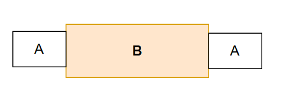

假设我现在传输一个数据A，可能传输一半中断了，然后来了一个数据B，后面我再把剩下一半数据A传输，那现在我要处理数据，那我们是不是先要把A的一半拿过来，然后再把B搬走，然后再拿剩下的一半A，那这样是不是比较浪费时间，而预处理的思路就是，我增加一个盒子用来提前处理，将需要的数据排列整齐，也就是如下图:

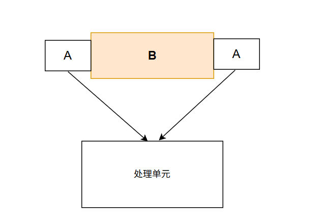

那我提前把两个A的数据放在一起后，等到真正用到的时候，是不是数据读取就很快了，这就是预处理的一个思路

**预测和推测技术：**这些技术试图提前预测或猜测未来的操作或需求，从而提前进行准备或执行。例如，预测模型可以预测用户的下一个操作，而推测执行则可以尝试提前执行某些操作以提高响应速度。

### 2.4 通过并行来提高性能

由于现代CPU无法增加晶体管来提高性能，所以通过多核来增加处理速度，也就是人越多办事越快

并发：一个时间段内多个任务同时响应

并行：也就是上面的多核处理

### 2.5 通过流水线来提高性能

很简单，就类似于工厂一样，一个工人只负责一个模块的处理，然后像流水线一样向下个工人来处理技术，以此类推，现代CPU 都有了这种流水技术，来提高性能也就是并行性能

例如，在处理器设计中，指令执行通常可以分为取指（Fetch）、译码（Decode）、执行（Execute）、访存（Memory Access）、写回（Write Back）等多个阶段。通过流水线技术，不同的指令可以在不同的流水线阶段同时进行处理，每个阶段都有专门的硬件单元来理，从而实现并行执行。

但是流水线是会被打断的，效率降低（分支、函数调用、异常[syscalll]）,这个后面会具体说

### 2.6 通过预测来提高性能

预测技术是计算机系统结构设计中提高性能的重要手段之一.预测技术通过预测未来的指令或数据，提前进行预取和预处理，从而减少等待时间和提高处理速度.预测技术通常应用于多个领域，包括指令预测、分支预测、缓存预取等。

**指令预测：**指令预测是一种预测技术，用于预测下一个要执行的指令。处理器可以基于之前的指令序列来预测未来的指令，并提前进行解码和准备。这样，当实际的指令到达时，处理器可以更快地执行它，从而提高执行速度。

**分支预测：**分支预测是另一种常见的预测技术，用于预测条件分支指令的结果。处理器会尝试预测分支指令是否会被执行（即条件为真或假），并提前加载和执行相应的指令。这样，当分支指令的结果确定时，处理器已经准备好了要执行的指令，从而避免了延迟

**缓存预取：**缓存预取是一种预测技术，用于预测哪些数据将被访问，并提前将这些数据加载到缓存中。处理器可以基于之前的访问模式来预测未来的数据访问，并提前从内存中加载这些数据到缓存中。当实际访问这些数据时，它们已经位于缓存中，从而提高了访问速度。

### 2.7 存储器层次结构

我们知道CPU的速度是快的，存储器，硬盘的效率是慢的.而我们的数据无时无刻不在进行着读取操作.所以，存储器速度通常就影响着性能.存储的大小规模就决定了他能处理问题的规模大小，速度越快，容量越小，价格越贵；速度越慢，容量越打，价格越便宜；

那对于寄存器的层次结构是什么呢：

**最顶层：**通常是**寄存器（Registers）或者缓存（Cache）**，它们速度最快，但容量最小，且单位容量的成本最高。CPU可以直接访问寄存器，而高速缓存则用来临时存储最近频繁使用的数据或指令以减少主存访问次数。

**主存（RAM，Random Access Memory）：**其速度相较于寄存器和缓存慢，但容量大得多，价格也相应降低。主存是CPU直接寻址和交换数据的主要区域。

再下一层可能包括**虚拟内存（Virtual Memory）、磁盘缓存（Disk Cache）**等，它们的速度进一步下降，但提供更大的存储空间，同时价格相对更低。

**底层**则是硬盘**驱动器（HDD）和固态硬盘（SSD）**等永久性存储介质，它们的访问速度最慢，但提供了TB级别的大容量存储，并且单位存储成本最低。

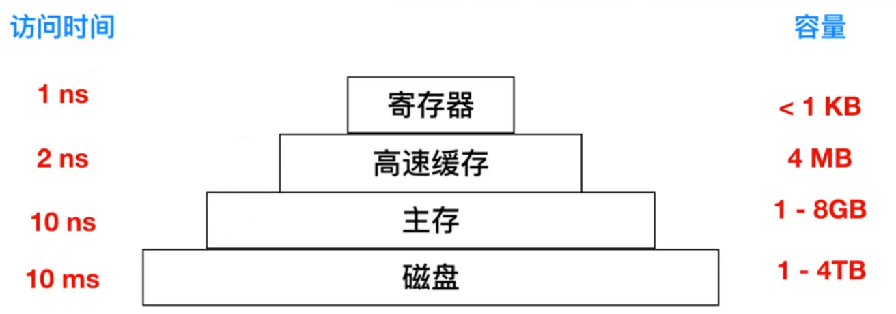

### 2.8 通过冗余提高可靠性

冗余技术就是：通过增加额外的硬件组件来提高系统的可靠性和容错能力

**处理器冗余：**使用多核处理器或者构建集群系统，当一个核心或节点失效时，其他部分可以接管任务，保证服务不中断。例如，云计算平台中的服务器集群就广泛采用了这种策略。

**存储冗余：**RAID（Redundant Array of Independent Disks）技术是一种常见的存储冗余方法，通过磁盘阵列将数据分布在多个硬盘上，实现数据备份、错误校验以及在单个硬盘故障时仍能正常读写数据

**网络冗余：**在网络设备中设置备用路径或备用设备，如负载均衡器、交换机的链路聚合（Link Aggregation）、路由协议中的热备路径等，当主路径出现问题时，流量可以迅速切换到备份路径或设备。

**电源冗余：**数据中心通常会采用双路供电或多路供电系统，确保一路电源故障时另一路电源能够继续为服务器和其他关键设备供电。

**冷却冗余：**大型数据中心还会对冷却系统进行冗余设计，以防止因冷却系统故障导致服务器过热而宕机。


## 3.程序

当我们编写一个应用程序时，无论是使用Java、C++还是其他编程语言，这些程序都不能直接被计算机的硬件所识别和执行。这是因为硬件只能理解一种非常底层、特定的指令集，即机器语言。

### 3.1 高级语言到硬件语言

那我们来看下从硬件语言到现在的高级语言是怎么发展的

我们先看下图：

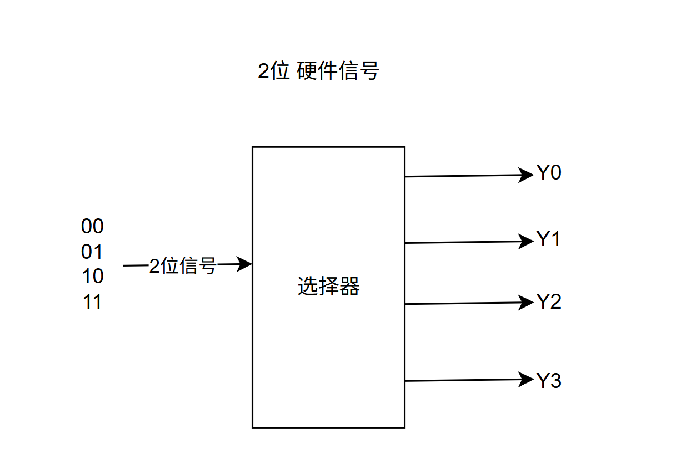


我们现在有一个2位的硬件信号，现在输入到了一个选择器里面，类似于数字电路，输出了四种信号，那这时候我们假设Y0连接了一个加法器，Y1连接减法器等等，那是不是四种信号对应四种模块，那我们这时候可以说这两个状态，就是这个模块的功能码，那虽然有了功能码，但是我们知不知道哪两个数相加呢，很显然并不知道，所以这个时候我们还需要一个数据码，那就还有个问题，存储数据码需要空间，但是CPU里面能存储的假设32位，但是这时候功能吗占了两位，那么数据码就只能存储30位，所以这时候数据码，就分为立即数和间接数字
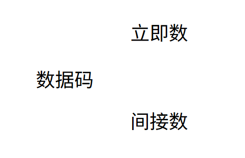

立即数：就是上述所说的30位数据

间接数：不存储在CPU里面，存储在内存或者别的地方的32位置数字

那对于我们的上述操作是不是都可以描述为开关和状态，也就是一串1和0组合

但是这一串10组合是有格式的，比如10 11001 110101，这个我们称为**序列格式**，后来人们认为这个为**指令序列**，再后来又起了一个名字叫**机器码**，由不同机器码组成的就叫**机器语言**，构成机器语言的是特定的**指令集**，机器语言也就是CPU可以执行的语言

在这之后呢，就会出现一个新的问题，有的厂家认为前两位是功能码，有的认为太少了，前四位才是，比如1101 110111 100111，所以就会出现不同的格式，那格式又是怎么约束呢，格式是由指令约束，由不同的指令集约束，不同的指令集也就是由不同的厂家来约定格式，由此提出不同的**处理器架构**

但是这时候直接记忆10 11011 100111这种太反人类了，所以在这之后为了方便人类记忆，提出了人类语言，第一个人类语言也就是助记符，比如这时候叫1010为ADD，但是不同的厂家有不同的定义格式，假设别的厂家叫1010为AU，那么这些助记符在后来也被称为**汇编语言**那从这些助记符到1010这些数字也有一个**汇编器**，但是**汇编器是跟体系结构相关的**，比如有的厂家1010表示为ADD，有的厂家1100才表示为ADD，**不同的CPU体系结构，汇编助记符不同，机器码不同**

那么接下来我们看程序怎么让两个不同的体系架构都能使用呢

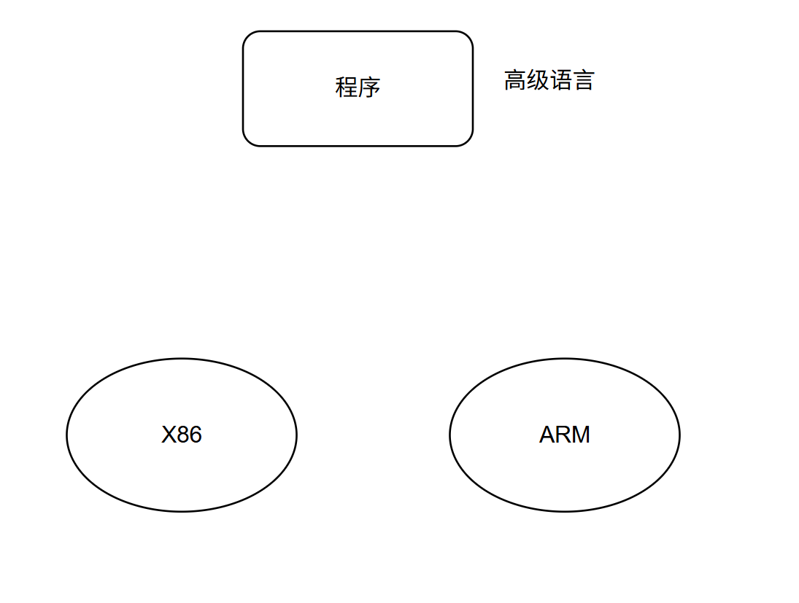

那么对于高级语言来说，我们就不需要再去记不同的助记符了，比如X86叫做ADD，ARM叫做AU，我们这时候统一用一个符号来表示，比如就用+来表示，那我们这时候需要一个将高级语言转译为汇编语言，那么这个就叫做**编译器**，但是不同的体系翻译不一样，所以这时候就出现了X86编译器和ARM编译器等等，那有了编译器，还需要X86的汇编器来翻译成X86的指令，也就是如下图：

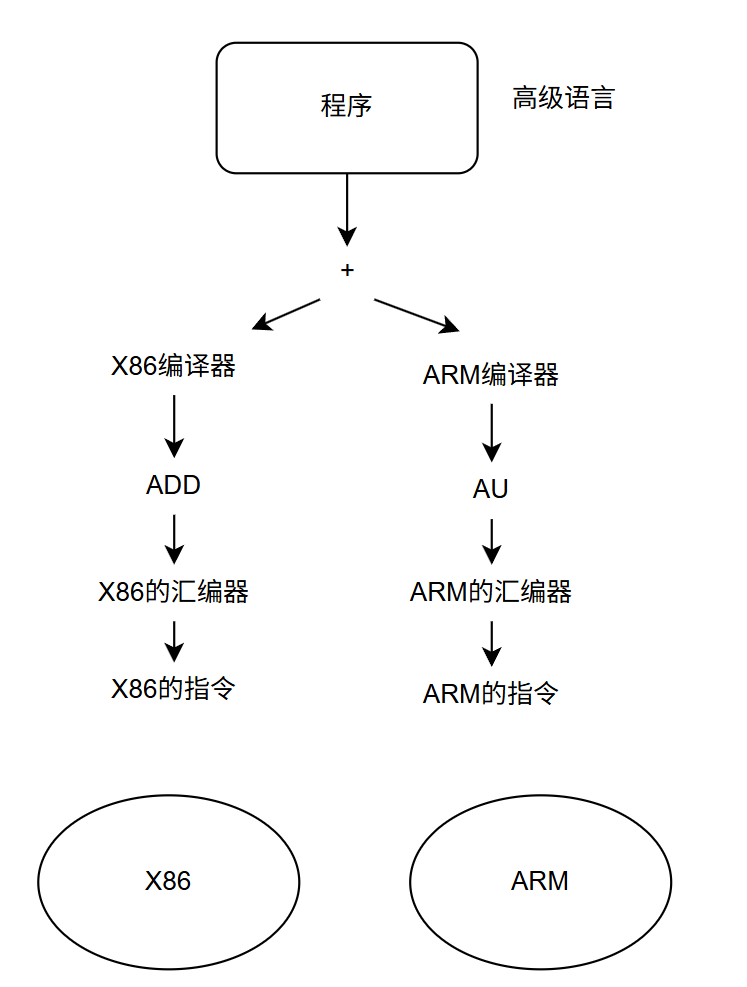


那按理说目标文件可以直接运行在CPU里面，但是对于多文件来编程来说，举个例子：比如说我现在有一个函数调用叫做func(10),那假设汇编语言翻译成 jump func;那假设jump翻译成1101但是它后面的位置写什么呢？我怎么知道func()要跳到哪里呢，再说X86架构上面可能会有不同的硬件，比如硬件1 1GB存储控件，硬件2 4GB存储空间，那对于不同的硬件，它可能存储地址不一样，那这时候我们就提出了需要**装配**，装配就是跟硬件资源确定真实的地址，然后系统就提出了一个新的概念**链接**，提供了一个**链接器**，链接器提供了**链接脚本**，它可以帮我们生成一个带地址的**可执行文件**,但现在的可执行文件是基于OS之上的，并非直接在硬件之上

操作系统屏蔽了硬件，给出一个虚拟地址，我们链接的是在虚拟地址上面，去确定地址，所以上面那个1101 xxxxx，xxxxx的部分也就是虚拟地址

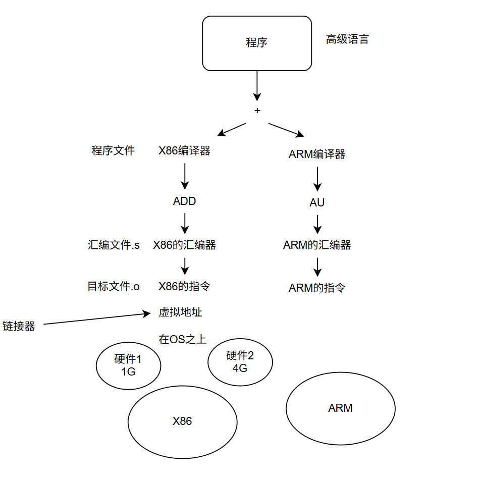

那么最后综上所述:

- 高级语言---(编译器)---对应的体系结构汇编语言---(汇编器)---目标体系结构的 目标文件
- 但是目标文件是二进制的机器码，缺乏地址信息
- 由此提出需要一个链接器的来填充目标文件的地址情况，才能生成可执行文件
- 因此提出了链接器的概念
- 高级语言到目标文件的行为叫做：编译行为

## 4.硬件

### 4.1 硬件有哪些

1.机箱：就是一个容器

2.CPU：中央处理器

- 现代CPU:多个核心的容器，包含传统CPU+显卡（核显）+Cache

  - 主频：单位时间的震荡次数（数字电路、逻辑电路、时序电路），也就是单位时间内所能干的事情，也是电脑里面唯一的节拍

    ```
    寄存器：CPU的寄存器、控制外设的寄存器
    ```

    

- 课本上的CPU:指令处理、处理一些数据逻辑

那我们来详细看一下CPU，由于CPU的主频很快，必然会出现一个问题，就是会有慢速设备的出现，那么CPU的速度很快，但是慢速设备的速度很慢，他们之间怎么交流呢，所以这时候就引出了一个概念叫做分频或者降频

那我们来画图理解一下，如下图：

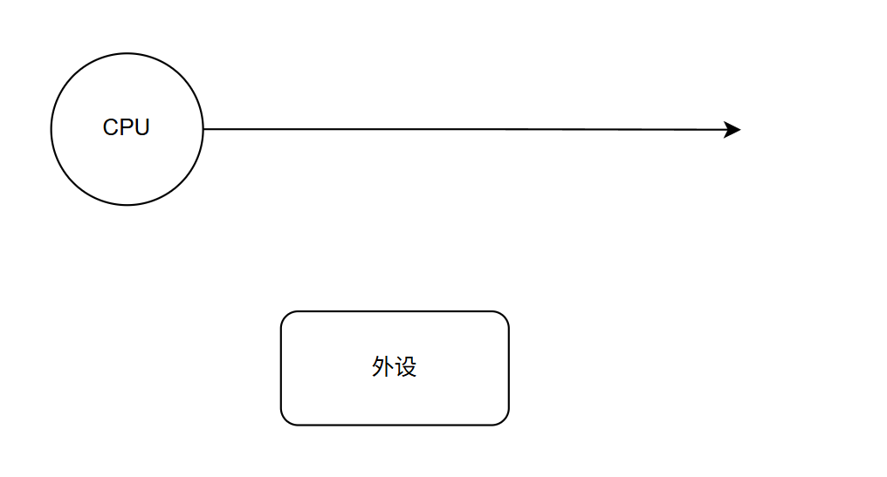

假设我们现在有一个CPU速度非常的快，但是呢，我们现在有一个外设，它的速度很慢，那我们这时候能不能直接让外设接到CPU上面呢，很显然并不可以，因为相应不过来，所以这时候在CPU和外设之间，我们还会再有一个芯片，这个芯片的速度和外设的速度差不多，芯片负责来操控外设，但是很显然，现在芯片仍然无法直接连接CPU，所以在CPU和芯片之间，还会有一个**分频器**用来降低CPU的频率，以可以操作芯片，如下图：

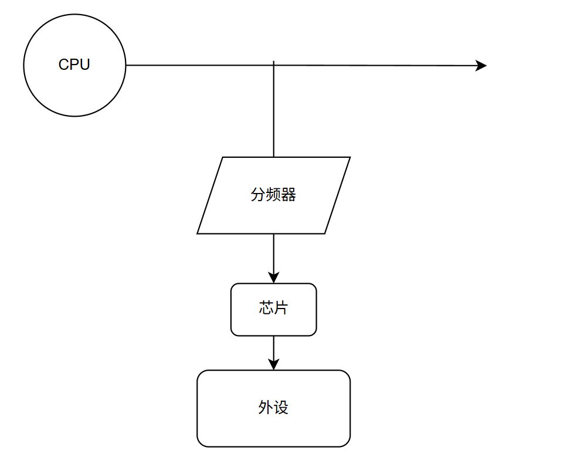

所以我们来看一下现代CPU的一个图：

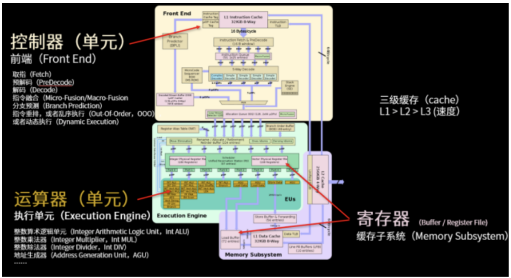

现在可能会看到有各种各样的代数，比如14代i7、10代i7，那这个代数主要升级在哪呢，主要升级在运算器里面，什么意思呢，就比如低一些代数的CPU里面，运算器里面可能没有乘法器，可能需要通过软件去模拟，而像新一点的代数来说可能就包含，也就是随着厂家的升级，运算器里面能执行的指令就更多

那我们再看控制器，控制器就相当于是一个大脑控制，就比如说现在有很多任务，得有个先来后到吧，那我接着是不是要取指令，然后分析去激活哪些电路，去激活运算器里面的什么内容，需要一个先后关系，控制器就是帮我们完成这些任务的，当然这个控制器有很多种，比如有的是控制CPU，有的是控制外设的

那缓存我们在上述也是说过的，一级缓存离CPU最近其次是二级，最远的是三级，寄存器也是这个原理，因为在之前发现CPU一直去磁盘里面取东西太慢了，所以科学家就想到给CPU放一个“小桌子”也就是寄存器，方便CPU拿去，增加运行速度，缓存也是在这里面


3.内存：也就是离CPU不算远的一个“仓库”

如下图：

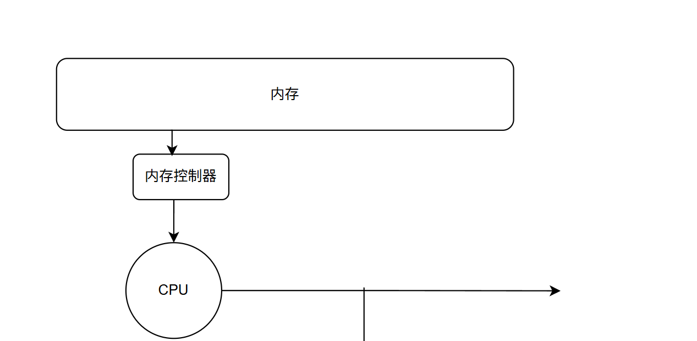

也就是说，内存的交流速度和CPU速度差不多，所以内存越大，CPU访问的越多，时间也就越快，内存也是通过地址来标记每个存储单元，那内存不够用了怎么办，那么这时候就得找硬盘

4.硬盘：存储设备

当然硬盘的速度也是很慢的，比内存慢，那么这时候内存能直接访问硬盘码，很显然不行，所以这时候，我们在内存和硬盘之间再加一个缓存，每次内存从缓存里面取不就可以吗，也就是如下图：

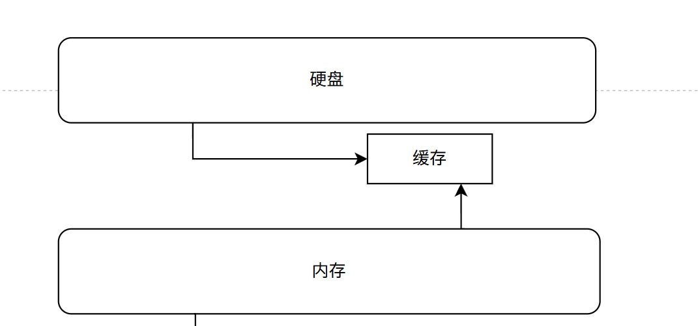

## 5.性能指标

性能指标的目的是为了衡量计算机在各种任务里面的执行效率、处理速度

### 5.1 相关硬件的性能指标

#### 5.1.1 机器字长

**CPU一次性能处理的二进制数据的位数，单位是bit**

那很显然，这个就相当于我们人的一只手，一次能拿起多少个东西，那CPU里面哪个是手呢，我们接着看

那我们看下图：

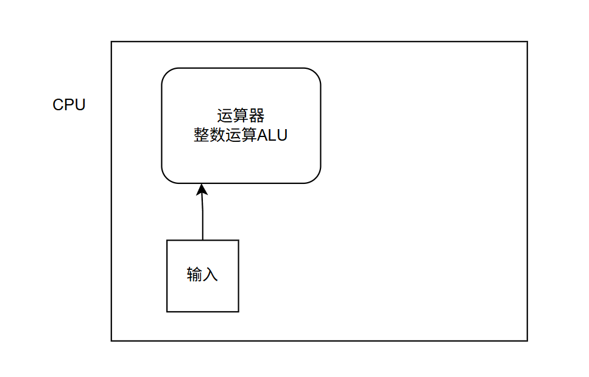

在我们的CPU里面有一个运算器，负责运算，那运算肯定需要一个输入设备，来负责输入数据，那么这个输入设备，我们就可以看作是一只手，那这个手从哪里抓东西呢，我们接着看下图：

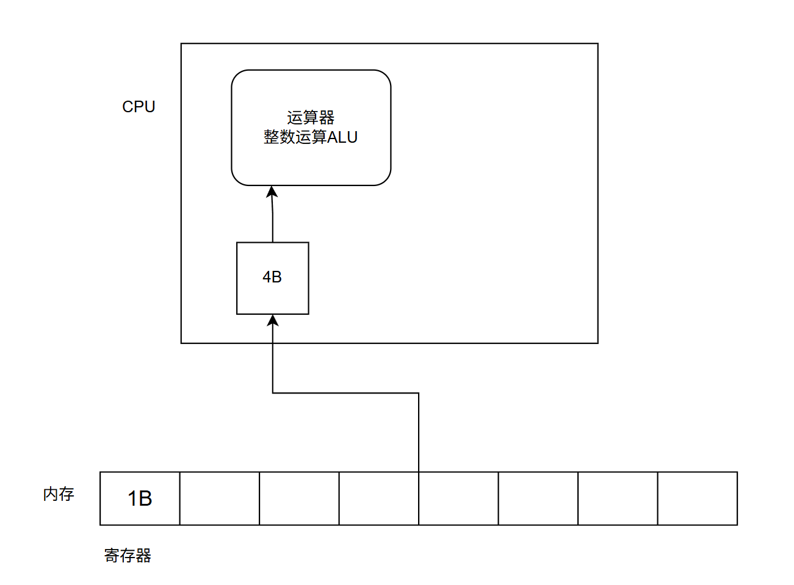

那这个输入设备，是走内存里面取数据，内存里面有一个个小盒子，我们称为存储单元，我们假设输入设备是4个字节的，存储单元是1个字节的，那也就说明内存一个周期要提供四个字节给这个输入设备，那也就说明了CPU一个周期，也就能处理32bit（1B=8bit），那也就变相说明了这个CPU的字长是32bit

那我们就可以得知：**机器字长与CPU内部 ALU的位数和通用寄存器的宽度是相等的**

那我们继续想，内存里面可能存有指令、也可能存有数据，那我们的指令的长度跟字长有关系吗？那这时候CPU里面就还有一个叫做指令寄存器，如下图：

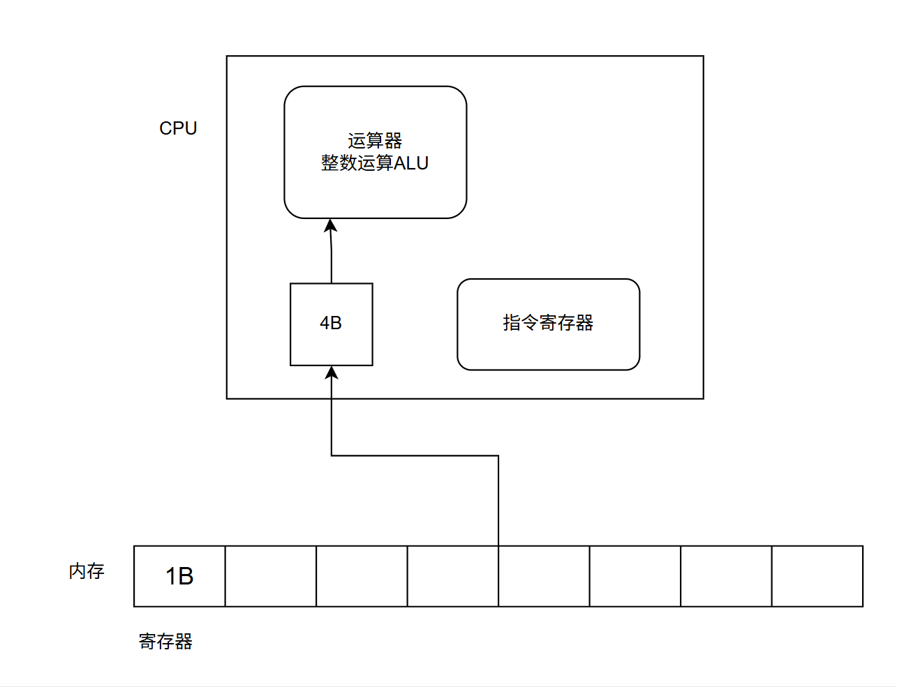

但是这个寄存器和输入设备的字节大小一样吗，这个是不一样的，在内存中，我们可能前两位是指令，后两位是下一条指令，所以指令分为两类，第一类是**定长指令**，第二类是**不定长指令**，所以CPU里面的指令寄存器，更多的是描述这款CPU能存储指令最大的位数，我们每次取数据，可能需要一个周期把寄存器填满，也可能需要两个周期，所以这时候就引入了一个知识点：

**指令寄存器跟机器字长没有关系**

机器字长越长，表示的数越大，字长影响了计算速度

常见的字长有：8bit\16bit\32bit\64bit

#### 5.1.2 主存容量

主从容量就是内存容量，磁盘叫做外存

#### 5.1.3 吞吐量

吞吐量就是单位时间里面能处理的信息量（任务）

#### 5.1.4 响应时间

以前指的是提交作业（纸带）开始，到系统完成作业为止所需要的时间

后来现在指的就是CPU的运行时间：

- 系统CPU时间:花在操作系统的时间
- 用户CPU时间:用户空间的时间

### 5.2 运算速度相关的性能指标

#### 5.2.1 CPU的时钟频率、时钟周期

CPU的时钟（震荡波形来驱动CPU做事情，时钟驱动时序，时许驱动事件）

时钟的单位是赫兹（Hz），常对应的是1Hz 1KHz 1MHz 1GHz 1THz

周期的单位就是秒，那与上面对应单位 1s    1ms   1us     1ns 

PS:每一个单位都对应10的三次方

#### 5.2.2 CPI

指的是cycles per instruction,**执行一条指令所需要的时钟周期数量**，单位是次数，也就是需要多少个周期

比如：一个乘法指令需要5个周期，一个加法指令，需要1个周期，所以不同的指令，执行周期不一样

一个程序的CPI:构成该程序的所有指令需要的时钟周期数的平均数

CPI=程序执行所需时钟周期数/程序包含的指令数量

#### 5.2.3 CPU执行时间

CPU执行时间=（程序所需要的指令数量*CPI）×时钟周期

周期数*每个周期占用时间

由于时钟频率和时钟周期时间互为倒数关系，上述公式也可以表示为：
CPU执行时间 = CPU时钟周期数 / 时钟频率

#### 5.2.4 IPC

Instruction per cycles **每个时钟周期能执行的指令数量**

随着指令流水线、多核的发展，IPC现在可以大于1

#### 5.2.5 MIPS

**每秒执行多少百万条指令**

MIPS=(程序所包含的指令数量➗CPU的执行时间)➗10^-6

常见单位缩写：

- K/M/G/T/P/E/Z(K为10^3,后面每一个都是前面的10^3倍)


## 6.冯诺依曼体系结构

在之前呢，我们了解了现代计算机里面的一个硬件组成，但是呢，我们现在需要抛开这个内容，去研究一下整个计算机它需要一个什么结构去组成，所以我们需要研究一下冯诺伊曼体系结构，看看对于所有计算机来说，通用的一个体系结构

为了方便理解冯诺伊曼体系结构，我们需要了解一下一点计算机历史，在1945年左右，一帮科学家做出了一个机器叫做ENIAC,然后有一个抽象的概念：**作业任务**，这个作业任务指的是把我们要做的事情放到一个开关电路上面然后作为一个模子送到计算机里面工作，但是这个东西只能做专门一个功能，每换一个功能就要重新设计去接线

后来在曼哈顿计划，冯诺依曼加入上面ENIAC这个团队，然后他就在想能不能优化一下，于是提出了一个划时代思想“存储程序”，最早的时候用的是纸带的存储，不同的纸带对应不同的任务，也就是不同的程序，后续也提出了非常多的思想

### 6.1体系特征

1.构成程序的指令和数据均采用二进制表示（PS：最早期的电路用十进制表示）

2.指令和数据存储在存储器上，按地址来访问

3.指令在存储器上面顺序存放，指令执行也是顺序执行

4.指令是由操作码和地址码组成的

5.机器是以运算器为中心的

6.由运算器、控制器、存储器、输入、输出设备5大部件组成

那我们下面来看一下这五大部件是怎么组成的（下面图实线代表数据流，虚线则不是数据流）

冯诺伊曼最开始的时候提出以运算器为核心，运算器从输入设备获取数据，那我们人就可以对输入设备输入数据

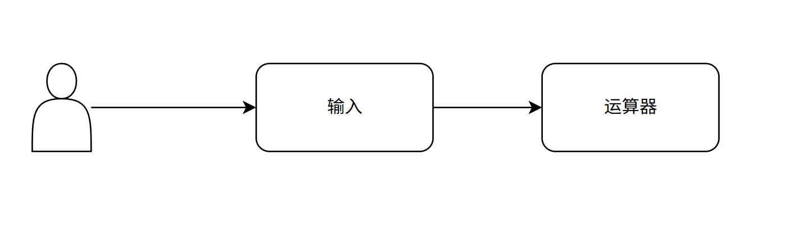

那运算器怎么读取输入管道里面的内容呢，它是靠控制器来控制，也就是控制器会告诉运算器可以干活，那同样，运算器也可也告诉控制器去干点别的，这是一个双向的

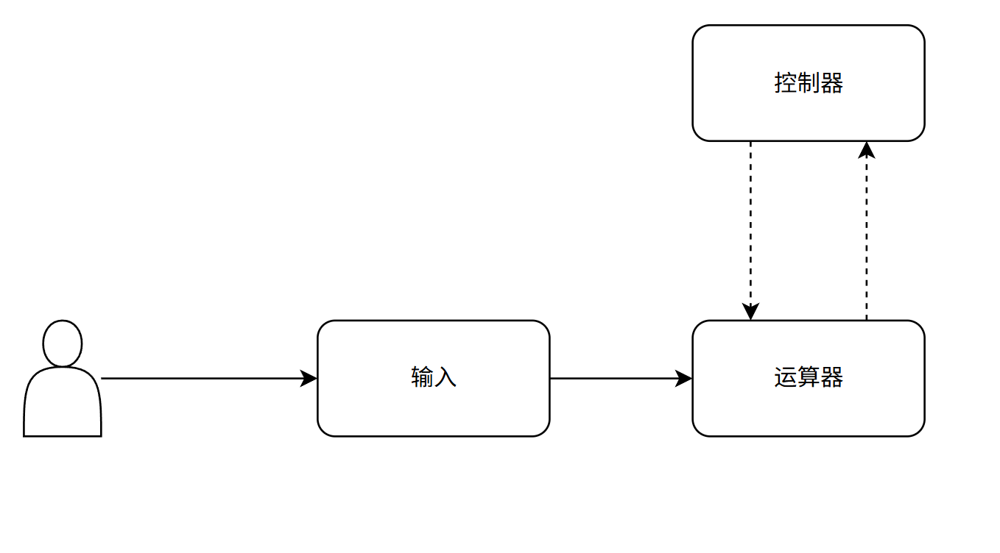

后来呢发现运算器从输入设备里面拿数据呢有点慢，于是我们放一个存储器来方便拿数据，那同时运算器也可以把结果告诉存储器，运算器算完的内容也可以告诉输出设备

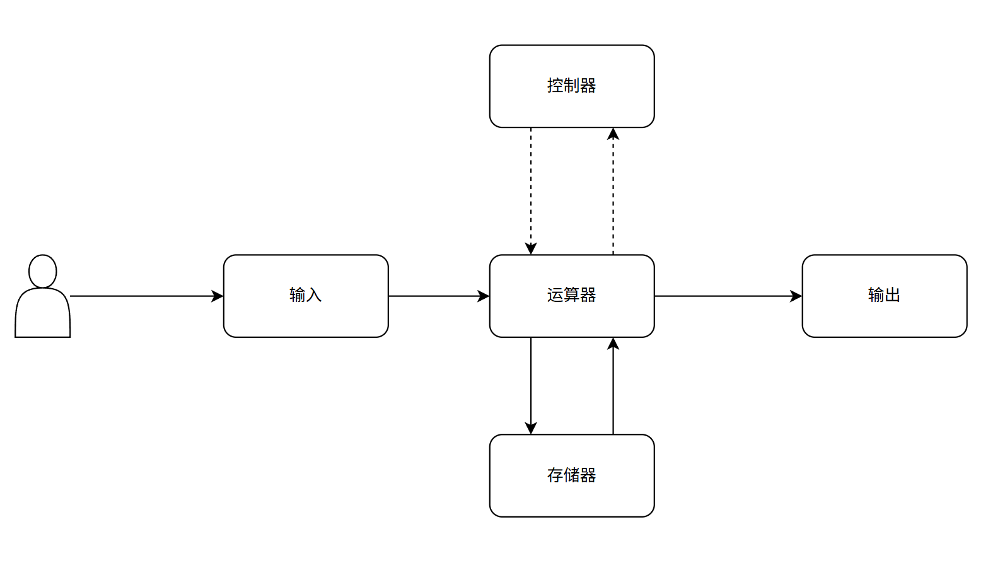

那同样，存储器也会告诉控制器，数据准备好了可以让运算器干活，那相反，控制器也可也告诉存储器，去哪拿东西，那控制器也可以去跟输入输出设备进行控制

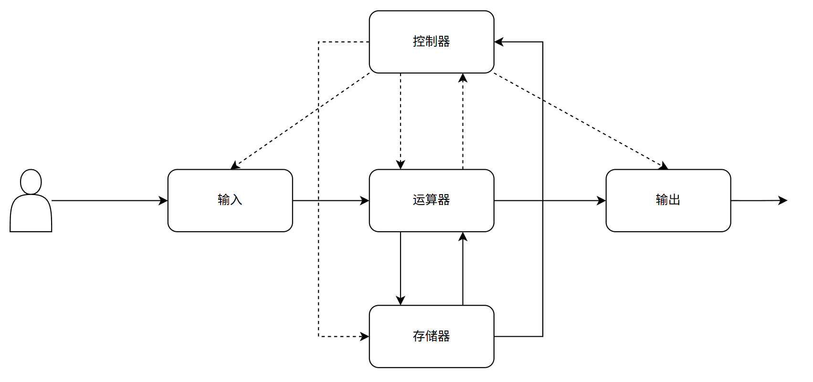

那么这就是一个冯诺依曼的一个思想，在当时是没有任何问题的，因为在当时存储器、控制器等这些设备的速度都差不多，所以这个也背称为**经典冯诺依曼结构**，随着后续的发展，由于摩尔定律，运算器的速度越来越快，存储器速度已经跟不上运算器的速度了，后来人们就想出了一个新的结构，以**存储器作为核心**

那么存储器作为核心，那我们之间让运算器从存储器里面读取数据，输入设备不直接给运算器，让输入设备给存储器，同时那控制器还是一样控制存储器、控制运算器、控制输入输出，也就变成下图：

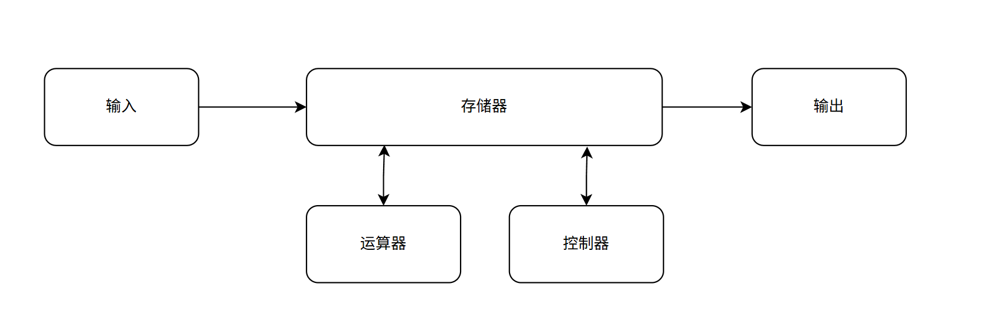

后来人们就把控制器和运算器封装在一起，叫做CPU，所以冯诺依曼体系结构没有改变，封装不一样而已

那我们再详细看看，运算器里面把相关的寄存器放进去，同时里面也有一个ALU，然后控制器里面也有寄存器，不过我们叫为控制单元（CU），控制器里面也有相关寄存器，然后存储器分为主存储器、辅助存储，然后分为输入和输出设备

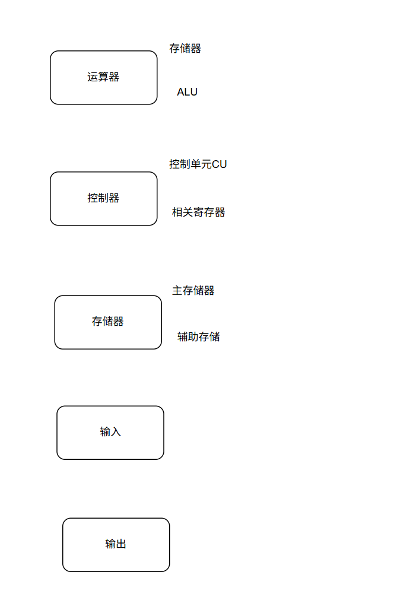

现代的CPU呢也就是控制器和存储器组合，然后呢，CPU加上主存储器，我们称为主机

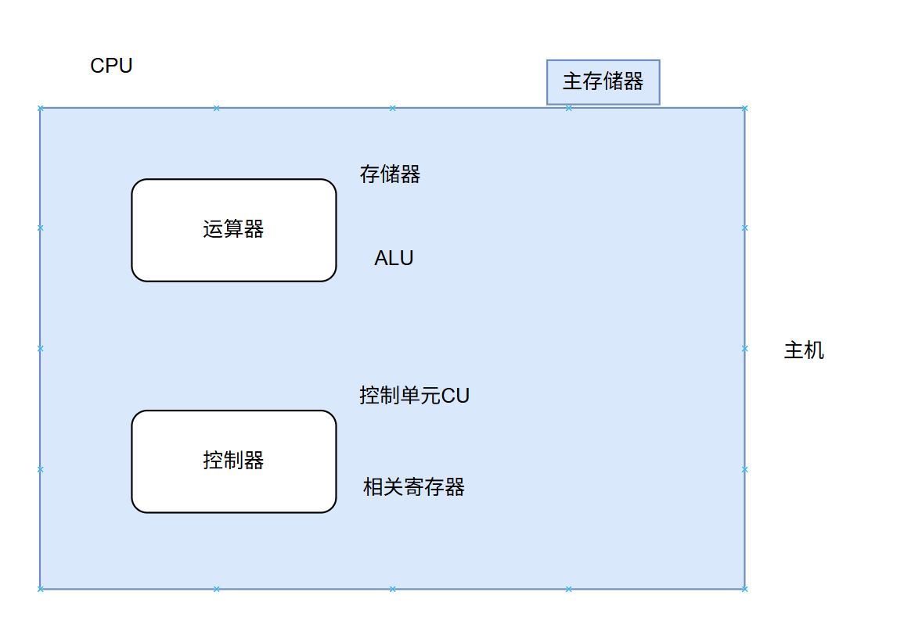

然后我们把输入和输出设备称为I/O设备，再加上辅助存储器，我们称为外部设备

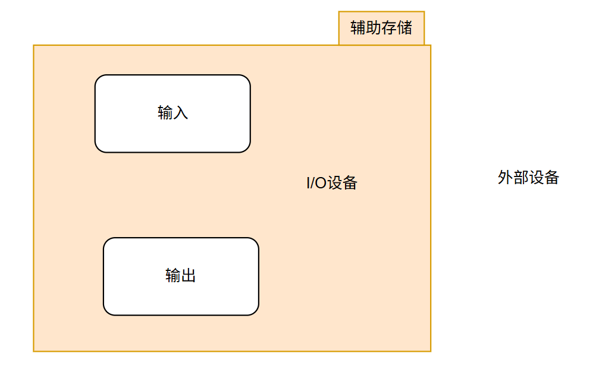

整体也就是如下：

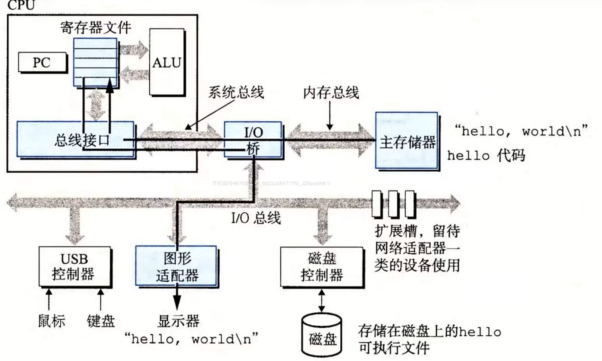

数据：指令里直接给出，不能表示所有可能的数据，立即数通过间接访问存储区来获取地址来访问，间接寻址

后续呢还有一个哈佛结构，与冯诺伊曼对比如下：

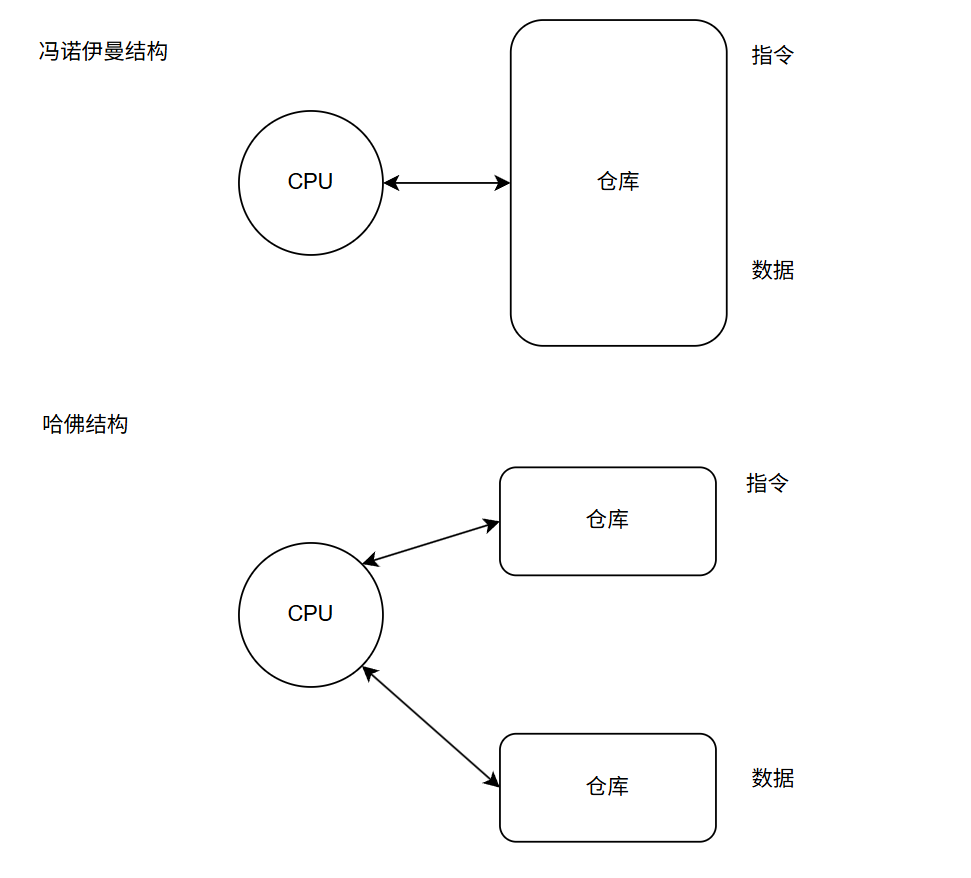

## 7. 指令

### 7.1 指令初探

要计算机服从指挥，就必须用计算机的语言。计算机语言中的基本单词称为指令，一台计算机的全部指令称为该计算机的**指令集**

那既然CPU要执行指令，那到底是执行什么样的指令呢，所以如果CPU要执行指令，那么它肯定需要**解析指令**，因为你怎么知道1、0的组合这段组合就是加法，这段组合就是乘法呢，那么既然要解析指令，那么肯定就是需要**规范指令**，比如我让1010 1111100前面四位为动词，那么对于指令我们就需要知道规范结构，那怎么规范呢，从这开始将自上而下的从看似受约束的汇编语言助记符开始，逐步精炼到实际计算机的真实语言 ，然后继续向下揭示算术运算的硬件以及浮点数的表示方法，我们先从汇编的规范看起，然后看机器码的映射方式

那在上述我们提到了指令集的概念，那对于CPU的每一代升级，升级在哪里呢，就是升级在了指令集的数量，比如有一代CPU没有SSE这个指令集，随着后续的升级有了，那么针对于某一个特定的模块，运算速度会快很多，随着发展呢，现在也有GPU、NPU，那像GPU可能只适合做一些简单的运算，比如加法和减法，而NPU是AI里面特定的芯片，它可以做求导这种，那现在就印出了一个问题，我怎么知道这是加法不是乘法呢，所以都需要一个**指令格式的定义**

### 7.2 计算机硬件的操作

我们在C语言里面提出了变量的概念，我们不管变量在哪，我们只有一个思想，我们现在要做a=b+c，那我怎么表示这个事情呢，所以就引出了**汇编的规范**，我们从MIPS架构来看

那么这个汇编就规范了一个动词+名词的格式，就相当于前面的动词是干什么，名词是我们要操作的什么，于是他们定义了一个动词的名字叫做ADD，MIPS架构规定了后面必须跟上三个名词，也就是ADD 名词 名词 名词，那这是什么意思呢，以ADD a b c为例子这个表示将两个变量 b 和 c 相加，并将它们的和放入变量 a 中，那对于a=b+c+d+e怎么办呢，那指令是如下表示add a,b,c  add a,a,d  add a, a,e，这样这三条指令完成了四个变量相加。

当然在汇编规范中分为复杂指令集和精简指令集，复杂指令集是可变长度，而精简指令集就如上动词后面跟三个名词

那我们接着看在精简指令集中，CPU厂商要考虑一个问题，既然要做指令，那就要确定从哪里拿数据，如下图：

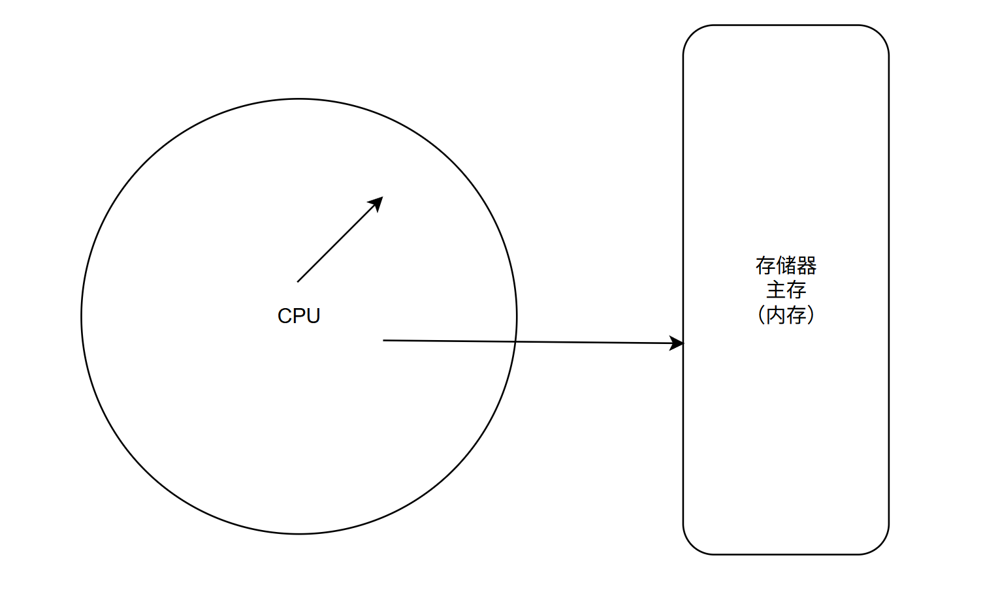

那CPU是走内部拿呢，还是走它旁边的主存拿呢，那精简指令集就一个非常重要的思想，所有的运算动作(也就是动词)数据源全部从CPU的寄存器里面拿，也就是说只能在本身内部去拿取东西，那又有一个新的问题，寄存器的数量是多还是少好呢，那假设我们有8个寄存器，那我们就需要3bit来表示，如果按照之前说的三位是动词，那也就是101 目的寄存器，整个指令数量变为3+3+3+3=12bit保存，因为后面有三个名词，那如果我们换成32个寄存器，那也就需要5bit来表示，那也就变成了3+5+5+5=18bit保存，所以针对于到底多还是少呢，我们需要看一条指令到底需要多少空间来编这个指令，所以这个不同的架构，寄存器数量也不同

由于CPU空间有限，所以我们得在内存上面开一小片空间，给CPU用，由于经典指令集，没有直达内存上的一小片空间，所以为了解决以下问题，在我们CPU里面有大量的寄存器集，想办法让CPU操作寄存器集，但是寄存器集也无法到达内存上的那一小段空间，于是提出了一个新的架构叫做Load/Store架构，如下图：

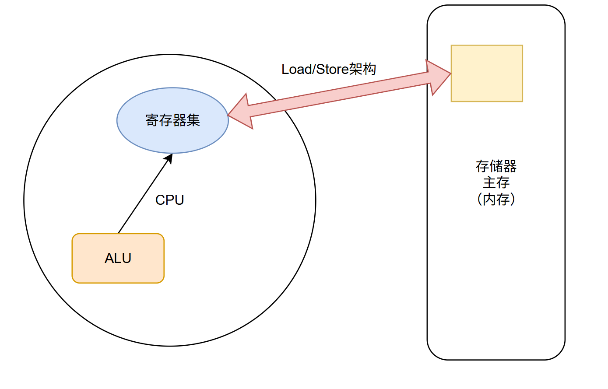

ALU无法访问内存里面的那一小片区域，所以就想出来这个架构，所以什么是Load/Store架构，Load就是让CPU从主存到寄存器拿东西，Store架构就是把算好的东西，送到寄存器里面，但是有点小问题，如果有一个部分空间有人用，但是这时候你也要用那就会冲突

当然对于不同的架构，指令的规范格式也不一样了，可能会出现下面的样子：

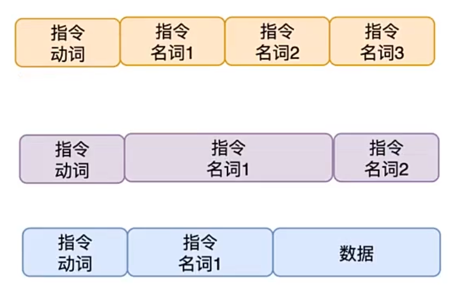

### 7.3 存储器的操作数

编程语言中，有仅含一个数据元素的简单变量. 也有像数组或结构体那样的复杂数据结构，这些复杂数据结构中的数据元素可能远多于计算机中寄存器的个数。计算机怎样来表示和访问这样大的结构呢？它只能存储在存储器上面，那么对于存储器来说，它就是能用地址来编地址的设备

那么对于CPU来说，它如果想要访问内存里面的数据，是直接访问里面的存储器吗，实际不是，在访问寄存器前，做内存的厂家会在里面增加一个东西叫做地址译码器，为什么需要这个呢，因为CPU发送过来的是一维地址，例如0x111这种，但是对于存储器里面的地址来说可能是三维的也可能是二维的，所以需要地址译码器，也就是如下图：

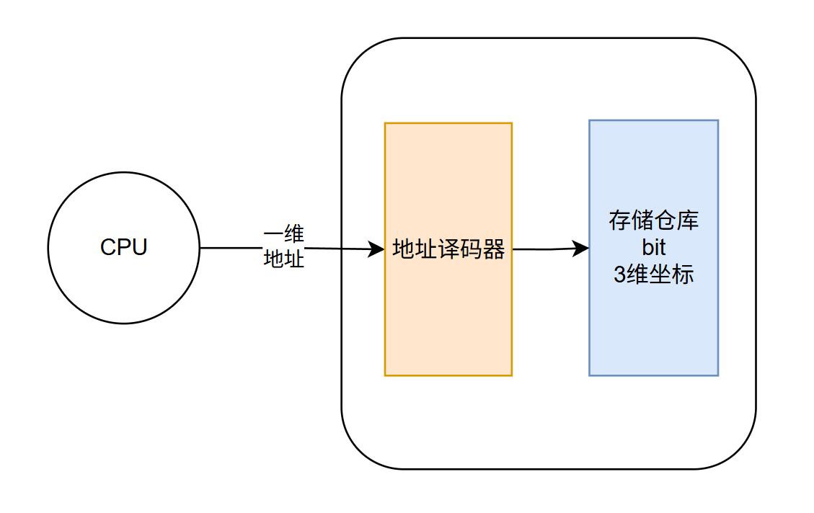

那我们现在知道我们要访问存储器，需要发出地址，那我们就需要知道存储器厂家是怎么进行编制的，有可能是按字节编址也有可能是按字编址，那我们以按字节编址来看看

将数据从存储器复制到寄存器的数据传送指令通常叫取数 (load) 指令。取数指令的格式是操作码后接着目标寄存器，再后面是用来访问存储器的常数和寄存器，常数和第二个寄存器中的值相加即得存储器地址 。实际的MIPS取数指令助记符是lw。也就是load word的缩写。

```c++
基本语法：lw 目标寄存器, 偏移量(基址寄存器)
lw $t0, 100($s1)
这条指令表示从寄存器 $s1 中的内容所指向的内存地址增加100个字节后的位置，加载一个32位的字数据到寄存器 $t0 中。在这里，"$s1" 是基址寄存器，"100" 是偏移量。
```

#### 7.3.1 小扩展

那我们基于上面的一个语法来看一个小的案例


现在内存里面有这些数据，那我现在想知道100占了多少空间，那按照上面的写法应该是 lw R2 ???(R5),R2和R5只是寄存器的一个名称，那R5前面的偏移量该填多少呢，那如果是按照上述字节编址的话，应该是4，如果这个寄存器里面一个盒子不是一个字节，它是四个字节，那我的偏移量该怎么写呢，我们继续看下图：

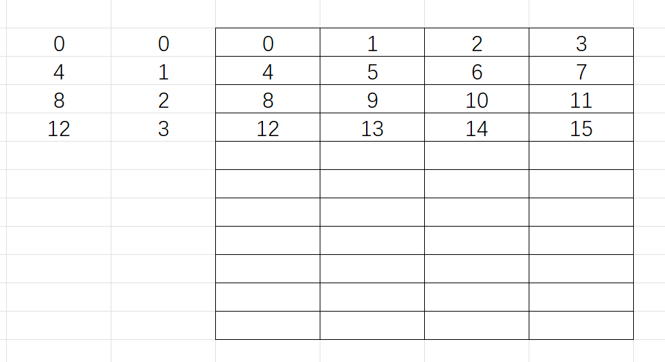

内存厂家编这些地址的时候，它给这些每个盒子编一个地址0、1、2....内存厂家是按照一个一个字做，但不管怎么做，是必须以字节为单位的，但是呢内存厂家把四个字节作为一个整体，那它编地址，是0、4、8、12好还是0、1、2、3好，答案是0、1、2、3，但是我们CPU发的地址是0、1、2、3、4这种吗，很显然不是，我们软件上面是以字节为单位访问，但是到了硬件这边是按字访问，那我们怎么解决这个问题呢

那我们来看一下每个字最前面的0、4、8、12，那他们的二进制是不是对应0000 0100 1000 1100，只有发出这些时候才对应的是基地址，但是你会发现一个现象，后面两位都是0，也就是说后面两位根本不用，也就是说CPU向地址译码器发送10bit地址线，实际地址译码器接收到8bit 地址线，因为后面两位根本不用，那这样是不是就跟内存厂家里面的基地址一样了也就是0、1、2、3

所以汇编语言的编写，需要明确存储器厂家是按什么编址的，所以上面的 lw R2 ???(R5)，可能是lw R2 3(R5)还是lw R2 12(R5),这个是因存储器厂家的定来编写

不过后来有了高级语言，觉得这些太累了，也就有了后面的关键字int short char，也就是声明，告诉编译器这段内存是怎么操作的，所以在翻译偏移量的时候就要按实际字节来做，因为C语言是按照逻辑个数做的

#### 7.3.2 字节对齐

那根据上述的内容，我们看一下什么是字节对齐，看下面的代码：

```c
struct abd{
    char a1;
    int x1;
}
```

那按照我们说的char占一个字节，int占了4个字节，那在内存中，是不是，应该如下图的存储

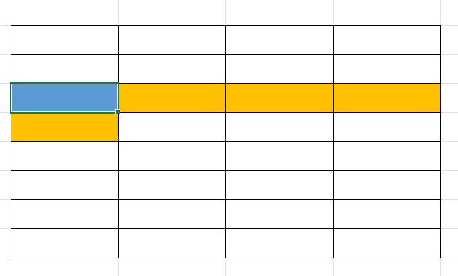

那我现在假设要访问x1，也就是P->X1,那你能直接跳过蓝色的部分访问后面橘色的部分吗，按照我们上面说的，舍弃了最后的两位，在硬件上面我们只能读取蓝色和橘色那一行，就相当于需要把char读进去，但是你发现还是不够，于是还得读取下一行，于是就有了字节对齐的概念，我们把int的空间放到同一行里面去，char那一行不读取,也就是如下

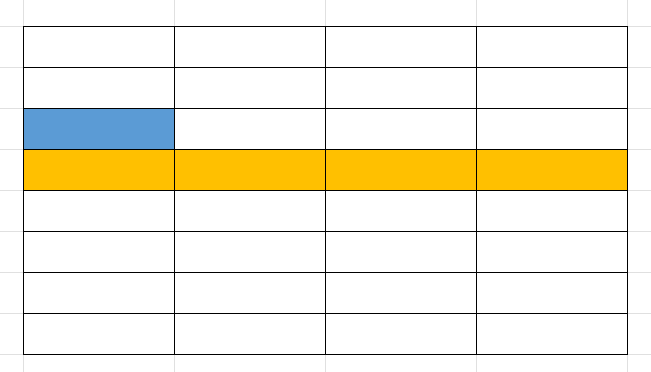

所以我们就知道了字节对齐的必要性，编译器牺牲了空间来换取时间

#### 7.3.3 大小端存储

有了编址，编写地址，也就要有寻址。也就是寻找地址。首先，既然编址按字来，那么寻址也是按字来。有两种类型的字节寻址的计算机：大端和小端。

1. 大端（Big-endian）：在大端编址方式中，一个多字节数据的高位字节存储在内存的低地址处，而低位字节则存储在内存的高地址处。例如，一个32位的字（假设其值为0x12345678）在内存中会被存储为：

   ```
   地址: 0x0000 0x12
   地址: 0x0001 0x34
   地址: 0x0002 0x56
   地址: 0x0003 0x78
   ```

   MIPS 架构就是使用大端编址的。

2. 小端（Little-endian）：在小端编址方式中，一个多字节数据的低位字节存储在内存的低地址处，而高位字节则存储在内存的高地址处。对于同样的32位字（0x12345678），它在内存中的存储方式会是：

```
地址: 0x0000 0x78
地址: 0x0001 0x56
地址: 0x0002 0x34
地址: 0x0003 0x12
```

​	许多现代的PC和个人设备（如Intel和AMD的x86和x64架构）使用小端编址。

### 7.6 数

#### 7.6.1 小知识

二进制、八进制、十进制、十六进制本身都是同一个东西，表示的数字都是一样的

我们拿123举例子，我们可以看成是100+20+3，那也就是1*10^2+2×10^1+3×10^0,那对于二进制的10000，也就是1×2^4

那么0x1和1是一个东西，那么对于0x1<<10,也就是1×2^10次方

但是后来我们发现一次性写20个零太多了，比如二进制里面的0x1<<20,所以根据二进制和十六进制的转换，每四个二进制可以表示一个十六进制，所以我们只需要写出五个十六进制的0即可（上述所有的移位都是二进制）

0xF101 === 1111 0001 0000 0001

0x代表在计算机里面后面就是16进制，0x没有任何意义

#### 7.6.2 有符号和无符号数

那我们回归正题，我们来想想怎么表示任意的数字，数字的表示有进制表示法，本质就是位权求和表示法，二进制、八进制、十进制、十六进制都是使用位权求和表示法，只要用这个方法表示我们就称为**无符号数**

那么如下图：

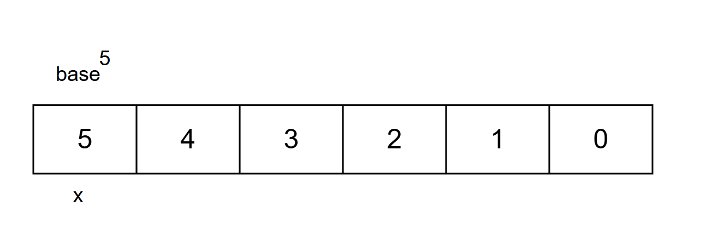

那么5的位置我们一般称为位权，无论X是多少，那个位置都是X×base^5,往后推则是X×base^4,那现在就有一个新的问题就是我怎么表示负数呢，于是科学家想出来，让第一个位置变成-1×base^5,如下图：

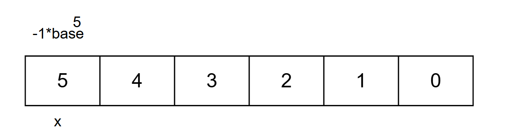

于是科学家就提出了一个新的概念，让最高位的权位设置为-1×权位值吗，其他位为正数，还是做位权求和，这个得到的数字就叫做**有符号数**

然后我们发现 1111 == -8+4+2+1 = -1，然后我们就会发现任何一个数A，与它的反数（每一位取反）他们的和都是1111

也就是A+~A 位数全是1，然后我们就发现A+~A + 1 =0

那我们再来看一下什么是补数的概念，我们以钟表为例子，假设现在时间是6点，我们想要它往回走，到2点的位置，那是不是6-4=2；那如果我们只能往前走，也就是加，那是不是6+8=14%12=2，我们发现也是2点，那么这时候我们称-4和8互为补数

于是根据上面的我们就定义上述的 ~A+1为A的补数，也就是A的补码，那所谓的-A也就是~A+1,其实计算机就是一个钟表，越界太多，就相当于往回走

